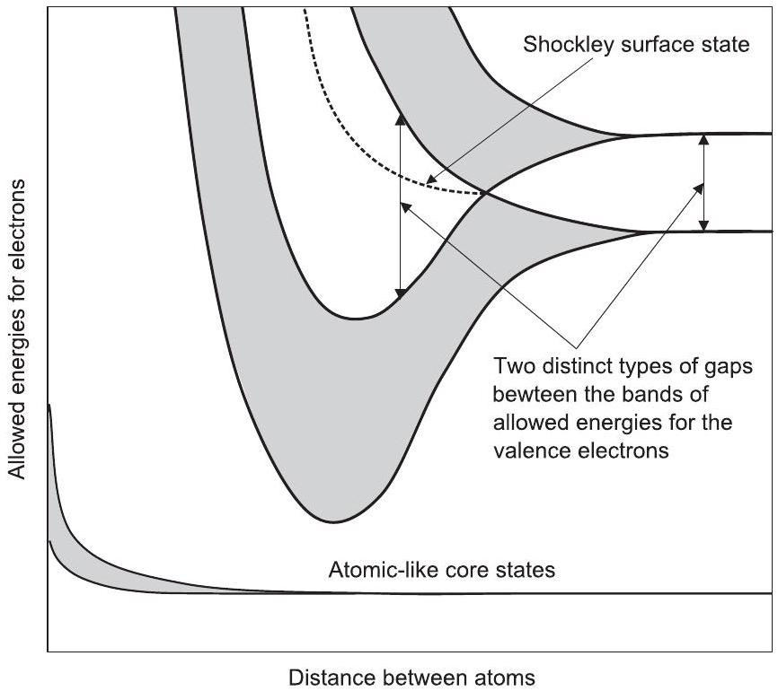
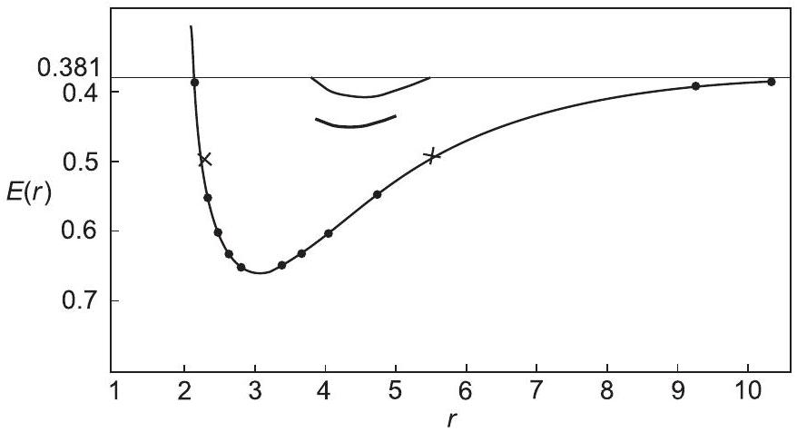
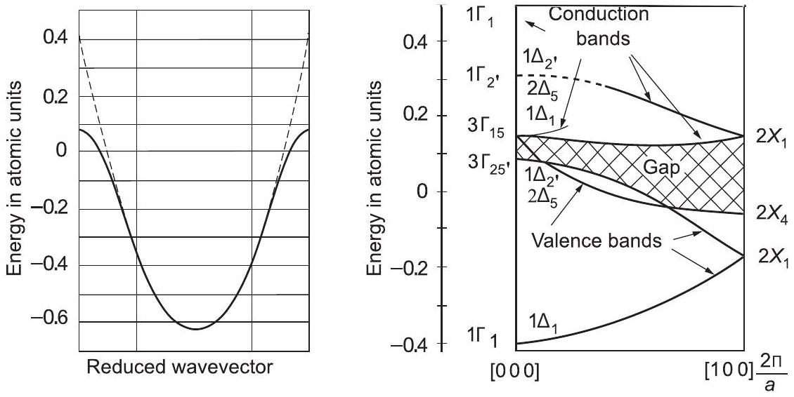

**PART 1**

**OVERVIEW AND BACKGROUND TOPICS**

**1**

**Introduction**

Without physics there is no life.
Taxi driver in Minneapolis
To love practice without theory is like the sailor who boards ship without rudder and compass and is forever uncertain where he may cast.

Leonardo da Vinci, notebook 1, c. 1490

**Summary**

Since the discovery of the electron in 1896-1897, the theory of electrons in matter has ranked among the greatest challenges of theoretical physics. The fundamental basis for understanding materials and phenomena ultimately rests upon understanding electronic structure, which means that we must deal with the interacting many-electron problem in diverse, realistic situations. This chapter provides a brief outline with original references to early developments of electronic structure and the pioneering quantitative works that foreshadowed many of the methods in use today.

Electrons and nuclei are the fundamental particles that determine the nature of matter in our everyday world: atoms, molecules, condensed matter, and man-made structures. Not only do electrons form the "quantum glue" that holds together the nuclei in solid, liquid, and molecular states, but also electron excitations determine the vast array of electrical, optical, and magnetic properties of materials. The theory of electrons in matter ranks among the great challenges of theoretical physics: to develop theoretical approaches and computational methods that can accurately treat the interacting system of many electrons and nuclei found in condensed matter and molecules.

Throughout this book there are references to a companion book [1], Interacting Electrons by Richard M. Martin, Lucia Reining, and David M. Ceperley (Cambridge University Press, 2016). Together these two books are meant to cover the field of electronic structure theory and methods, each focusing on ways to address the difficult problem of many
interacting electrons. They are independent books and references to [1] indicate where more information can be found, especially about many-body theory and methods outside the scope of this book.

# 1.1 Quantum Theory and the Origins of Electronic Structure

Although electric phenomena have been known for centuries, the story of electronic structure begins in the 1890s with the discovery of the electron as a particle - a fundamental constituent of matter. Of particular note, Hendrik A. Lorentz ${ }^{1}$ modified Maxwell's theory of electromagnetism to interpret the electric and magnetic properties of matter in terms of the motion of charged particles. In 1896, Pieter Zeeman, a student of Lorentz in Leiden, discovered [3] the splitting of spectral lines by a magnetic field, which Lorentz explained with his electron theory, concluding that radiation from atoms was due to negatively charged particles with a very small mass. The discovery of the electron in experiments on ionized gases by J. J. Thomson at the Cavendish Laboratory in Cambridge in 1897 [4, 5] also led to the conclusion that the electron is negatively charged, with a charge-to-mass ratio similar to that found by Lorentz and Zeeman. For this work, the Nobel Prize was awarded to Lorentz and Zeeman in 1902 and to Thomson in 1906.

The compensating positive charge is composed of small massive nuclei, as was demonstrated by experiments in the laboratory of Rutherford at Manchester in 1911 [6]. This presented a major problem for classical physics: How can matter be stable? What prevents electrons and nuclei from collapsing due to attraction? The defining moment occurred when Niels Bohr (at the Cavendish Laboratory for postdoctoral work after finishing his dissertation in 1911) met Rutherford and moved to Manchester to work on this problem. There he made the celebrated proposal that quantum mechanics could explain the stability and observed spectra of atoms in terms of a discrete set of allowed levels for electrons [7]. The work of Planck in 1900 and one of the major works of Einstein in 1905 had established the fact that the energy of light waves is quantized. Although Bohr's model was fundamentally incorrect, it set the stage for the discovery of the laws of quantum mechanics, which emerged in 1923-1925, most notably through the work of de Broglie, Schrödinger, and Heisenberg. ${ }^{2}$ Electrons were also the testing ground for the new quantum theory. The famous Stern-Gerlach experiments [14, 15] in 1921 on the deflection of silver atoms in a magnetic field were formulated as tests of the applicability of quantum theory to particles in a magnetic field. Simultaneously, Compton [16] proposed that the electron possesses an intrinsic moment, a "magnetic doublet." The coupling of orbital angular momentum and an intrinsic spin of $1 / 2$ was formulated by Goudschmidt and Uhlenbeck [17], who noted the earlier hypothesis of Compton.

[^0]One of the triumphs of the new quantum mechanics, in 1925, was the explanation of the periodic table of elements in terms of electrons obeying the exclusion principle proposed by Pauli [18] that no two electrons can be in the same quantum state. ${ }^{3}$ In work published early in 1926, Fermi [20] extended the consequences of the exclusion principle to the general formula for the statistics of noninteracting particles (see Eq. (1.3)) and noted the correspondence to the analogous formula for Bose-Einstein statistics [21,22]. ${ }^{4}$ The general principle that the wavefunction for many identical particles must be either symmetric or antisymmetric when two particles are exchanged was apparently first discussed by Heisenberg [23] and, independently, by Dirac [24] in $1926 .{ }^{5}$

By 1928 the laws of quantum mechanics that are the basis of all modern theories of electronic structure of matter were complete. Two papers by Dirac [26,27] brought together the principles of quantum mechanics, special relativity, and Maxwell's equations in an awesome example of creativity that Ziman characterized as "almost by sheer cerebration," i.e., by sheer mental reasoning. From this work emerged the Dirac equation for fermions that have spin $1 / 2$ with quantized magnetic moments and spin-orbit interaction. As described in more detail in Appendix O, this has profound consequences for electronic structure, where it leads to effects that are qualitatively different from anything that can be produced by a potential. In molecules and condensed matter it is usually sufficient to include spin-orbit interaction in the usual nonrelativistic Schrödinger equation with an added term $\hat{H}_{\mathrm{SO}}$, as given in Eq. (O.10). Spin-orbit interaction has come to the fore in condensed matter theory with the discovery of topological insulators described in Chapter 25-28.

Further progress quickly led to improved understanding of electrons in molecules and solids. The most fundamental notions of chemical bonding in molecules (the rules for which had already been formulated by Lewis [28] and others before 1920) were placed upon a firm theoretical basis by quantum mechanics in terms of the way atomic wave functions are modified as molecules are formed (see, for example, Heitler and London in 1927 [29]). The rules for the number of bonds made by atoms were provided by quantum mechanics, which allows the electrons to be delocalized on more than one atom, lowering the kinetic energy and taking advantage of the attraction of electrons to each of the nuclei.

# 1.2 Why Is the Independent-Electron Picture So Successful?

A section with the same title is in the introduction to the companion book [1], and is devoted to methods to deal with the correlated, interacting many-body problem. The central tenet of

[^1]both volumes is that electronic structure is at its heart a many-body problem of interacting electrons, which is among the major problems in theoretical physics. The full hamiltonian is given in Eq. (3.1) and it is clear that the electron-electron interactions are not at all negligible. Nevertheless, theoretical concepts and methods involving independent electrons play a central role in essentially every aspect of the theory of materials. Both volumes stress that independent-particle methods are very important and useful, and it is essential to understand why and when they capture the essential physics.

The leading scientists of the field in the 1920s were fully aware of the difficulty of treating many interacting particles and it is edifying to examine the masterful ways that independent-particle theories were used to bring out fundamental physics. Such a system can be described by the eigenstates $\psi_{1}$ of an effective one-particle hamiltonian

$$
H_{\mathrm{eff}} \psi_{i}(\mathbf{r})=\varepsilon_{i} \psi_{i}(\mathbf{r})
$$

with

$$
H_{\mathrm{eff}}=-\frac{\hbar^{2}}{2 m_{e}} \nabla^{2}+V_{\mathrm{eff}}(\mathbf{r}),
$$

where $V_{\text {eff }}(\mathbf{r})$ includes potentials acting on the electrons, e.g., due to the nuclei, and an effective field that takes into account at least some average aspects of interactions. The state of the system is specified by the occupation numbers $f_{i}$, which in thermal equilibrium are given by

$$
f_{i}=\frac{1}{e^{\beta\left(\epsilon_{i}-\mu\right)} \pm 1},
$$

where the minus sign is for Bose-Einstein [21, 22] and the plus sign is for Fermi-Dirac statistics [20,24]. Among the first accomplishments of the new quantum theory was the realization in 1926-1928 by Wolfgang Pauli and Arnold Sommerfeld [30, 31] that it resolved the major problems of the classical Drude-Lorentz theory. ${ }^{6}$ The first step was the paper [30] of Pauli, submitted late in 1926, in which he showed that weak paramagnetism is explained by spin polarization of electrons obeying Fermi-Dirac statistics. At zero temperature and no magnetic field, the electrons are spin paired and fill the lowest energy states up to a Fermi energy, leaving empty the states above this energy. For temperature or magnetic field nonzero, but low compared to the characteristic electronic energies, only the electron states near the Fermi energy are able to participate in electrical conduction, heat capacity, paramagnetism, and other phenomena. ${ }^{7}$ Pauli and Sommerfeld based their

[^2]successful theory of metals on the model of a homogeneous free-electron gas, which resolved the major mysteries that beset the Drude-Lorentz theory. However, at the time it was not clear what would be the consequences of including the nuclei and crystal structure in the theory, both of which would be expected to perturb the electrons strongly.

## 1.2.1 Band Theory for Independent Electrons

The critical next step toward understanding electrons in crystals was the realization of the nature of independent noninteracting electrons in a periodic potential. This was elucidated most clearly ${ }^{8}$ in the thesis of Felix Bloch, the first student of Heisenberg in Leipzig. Bloch [35] formulated the concept of electron bands in crystals and what has come to be known as the "Bloch theorem" (see Chapters 4 and 12), i.e., that the wavefunction in a perfect crystal is an eigenstate of the "crystal momentum." This resolved one of the key problems in the Pauli-Sommerfeld theory of conductivity of metals: Electrons can move freely through the perfect lattice, scattered only by imperfections and displacements of the atoms due to thermal vibrations.

It was only later, however, that the full consequences of band theory were formulated. Based on band theory and the Pauli exclusion principle, the allowed states for each spin can each hold one electron per unit cell of the crystal. Rudolf Peierls, in Heisenberg's group at Leipzig, recognized the importance of filled bands and "holes" (i.e., missing electrons in otherwise filled bands) in the explanation of the Hall effect and other properties of metals [36, 37]. However, it was only with the work of A. H. Wilson [38, 39], also at Leipzig in the 1930s, that the foundation was laid for the classification of all crystals into metals, semiconductors, and insulators. ${ }^{9}$

Development of the bands, as the atoms are brought together, is illustrated in Fig. 1.1, which is based on a well-known figure by G. E. Kimball in 1935 [41]. Kimball considered diamond-structure crystals, which were difficult to study at the time because the electron states change qualitatively from those in the atom. In his words:

Although not much of a quantitative nature can be concluded from these results, the essential differences between diamond and the metals are apparent.
G. E. Kimball in [41].

Figure 1.1 also shows a surface state that emerges at the transition between the two types of insulating gaps. This was derived in a prescient paper in 1939 by Shockley ${ }^{10}$
${ }^{8}$ Closely related work was done simultaneously in the thesis research of Hans Bethe [34] in 1928 (student of Sommerfeld in Munich), who studied the scattering of electrons from the periodic array of atoms in a crystal.
${ }^{9}$ In his classic book, Seitz [40] further divided insulators into ionic, valence, and molecular. It is impressive to realize that Seitz was only 29 years old when his 698-page book was published.
${ }^{10}$ This is the same Shockley who shared the Nobel prize, with Bardeen and Brattain, for development of the transistor. His work on surfaces was no idle exercise: the first transistors worked by controlling the conductivity in the surface region and the properties of surface states was crucial. Shockley was born in Palo Alto, California, and it is said that his mother is the one who put the silicon in Silicon Valley because Shockley moved back to Palo Alto from Bell Labs in New Jersey to take care of her and to start Shockley Semiconductor Laboratory. Sadly, his later years were sullied by his espousal of eugenics.

Figure 1.1. Schematic illustration taken from the work of G. E. Kimball in 1935 [41] of the evolution from discrete atomic energies to bands of allowed states separated by energy gaps as atoms are brought together in the diamond structure. One aspect is independent of the crystal structure: the division of solids into insulators, where the bands are filled with a gap to the empty states, and metals, where the bands are partially filled with no gap. However, there is additional information for specific cases: Kimball pointed out that there are two distinct types of energy gaps illustrated by the transition from atomic-like states to covalent bonding states and, in this example, the transition occurs at a point where the gap vanishes. There is a similar figure in the 1939 paper by Shockley [42], who realized that transition in the nature of the states in the crystal also leads to a surface state in the gap, which is a forerunner of topological insulators, one of the major recent discoveries in condensed matter physics this century, which is the topic of Chapters 25-28.

[42] who used a simple one-dimensional model to elucidate the nature of the transition in the bulk band structure and the conditions for which there is a surface state in the gap. Shockley had previously carried out one of the first realistic band structure calculations for $\mathrm{NaCl}[43]$ using a cellular method, but covalent semiconductors are very different. This is a story of choosing an elegantly simple model that captures the essence of the problem and an elegantly simple method, the same cellular method he had used before but now applied to a covalent crystal with surfaces. Shockley's analysis is explained in some detail in Chapters 22 and 26 because it is a forerunner of topological insulators.

## 1.2.2 Classification of Materials by Electron Counting

The classification of materials is based on the filling of the bands illustrated in Fig. 1.1, which depends on the number of electrons per cell:

- Each band consists of one state per cell for each spin.
- Insulators have filled bands with a large energy gap of forbidden energies separating the ground state from all excited states of the electrons.
- Semiconductors have only a small gap, so thermal energies are sufficient to excite the electrons to a degree that allows important conduction phenomena.
- Metals have partially filled bands with no excitation gaps, so electrons can conduct electricity at zero temperature.

## 1.2.3 Relation to the Full Interacting-Electron Problem

The independent-particle analysis is a vast simplification of the full many-body problem; however, certain properties carry over to the full problem. The fundamental guiding principle is continuity if one imagines continuously turning on interactions to go from independent particles to the actual system. It was only in the 1950s and 1960s that the principles were codified in the form used today by Landau and others. ${ }^{11}$ A concise form now called the "Luttinger theorem" [46, 47] states that the volume enclosed by the Fermi surface does not change so long as there are no phase transitions. This is not a theorem in the mathematical sense. It is an argument formulated with careful reasoning, which makes it clear that an exception indicates a transition to a new state of matter, for example, superconductivity. So long as there is no transition to some other state, a metal with partially filled bands in the independent-particle approximation should remain a metal in the full problem. An insulator with filled bands must either remain an insulator with a gap or change into a semimetal with Fermi surfaces with equal numbers of electrons and holes. The issues are discussed much more extensively in [1] but arguments like this capture the basic concepts.

The emergence of topology as a property of the electronic structure provides a new angle on this old problem. Essentially all work on what are called topological insulators is for independent electrons, and the principle of continuity can be used in a different way to invoke the principle that the topology can change only if a gap goes to zero.

# 1.3 Emergence of Quantitative Calculations

The first quantitative calculations undertaken on multielectron systems were for atoms, most notably by D. R. Hartree ${ }^{12}$ [50] and Hylleraas [51, 52]. Hartree's work pioneered the self-consistent field method, in which one solves the equation numerically for each electron moving in a central potential due to the nucleus and other electrons, and set the stage for many of the numerical methods still in use today. However, the approach was somewhat

[^3]
Figure 1.2. Energy versus radius of Wigner-Seitz sphere for Na calculated by Wigner and Seitz [54,57]. Bottom curve: energy of lowest electron state calculated by the cellular method. Middle curve: total energy, including an estimate of the additional kinetic energy from the homogeneous electron gas as given in Tab. 5.3. From [54]. The upper curve is taken from the later paper [57] and includes an estimate of the correlation energy. The final result is in remarkable agreement with experiment.

heuristic, and it was in 1930 that Fock [53] published the first calculations using properly antisymmetrized determinant wave functions, the first example of what is now known as the Hartree-Fock method. Many of the approaches used today in perturbation theory and response functions (e.g., Section D. 1 and Chapter 20) originated in the work of Hylleraas, which provided accurate solutions for the ground state of two-electron systems as early as 1930 [52].

The 1930s witnessed the initial formulations of most of the major theoretical methods for electronic structure of solids still in use today. ${ }^{13}$ Among the first quantitative calculations of electronic states was the work on Na metal by Wigner and Seitz [54, 57] published in 1933 and 1934. They used the cellular method, a forerunner of the atomic sphere approximation, which allows the needed calculations to be done in atomic-like spherical geometry. Even with that simplification, the effort required at the time can be gleaned from their description:

The calculation of a wavefunction took about two afternoons, and five wavefunctions were calculated on the whole, giving ten points of the figure.

Wigner and Seitz [54].
The original figure from [54], reproduced in Fig. 1.2, shows the energy of the lowest electronic state (lower curve) and the total energy of the crystal including the kinetic energy (middle curve). The upper curve [57] includes an estimate of the correlation energy; the result is in remarkable agreement with experiment.

The electron energy bands in Na were calculated in 1934 by Slater [58] and Wigner and Seitz [57], each using the cellular method. The results of Slater are shown in Fig. 1.3;

[^4]
Figure 1.3. Left: Energy bands in Na calculated in 1934 by Slater [58] using the cellular method of Wigner and Seitz [54]. The bands clearly demonstrate the nearly-free-electron character, even though the wavefunction has atomic character near each nucleus. Right: Energy bands in Ge calculated by Herman and Callaway [59] in 1953, one of the first computer calculations of a band structure. The lowest gap in this direction is in reasonable agreement with experiment and more recent work shown in Fig. 2.23, but the order of the conduction bands at $\Gamma$ is not correct.

very similar bands were found by Wigner and Seitz. Although the wavefunction has atomic character near each nucleus, nevertheless the bands are very free-electron-like, a result that has formed the basis of much of our understanding of sp-bonded metals. Many calculations were done in the 1930s and 1940s for high-symmetry metals (e.g., copper bands calculated by Krutter [60]) and ionic solids (e.g., NaCl studied by Shockley [43]) using the cellular method.

The difficulty in a general solid is to deal accurately with the electrons both near the nucleus and in the smoother bonding regions. Augmented plane waves (Chapter 16), pioneered by Slater[61] in 1937 and developed ${ }^{14}$ in the 1950s [62, 63], accomplish this with different basis sets that are matched at the boundaries. Orthogonalized plane waves (Chapter 11) were originated by Herring [64] in 1940 to take into account effects of the cores on valence electrons. Effective potentials (forerunners of pseudopotentials; see Chapter 11) were introduced in diverse fields of physics, e.g., by Fermi [65] in 1934 to describe scattering of electrons from atoms and neutrons from nuclei (see Fig. 11.1). Perhaps the original application to solids was by H. Hellmann [66, 67] in 1935-1936, who developed a theory for valence electrons in metals remarkably like a modern pseudopotential calculation. Although quantitative calculations were not feasible for general classes of solids, the development of the concepts - together with experimental studies - led to many important developments, most notably the transistor. ${ }^{15}$

[^5]The first quantitatively accurate calculations of bands in difficult cases like semiconductors, where the electronic states are completely changed from atomic states, were done in the early 1950s. ${ }^{16}$ For example, Fig. 1.3 shows the bands of Ge calculated by Herman and Callaway [59] using the orthogonalized plane wave (OPW) method (Section 11.2) with a potential assumed to be a sum of atomic potentials. They pointed out that their gap was larger than the experimental value. It turns out that this is correct: the gap in the direction studied is larger than the lowest gap, which is in a different direction in the Brillouin zoneharder to calculate at the time. Comparison with recent calculations, e.g., in Fig. 2.23, shows that the results for the valence band and the gap are basically correct but there are discrepancies in the conduction bands.

# 1.4 The Greatest Challenge: Electron Interaction and Correlation

Even though independent-particle theory was extremely successful in many ways, the great question was: What are the consequences of electron-electron interactions? One of the most important effects of this interaction was established early in the history of electronic structure: the underlying cause of magnetism was identified by Heisenberg [70] and Dirac [71] in terms of the exchange energy of interacting electrons, which depends on the spin state and the fact that the wavefunction must change sign when two electrons are exchanged. ${ }^{17}$ In atomic physics and chemistry, it was quickly realized that accurate descriptions must go beyond the effective independent-electron approximations because of strong correlations in localized systems and characteristic bonds in molecules [75].

In condensed matter, the great issues associated with electron-electron interactions were posed succinctly in terms of metal-insulator transitions described by Eugene Wigner [76] and Sir Nevill Mott [77-79]. A watershed point was a conference in 1937 where J. H. de Boer and E. J. W Verwey presented a paper on "Semi-conductors with partially and with completely filled 3d lattice Bands," with NiO as a prominent example [80], followed by Mott and R. Peierls, in a paper entitled "Discussion of the paper by de Boer and Verwey" [77]. They posed the issues in the same form as used today: the competition between formation of bands and atomic-like behavior where the effects of interactions are larger than band widths. The competition is especially dramatic for localized partially filled 3d states, which leads to some of the most fascinating problems in physics today, such as the high temperature superconductors. ${ }^{18}$ Methods to deal with such problems are a main topic

[^6]of the companion book [1] and some of the characteristic examples are summarized in this book in Chapter 2, especially Section 2.17.

# 1.5 Density Functional Theory

Two papers by Pierre Hohenberg and Walter Kohn in 1964 [83] and Kohn and Lu Sham in 1965 [84] put the theory of electronic structure on a whole new level. Density functional theory (DFT) is now the basis of essentially all the qualitative work on the electronic structure of condensed matter and many other fields, ${ }^{19}$ and it is a central topic of this book. The basic theory is the subject of Part II and applications of DFT are the primary topic of most of the rest of the book. Perhaps the most important point to emphasize is that DFT is a theory of the interacting, correlated, many-body system of electrons. The Kohn-Sham version of DFT uses independent-particle methods, but it is not an independent-particle approximation; it constructs an auxiliary system that in principle provides the exact density and total energy of the actual interacting system. The original Hohenberg-Kohn theorem is that all properties are functionals of only the density; however, as described in Chapter 6 this is really just a Legendre transformation with no prescription for doing anything else. The key to the phenomenal success of DFT is the stroke of genius of Kohn and Sham to formulate a theory that is supposed to give only certain properties - and not other properties - of the interacting system. By choosing only the ground-state density and total energy, it has proven to be possible to find approximations that are remarkably accurate and useful.

In Kohn-Sham DFT all the effects of exchange and correlation are incorporated in the exchange-correlation functional $E_{x c}[n]$, which depends on the density $n(\mathbf{r})$. The approximations for $E_{x c}$ all involve some approach to utilize information derived by some many-body method. In the first edition of this book, the main examples were the local density and generalized-gradient approximations with almost all information coming from calculations on the electron gas. The success of these methods has led to much new work on improved functionals. In this edition there are two chapters on functionals (Chapters 8 and 9) with much more on the concepts and many-body ideas behind the new functionals.

# 1.6 Electronic Structure Is Now an Essential Part of Research

Since the advent of density functional theory many developments have set the stage for new understanding and applications in condensed matter physics, materials science, and other fields. The most influential development since the work of Kohn and Sham is due to Car and Parrinello in 1985 [85]. As explained in Chapter 19, their work has led to many new

[^7]developments that have opened the door for an entire new world of calculations. Before their work almost all calculations were limited to simple crystals and heroic calculations on larger systems. After their work there was rapid development of many different techniques, and it is now routine to treat systems with hundreds of atoms, complex structures and surfaces, reactions, liquids as a function of temperature, and a host of other problems.

The theory and computational methods of electronic structure are now an integral part of research in physics and other fields. The basic methods for calculations are in Part IV, and the extensions to determine many properties of matter are the subject of Part V, and many examples are given in Chapter 2, which provides an overview of the types of problems that are the province of electronic structure today. The profound effect upon research is typified by modern-day searches for new materials. Of course, it is finally the role of experiment to create materials that can actually be made by feasible methods, but quantitative theory is almost always an essential part of research on new materials and systems: fullerenes, nanotubes, graphene, high-temperature superconductors, two-dimensional systems in layer materials and oxide interfaces, and materials for geophysics at pressures and temperatures in the earth, to cite just a few examples. In more and more cases discoveries of new materials have followed predictions by theory, such as the sulfur hydride superconductors at high pressure in Chapter 2 and topological insulators in Part VI that comprise an entire new field of research.

# 1.7 Materials by Design

The power of computers has made it possible to calculate the energies for enormous numbers of structures and to use a variety of approaches to search for new materials with desired properties, i.e., materials by design. This means much more than molecules or macroscopic solids. The term "materials" denotes clusters that may have many possible sizes, shapes and composition; surfaces and interfaces between different systems; defects that control the desired phenomena; liquids, solutions, and solid-liquid interfaces; layered systems that can be stacked in a controlled manner; and many other possibilities. Certainly the most important property is whether or not it can actually be made. A successful theory must be able to determine the stable compounds and their structure, and in many cases examine other cases that may be metastable or may be created by nonequilibrium conditions. It should be able to treat systems from molecules to clusters to solids. It should also be able to predict the desired properties accurately, e.g., strength, bandgaps, optical phenomena, magnetism, and superconductivity.

Such a theory does not exist. But there have been great steps toward the goal. At the center of the progress is density functional theory (DFT), which is essentially the only method capable of quantitative predictions for stable structures and other ground-state properties. In recent years there has been progress in new functionals that can treat a wider range of materials, e.g., van der Waals functionals and ones that incorporate other effects such as polarizability in the functional itself. There are famous deficiencies like the "bandgap problem," but great progress has been made in DFT methods to predict bandgaps. Characteristic examples of the theory and methods are the topic of this book. In addition,
combination with many-body methods - the topic of the companion book [1] - is a powerful approach that can overcome many deficiencies in present-day DFT calculations.

There are now a number of large-scale collaborations to create the infrastructure for theorists and experimentalists to work together to discover and utilize new materials much more efficiently and effectively. Two examples are the Materials Genome Initiative (MGI), centered in the United States, and Novel Materials Discovery (NOMAD), centered in Europe, which are readily accessible on the Internet. The development of the tools and the means to utilize the vast amounts of data that are generated are exciting areas, but they are only touched on in this book. The topics of this and the companion [1] book are the theory and methods that are the foundation upon which these developments depend.

# 1.8 Topology of Electronic Structure

One of the greatest developments in the conceptual structure of condensed matter theory since the Bloch theorem is the recognition of the role of topology in electronic structure and the discovery of topological insulators in 2005-2006 in the seminal papers by Kane and Mele [86, 87] and Bernevig and Zhang [88]. The famous TKNN paper [89] by Thouless and coworkers in 1982 showed that the precise integer multiples in the quantum Hall effect (QHE) (see Appendix Q) can be explained as a topological invariant. However, the QHE occurs only in the presence of a strong magnetic field; it was the discovery of topological insulators, where spin-orbit interaction leads to related effects in the absence of a magnetic field, that has brought topology squarely into electronic structure. In hindsight we can see that the work of Shockley in 1939 [42] (see especially Fig. 1.1 and Chapters 22 and 26) was a forerunner of topological insulators, and it can be viewed as a crystalline topological insulator.

It is an inspiration that after so many years since the advent of quantum mechanics and the Bloch theorem that there are still new discoveries! Just as surprising is the fact that topological insulators can be understood with only knowledge of band structure and spinorbit interaction at the level of an undergraduate solid state physics textbook. This is the topic of Chapters 25-28.

**SELECT FURTHER READING**

The companion book [1]:
Martin, R. M., Reining, L. and Ceperley, D. M., Interacting Electrons: Theory and Computational Approaches (Cambridge University Press, Cambridge, 2016). Together these two books are meant to cover the field of electronic structure theory and methods.
Examples of classic books that have much wisdom that is relevant today:
Dirac, P. A. M., The Principles of Quantum Mechanics (Oxford University Press, Oxford, 1930), reprinted in paperback. Insights from one of the penetrating minds of the era.
Mott, N. F. and Jones, H., The Theory of the Properties of Metals and Alloys (Clarendon Press, Oxford, 1936), reprinted in paperback by Dover Press, New York, 1955. A landmark for the early development of the quantum theory of solids.

Seitz, F., The Modern Theory of Solids (McGraw-Hill Book Company, New York, 1940), reprinted in paperback by Dover Press, New York, 1987. Another landmark for the development of the quantum theory of solids.
Slater, J. C., Quantum Theory of Electronic Structure, vols. 1-4 (McGraw Hill Book Company, New York, 1960-1972). A set of volumes containing a trove of theoretical information and many references to original works.

[^0]:    ${ }^{1}$ The work of Lorentz and many other references can be found in a reprint volume of lectures given in 1906 [2].
    ${ }^{2}$ The development of quantum mechanics is discussed, for example, in the books by Jammer [8] and Waerden [9]. Early references and a short history are given by Messiah [10], chapter 1. Historical development of the theory of metals is presented in the reviews by Hoddeson and Baym [11, 12] and the book Out of the Crystal Maze [13], especially the chapter "The Development of the Quantum Mechanical Electron Theory of Metals, 1926-1933" by Hoddeson, Baym, and Eckert.

[^1]:    ${ }^{3}$ This was a time of intense activity by many people [13] and Pauli referred to earlier related work of E. C. Stoner [19].
    ${ }^{4}$ There is a striking similarity of the titles of Fermi's 1926 paper, "Zur Quantelung des Idealen Einatomigen Gases" and Einstein's 1924 paper, "Quantentheorie des Idealen Einatomigen Gases."
    ${ }^{5}$ According to [13], Heisenberg learned of the ideas of statistics from Fermi in early 1926, but Dirac's work was apparently independent. In his 1926 paper, Dirac also explicitly pointed out that the wavefunction for noninteracting electrons of a given spin (up or down) can be written as a determinant of one-electron orbitals. However, it was only in 1929 that Slater showed that the wavefunction including spin can be written as a determinant of "spin orbitals" [25].

[^2]:    ${ }^{6}$ Simultaneous to Lorentz's development [2] of the theory of electric and magnetic properties of matter in terms of the motion of charged particles, Paul K. L. Drude developed a theory of optical properties of matter [32, 33] in a more phenomenological manner in terms of the motion of particles. Their work formed the basis of the purely classical theory that remains highly successful today, reinterpreted in the light of quantum mechanics.
    ${ }^{7}$ Sommerfeld learned of the ideas from Pauli in early 1927 and the development of the theory was the main subject of Sommerfeld's research seminars in Munich during 1927, which included participants such as Bethe, Eckhart, Houston, Pauling, and Peierls [11]. Both Pauli and Heisenberg were students of Sommerfeld, who went on to found the active centers of research in quantum theory, respectively in Zurich and Leipzig. The three centers were the hotbeds of activity in quantum theory, with visitors at Leipzig such as Slater, Peierls, and Wilson.

[^3]:    ${ }^{11}$ Reprints of many original papers can be found in the book by Pines [44], and theory is presented in the text known by the initials "AGD" [45], which refers to Luttinger for the original reference for the "theorem."
    ${ }^{12}$ D. R. Hartree was aided by his father, W. R. Hartree, a businessman with an interest in mathematics who carried out calculations on a desk calculator [48]. Together they published numerous calculations on atoms. D. R. went on to become one of the pioneers of computer science and the use of electronic computers, and he published a book on the calculation of electronic structure of atoms [49].

[^4]:    13 The status of band theory in the early 1930s can be found in the reviews by Sommerfeld and Bethe [55] and Slater [56] and in the book Out of the Crystal Maze [13], especially the chapter "The Development of the Band Theory of Solids, 1933-1960," by P. Hoch.

[^5]:    14 Apparently, the first published use of the term "augmented plane waves" was in the 1953 paper by Slater [62].
    ${ }^{15}$ Shockley's work is noted on page 5 . One of the other inventors of the transistor, John Bardeen, was a student of Wigner; his thesis work on electronic structure of metals is quoted in Chapter 5.

[^6]:    ${ }^{16}$ See, for example, reviews by Herman [68, 69]. In his readable account in Physics Today [69], Herman recounts that many of the earlier hand calculations were done by his mother (cf. the role of D. R. Hartree's father).
    ${ }^{17}$ This was another milestone for quantum mechanics, since it follows from very general theorems [72-74] that in classical mechanics, the energy of a system of charges in equilibrium cannot depend on the magnetic field.
    18 The issues are expressed eloquently by P. W. Anderson in a paper [81] entitled "More is different," where it is emphasized that interactions may lead to phase transitions, broken symmetry, and other collective behavior that emerge in systems of many particles. The lasting character of these notions are brought out in the proceedings More Is Different: Fifty Years of Condensed Matter Physics [82].

[^7]:    19 A tribute to the progress in crossing the boundaries between physics, chemistry, and other disciplines is the fact that the 1998 Nobel Prize in Chemistry was shared by Walter Kohn "for his development of the densityfunctional theory" - originally developed in the context of solids with slowly varying densities - and by John A. Pople "for his development of computational methods in quantum chemistry."

