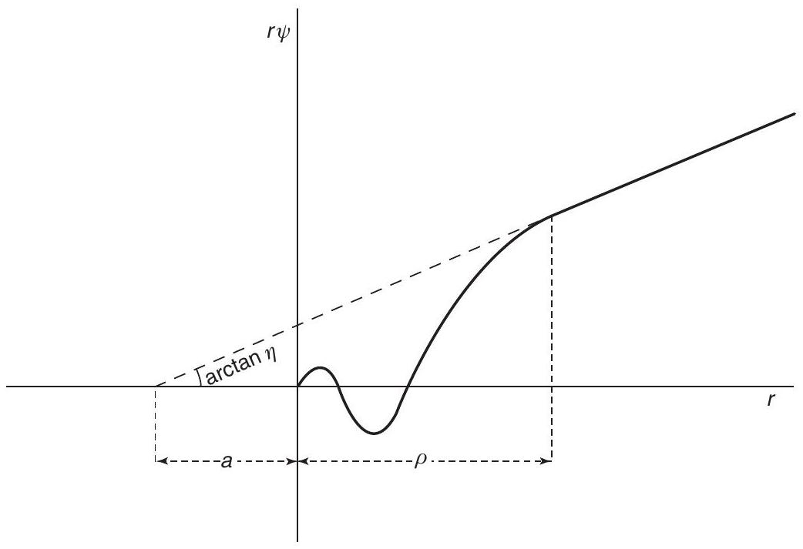
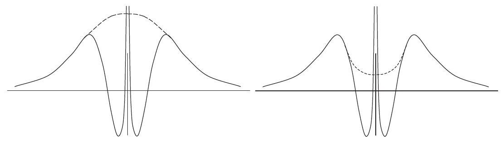
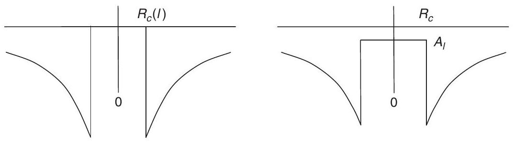
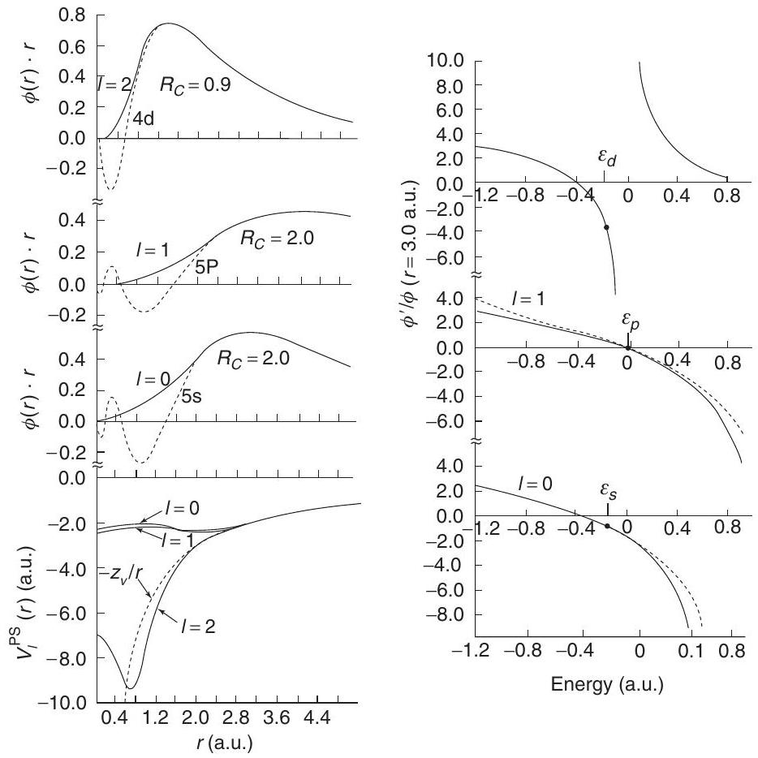
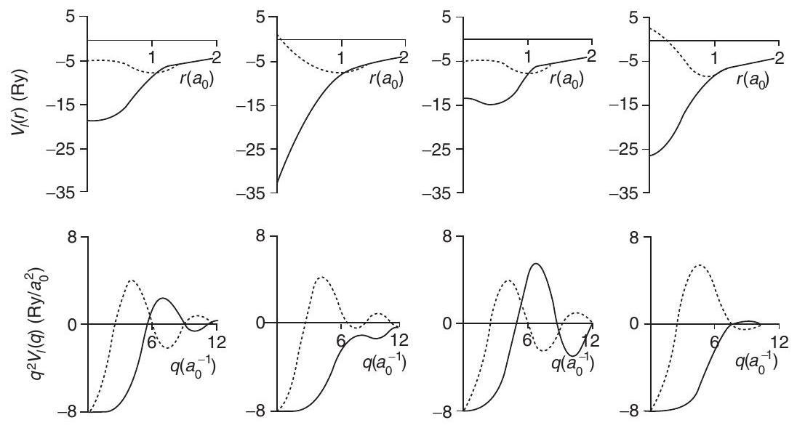
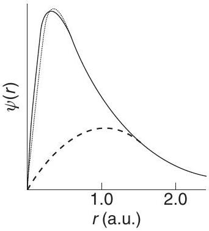

**11**

**Pseudopotentials**

**Summary**

The fundamental idea of a "pseudopotential" is the replacement of one problem with another. The primary application in electronic structure is to replace the strong Coulomb potential of the nucleus and the effects of the tightly bound core electrons by an effective ionic potential acting on the valence electrons. A pseudopotential can be generated in an atomic calculation and then used to compute properties of valence electrons in molecules or solids, since the core states remain almost unchanged. Furthermore, the fact that pseudopotentials are not unique allows the freedom to choose forms that simplify the calculations and the interpretation of the resulting electronic structure. The advent of $a b$ initio "norm-conserving" and "ultrasoft" pseudopotentials has led to accurate calculations that are the basis for much of the current research and development of new methods in electronic structure, as described in the following chapters.

Many of the ideas originated in the orthogonalized plane wave (OPW) approach that casts the eigenvalue problem in terms of a smooth part of the valence functions plus core (or core-like) functions. The OPW method has been brought into the modern framework of total energy functionals by the projector augmented wave (PAW) approach that uses pseudopotential operators but keeps the full core wavefunctions.

# 11.1 Scattering Amplitudes and Pseudopotentials

It is useful to first consider scattering properties of a localized spherical potential at energy $\varepsilon$, which can be formulated concisely in terms of the phase shift $\eta_{l}(\varepsilon)$, which determines the effect on the wavefunction outside the localized region. This is a central concept for many phenomena in physics, such as scattering cross-sections in nuclear and particle physics, resistance in metals due to scattering from impurities, and electron states in crystals described by phase shifts in the augmented plane wave and multiple scattering KKR methods (Chapter 16). One of the early examples of this idea is illustrated in Fig. 11.1, taken from papers by Fermi and coworkers. Exacty the same figure appears in two papers,

Figure 11.1. Radial wavefunction $\phi=r \psi$ for low-energy scattering as illustrated in a figure from the 1934 and 1935 papers of Fermi and coworkers for low-energy electron scattering from atoms [65] and neutron scattering from nuclei [500]. The nodes in the wavefunction near the origin show that the potential is attractive and strong enough to have bound states. The cross-section for scattering from the localized potential is determined by the phase shift (or equivalently the extrapolated scattering length as discussed in Exercise 11.1) and is the same for a weaker pseudopotential with the same phase shift modulo $2 \pi$.

one on low-energy electron scattering from atoms [65] and the other on low-energy neutron scattering from nuclei [500]. The incident plane wave is resolved into spherical harmonics as in Fig. J.1, and the figure shows the radial wavefunction for one angular momentum $l$ in a scattering state with a small positive energy. The closely spaced nodes in the wavefunction near the origin indicate that the kinetic energy is large, i.e., that there is a strong attractive potential. In fact, there must be lower-energy bound states (with fewer nodes) to which the scattering state must be orthogonal. The same effect on the wavefunction outside the core can be produced by a weaker potential that has no bound states.

It is instructive to consider the changes in the wavefunction $\phi=r \psi$ outside the scattering region as a function of the scattering potential. If there were no potential, i.e., phase shift $\eta_{l}(\varepsilon)=0$, then Eq. (J.4) leads to $\phi \propto r j_{l}(\kappa r)$, which extrapolates to zero at $r=0$. In the presence of a potential the wavefunction outside the central region is also a free wave but phase shifted as in Eq. (J.4). A weak potential leads to a small phase shift $\eta<2 \pi$. If the potential is made more attractive, the phase shift increases with a new bound state formed for each integer multiple $2 \pi$. From the explicit solution Eq. (J.4), it is clear that the wavefunction outside the central region is exactly the same for any potential that gives the same phase shift $\eta_{l}(\varepsilon)$ modulo any multiple of $2 \pi$. In particular, the scattering in Fig. 11.1 can be reproduced at the given energy $\varepsilon$ by a weak potential that has no bound states and a scattering state with no nodes. For example, one can readily find a square well with the
same scattering properties at this energy (see Exercise 11.2). The aim of pseudopotential theory is to find useful pseudopotentials that faithfully represent the scattering over a desired energy range.

This is the essential idea for pseudopotentials, to describe the low-energy states - the valence states that are responsible for bonding - without explicitly treating the tightly bound core states. In a solid or molecule the potential is not zero outside the core region, but it is slowly varying and the same approach can be used to replace the strong potential with a weaker one. Perhaps the first use of pseudopotentials in solids was by Hellmann [66, 67] in 1935, who developed an effective potential for scattering of the valence electrons from the ion cores in metals and formulated a theory for binding of metals that is remarkably similar to present-day pseudopotential methods. The potentials, however, were not very weak [501], so that the calculations were not very accurate using perturbation methods available at the time.

Interest in pseudopotentials in solids was revived in the 1950s by Antoncik [502, 503] and Phillips and Kleinman [504], who showed that the orthogonalized plane wave (OPW) method of Herring [64,505] (see Section 11.2) can be recast in the form of equations for the valence states only that involve only a weaker effective potential. Their realization that the band structures of sp-bonded metals and semiconductors could be described accurately by a few empirical coefficients led to the basic understanding of a vast array of properties of sp-bonded metals and semiconductors. Excellent descriptions of the development of pseudopotentials before 1970 can be found in the review of Heine and Cohen [506, 507] and in the book Pseudopotentials in the Theory of Metals by Harrison [508].

Today modern pseudopotential calculations are based on $a b$ initio approaches in which the pseudopotential is derived from calculations on an atom without any fitting to properties of a molecule or solid. "Norm-conserving" potentials (Sections 11.4-11.8) are in a sense a return to the model potential concepts of Fermi and Hellmann, but with important additions. The requirement of norm conservation is the key step in making accurate, transferable pseudopotentials, which is essential so that a pseudopotential constructed in one environment (usually the atom) can faithfully describe the valence properties in different environments including atoms, ions, molecules, and condensed matter. ${ }^{1}$ The basic principles are given in some detail in Section 11.4 because they are closely related to scattering phase shifts (Appendix J), the augmentation approaches of Chapter 16, and the properties of the wavefunctions needed for linearization and given explicitly in Section 17.2. Section 11.5 is devoted to the generation of "semilocal" potentials $V_{l}(r)$ that are $l$-dependent, i.e., act differently upon different angular momenta $l$. In Section 11.8 we describe the transformation to a separable, fully nonlocal operator form that is often advantageous.

[^0]This approach has been extended by Blöchl [509] and Vanderbilt [510], who showed that one can make use of auxiliary localized functions to define "ultrasoft pseudopotentials" (Section 11.11). By expressing the pseudofunction as the sum of a smooth part and a more rapidly varying function localized around each ion core (formally related to the original OPW construction [64] and the Phillips-Kleinman-Antoncik transformation), the accuracy of norm-conserving pseudopotentials can be improved, while at the same time making the calculations less costly (although at the expense of added complexity in the programs).

The projector augmented wave (PAW) formulation (Section 11.12) is a reformulation of the OPW method into a form that is particularly appropriate for density functional theory calculations of total energies and forces. The valence wavefunctions are expressed as a sum of smooth functions plus core functions, which leads to a generalized eigenvalue equation just as in the OPW approach. Unlike pseudopotentials, however, the PAW method retains the entire set of all-electron core functions along with smooth parts of the valence functions. Matrix elements involving core functions are treated using muffin-tin spheres as in the augmented methods (Chapter 16). As opposed to augmented methods, however, the PAW approach maintains the advantage of pseudopotentials that forces can be calculated easily.

The concept of a pseudopotential is not limited to reproducing all-electron calculations within independent-particle approximations, such as the Kohn-Sham density functional approach. In fact, the original problem of "replacing the effects of core electrons with an effective potential" presents a larger challenge: can this be accomplished in a true manybody theory taking into account the fact that all electrons are indistinguishable? Although the details are beyond the scope of the present chapter, Section 11.13 provides the basic issues and ideas for construction of pseudopotentials that describe the effects of the cores beyond the independent electron approximation.

# 11.2 Orthogonalized Plane Waves (OPWs) and Pseudopotentials

Orthogonalized plane waves (OPWs), introduced by Herring [64, 505] in 1940, were the basis for the first quantitative calculations of bands in materials other than sp-bonded metals (see, e.g., [59, 511, 512] and the review by Herman [68]). The calculations of Herman and Callaway [59] for Ge, done in the 1950s, are shown in Fig. 1.3; similarly, OPW calculations provided the first theoretical understanding that Si is an indirect bandgap material with the minimum of the conduction band near the $X(\mathbf{k}=(1,0,0))$ zone boundary point [513, 514]. Combined with experimental observations [515], this work clarified the nature of the bands in these important materials. The OPW method is described in this chapter because it is the direct antecedent of modern pseudopotential and projector augmented wave (PAW) methods.

The original OPW formulation [64] is a very general approach for construction of basis functions for valence states with the form

$$
\chi_{\mathbf{q}}^{\mathrm{OPW}}(\mathbf{r})=\frac{1}{\Omega}\left\{\mathrm{e}^{\mathrm{i} \mathbf{q} \cdot \mathbf{r}}-\sum_{j}\left\langle u_{j} \mid \mathbf{q}\right\rangle u_{j}(\mathbf{r})\right\},
$$

where

$$
\left\langle u_{j} \mid \mathbf{q}\right\rangle \equiv \int \mathrm{d} \mathbf{r} u_{j}(\mathbf{r}) \mathrm{e}^{\mathrm{i} \mathbf{q} \cdot \mathbf{r}}
$$

from which it follows that $\chi_{\mathbf{q}}^{\mathrm{OPW}}$ is orthogonal to each function $u_{j}$. The functions $u_{j}(\mathbf{r})$ are left unspecified but are required to be localized around each nucleus.

If the localized functions $u_{j}$ are well chosen, Eq. (11.1) divides the function into a smooth part plus the localized part, as illustrated on the left-hand side of Fig. 11.2. In a crystal a smooth function can be represented conveniently by plane waves, hence the emphasis on plane waves in the original work. In the words of Herring [64]:

This suggests that it would be practical to try to approximate [the eigenfunction in a crystal] by a linear combination of a few plane waves, plus a linear combination of a few functions centered about each nucleus and obeying wave equations of the form ${ }^{2}$

$$
\frac{1}{2} \nabla^{2} u_{j}+\left(E_{j}-V_{j}\right) u_{j}=0
$$

The potential $V_{j}=V_{j}(r)$ and the functions $u_{j}$ are to be chosen to be optimal for the problem. With this broad definition present in the original formulation [64], the OPW approach is the prescience of all modern pseudopotential and PAW methods. As is clear in the sections below, those methods involve new ideas and clever choices for the functions and operations on the functions. This has led to important advances in electronic structure that have made many of the modern developments in the field possible. For present purposes it is useful to consider the orthogonalized form for the valence states in an atom, where the state is labeled by angular momentum lm, and, of course, the added functions must also have the same lm. Using the definitions Eqs. (11.1) and (11.2), it follows immediately that the general OPW-type relation takes the form

$$
\psi_{l m}^{v}(\mathbf{r})=\tilde{\psi}_{l m}^{v}(\mathbf{r})+\sum_{j} B_{l m j} u_{l m j}(\mathbf{r})
$$

where $\psi_{l m}^{v}$ is the valence function, $\tilde{\psi}_{l m}^{v}$ is the smooth part, and all quantities can be expressed in terms of the original OPWs by Fourier transforms:

$$
\begin{aligned}
\psi_{l m}^{v}(\mathbf{r}) & =\int \mathrm{d} \mathbf{q} c_{l m}(\mathbf{q}) \chi_{\mathbf{q}}^{\mathrm{OPW}}(\mathbf{r}) \\
\tilde{\psi}_{l m}^{v}(\mathbf{r}) & =\int \mathrm{d} \mathbf{q} c_{l m}(\mathbf{q}) \mathrm{e}^{\mathrm{i} \mathbf{q} \cdot \mathbf{r}} \\
B_{l m j} & =\int \mathrm{d} \mathbf{q} c_{l m}(\mathbf{q})\left\langle u_{j} \mid \mathbf{q}\right\rangle
\end{aligned}
$$

A schematic example of a 3 s valence state and the corresponding smooth function is illustrated in Fig. 11.2.

[^1]
Figure 11.2. Schematic example of a valence function that has the character of a 3s orbital near the nucleus (which is properly orthogonal to the 1s and 2s core states) and two examples of smooth functions (dashed lines) that equal the full wavefunction outside the core region. Left: the dashed curve illustrates the smooth part of the valence function $\tilde{\psi}$ defined by OPW-like equations Eqs. (11.4) and (11.6). Right: a smooth pseudofunction $\psi_{l}^{\mathrm{PS}}$ that satisfies the norm-conservation condition Eq. (11.21). In general, $\psi_{l}^{\mathrm{PS}}$ is not as smooth as $\tilde{\psi}$.

It is also illuminating to express the OPW relation Eq. (11.4) as a transformation

$$
\left|\psi_{l m}^{v}\right\rangle=\mathcal{T}\left|\tilde{\psi}_{l m}^{v}\right\rangle .
$$

This is nothing more than a rewritten form of Eq. (11.4), but it expresses in compact form the idea that a solution for the smooth function $\tilde{\psi}_{l m}^{v}$ is sufficient; one can always recover the full function $\psi_{l m}^{v}$ using a linear transformation denoted $\mathcal{T}$ in Eq. (11.8). This is exactly the form used in the PAW approach in Section 11.12.

The simplest approach is to choose the localized states to be core orbitals $u_{\text {lmi }}=\psi_{\text {lmi }}^{c}$, i.e., to choose the potential in Eq. (11.3) to be the actual potential (assumed to be spherical near the nucleus), so that $\psi_{l m i}^{c}$ are the lowest eigenstates of the hamiltonian

$$
H \psi_{l m i}^{c}=\varepsilon_{l i}^{c} \psi_{l m i}^{c} .
$$

Since the valence state $\psi_{l m}^{v}$ must be orthogonal to the core states $\psi_{l m i}^{c}$, the radial part of $\psi_{l}^{v}(r)$ must have as many nodes as there are core orbitals with that angular momentum. One can show (Exercise 11.3) that the choice of $u_{l i}=\psi_{l i}^{c}$ leads to a smooth function $\tilde{\psi}_{l}^{v}(\mathbf{r})$ that has no radial nodes, i.e., it is indeed smoother than $\psi_{l}^{v}(\mathbf{r})$. Furthermore, often the core states can be assumed to be the same in the molecule or solid as in the atom. This is the basis for the actual calculations [68] in the OPW method.

There are several relevant points to note. As is illustrated on the left-hand side of Fig. 11.2, an OPW is like a smooth wave with additional structure and reduced amplitude near the nucleus. The set of OPWs is not orthonormal and each wave has a norm less than unity (Exercise 11.4)

$$
\left\langle\chi_{\mathbf{q}}^{\mathrm{OPW}} \mid \chi_{\mathbf{q}}^{\mathrm{OPW}}\right\rangle=1-\sum_{j}\left|\left\langle u_{j} \mid \mathbf{q}\right\rangle\right|^{2} .
$$

This means that the equations for the OPWs have the form of a generalized eigenvalue problem with an overlap matrix.

## 11.2.1 The Pseudopotential Transformation

The pseudopotential transformation of Phillips and Kleinman [504] and Antoncik [502, 503] (PKA) results if one inserts Expression (11.4) for $\psi_{i}^{v}(\mathbf{r})$ into the original equation for the valence eigenfunctions

$$
\hat{H} \psi_{i}^{v}(\mathbf{r})=\left[-\frac{1}{2} \nabla^{2}+V(\mathbf{r})\right] \psi_{i}^{v}(\mathbf{r})=\varepsilon_{i}^{v} \psi_{i}^{v}(\mathbf{r}),
$$

where $V$ is the total effective potential, which leads to an equation for the smooth functions, $\tilde{\psi}_{i}^{v}(\mathbf{r})$,

$$
\hat{H}^{\mathrm{PKA}} \tilde{\psi}_{i}^{v}(\mathbf{r}) \equiv\left[-\frac{1}{2} \nabla^{2}+\hat{V}^{\mathrm{PKA}}\right] \tilde{\psi}_{i}^{v}(\mathbf{r})=\varepsilon_{i}^{v} \tilde{\psi}_{i}^{v}(\mathbf{r})
$$

Here

$$
\hat{V}^{\mathrm{PKA}}=V+\hat{V}^{R}
$$

where $\hat{V}^{R}$ is a nonlocal operator that acts on $\tilde{\psi}_{i}^{v}(\mathbf{r})$ with the effect

$$
\hat{V}^{R} \tilde{\psi}_{i}^{v}(\mathbf{r})=\sum_{j}\left(\varepsilon_{i}^{v}-\varepsilon_{j}^{c}\right)\left\langle\psi_{j}^{c} \mid \tilde{\psi}_{i}^{v}\right\rangle \psi_{j}^{c}(\mathbf{r})
$$

Thus far this is nothing more than a formal transformation of the OPW expression, (11.11). The formal properties of the transformed equations suggest both advantages and disadvantages. It is clear that $\hat{V}^{R}$ is repulsive since Eq. (11.14) is written in terms of the energies $\varepsilon_{i}^{v}-\varepsilon_{j}^{c}$, which are always positive. Furthermore, a stronger attractive nuclear potential leads to deeper core states so that Eq. (11.14) also becomes more repulsive. This tendency was pointed out by Phillips and Kleinman and Antoncik and derived in a very general form as the "cancellation theorem" by Cohen and Heine [516]. Thus $\hat{V}^{\mathrm{PKA}}$ is much weaker than the original $V(\mathbf{r})$, but it is a more complicated nonlocal operator. In addition, the smooth pseudofunctions $\tilde{\psi}_{i}^{v}(\mathbf{r})$ are not orthonormal because the complete function $\psi_{i}^{v}$ also contains the sum over core orbitals in Eq. (11.4). Thus the solution of the pseudopotential equation (11.12) is a generalized eigenvalue problem. ${ }^{3}$ Furthermore, since the core states are still present in the definition, Eq. (11.14), this transformation does not lead to a "smooth" pseudopotential.

The full advantages of the pseudopotential transformation are realized by using both the formal properties of pseudopotential $\hat{V}^{\mathrm{PKA}}$ and the fact that the same scattering properties can be reproduced by different potentials. Thus the pseudopotential can be chosen to be both smoother and weaker than the original potential $V$ by taking advantage of the nonuniqueness of pseudopotentials, as discussed in more detail in following sections.

Even though the potential operator is a more complex object than a simple local potential, the fact that it is weaker and smoother (i.e., it can be expanded in a small number of Fourier

[^2]components) has great advantages, conceptually and computationally. In particular, it immediately resolves the apparent contradiction (see Chapter 12) that the valence bands $\varepsilon_{n \mathbf{k}}^{v}$ in many materials are nearly-free-electron-like, even though the wavefunctions $\psi_{n \mathbf{k}}^{v}$ must be very non-free-electron-like since they must be orthogonal to the cores. The resolution is that the bands are determined by the secular equation for the smooth, nearly-free-electron-like $\tilde{\psi}_{n \mathbf{k}}^{v}$ that involves the weak pseudopotential $\hat{V}^{\mathrm{PKA}}$ or $\hat{V}^{\text {model }}$.

# 11.3 Model Ion Potentials

Based on the foundation of pseudopotentials in scattering theory, and the transformation of the OPW equations and the cancellation theorem, the theory of pseudopotentials has become a fertile field for generating new methods and insight for the electronic structure of molecules and solids. There are two approaches: (1) to define ionic pseudopotentials, which leads to the problem of interacting valence-only electrons, and (2) to define a total pseudopotential that includes effects of the other valence electrons. The former is the more general approach since the ionic pseudopotentials are more transferable with a single ion potential applicable for the given atom in different environments. The latter approach is very useful for describing the bands accurately if they are treated as adjustable empirical potentials; historically, empirical pseudopotentials have played an important role in the understanding of electronic structures [506,507], and they reappear in Section 12.6 as a useful approach for understanding bands in a plane wave basis.

Here we concentrate on ionic pseudopotentials and the form of model potentials that give the same scattering properties as the pseudopotential operators of Eqs. (11.13) and Eq. (11.14) or more general forms. Since a model potential replaces the potential of a nucleus and the core electrons, it is spherically symmetric and each angular momentum $l, m$ can be treated separately, which leads to nonlocal $l$-dependent model pseudopotentials $V_{l}(r)$. The qualitative features of $l$-dependent pseudopotentials can be illustrated by the forms shown in Fig. 11.3. Outside the core region, the potential is $Z_{\text {ion }} / r$, i.e., the combined Coulomb potential of the nucleus and core electrons. Inside the core region the potential is

Figure 11.3. Left: "empty core" model potential of Ashcroft [517] in which the potential is zero inside radius $R_{c}(l)$, which is different for each $l$. Right: square well model potential with value $A_{l}$ inside a cutoff radius $R_{c}$, proposed by Abarenkov and Heine [518] and fit to atomic data by Animalu and Heine [519,520] (see also by Harrison [508]). The fact that the potentials are weak, zero, or even positive inside a cutoff radius $R_{c}$ is an illustration of the "cancellation theorem" [516].

expected to be repulsive [516] to a degree that depends on the angular momentum $l$, as is clear from the analysis of the repulsive potential in Eq. (11.14).

The dependence on $l$ means that, in general, a pseudopotential is a nonlocal operator that can be written in "semilocal" (SL) form

$$
\hat{V}_{\mathrm{SL}}=\sum_{l m}\left|Y_{l m}\right\rangle V_{l}(r)\left\langle Y_{l m}\right|,
$$

where $Y_{l m}(\theta, \phi)=P_{l}(\cos (\theta)) \mathrm{e}^{\mathrm{i} m \phi}$. This is termed semilocal (SL) because it is nonlocal in the angular variables but local in the radial variable: when operating on a function $f\left(r, \theta^{\prime}, \phi^{\prime}\right), \hat{V}_{\text {SL }}$ has the effect

$$
\left[\hat{V}_{\mathrm{SL}} f\right]_{r, \theta, \phi}=\sum_{l m} Y_{l m}(\theta, \phi) V_{l}(r) \int \mathrm{d}\left(\cos \theta^{\prime}\right) \mathrm{d} \phi^{\prime} Y_{l m}\left(\theta^{\prime}, \phi^{\prime}\right) f\left(r, \theta^{\prime}, \phi^{\prime}\right) .
$$

All the information is in the radial functions $V_{l}(r)$ or their Fourier transforms, which are defined in Section 12.4. An electronic structure involves calculation of the matrix elements of $\hat{V}_{\text {SL }}$ between states $\psi_{i}$ and $\psi_{j}$

$$
\left\langle\psi_{i}\right| \hat{V}_{\mathrm{SL}}\left|\psi_{j}\right\rangle=\int \mathrm{d} r \psi_{i}(r, \theta, \phi)\left[\hat{V}_{\mathrm{SL}} \psi_{j}\right]_{r, \theta, \phi}
$$

(Compare this with Eq. (11.43) for a fully nonlocal separable form of the pseudopotential.) There are two approaches to the definition of potentials:

- Empirical potentials fitted to atomic or solid state data. Simple forms are the "empty core" [517] and square well [518-520] models illustrated in Fig. 11.3. In the latter case, the parameters were fit to atomic data for each $l$ and tabulated for many elements by Animalu and Heine [519,520] (tables given also by Harrison [508]). ${ }^{4}$
- Ab initio potentials constructed to fit the valence properties calculated for the atom. The advent of "norm-conserving" pseudopotentials provided a straightforward way to make such potentials that are successfully transferrable to calculations on molecules and solids.

# 11.4 Norm-Conserving Pseudopotentials (NCPPs)

Pseudopotentials generated by calculations on atoms (or atomic-like states) are termed $a b$ initio because they are not fitted to experiment. The concept of "norm conservation" has a special place in the development of $a b$ initio pseudopotentials; at one stroke it simplifies

[^3]the application of the pseudopotentials and it makes them more accurate and transferable. The latter advantage is described below, but the former can be appreciated immediately. In contrast to the PKA approach (Section 11.2) (where the equations were formulated in terms of the smooth part of the valence function $\tilde{\psi}_{i}^{v}(\mathbf{r})$ to which another function must be added, as in Eq. (11.4)), norm-conserving pseudofunctions $\psi^{\mathrm{PS}}(\mathbf{r})$ are normalized and are solutions of a model potential chosen to reproduce the valence properties of an allelectron calculation. A schematic example is shown on the right-hand side of Fig. 11.2, which illustrates the difference from the unnormalized smooth part of the OPW. In the application of the pseudopotential to complex systems, such as molecules, clusters, solids, etc., the valence pseudofunctions satisfy the usual orthonormality conditions as in Eq. (7.9),
$$
\left\langle\psi_{i}^{\sigma, \mathrm{PS}} \mid \psi_{j}^{\sigma^{\prime}, \mathrm{PS}}\right\rangle=\delta_{i, j} \delta_{\sigma, \sigma^{\prime}}
$$
so that for the Kohn-Sham equations have the same form as in Eq. (7.11),
$$
\left(H_{\mathrm{KS}}^{\sigma, \mathrm{PS}}-\varepsilon_{i}^{\sigma}\right) \psi_{i}^{\sigma, \mathrm{PS}}(\mathbf{r})=0
$$
with $H_{\mathrm{KS}}^{\sigma, \mathrm{PS}}$ given by Eq. (7.12) and Eq. (7.13), and the external potential given by the pseudopotential specified in the section following.

## 11.4.1 Norm-Conservation Condition

Quantum chemists and physicists have devised pseudopotentials called, respectively, "shape-consistent" [521, 522] and "norm-conserving" [523]. ${ }^{5}$ The starting point for defining norm-conserving potentials is the list of requirements for a "good" ab initio pseudopotential given by Hamann, Schluter, and Chiang (HSC) [523]:

1. All-electron and pseudovalence eigenvalues agree for the chosen atomic reference configuration.
2. All-electron and pseudovalence wavefunctions agree beyond a chosen core radius $R_{c}$.
3. The logarithmic derivatives of the all-electron and pseudo-wavefunctions agree at $R_{c}$.
4. The integrated charge inside $R_{c}$ for each wavefunction agrees (norm conservation).
5. The first energy derivative of the logarithmic derivatives of the all-electron and pseudowavefunctions agrees at $R_{c}$, and therefore for all $r \geq R_{c}$.

From points 1 and 2 it follows that the NCPP equals the atomic potential outside the "core region" of radius $R_{c}$; this is because the potential is uniquely determined (except for a constant that is fixed if the potential is zero at infinity) by the wavefunction and the energy $\varepsilon$, which need not be an eigenenergy. Point 3 follows since the wavefunction $\psi_{l}(r)$ and its radial derivative $\psi_{l}^{\prime}(r)$ are continuous at $R_{c}$ for any smooth potential. The dimensionless logarithmic derivative $D$ is defined by

$$
D_{l}(\varepsilon, r) \equiv r \psi_{l}^{\prime}(\varepsilon, r) / \psi_{l}(\varepsilon, r)=r \frac{\mathrm{~d}}{\mathrm{~d} r} \ln \psi_{l}(\varepsilon, r)
$$

also given in Eq. (J.5).

[^4]Inside $R_{c}$ the pseudopotential and radial pseudo-orbital $\psi_{l}^{\mathrm{PS}}$ differ from their all-electron counterparts; however, point 4 requires that the integrated charge,

$$
Q_{l}=\int_{0}^{R_{c}} \mathrm{~d} r r^{2}\left|\psi_{l}(r)\right|^{2}=\int_{0}^{R_{c}} \mathrm{~d} r \phi_{l}(r)^{2}
$$

be the same for $\psi_{l}^{\mathrm{PS}}$ (or $\phi_{l}^{\mathrm{PS}}$ ) as for the all-electron radial orbital $\psi_{l}$ (or $\phi_{l}$ ) for a valence state. The conservation of $Q_{l}$ insures that (a) the total charge in the core region is correct, and (b) the normalized pseudo-orbital is equal ${ }^{6}$ to the true orbital outside of $R_{c}$ (in contrast to the smooth orbital of Eq. (11.6), which equals the true orbital outside $R_{c}$ only if it is not normalized). Applied to a molecule or solid, these conditions ensure that the normalized pseudo-orbital is correct in the region outside $R_{c}$ between the atoms where bonding occurs, and that the potential outside $R_{c}$ is correct as well since the potential outside a spherically symmetric charge distribution depends only on the total charge inside the sphere.

Point 5 is a crucial step toward the goal of constructing a "good" pseudopotential: one that can be generated in a simple environment like a spherical atom and then used in a more complex environment. In a molecule or solid, the wavefunctions and eigenvalues change and a pseudopotential that satisfies point 5 will reproduce the changes in the eigenvalues to linear order in the change in the self-consistent potential. At first sight, however, it is not obvious how to satisfy the condition that the first energy derivative of the logarithmic derivatives $\mathrm{d} D_{l}(\varepsilon, r) / \mathrm{d} \varepsilon$ agree for the pseudo- and the all-electron wavefunctions evaluated at the cutoff radius $R_{c}$ and energy $\varepsilon_{l}$ chosen for the construction of the pseudopotential of angular momentum $l$.

The advance due to HSC [523] and others [521, 522] was to show that point 5 is implied by point 4 . This "norm-conservation condition" can be derived straightforwardly, e.g., following the derivation of Shirley et al. [526], which uses relations due to Luders [527] (see Exercises 11.8 and 11.9 for intermediate steps). The radial equation for a spherical atom or ion, Eq. (10.12), which can be written

$$
-\frac{1}{2} \phi_{l}^{\prime \prime}(r)+\left[\frac{l(l+1)}{2 r^{2}}+V_{\mathrm{eff}}(r)-\varepsilon\right] \phi_{l}(r)=0
$$

where a prime means derivative with respect to $r$, can be transformed by defining the variable $x_{l}(\varepsilon, r)$

$$
x_{l}(\varepsilon, r) \equiv \frac{\mathrm{d}}{\mathrm{~d} r} \ln \phi_{l}(r)=\frac{1}{r}\left[D_{l}(\varepsilon, r)+1\right]
$$

It is straightforward to show that Eq. (11.22) is equivalent to the nonlinear first-order differential equation,

$$
x_{l}^{\prime}(\varepsilon, r)+\left[x_{l}(\varepsilon, r)\right]^{2}=\frac{l(l+1)}{r^{2}}+2[V(r)-\varepsilon]
$$

[^5]Differentiating this equation with respect to energy gives

$$
\frac{\partial}{\partial \varepsilon} x_{l}^{\prime}(\varepsilon, r)+2 x_{l}(\varepsilon, r) \frac{\partial}{\partial \varepsilon} x_{l}(\varepsilon, r)=-1 .
$$

Combining this with the relation valid for any function $f(r)$ and any $l$,

$$
f^{\prime}(r)+2 x_{l}(\varepsilon, r) f(r)=\frac{1}{\phi_{l}(r)^{2}} \frac{\partial}{\partial r}\left[\phi_{l}(r)^{2} f(r)\right]
$$

multiplying by $\phi_{l}(r)^{2}$ and integrating, one finds at radius $R$

$$
\frac{\partial}{\partial \varepsilon} x_{l}(\varepsilon, R)=-\frac{1}{\phi_{l}(R)^{2}} \int_{0}^{R} \mathrm{~d} r \phi_{l}(r)^{2}=-\frac{1}{\phi_{l}(R)^{2}} Q_{l}(R)
$$

or in terms of the dimensionless logarithmic derivative $D_{l}(\varepsilon, R)$

$$
\frac{\partial}{\partial \varepsilon} D_{l}(\varepsilon, R)=-\frac{R}{\phi_{l}(R)^{2}} \int_{0}^{R} \mathrm{~d} r \phi_{l}(r)^{2}=-\frac{R}{\phi_{l}(R)^{2}} Q_{l}(R)
$$

This shows immediately that if $\phi_{l}^{\mathrm{PS}}$ has the same magnitude as the all-electron function $\phi_{l}$ at $R_{c}$ and obeys norm conservation ( $Q_{l}$ the same), then the first energy derivative of the logarithmic derivative $x_{l}(\varepsilon, R)$ and $D_{l}(\varepsilon, R)$ is the same as for the all-electron wavefunction. This also means that the norm-conserving pseudopotential has the same scattering phase shifts as the all-electron atom to linear order in energy around the chosen energy $\varepsilon_{l}$, which follows from Expression (J.6), which relates to $D_{l}(\varepsilon, R)$ and the phase shift $\eta_{l}(\varepsilon, R) .^{7}$

# 11.5 Generation of $\boldsymbol{I}$-Dependent Norm-Conserving Pseudopotentials

Generation of a pseudopotential starts with the usual all-electron atomic calculation as described in Chapter 10. Each state $l, m$ is treated independently except that the total potential is calculated self-consistently for the given approximation for exchange and correlation and for the given configuration of the atom. The next step is to identify the valence states and generate the pseudopotentials $V_{l}(r)$ and pseudo-orbitals $\psi_{l}^{\mathrm{PS}}(r)= r \phi_{l}^{\mathrm{PS}}(r)$. The procedure varies with different approaches, but in each case one first finds a total "screened" pseudopotential acting on valence electrons in the atom. This is then "unscreened" by subtracting from the total potential the sum of Hartree and exchangecorrelation potentials $V_{H \times c}^{\mathrm{PS}}(r)=V_{\text {Hartree }}^{\mathrm{PS}}(r)+V_{\mathrm{xc}}^{\mathrm{PS}}(r)$

$$
V_{l}(r) \equiv V_{l, \text { total }}(r)-V_{H \mathrm{xc}}^{\mathrm{PS}}(r)
$$

where $V_{H \times \mathrm{c}}^{\mathrm{PS}}(r)$ is defined for the valence electrons in their pseudo-orbitals. Further aspects of "unscreening" are deferred to Section 11.6.

[^6]It is useful to separate the ionic pseudopotential into a local ( $l$-independent) part of the potential plus nonlocal terms

$$
V_{l}(r)=V_{\text {local }}(r)+\delta V_{l}(r)
$$

Since the eigenvalues and orbitals are required to be the same for the pseudo and the allelectron case for $r>R_{c}$, each potential $V_{l}(r)$ equals the local ( $l$-independent) all-electron potential, and $V_{l}(r) \rightarrow-\frac{Z_{\text {ion }}}{r}$ for $r \rightarrow \infty$. Thus $\delta V_{l}(r)=0$ for $r>R_{c}$ and all the longrange effects of the Coulomb potential are included in the local potential $V_{\text {local }}(r)$. Finally, the "semilocal" operator Eq. (11.15) can be written as

$$
\hat{V}_{\mathrm{SL}}=V_{\text {local }}(r)+\sum_{l m}\left|Y_{l m}\right\rangle \delta V_{l}(r)\left\langle Y_{l m}\right|
$$

Even if one requires norm conservation, there is still freedom of choice in the form of $V_{l}(r)$ in constructing pseudopotentials. There is no one "best pseudopotential" for any given element - there may be many "best" choices, each optimized for some particular use of the pseudopotential. In general, there are two overall competing factors:

- Accuracy and transferability generally lead to the choice of a small cutoff radius $R_{c}$ and "hard" potentials, since one wants to describe the wavefunction as well as possible in the region near the atom.
- Smoothness of the resulting pseudofunctions generally leads to the choice of a large cutoff radius $R_{c}$ and "soft" potentials, since one wants to describe the wavefunction with as few basis functions as possible (e.g., plane waves).

Here we will try to present the general ideas in a form that is the basis of widely used methods, with references to some of the many proposed forms that cannot be covered here.

An example of pseudopotentials [523] for Mo is shown in Fig. 11.4. A similar approach has been used by Bachelet, Hamann, and Schlüter (BHS) [528] to construct pseudopotentials for all elements from H to Po , in the form of an expansion in gaussians with tabulated coefficients. These potentials were derived starting from an assumed form of the potential and varying parameters until the wavefunction has the desired properties, an approach also used by Vanderbilt [529]. A simpler procedure is that of Christiansen et al. [521] and Kerker [530], which defines a pseudowavefunction $\phi_{l}^{\mathrm{PS}}(r)$ with the desired properties for each $l$ and numerically inverts the Schrödinger equation to find the potential $V_{l}(r)$ for which $\phi_{l}^{\mathrm{PS}}(r)$ is a solution with energy $\varepsilon$. The wavefunction outside the radius $R_{c}$ is the same as the true function and at $R_{c}$ it is matched to a parameterized analytic function. Since the energy $\varepsilon$ is fixed (often it is the eigenvalue from the all-electron calculation, but this is not essential), it is straightforward to invert the Schrödinger equation for a nodeless function $\phi_{l}^{\mathrm{PS}}(r)$ for each $l$ separately, yielding

$$
V_{l, \text { total }}(r)=\varepsilon-\frac{\hbar^{2}}{2 m_{e}}\left[\frac{l(l+1)}{2 r^{2}}-\frac{\frac{\mathrm{d}^{2}}{\mathrm{~d} r^{2}} \phi_{l}^{\mathrm{PS}}(r)}{\phi_{l}^{\mathrm{PS}}(r)}\right]
$$

Figure 11.4. Example of norm-conserving pseudopotentials, pseudofunctions, and logarithmic derivative for the element Mo. Left bottom: $V_{l}(r)$ in Rydbergs for angular momentum $l=0,1,2$ compared to $Z_{\text {ion }} / r$ (dashed). Left top: all-electron valence radial functions $\phi_{l}(r)=r \psi_{l}(r)$ (dashed) and norm-conserving pseudofunctions. Right: logarithmic derivative of the pseudopotential compared to the full-atom calculation; the points indicate the energies, $\varepsilon$, where they are fitted. The derivative with respect to the energy is also correct due to the norm-conservation condition Eq. (11.27). From [523].

The analytic form chosen by Kerker is $\phi_{l}^{\mathrm{PS}}(r)=\mathrm{e}^{p(r)}, r<R_{c}$, where $p(r)=$ polynomial to the fourth power with coefficients fixed by requiring continuous first and second derivatives at $R_{c}$ and norm conservation.

One of the important considerations for many uses is to make the wavefunction as smooth as possible, which allows it to be described by fewer basis functions, e.g., fewer Fourier components. For example, the BHS potentials [528] are a standard reference for comparison; however, they are generally harder and require more Fourier components in the description of the pseudofunction than other methods. Troullier and Martins [531] have extended the Kerker method to make it smoother by using a higher-order polynomial and matching more derivatives of the wavefunction. A comparison of different pseudopotentials for carbon is given in Fig. 11.5, showing the forms both in real and reciprocal space. The one-dimensional radial transforms $V_{l}(q)$ (or "form factors") for each $l$ are defined in Section 12.4; these are the functions that enter directly in plane wave calculations and their extent in Fourier space determines the number of plane waves needed for convergence.

Figure 11.5. Comparison of pseudopotentials for carbon (dotted line for s and solid line for p ) in real space and reciprocal space, illustrating the large variations in potentials that are all norm conserving and have the same phase shifts at the chosen energies. In order from left to right, generated using the procedures of Troullier and Martins [531]; Kerker [530]; Hamann, Schlüter, and Chiang [523]; Vanderbilt [529]. From Troullier and Martins [531].

A number of authors have proposed ways to make smoother potentials to reduce the size of calculations. One approach [532, 533] is to minimize the kinetic energy of the pseudofunctions explicitly for the chosen core radius. This can be quantified by examination of the Fourier transform and its behavior at large momentum $q$, as described in Section 11.7. Optimization of the potentials can be done in the atom, and the results carry over to molecules and solids, since the convergence is governed by the form inside the core radius.

## 11.5.1 Relativistic Effects

Effects of special relativity can be incorporated into pseudopotentials, since they originate deep in the interior of the atom near the nucleus, and the consequences for valence electrons can be easily carried into molecular or solid-state calculations. This includes shifts due to scalar relativistic effects and spin-orbit interactions. The first step is generation of a pseudopotential from a relativistic all-electron calculation on the atom for both $j=l+1 / 2$ and $j=l-1 / 2$. From the two potentials we can define [372, 528]

$$
\begin{aligned}
V_{l} & =\frac{l}{2 l+1}\left[(l+1) V_{l+1 / 2}+l V_{l-1 / 2}\right], \\
\delta V_{l}^{\mathrm{so}} & =\frac{2}{2 l+1}\left[V_{l+1 / 2}-V_{l-1 / 2}\right] .
\end{aligned}
$$

Scalar relativistic effects are included in the first term and the spin-orbit effects are included in a short-range nonlocal term [486, 487],

$$
\delta \hat{V}_{\mathrm{SL}}^{\mathrm{so}}=\sum_{l m}\left|Y_{l m}\right\rangle \delta V_{l}^{\mathrm{so}}(r) \mathbf{L} \cdot \mathbf{S}\left\langle Y_{l m}\right| .
$$

# 11.6 Unscreening and Core Corrections

In the construction of $a b$ initio pseudopotentials there is a straightforward one-to-one relation of the valence pseudofunction and the total pseudopotential. It is then a necessary step to "unscreen" to derive the bare-ion pseudopotential, which is transferable to different environments. However, the process of "unscreening" is not so straightforward. If the effective exchange-correlation potential were a linear function of density (as is the Hartree potential $V_{\text {Hartree }}$ ) there would be no problem, and Eq. (11.29) could be written as

$$
V_{l, \text { total }}=V_{l}(r)+V_{\text {Hartree }}\left(\left[n^{\mathrm{PS}}\right], \mathbf{r}\right)+V_{\mathrm{xc}}\left(\left[n^{\mathrm{PS}}\right], \mathbf{r}\right),
$$

where the notation $\left[n^{\mathrm{PS}}\right]$ means the quantity is evaluated as a functional of the pseudodensity $n^{\mathrm{PS}}$. This is true for the Hartree potential, but the fact that $V_{\mathrm{xc}}$ is a nonlinear functional of $n$ (and may also be nonlocal) leads to difficulties and ambiguities. (Informative discussions can be found in [534] and [525].)

## 11.6.1 Nonlinear Core Corrections

So long as the exchange-correlation functional involves only the density or its gradients at each point, then the unscreening of the potential in the atom can be accomplished by defining the effective exchange-correlation potential in Eq. (11.29) as

$$
\tilde{V}_{\mathrm{xc}}(\mathbf{r})=V_{\mathrm{xc}}\left(\left[n^{\mathrm{PS}}\right], \mathbf{r}\right)+\left[V_{\mathrm{xc}}\left(\left[n^{\mathrm{PS}}+n^{\text {core }}\right], \mathbf{r}\right)-V_{\mathrm{xc}}\left(\left[n^{\mathrm{PS}}\right], \mathbf{r}\right)\right] .
$$

The term in square brackets is a core correction that significantly increases the transferability of the pseudopotential [534]. There are costs, however: the core charge density must be stored along with the pseudodensity and the implementation in a solid must use $\tilde{V}_{\mathrm{xc}}(\mathbf{r})$ defined in Eq. (11.37), and the rapidly varying core density would be a disadvantage in plane wave methods. The second obstacle can be overcome [534] using the freedom of choice inherent in pseudopotentials by defining a smoother "partial core density" $n_{\text {partial }}^{\text {core }}(r)$ that can be used in Eq. (11.37). The original form proposed by Louie, Froyen, and Cohen [534] is ${ }^{8}$

$$
n_{\text {partial }}^{\text {core }}(r)= \begin{cases}\frac{A \sin (B r)}{r}, & r<r_{0}, \\ n^{\text {core }}(r), & r>r_{0},\end{cases}
$$

where $A$ and $B$ are determined by the value and gradient of the core charge density at $r_{0}$, a radius chosen where $n^{\text {core }}$ is typically one to two times $n^{\text {valence }}$. The effect is particularly large for cases in which the core is extended (e.g., the 3d transition metals where the 3p "core" states strongly overlap the 3d "valence" states) and for magnetic systems where there may be a large difference between up and down valence densities even though the fractional difference in total density is much smaller. In such cases, description of spin-polarized

[^7]configurations can be accomplished with a spin-independent ionic pseudopotential, with no need for separate spin-up and spin-down ionic pseudopotentials.

## 11.6.2 Nonlocal $E_{X C}$ Functionals

There is a complication in "unscreening" in cases where the $E_{\mathrm{xc}}$ functional is intrinsically nonlocal, as in Hartree-Fock and exact exchange (EXX). In general it is not possible to make a potential that keeps the wavefunctions outside a core radius the same as in the original all-electron problem because the nonlocal effects extend to all radii. The issues are discussed thoroughly in [525].

# 11.7 Transferability and Hardness

There are two meanings to the word "hardness." One meaning is a measure of the variation in real space, which is quantified by the extent of the potential in Fourier space. In general, "hard" potentials describe the properties of the localized rigid ion cores and are more transferable from one material to another; attempts to make the potential "soft" (i.e., smooth) have tended to lead to poorer transferability. There is considerable effort to make accurate, transferable potentials that do not extend far in Fourier space. What we care about is the extent of the pseudowavefunction (not the potential, even though they are related) where the Fourier transform of the wavefunction for each $l$ is given by

$$
\psi_{l}(q)=\int_{0}^{\infty} \mathrm{d} r j_{l}(q r) r^{2} \psi_{l}(r)
$$

In a calculation with plane waves up to a cutoff $q_{c}$ a quantitative measure of the error proposed by Rappe et al. [532] is the residual kinetic energy, i.e., the kinetic energy above the cutoff,

$$
E_{l}^{r}\left(q_{c}\right)=\int_{q_{c}}^{\infty} \mathrm{d} q q^{4}\left|\psi_{l}(q)\right|^{2}
$$

and the idea is to minimize $E_{l}^{r}\left(q_{c}\right)$ with the constraint of continuity, slope, and second derivative at the pseudopotential cutoff radius $r_{c}$. Pseudopotentials generated in this way were termed "optimized" [532]. This approach was extended by Hamann [535], who developed a procedure to expand the wavefunction in a set of functions that are used to satisfy continuity conditions up to an arbitrary number of derivatives. ${ }^{9}$

The second meaning is a measure of the ability of the valence pseudoelectrons to describe the response of the system to a change in the enviroment properly [536-538]. We have already seen that norm conservation guarantees that the electron states of the atom have the correct first derivative with respect to change in energy. This meaning of "hardness" is a measure of the faithfulness of the response to a change in potential. Potentials can be tested

[^8]versus spherical perturbations (change of charge, state, radial potential) using the usual spherical atom codes. Goedecker and Maschke [536] have given an insightful analysis in terms of the response of the charge density in the core region; this is relevant since the density is the central quantity in density functional theory and the integrated density is closely related to norm-conservation conditions. Also tests with nonspherical perturbations ascertain the performance with relevant perturbations, in particular, the polarizability in an electric field [538].

## 11.7.1 Tests in Spherical Boundary Conditions

We have seen in Section 10.7 that some aspects of solids are well modeled by imposing different spherical boundary conditions on an atom or ion. A net consequence is that the valence wavefunctions tend to be more concentrated near the nucleus than in the atom. How well do pseudopotentials derived for an isolated atom describe such situations? The answer can be found directly using computer programs for atoms and pseudoatoms; examples are given in the exercises. These are the types of tests that should be done whenever generating a new pseudopotential.

# 11.8 Separable Pseudopotential Operators and Projectors

It was recognized by Kleinman and Bylander (KB) [539] that it is possible to construct a separable pseudopotential operator, i.e., $\delta V\left(\mathbf{r}, \mathbf{r}^{\prime}\right)$ written as a sum of products of the form $\Sigma_{i} f_{i}(\mathbf{r}) g_{i}\left(\mathbf{r}^{\prime}\right) . \mathrm{KB}$ showed that the effect of the semilocal $\delta V_{l}(r)$ in Eq. (11.30) can be replaced, to a good approximation, by a separable operator $\delta \hat{V}_{\mathrm{NL}}$ so that the total pseudopotential has the form

$$
\hat{V}_{\mathrm{NL}}=V_{\text {local }}(r)+\sum_{l m} \frac{\left|\psi_{l m}^{\mathrm{PS}} \delta V_{l}\right\rangle\left\langle\delta V_{l} \psi_{l m}^{\mathrm{PS}}\right|}{\left\langle\psi_{l m}^{\mathrm{PS}}\right| \delta V_{l}\left|\psi_{l m}^{\mathrm{PS}}\right\rangle},
$$

where the second term written explicitly in coordinates, $\delta \hat{V}_{\mathrm{NL}}\left(\mathbf{r}, \mathbf{r}^{\prime}\right)$, has the desired separable form. Unlike the semilocal form Eq. (11.15), it is fully nonlocal in angles $\theta, \phi$ and radius $r$. When operating on the reference atomic states $\psi_{l m}^{\mathrm{PS}}, \delta \hat{V}_{\mathrm{NL}}\left(\mathbf{r}, \mathbf{r}^{\prime}\right)$ acts the same as $\delta V_{l}(r)$, and it can be an excellent approximation for the operation of the pseudopotential on the valence states in a molecule or solid.

The functions $\left\langle\delta V_{l} \psi_{l m}^{\mathrm{PS}}\right|$ are projectors that operate on the wavefunction

$$
\left\langle\delta V_{l} \psi_{l m}^{\mathrm{PS}} \mid \psi\right\rangle=\int \mathrm{d} \mathbf{r} \delta V_{l}(r) \psi_{l m}^{\mathrm{PS}}(\mathbf{r}) \psi(\mathbf{r}) .
$$

Each projector is localized in space, since it is nonzero only inside the pseudopotential cutoff radius where $\delta V_{l}(r)$ is nonzero. This is independent of the extent of the functions $\psi_{l m}^{\mathrm{PS}}=\psi_{l m}(r) P_{l}(\cos (\theta)) \mathrm{e}^{\mathrm{i} m \phi}$, which have the extent of atomic valence orbitals or can even be nonbound states.

The advantage of the separable form is that matrix elements require only products of projection operations Eq. (11.42)

$$
\left\langle\psi_{i}\right| \delta \hat{V}_{\mathrm{NL}}\left|\psi_{j}\right\rangle=\sum_{l m}\left\langle\psi_{i} \mid \psi_{l m}^{\mathrm{PS}} \delta V_{l}\right\rangle \frac{1}{\left\langle\psi_{l m}^{\mathrm{PS}}\right| \delta V_{l}\left|\psi_{l m}^{\mathrm{PS}}\right\rangle}\left\langle\delta V_{l} \psi_{l m}^{\mathrm{PS}} \mid \psi_{j}\right\rangle .
$$

This can be contrasted with Eq. (11.17), which involves a radial integral for each pair of functions $\psi_{i}$ and $\psi_{j}$. This leads to savings in computations that can be important for large calculations. However, it does lead to an additional step, which may lead to increased errors. Although the operation on the given atomic state is unchanged, the operations on other states at different energies may be modified, and care must be taken to ensure that there are no artificial "ghost states" introduced. (As discussed in Exercise 11.12, such ghost states at low energy are expected when $V_{\text {local }}(r)$ is attractive and the nonlocal $\delta V_{l}(r)$ are repulsive. This choice should be avoided [540].)

It is straightforward to generalize to the case of spin-orbit coupling using the states of the atom derived from the Dirac equation with total angular momentum $j=l \pm \frac{1}{2}$ [487,539]. The nonlocal projections become

$$
\hat{V}_{\mathrm{NL}}^{j=l \pm \frac{1}{2}}=V_{\text {local }}(r)+\sum_{l m} \frac{\left|\psi_{l \pm \frac{1}{2}, m}^{\mathrm{PS}} V_{l \pm \frac{1}{2}}\right\rangle\left\langle\delta V_{l \pm \frac{1}{2}} \psi_{l \pm \frac{1}{2}, m}^{\mathrm{PS}}\right|}{\left\langle\psi_{l \pm \frac{1}{2}, m}^{\mathrm{PS}}\right| \delta V_{l \pm \frac{1}{2}}\left|\psi_{l \pm \frac{1}{2}, m}^{\mathrm{PS}}\right\rangle}
$$

The KB construction can be modified to generate the separable potential directly without going through the step of constructing the semilocal $V_{l}(r)$ [510]. Following the same procedure as for generating the norm-conserving pseudopotential, the first step is to define pseudofunctions $\psi_{\text {lm }}^{\mathrm{PS}}(\mathbf{r})$ and a local pseudopotential $V_{\text {local }}(r)$ that are equal to the allelectron functions outside a cutoff radius $r>R_{c}$. For $r>R_{c}, \psi_{l m}^{\mathrm{PS}}(\mathbf{r})$ and $V_{\text {local }}(r)$ are chosen in some smooth fashion as was done in Section 11.5. If we now define new functions

$$
\chi_{l m}^{\mathrm{PS}}(\mathbf{r}) \equiv\left\{\varepsilon_{l}-\left[-\frac{1}{2} \nabla^{2}+V_{\text {local }}(r)\right]\right\} \psi_{l m}^{\mathrm{PS}}(\mathbf{r})
$$

it is straightforward to show that $\chi_{l m}^{\mathrm{PS}}(\mathbf{r})=0$ outside $R_{c}$ and that the operator

$$
\delta \hat{V}_{\mathrm{NL}}=\sum_{l m} \frac{\left|\chi_{l m}^{\mathrm{PS}}\right\rangle\left\langle\chi_{l m}^{\mathrm{PS}}\right|}{\left\langle\psi_{l m}^{\mathrm{PS}}\right| \delta V_{l}\left|\psi_{l m}^{\mathrm{PS}}\right\rangle}
$$

has the same properties as the KB operator Eq. (11.41), i.e., $\psi_{l m}^{\mathrm{PS}}$ is a solution of $\hat{H} \psi_{l m}^{\mathrm{PS}}=\varepsilon_{l} \psi_{l m}^{\mathrm{PS}}$ with $\hat{H}=-\frac{1}{2} \nabla^{2}+V_{\text {local }}+\delta \hat{V}_{\mathrm{NL}}$.

# 11.9 Extended Norm Conservation: Beyond the Linear Regime

Two general approaches have been proposed to extend the range of energies over which the phase shifts of the original all-electron potential are described. Shirley and coworkers [526] have given general expressions that must be satisfied for the phase shifts to be correct to arbitrary order in a power series expansion in $\left(\varepsilon-\varepsilon_{0}\right)^{N}$ around the chosen energy $\varepsilon_{0}$.

A second approach is easier to implement and is the basis for further generalizations in the following Sections and in Section 17.9. The construction of the projectors can be done at any energy $\varepsilon_{s}$ and the procedure can be generalized to satisfy the Schrödinger equation at more than one energy for a given $l, m$ [509, 510]. (Below we omit superscript PS and subscript $l, m$ for simplicity.) If pseudofunctions $\psi_{s}$ are constructed from all-electron calculations at different energies $\varepsilon_{s}$, one can form the matrix $B_{s, s^{\prime}}=\left\langle\psi_{s} \mid \chi_{s^{\prime}}\right\rangle$, where the $\chi_{s}$ are defined by Eq. (11.45). In terms of the functions $\beta_{s}=\sum_{s^{\prime}} B_{s, s^{\prime}}^{-1} \chi_{s^{\prime}}$, the generalized nonlocal potential operator can be written

$$
\delta \hat{V}_{\mathrm{NL}}=\sum_{l m}\left[\sum_{s, s^{\prime}} B_{s, s^{\prime}}\left|\beta_{s}\right\rangle\left\langle\beta_{s^{\prime}}\right|\right]_{l m}
$$

It is straightforward to show (Exercise 11.13) that each $\psi_{s}$ is a solution of $\hat{H} \psi_{s}=\varepsilon_{s} \psi_{s}$. With this modification, the nonlocal separable pseudopotential can be generalized to agree with the all-electron calculation to arbitrary accuracy over a desired energy range.

The transformation Eq. (11.47) exacts a price; instead of the simple sum of products of projectors in Eq. (11.43), matrix elements of Eq. (11.47) involve a matrix product of operators. For the spherically symmetric pseudopotential, the matrix is $s \times s$ and is diagonal in $l, m$. (A similar idea is utilized in Section 17.9 to transform the equations for the general problem of electron states in a crystal.)

# 11.10 Optimized Norm-Conserving Potentials

Although the "ultrasoft" potentials in the next section were developed much earlier, it is logical to first consider "optimized norm-conserving Vanderbilt pseudopotentials" (ONCV) developed by Hamann [535]. The name explains the method: "Vanderbilt" denotes that the potentials involve multiple projectors as defined in Eq. (11.47) and norm conserving means that the pseudofunctions are normalized. Thus they can be used just like other normconserving potentials, except that the separable operator in Eq. (11.41) becomes a sum of operators. This is only a minor complication in codes that are designed to use separable potentials. Finally, "optimized" means that great care has been taken to make the potentials soft using the condition of minimizing the residual kinetic energy in Eq. (11.40). The set of projectors for each angular momentum $l$ must be optimized, and it was in this context that a new approach was devised in terms of a set of auxiliary functions to satisfy multiple continuity constraints [535].

The ONCV potentials are an important extension to the family of norm-conserving potentials. The fact that only one projector was used in the Kleinman-Bylander approach leads to inaccuracies (sometimes quite severe) in many cases and the potential needs to be very hard (requiring many plane waves) to converge. The ONCV potentials address both these difficulties, with higher accuracy due to the multiple projectors for the same reason this occurs in the ultrasoft potentials. The renewed focus on softness has allowed the ONCV potentials to be competitive with ultrasoft potentials.

Tests of the potentials in [535] show they are in excellent agreement with all-electron calculations, including cases where the single projector methods make serious errors, such as $\mathrm{K}, \mathrm{Cu}$, and $\mathrm{SrTiO}_{3}$, which have shallow semicore states. Further details of the potentials and extensive tests are in [541] entitled "The PseudoDojo: Training and Grading a 85 Element Optimized Norm-Conserving Pseudopotential Table."

There are great advantages of norm-conserving potentials because they are normalized and do not involve auxiliary functions like the ultrasoft potentials. For example, they can be used in quantum Monte Carlo calculations where the accuracy of the pseudopotential is the key limiting factor.

# 11.11 Ultrasoft Pseudopotentials

One goal of pseudopotentials is to create pseudofunctions that are as "smooth" as possible and yet are accurate. For example, in plane wave calculations the valence functions are expanded in Fourier components, and the cost of the calculation scales as a power of the number of Fourier components needed in the calculation (see Chapter 12). The approach in the previous sections is to maximize "smoothness" by minimizing the range in Fourier space needed to describe the valence properties to a given accuracy. "Norm-conserving" pseudopotentials achieve the goal of accuracy, usually at some sacrifice of "smoothness."

A different approach known as "ultrasoft pseudopotentials" reaches the goal of accurate calculations by a transformation that reexpresses the problem in terms of a smooth function and an auxiliary function around each ion core that represents the rapidly varying part of the density. Although the equations are formally related to the OPW equations and the Phillips-Kleinman-Antoncik construction given in Section 11.2, ultrasoft pseudopotentials are a practical approach for solving equations beyond the applicability of those formulations. We will focus on examples of states that present the greatest difficulties in the creation of accurate, smooth pseudofunctions: valence states at the beginning of an atomic shell, 1s, 2p, 3d, etc. For these states, the OPW transformation has no effect since there are no core states of the same angular momentum. Thus the wavefunctions are nodeless and extend into the core region. Accurate representation by norm-conserving pseudofunctions requires that they are at best only moderately smoother than the all-electron function (see Fig. 11.6).

The transformation proposed by Blöchl [509] and Vanderbilt [510] rewrites the nonlocal potential in Eq. (11.47) in a form involving a smooth function $\tilde{\phi}=r \tilde{\psi}$ that is not norm conserving. (We follow the notation of [510], omitting the labels PS, $l, m$, and $\sigma$ for simplicity.) The difference in the norm equation (11.21), from that norm-conserving function $\phi=r \psi$ (either an all-electron function or a pseudofunction) is given by

$$
\Delta Q_{s, s^{\prime}}=\int_{0}^{R_{c}} \mathrm{~d} r \Delta Q_{s, s^{\prime}}(r)
$$

where

$$
\Delta Q_{s, s^{\prime}}(r)=\phi_{s}^{*}(r) \phi_{s^{\prime}}(r)-\tilde{\phi}_{s}^{*}(r) \tilde{\phi}_{s^{\prime}}(r) .
$$

Figure 11.6. 2 p radial wavefunction $\psi(r)$ for oxygen treated in the LDA, comparing the all-electron function (solid line), a pseudofunction generated using the Hamann-Schluter-Chiang approach ([523] (dotted line), and the smooth part of the pseudofunction $\tilde{\psi}$ in the "ultrasoft" method (dashed line). From [510].

A new nonlocal potential that operates on the $\tilde{\psi}_{s^{\prime}}$ can now be defined to be

$$
\delta \hat{V}_{\mathrm{NL}}^{\mathrm{US}}=\sum_{s, s^{\prime}} D_{s, s^{\prime}}\left|\beta_{s}\right\rangle\left\langle\beta_{s^{\prime}}\right|,
$$

where

$$
D_{s, s^{\prime}}=B_{s, s^{\prime}}+\varepsilon_{s^{\prime}} \Delta Q_{s, s^{\prime}} .
$$

For each reference to atomic states $s$, it is straightforward to show that the smooth functions $\tilde{\psi}_{s}$ are the solutions of the generalized eigenvalue problem

$$
\left[\hat{H}-\varepsilon_{s} \hat{S}\right] \tilde{\psi}_{s}=0,
$$

with $\hat{H}=-\frac{1}{2} \nabla^{2}+V_{\text {local }}+\delta \hat{V}_{\mathrm{NL}}^{\mathrm{US}}$ and $\hat{S}$ an overlap operator,

$$
\hat{S}=\hat{\mathbf{1}}+\sum_{s, s^{\prime}} \Delta Q_{s, s^{\prime}}\left|\beta_{s}\right\rangle\left\langle\beta_{s^{\prime}}\right|,
$$

which is different from unity only inside the core radius. The eigenvalues $\varepsilon_{s}$ agree with the all-electron calculation at as many energies $s$ as desired. The full density can be constructed from the functions $\Delta Q_{s, s^{\prime}}(r)$, which can be replaced by a smooth version of the all-electron density.

The advantage of relaxing the norm-conservation condition $\Delta Q_{s, s^{\prime}}=0$ is that each smooth pseudofunction $\tilde{\psi}_{S}$ can be formed independently, with only the constraint of matching the value of the functions $\tilde{\psi}_{s}\left(R_{c}\right)=\psi_{s}\left(R_{c}\right)$ at the radius $R_{c}$. Thus it becomes possible to choose an $R_{c}$ much larger than for a norm-conserving pseudopotential while maintaining the desired accuracy by adding the auxiliary functions $\Delta Q_{s, s^{\prime}}(r)$ and the overlap operator $\hat{S}$. An example of the unnormalized smooth function for the 2 p state of oxygen is shown in Fig. 11.6, compared to a much more rapidly varying norm-conserving function.

In a calculation that uses an "ultrasoft pseudopotential" the solutions for the smooth functions $\tilde{\psi}_{i}(\mathbf{r})$ are orthonormalized according to

$$
\left\langle\tilde{\psi}_{i}\right| \hat{S}\left|\tilde{\psi}_{i^{\prime}}\right\rangle=\delta_{i, i^{\prime}}
$$

and the valence density is defined to be

$$
n_{v}(\mathbf{r})=\sum_{i}^{\mathrm{occ}} \tilde{\psi}_{i}^{*}(\mathbf{r}) \tilde{\psi}_{i^{\prime}}(\mathbf{r})+\sum_{s, s^{\prime}} \rho_{s, s^{\prime}} \Delta Q_{s, s^{\prime}}(\mathbf{r})
$$

where

$$
\rho_{s, s^{\prime}}=\sum_{i}^{\mathrm{occ}}\left\langle\tilde{\psi}_{i} \mid \beta_{s^{\prime}}\right\rangle\left\langle\beta_{s} \mid \tilde{\psi}_{i}\right\rangle
$$

The solution is found by minimizing the total energy

$$
\begin{aligned}
E_{\text {total }}= & \sum_{i}^{\text {occ }}\left\langle\tilde{\psi}_{n}\right|-\frac{1}{2} \nabla^{2}+V_{\text {local }}^{\text {ion }}+\sum_{s, s^{\prime}} D_{s, s^{\prime}}^{\text {ion }}\left|\beta_{s}\right\rangle\left\langle\beta_{s^{\prime}} \| \tilde{\psi}_{n}\right\rangle \\
& +E_{\text {Hartree }}\left[n_{v}\right]+E_{I I}+E_{\mathrm{xc}}\left[n_{v}\right]
\end{aligned}
$$

which is the analog of Eqs. (7.5) and (7.16), except that now the normalization condition is given by Eq. (11.54). ${ }^{10}$ If we define the "unscreened" bare-ion pseudopotential by $V_{\text {local }}^{\text {ion }} \equiv V_{\text {local }}-V_{H \mathrm{xc}}$, where $V_{H \mathrm{xc}}=V_{H}+V_{\mathrm{xc}}$, and similarly $D_{s, s^{\prime}}^{\text {ion }} \equiv D_{s, s^{\prime}}-D_{s, s^{\prime}}^{H \mathrm{xc}}$ with

$$
D_{s, s^{\prime}}^{H x c}=\int \mathrm{d} \mathbf{r} V_{H x c}(\mathbf{r}) \Delta Q_{s, s^{\prime}}(r)
$$

this leads to the generalized eigenvalue problem

$$
\left[-\frac{1}{2} \nabla^{2}+V_{\mathrm{local}}+\delta \hat{V}_{\mathrm{NL}}^{\mathrm{US}}-\varepsilon_{i} \hat{S}\right] \tilde{\psi}_{i}=0
$$

where $\delta \hat{V}_{\mathrm{NL}}^{\mathrm{US}}$ is given by the sum over ions of Eq. (11.50). Fortunately, such a generalized eigenvalue problem is not a major complication with iterative methods (see Appendix M).

# 11.12 Projector Augmented Waves (PAWs): Keeping the Full Wavefunction

The projector augmented wave (PAW) method is a general approach to solution of the electronic structure problem that reformulates the OPW method, adapting it to modern techniques for calculation of total energy, forces, and stress. The original derivations of the method were in the 1990s [542-544] and more recent work has made an efficient method in which the core states are updated consistently [545]. Like the "ultrasoft" pseudopotential method, it introduces projectors and auxiliary localized functions. The PAW approach also defines a functional for the total energy that involves auxiliary functions and it uses

[^9]advances in algorithms for efficient solution of the generalized eigenvalue problem like Eq. (11.59). However, the difference is that the PAW approach keeps the full all-electron wavefunction in a form similar to the general OPW expression given earlier in Eq. (11.1); since the full wavefunction varies rapidly near the nucleus, all integrals are evaluated as a combination of integrals of smooth functions extending throughout space plus localized contributions evaluated by radial integration over muffin-tin spheres, as in the augmented plane wave (APW) approach of Chapter 16.

Here we only sketch the basic ideas of the definition of the PAW method for an atom, following [542]. Further developments for calculations for molecules and solids are deferred to Section 13.3. Just as in the OPW formulation, one can define a smooth part of a valence wavefunction $\tilde{\psi}_{i}^{v}(\mathbf{r})$ (a plane wave as in Eq. (11.1) or an atomic orbital as in Eq. (11.4)) and a linear transformation $\psi^{v}=\mathcal{T} \tilde{\psi}^{v}$ that relates the set of all-electron valence functions $\psi_{j}^{v}(\mathbf{r})$ to the smooth functions $\tilde{\psi}_{i}^{v}(\mathbf{r})$. The transformation is assumed to be unity except with a sphere centered on the nucleus, $\mathcal{T}=\mathbf{1}+\mathcal{T}_{0}$. For simplicity, we omit the superscript $v$, assuming that the $\psi \mathrm{s}$ are valence states, and the labels $i, j$. Adopting the Dirac notation, the expansion of each smooth function $|\tilde{\psi}\rangle$ in partial waves $m$ within each sphere can be written (see Eqs. (J.1) and Eq. (16.4))

$$
|\tilde{\psi}\rangle=\sum_{m} c_{m}\left|\tilde{\psi}_{m}\right\rangle
$$

with the corresponding all-electron function,

$$
|\psi\rangle=\mathcal{T}|\tilde{\psi}\rangle=\sum_{m} c_{m}\left|\psi_{m}\right\rangle
$$

Hence the full wavefunction in all space can be written

$$
|\psi\rangle=|\tilde{\psi}\rangle+\sum_{m} c_{m}\left\{\left|\psi_{m}\right\rangle-\left|\tilde{\psi}_{m}\right\rangle\right\}
$$

which has the same form as Eqs. (11.4) and (11.8).
If the transformation $\mathcal{T}$ is required to be linear, then the coefficients must be given by a projection in each sphere

$$
c_{m}=\left\langle\tilde{p}_{m} \mid \tilde{\psi}\right\rangle
$$

for some set of projection operators $\tilde{p}$. If the projection operators satisfy the biorthogonality condition,

$$
\left\langle\tilde{p}_{m} \mid \tilde{\psi}_{m^{\prime}}\right\rangle=\delta_{m m^{\prime}}
$$

then the one-center expansion $\sum_{m}\left|\tilde{\psi}_{m}\right\rangle\left\langle\tilde{p}_{m} \mid \tilde{\psi}\right\rangle$ of the smooth function $\tilde{\psi}$ equals $\tilde{\psi}$ itself.
The resemblance of the projection operators to the separable form of pseudopotential operators (Section 11.8) is apparent. Just as for pseudopotentials, there are many possible
choices for the projectors with examples given in [542] of smooth functions for $\tilde{p}(\mathbf{r})$ closely related to pseudopotential projection operators. The difference from pseudopotentials, however, is that the transformation $\mathcal{T}$ still involves the full all-electron wavefunction

$$
\mathcal{T}=\mathbf{1}+\sum_{m}\left\{\left|\psi_{m}\right\rangle-\left|\tilde{\psi}_{m}\right\rangle\right\}\left\langle\tilde{p}_{m}\right| .
$$

Furthermore, the expressions apply equally well to core and valence states so that one can derive all-electron results by applying the expressions to all the electron states.

The general form of the PAW equations can be cast in terms of the transformation Eq. (11.65). For any operator $\hat{A}$ in the original all-electron problem, one can introduce a transformed operator $\tilde{A}$ that operates on the smooth part of the wavefunctions

$$
\tilde{A}=\mathcal{T}^{\dagger} \hat{A} \mathcal{T}=\hat{A}+\sum_{m m^{\prime}}\left|\tilde{p}_{m}\right\rangle\left\{\left\langle\psi_{m}\right| \hat{A}\left|\psi_{m^{\prime}}\right\rangle-\left\langle\tilde{\psi}_{m}\right| \hat{A}\left|\tilde{\psi}_{m^{\prime}}\right\rangle\right\}\left\langle\tilde{p}_{m^{\prime}}\right|,
$$

which is very similar to a pseudopotential operator as in Eq. (11.41). Furthermore, one can add to the right-hand side of Eq. (11.66) any operator of the form

$$
\hat{B}-\sum_{m m^{\prime}}\left|\tilde{p}_{m}\right\rangle\left\langle\tilde{\psi}_{m}\right| \hat{B}\left|\tilde{\psi}_{m^{\prime}}\right\rangle\left\langle\tilde{p}_{m^{\prime}}\right|
$$

with no change in the expectation values. For example, one can remove the nuclear Coulomb singularity in the equations for the smooth function, leaving a term that can be dealt with in the radial equations about each nucleus.

The expressions for physical quantities in the PAW approach follow from Eqs. (11.65) and (11.66). For example, the density is given by ${ }^{11}$

$$
n(\mathbf{r})=\tilde{n}(\mathbf{r})+n^{1}(\mathbf{r})-\tilde{n}^{1}(\mathbf{r}),
$$

which can be written in terms of eigenstates labeled $i$ with occupations $f_{i}$ as

$$
\begin{gathered}
\tilde{n}(\mathbf{r})=\sum_{i} f_{i}\left|\tilde{\psi}_{i}(\mathbf{r})\right|^{2}, \\
n^{1}(\mathbf{r})=\sum_{i} f_{i} \sum_{m m^{\prime}}\left\langle\tilde{\psi}_{i} \mid \tilde{\psi}_{m}\right\rangle \psi_{m}^{*}(\mathbf{r}) \psi_{m^{\prime}}(\mathbf{r})\left\langle\tilde{\psi}_{m^{\prime}} \mid \tilde{\psi}_{i}\right\rangle,
\end{gathered}
$$

and

$$
\tilde{n}^{1}(\mathbf{r})=\sum_{i} f_{i} \sum_{m m^{\prime}}\left\langle\tilde{\psi}_{i} \mid \tilde{\psi}_{m}\right\rangle \tilde{\psi}_{m}^{*}(\mathbf{r}) \tilde{\psi}_{m^{\prime}}(\mathbf{r})\left\langle\tilde{\psi}_{m^{\prime}} \mid \tilde{\psi}_{i}\right\rangle .
$$

The last two terms are localized around each atom, and the integrals can be done in spherical coordinates with no problems from the strong variations near the nucleus, as in augmented methods. Section 13.3 is devoted to the PAW method and expressions for other quantities in molecules and condensed matter.

[^10]
# 11.13 Additional Topics

## 11.13.1 Operators with Nonlocal Potentials

The nonlocal character of pseudopotentials leads to complications that the user should be aware of. One is that the usual relation of momentum and position matrix elements does not hold [547, 548]. The analysis at Eq. (20.33) shows that for nonlocal potentials the correct relation is

$$
[H, \mathbf{r}]=i \frac{\hbar}{m_{e}} \mathbf{p}+\left[\delta V_{n l}, \mathbf{r}\right],
$$

where $\delta V_{n l}$ denotes the nonlocal part of the potential. The commutator can be worked out using the angular projection operators in $\delta V_{n l}[547,548]$.

## 11.13.2 Reconstructing the Full Wavefunction

In a pseudopotential calculation, only the pseudowavefunction is determined directly. However, the full wavefunction is required to describe many important physical properties, e.g., the Knight shift and the chemical shift measured in nuclear resonance experiments [549, 550]. These provide extremely sensitive probes of the environment of a nucleus and the valence states, but the information depends critically on the perturbations of the core states. Other experiments, such as core-level photoemission and absorption, involve core states directly.

The OPW and PAW methods provide the core wavefunctions. Is it possible to reconstruct the core wavefunctions from a usual pseudopotential calculation? The answer is yes, within some approximations. The procedure is closely related to the PAW transformation Eq. (11.65). For each scheme of generating ab initio pseudopotentials, one can formulate an explicit way to reconstruct the full wavefunctions given the smooth pseudofunction calculated in the molecule or solid. Such reconstruction has been used, e.g., by Mauri and coworkers, to calculate nuclear chemical shifts [550, 551].

## 11.13.3 Pseudohamiltonians

A pseudohamiltonian is a more general object than a pseudopotential; in addition to changing the potential, the mass is varied to achieve the desired properties of the valence states. Since the pseudohamiltonian is chosen to represent a spherical core, the pseudokinetic energy operator is allowed only to have a mass that can be different for radial and tangential motion and whose magnitude can vary with radius [552]. Actual pseudohamiltonians derived thus far have assumed that the potential is local [552-554]. If such a form can be found, it will be of great use in Monte Carlo calculations, where the nonlocal operators are problematic [552, 553]; however, it has so far not proven possible to derive pseudohamiltonians of general applicability.

## 11.13.4 Beyond the Single-Particle Approximation

It is also possible to define pseudopotentials that describe the effects of the cores beyond the independent-electron approximation [521, 555-557]. At first sight, it seems impossible to define a hamiltonian for valence electrons only, omitting the cores, when all electrons are identical. However, a proper theory can be constructed relying on the fact that all low-energy excitations can be mapped one to one onto a valence-only problem. In essence, the outer valence electrons can be viewed as quasiparticles that are renormalized by the presence of the core electrons. Further treatment is beyond the scope of the present work, but extensive discussion and actual pseudopotentials can be found in [555,556].

**SELECT FURTHER READING**

Overview and perspective on earlier work on norm-conserving and ultrasoft potentials can be found in:

Hamann, D. R., "Optimized norm-conserving Vanderbilt pseudopotentials," Phys. Rev. B 88: 085117, 2013.

For history and early work see, for example:
Heine, V., in Solid State Physics, edited by H. Ehrenreich, F. Seitz, and D. Turnbull (Academic, New York, 1970), p. 1.

**Exercises**

11.1 Consider $s$-wave ( $l=0$ ) scattering in the example illustrated in Fig. 11.1. Using Formula Eq. (J.4) for the radial wavefunction $\psi$, with the definition $\phi=r \psi$, and the graphical construction indicated in Fig. 11.1, show that the scattering length approaches a well-defined limit as $\kappa \rightarrow 0$, and find the relation to the phase shift $\eta_{0}(\varepsilon)$.
11.2 The pseudopotential concept can be illustrated by a square well in one dimension with width $s$ and depth $-V_{0}$. (See also Exercises 11.6 and 11.14; the general solution for bands in one dimension in Exercise 4.22; and relations to the plane wave, APW, KKR, and MTO methods, respectively, in Exercises 12.6, 16.1, 16.7, and 16.13.)
A plane wave with energy $\varepsilon>0$ traveling to the right has a reflection coefficient $r$ and transmission coefficient $t$ (see Exercise 4.22).
(a) By matching the wavefunction at the boundary, derive $r$ and $t$ as a function of $V_{0}, s$, and $\varepsilon$. Note that the phase shift $\delta$ is the shift of phase of the transmitted wave compared to the wave in the absence of the well.
(b) Show that the same transmission coefficient $t$ can be found with different $V_{0}^{\prime}$ and/or $s^{\prime}$ at a chosen energy $\varepsilon_{0}$.
(c) Combined with the analysis in Exercise 4.22, show that a band in a one-dimensional crystal is reproduced approximately by the modified potential. The bands agree exactly at energy $\varepsilon_{k}=\varepsilon_{0}$ and have errors linear in $\varepsilon_{k}-\varepsilon_{0}$ plus higher-order terms at other energies at most $\propto \varepsilon_{k}-\varepsilon_{0}$.
11.3 Following Eq. (11.9) it is stated that if $u_{l i}=\psi_{l i}^{c}$ in the OPW, then the smooth function $\tilde{\psi}_{l}^{v}(\mathbf{r})$ has no radial nodes. Show that this follows from the definition of the OPW.
11.4 Verify Expression (11.10) for the norm of an OPW. Show this means that different OPWs are not orthonormal and each has norm less than unity.
11.5 Derive the transformation from the OPW equation (11.11) to the pseudopotential equation (11.12) for the smooth part of the wavefunction.
11.6 Consider the one-dimensional square well defined in Exercise 11.2. There (and in Exercise 4.22) the scattering was considered in terms of left and right propagating waves $\psi_{l}$ and $\psi_{r}$. However, pseudopotentials are defined for eigenstates of the symmetry. In one dimension the only spatial symmetry is inversion so that all states can be classified as even or odd. Here we construct a pseudopotential; the analysis is also closely related to the KKR solution in Exercise 16.7.
(a) Using linear combinations of $\psi_{l}$ and $\psi_{r}$, construct even and odd functions, and show they have the form

$$
\begin{aligned}
& \psi^{+}=\mathrm{e}^{-i k|x|}+(t+r) \mathrm{e}^{i k|x|} \\
& \psi^{-}=\left[\mathrm{e}^{-i k|x|}+(t-r) \mathrm{e}^{i k|x|}\right] \operatorname{sign}(x)
\end{aligned}
$$

(c) From the relation of $t$ and $r$ given in Exercise 4.22, show that the even and odd phase shifts are given by

$$
\begin{aligned}
& \mathrm{e}^{2 i \eta^{+}} \equiv t+r=\mathrm{e}^{i(\delta+\theta)}, \\
& \mathrm{e}^{2 i \eta^{-}} \equiv t-r=\mathrm{e}^{i(\delta-\theta)},
\end{aligned}
$$

where $t=|t| \mathrm{e}^{i \delta}$ and $\theta \equiv \cos ^{-1}(|t|)$.
(d) Repeat the analysis of Exercise 11.2 and show that the band of a one-dimensional crystal at a given energy $\varepsilon$ is reproduced by a pseudopotential if both phase shifts $\eta^{+}(\varepsilon)$ and $\eta^{-}(\varepsilon)$ are correct.
11.7 Find the analytic formulas for the Fourier transforms of a spherical square well potential $V(r)=v_{0}, r<R_{0}$, and a gaussian potential $V(r)=A_{0} \exp -\alpha r^{2}$, using the expansion of a plane wave in spherical harmonics.
11.8 Show that the radial Schrödinger equation can be transformed to the nonlinear first-order differential equation (11.24).
11.9 Show that Eq. (11.26) indeed holds for any function $f$ and that this relation leads to Eq. (11.27) with the choice $f(r)=(\partial / \partial \varepsilon) x_{l}(\varepsilon, r)$. To do this use the fact that $\phi=0$ at the origin so that the final answer depends only on $f(R)$ and $\phi(R)$ at the outer radius.
11.10 Show that the third condition of norm conservation (agreement of logarithmic derivatives of the wavefunction) ensures that the potential is continuous at $R_{c}$.
11.11 Computational exercise (using available codes for pseudopotential calculations): Generate a "high-quality" (small $R_{c}$ ) pseudopotential for Si in the usual atomic ground state $3 \mathrm{~s}^{2} 3 \mathrm{p}^{2}$. Check that the eigenvalues are the same as the all-electron calculation.
(a) Use the same pseudopotential to calculate the eigenvalues in various ionization states +1 , $+2,+3,+4$. How do the eigenvalues agree with the all-electron results?
(b) Repeat for a poorer-quality (larger $R_{c}$ ) pseudopotential. Is the agreement worse? Why or why not?
(c) Carry out another set of calculations for a "compressed atom" - i.e., confined to a radius $\approx \frac{1}{2}$ the nearest neighbor distance. (This may require changes in the code.) Calculate the changes in eigenvalues using the all-electron code and using the same pseudopotential, i.e., one derived from the "compressed atom." How do they agree?
(d) Nonlinear core correlation corrections can also be tested. In many generation codes, the corrections can simply be turned on or off. One can also calculate explicitly the exchangecorrelation energy using the pseudo and the entire density. The largest effects are for spinpolarized transition metals, e.g., $\mathrm{Mn} 3 \mathrm{~d}^{5 \uparrow}$ compared to $3 \mathrm{~d}^{4 \uparrow} 3 \mathrm{~d}^{1 \downarrow}$.
11.12 Show that unphysical "ghost states" can occur at low energies as eigenvalues of the hamiltonian with the nonlocal potential operator Eq. (11.41) if $V_{\text {local }}(r)$ is chosen to be large and negative (attractive) so that the nonlocal $\delta V_{l}(r)$ must be large and positive. Hint: consider the limit of a very large negative $V_{\text {local }}(r)$ acting on a state that is orthogonal to $\phi_{l}(r)$.
11.13 Show that each $\psi_{s}$ is a solution of $\hat{H} \psi_{s}=\varepsilon_{s} \psi_{s}$ if the "ultrasoft" potential is constructed using Eq. (11.47).
11.14 The square well in one dimension considered in Exercises 11.2 and 11.6 illustrates ideas of the OPW and pseudopotential methods and also shows close relations to other methods (see Exercise 11.2). In this example we consider a bound state with $\varepsilon<0$, but similar ideas apply for $\varepsilon>0$ (Exercise 11.2).
(a) A deep well has states analogous to core states with $\varepsilon_{c} \ll 0$. Consider a well with width $s=2 a_{0}$ and depth $-V_{0}=-12 H a$. Solve for the two lowest "core" states using the approximation that they are bound states of an infinite well. Solve for the third "valence" state by matching the wavefunction.
(b) Construct a generalized OPW-like valence state using the definition $\psi^{v}(x)=\tilde{\psi}^{v}(x)+ \sum_{j} B_{j} u_{j}(x)$, analogous to (11.4). Rather than using the expressions in Fourier space, it is easiest to use the definition $B_{j}=\left\langle u_{j} \mid \tilde{\psi}^{v}\right\rangle$. The overlap $B_{j}$ is zero for one of the "core" states; give the reason and generalize the argument to apply to core states of an atom in three dimensions. Show that the "smooth state" $\tilde{\psi}^{v}$ is indeed smoother than the original $\psi^{v}$.
(c) Construct the PKA pseudopotential analogous to Eq. (11.13) and show that its operation on $\tilde{\psi}^{v}$ is effectively that of a weaker potential.
(d) Construct a model potential with the same width $s$ but weaker potential $V_{0}^{\prime}$ that has the same logarithmic derivative at the "valence" energy $\varepsilon$. Is this potential norm-conserving?
(e) Construct a norm-conserving potential, which can be done by first finding a nodeless norm-conserving wavefunction and inverting it as in Eq. (11.32). If the form of the wavefunction is analytic, e.g., a polynomial inside the well, all steps can be done analytically.
(f) Write a computer code to integrate the one-dimensional Schrödinger equation and evaluate the logarithmic derivative as a function of energy near $\varepsilon$ and compare the results for the original problem with the pseudopotentials from parts (d) and (e).
(g) Transform the potential to a separable form as in Section 11.8. There is only one projector since only one state is considered. Show that for a symmetric well in one dimension the general form involves only two projectors for even and odd functions.
(h) Generate an "ultrasoft" potential and the resulting generalized eigenvalue problem analogous to Eq. (11.59). Discuss the relation to the OPW method and PKA form of the potential.
(i) Generate a PAW function and show the relation to the OPW and APW methods (part (b) above and Exercise 16.1).

[^0]:    ${ }^{1}$ Of course, there is some error due to the assumption that the cores do not change. Many tests have shown that this is an excellent approximation in atoms with small, deep cores. Errors occur in cases with shallow cores and requiring high accuracy.

[^1]:    ${ }^{2}$ This is the original equation except that the factor of $1 / 2$ was not included since Herring's equation was written in Rydberg atomic units.

[^2]:    3 "Norm-conserving" potentials described in Section 11.4 remove this complication; however, nonorthogonality is resurrected in "ultrasoft" pseudopotentials, which are formally similar to the operator construction described here (see Section 11.11).

[^3]:    ${ }^{4}$ Construction of such model potentials from atomic information presents a conceptual problem: the potential represents the effects of $\hat{V}^{\mathrm{PKA}}$, which depends on the valence eigenvalue $\varepsilon_{i}^{v}$ in the atom, which is defined relative to a reference energy equal to zero at infinity; however, the goal is to apply the pseudopotentials to infinite solids, where this is not a well-defined reference energy, and to molecules, where the levels are shifted relative to the atom. How can one relate the eigenvalues of the two types of systems? This was a difficult issue in the original pseudopotentials that was resolved by the conditions for construction of "norm-conserving" pseudopotentials described in Section 11.4.

[^4]:    ${ }^{5}$ Perhaps the earliest work was that of Topp and Hopfield [524].

[^5]:    ${ }^{6}$ Equality can be strictly enforced only for local functionals, not for nonlocal cases as in Hartree-Fock and EXX potentials. For example, see [525].

[^6]:    ${ }^{7}$ This relation is very important and used in many contexts: in Appendix J it is seen to be the Friedel sum rule, which has important consequences for resistivity due to impurity scattering in metals. In Chapter 17 it is used to relate the band width to the value of the wavefunction at the boundary of a sphere.

[^7]:    ${ }^{8}$ The form in Eq. (11.38) has a discontinuity in the second derivative $r_{0}$, which causes difficulties in conjunction with GGA functionals. This problem is readily remedied by using a more flexible functional form.

[^8]:    ${ }^{9}$ The auxiliary functions are used only for the purpose of generating the pseudopotential.

[^9]:    ${ }^{10}$ Note that one can add a "non-linear core correction" in $E_{\mathrm{Xc}}$ just as in other pseudopotential methods.

[^10]:    ${ }^{11}$ The equations are modified if the core functions are not strictly localized in the augmentation spheres [546].

