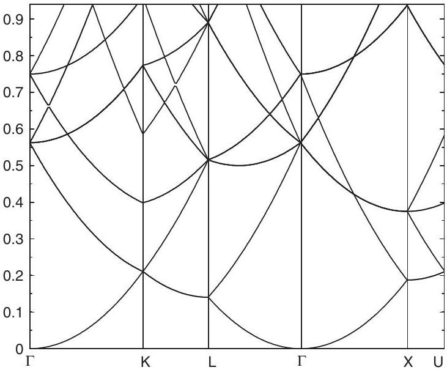
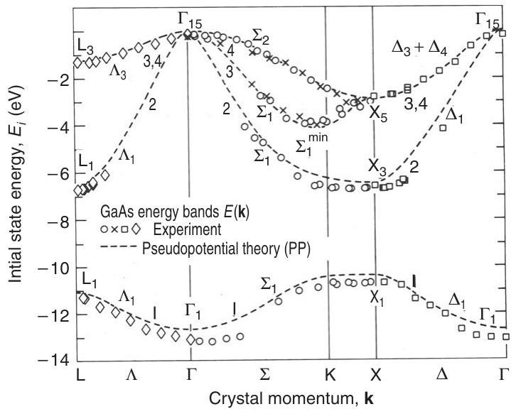
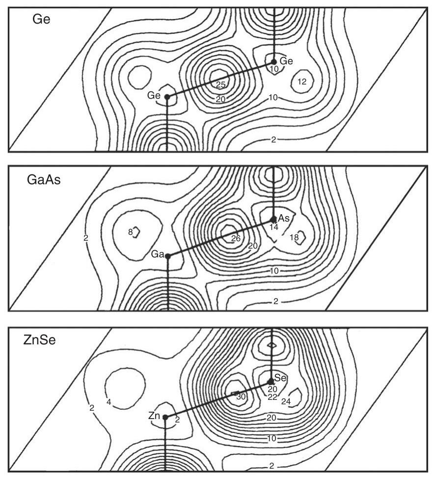
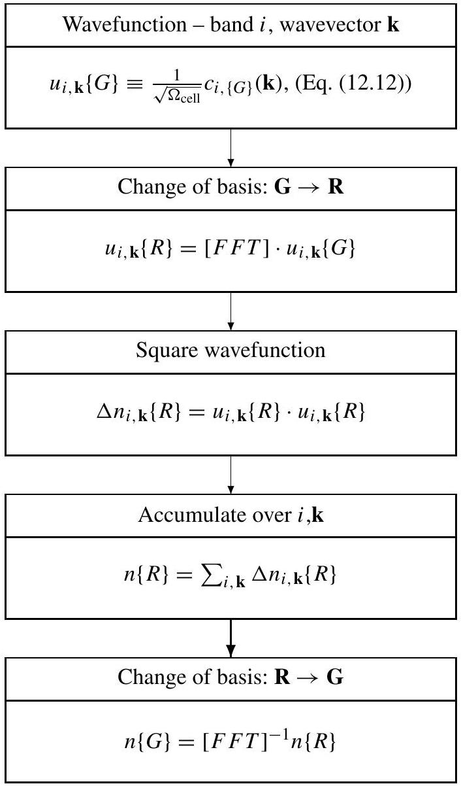
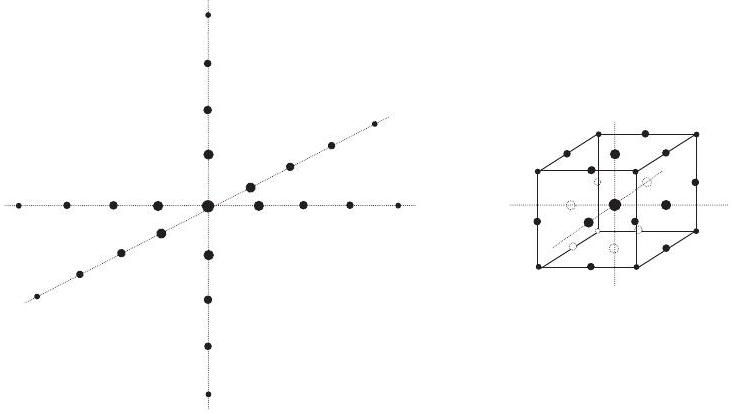
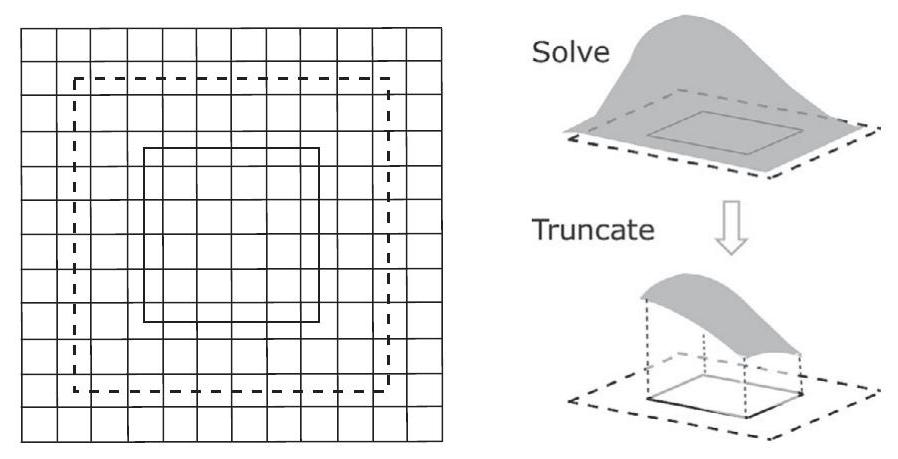
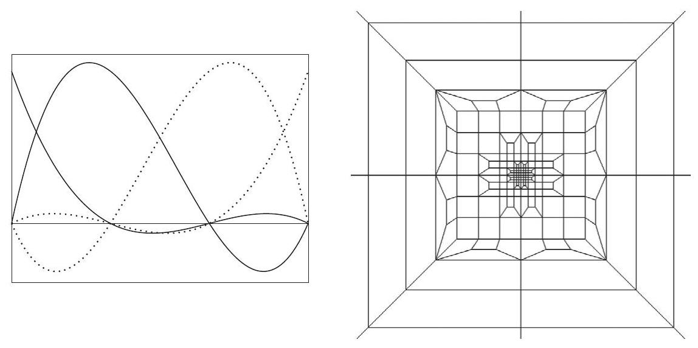
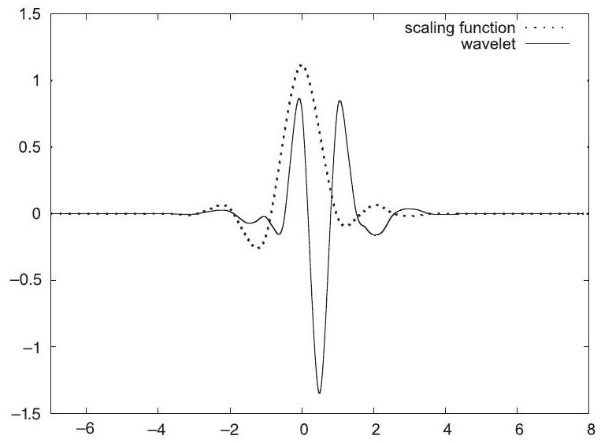
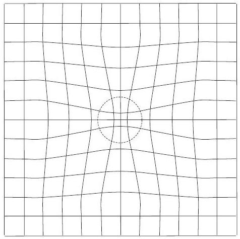

**12**

**Plane Waves and Grids: Basics**

**Summary**

Plane waves and grids provide general methodologies for solution of differential equations including the Schrödinger and Poisson equations; in many ways they are very different and in other ways they are two sides of the same coin. Plane waves are especially appropriate for periodic crystals, where they provide intuitive understanding as well as simple algorithms for practical calculations. Methods based on grids in real space are most appropriate for finite systems and are prevalent in many fields of science and engineering. We introduce them together because modern electronic structure algorithms use both plane waves and grids with fast Fourier transforms.

This chapter is organized first to give the general equations in a plane wave basis and a transparent derivation of the Bloch theorem, complementary to the one given in Chapter 4. The remaining sections are devoted to relevant concepts and useful steps, such as nearly-free-electron approximation and empirical pseudopotentials, that reveal the characteristic properties of electronic bands in materials. This lays the ground work for the full solution of the density functional equations using $a b$ initio nonlocal pseudopotentials given in Chapter 13. The last sections are devoted to real-space finite difference grid methods and multiresolution methods including finite elements and wavelets.

# 12.1 The Independent-Particle Schrödinger Equation in a Plane Wave Basis

The eigenstates of any independent-particle Schrödinger-like equation in which each electron moves in an effective potential $V_{e f f}(\mathbf{r}),{ }^{1}$ such as the Kohn-Sham equations, satisfy the eigenvalue equation

$$
\hat{H}_{e f f}(\mathbf{r}) \psi_{i}(\mathbf{r})=\left[-\frac{\hbar^{2}}{2 m_{e}} \nabla^{2}+V_{e f f}(\mathbf{r})\right] \psi_{i}(\mathbf{r})=\varepsilon_{i} \psi_{i}(\mathbf{r})
$$

[^0]In a solid (or any state of condensed matter) it is convenient to require the states to be normalized and obey periodic boundary conditions in a large volume $\Omega$ that is allowed to go to infinity. (Any other choice of boundary conditions will give the same result in the large $\Omega$ limit [91].) Using the fact that any periodic function can be expanded in the complete set of Fourier components, an eigenfunction can be written

$$
\psi_{i}(\mathbf{r})=\sum_{\mathbf{q}} c_{i, \mathbf{q}} \times \frac{1}{\sqrt{\Omega}} \exp (\mathrm{iq} \cdot \mathbf{r}) \equiv \sum_{\mathbf{q}} c_{i, \mathbf{q}} \times|\mathbf{q}\rangle,
$$

where $c_{i, \mathbf{q}}$ are the expansion coefficients of the wavefunction in the basis of orthonormal plane waves $|\mathbf{q}\rangle$ satisfying

$$
\left\langle\mathbf{q}^{\prime} \mid \mathbf{q}\right\rangle \equiv \frac{1}{\Omega} \int_{\Omega} \mathrm{d} \mathbf{r} \exp \left(-\mathrm{i} \mathbf{q}^{\prime} \cdot \mathbf{r}\right) \exp (\mathrm{i} \mathbf{q} \cdot \mathbf{r})=\delta_{\mathbf{q}, \mathbf{q}^{\prime}}
$$

Inserting Eq. (12.2) into Eq. (12.1), multiplying from the left by $\left\langle\mathbf{q}^{\prime}\right|$ and integrating as in Eq. (12.3) leads to the Schrödinger equation in Fourier space

$$
\sum_{\mathbf{q}}\left\langle\mathbf{q}^{\prime}\right| \hat{H}_{e f f}|\mathbf{q}\rangle c_{i, \mathbf{q}}=\varepsilon_{i} \sum_{\mathbf{q}}\left\langle\mathbf{q}^{\prime} \mid \mathbf{q}\right\rangle c_{i, \mathbf{q}}=\varepsilon_{i} c_{i, \mathbf{q}^{\prime}}
$$

The matrix element of the kinetic energy operator is simply

$$
\left\langle\mathbf{q}^{\prime}\right|-\frac{\hbar^{2}}{2 m_{e}} \nabla^{2}|\mathbf{q}\rangle=\frac{\hbar^{2}}{2 m_{e}}|q|^{2} \delta_{\mathbf{q}, \mathbf{q}^{\prime}} \rightarrow \frac{1}{2}|q|^{2} \delta_{\mathbf{q}, \mathbf{q}^{\prime}}
$$

where the last expression is in Hartree atomic units. For a crystal, the potential $V_{\text {eff }}(\mathbf{r})$ is periodic and can be expressed as a sum of Fourier components (see Eqs. (4.7) to (4.11))

$$
V_{e f f}(\mathbf{r})=\sum_{m} V_{e f f}\left(\mathbf{G}_{m}\right) \exp \left(\mathbf{i G}_{m} \cdot \mathbf{r}\right)
$$

where $\mathbf{G}_{m}$ are the reciprocal lattice vectors, and

$$
V_{e f f}(\mathbf{G})=\frac{1}{\Omega_{\text {cell }}} \int_{\Omega_{\text {cell }}} V_{e f f}(\mathbf{r}) \exp (-\mathrm{i} \mathbf{G} \cdot \mathbf{r}) \mathrm{d} \mathbf{r}
$$

with $\Omega_{\text {cell }}$ the volume of the primitive cell. Thus the matrix elements of the potential

$$
\left\langle\mathbf{q}^{\prime}\right| V_{e f f}|\mathbf{q}\rangle=\sum_{m} V_{e f f}\left(\mathbf{G}_{m}\right) \delta_{\mathbf{q}^{\prime}-\mathbf{q}, \mathbf{G}_{m}}
$$

are nonzero only if $\mathbf{q}$ and $\mathbf{q}^{\prime}$ differ by some reciprocal lattice vector $\mathbf{G}_{m}$.
Finally, if we define $\mathbf{q}=\mathbf{k}+\mathbf{G}_{m}$ and $\mathbf{q}^{\prime}=\mathbf{k}+\mathbf{G}_{m^{\prime}}$ (which differ by a reciprocal lattice vector $\mathbf{G}_{m^{\prime \prime}}=\mathbf{G}_{m}-\mathbf{G}_{m^{\prime}}$ ), then the Schrödinger equation for any given $\mathbf{k}$ can be written as the matrix equation

$$
\sum_{m^{\prime}} H_{m, m^{\prime}}(\mathbf{k}) c_{i, m^{\prime}}(\mathbf{k})=\varepsilon_{i}(\mathbf{k}) c_{i, m}(\mathbf{k})
$$

where ${ }^{2}$

$$
H_{m, m^{\prime}}(\mathbf{k})=\left\langle\mathbf{k}+\mathbf{G}_{m}\right| \hat{H}_{e f f}\left|\mathbf{k}+\mathbf{G}_{m^{\prime}}\right\rangle=\frac{\hbar^{2}}{2 m_{e}}\left|\mathbf{k}+\mathbf{G}_{m}\right|^{2} \delta_{m, m^{\prime}}+V_{e f f}\left(\mathbf{G}_{m}-\mathbf{G}_{m^{\prime}}\right) .
$$

Here we have labeled the eigenvalues and eigenfunctions $i=1,2, \ldots$, for the discrete set of solutions of the matrix equations for a given $\mathbf{k}$. Equations (12.9) and (12.10) are the basic Schrödinger equations in a periodic crystal, leading to the formal properties of bands derived in the next section as well as to the practical calculations that are the subject of the remainder of this chapter.

# 12.2 Bloch Theorem and Electron Bands

The fundamental properties of bands and the Bloch theorem have been derived from the translation symmetry in Section 4.3; this section provides an alternative, simpler derivation ${ }^{3}$ in terms of the Fourier analysis of the previous section.

1. The Bloch theorem. Each eigenfunction of the Schrödinger equation, (12.9), for a given $\mathbf{k}$ is given by Eq. (12.2), with the sum over $\mathbf{q}$ restricted to $\mathbf{q}=\mathbf{k}+\mathbf{G}_{m}$, which can be written

$$
\psi_{i, \mathbf{k}}(\mathbf{r})=\sum_{m} c_{i, m}(\mathbf{k}) \times \frac{1}{\sqrt{\Omega}} \exp \left(\mathrm{i}\left(\mathbf{k}+\mathbf{G}_{m}\right) \cdot \mathbf{r}\right)=\exp (\mathrm{i} \mathbf{k} \cdot \mathbf{r}) \frac{1}{\sqrt{N_{\text {cell }}}} u_{i, \mathbf{k}}(\mathbf{r}),
$$

where $\Omega=N_{\text {cell }} \Omega_{\text {cell }}$ and

$$
u_{i, \mathbf{k}}(\mathbf{r})=\frac{1}{\sqrt{\Omega_{\mathrm{cell}}}} \sum_{m} c_{i, m}(\mathbf{k}) \exp \left(\mathbf{i G}_{m} \cdot \mathbf{r}\right),
$$

which has the periodicity of the crystal. This is the Bloch theorem also stated in Eq. (4.33): any eigenvector is a product of $\exp (\mathrm{ik} \cdot \mathbf{r})$ and a periodic function. Since we require $\psi_{i, \mathbf{k}}(\mathbf{r})$ to be orthonormal over the volume $\Omega$, then $u_{i, \mathbf{k}}(\mathbf{r})$ are orthonormal in one primitive cell, i.e.,

$$
\frac{1}{\Omega_{\text {cell }}} \int_{\text {cell }} \mathrm{d} \mathbf{r} u_{i, \mathbf{k}}^{*}(\mathbf{r}) u_{i^{\prime}, \mathbf{k}}(\mathbf{r})=\sum_{m} c_{i, m}^{*}(\mathbf{k}) c_{i^{\prime}, m}(\mathbf{k})=\delta_{i, i^{\prime}},
$$

where the final equation means the $c_{i, m}(\mathbf{k})$ are orthonormal vectors in the discrete index $m$ of the reciprocal lattice vectors.
2. Bands of eigenvalues. Since the Schrödinger equation, (12.9), is defined for each $\mathbf{k}$ separately, each state can be labeled by the wavevector $\mathbf{k}$ and the eigenvalues and eigenvectors for each $\mathbf{k}$ are independent unless they differ by a reciprocal lattice vector.

[^1]In the limit of large volume $\Omega$, the $\mathbf{k}$ points become a dense continuum and the eigenvalues $\varepsilon_{i}(\mathbf{k})$ become continuous bands. At each $\mathbf{k}$ there are a discrete set of eigenstates labeled $i=1,2, \ldots$, that may be found by diagonalizing the hamiltonian, Eq. (12.10), in the basis of discrete Fourier components $\mathbf{k}+\mathbf{G}_{m}, m=1,2, \ldots$.
3. Conservation of crystal momentum. Since any state can be labeled by a well-defined $\mathbf{k}$, it follows that $\mathbf{k}$ is conserved in a way analogous to ordinary momentum in free space; however, in this case $\mathbf{k}$ is conserved modulo addition of any reciprocal lattice vector $\mathbf{G}$. In fact, it follows from inspection of the Schrödinger equation, (12.9), with the hamiltonian, Eq. (12.10), that the solutions are periodic in $\mathbf{k}$, so that all unique solutions are given by $\mathbf{k}$ in one primitive cell of the reciprocal lattice.
4. The role of the Brillouin zone. Since all possible eigenstates are specified by the wavevector $\mathbf{k}$ within any one primitive cell of the periodic lattice in reciprocal space, the question arises: is there a "best choice" for the cell? The answer is "yes." The first Brillouin zone (BZ) is the uniquely defined cell that is the most compact possible cell, and it is the cell of choice in which to represent excitations. It is unique among all primitive cells because its boundaries are the bisecting planes of the $\mathbf{G}$ vectors where Bragg scattering occurs (see Section 4.2). Inside the Brillouin zone there are no such boundaries: the bands must be continuous and analytic inside the zone. The boundaries are of special interest since every boundary point is $\mathbf{k}$ vector for which Bragg scattering can occur; this leads to special features, such as zero group velocities due to Bragg scattering at the BZ boundary. The construction of the BZ is illustrated in Figs. 4.1, 4.2, 4.3, and 4.4, and widely used notations for points in the BZ of several crystals are given in Fig. 4.10.
5. Integrals in $\mathbf{k}$ space. For many properties such as the counting of electrons in bands, total energies, etc., it is essential to integrate over $\mathbf{k}$ throughout the BZ. As pointed out in Section 4.3, an intrinsic property of a crystal expressed "per unit cell" is an average over $\mathbf{k}$, i.e., a sum over the function evaluated at points $\mathbf{k}$ divided by the number of values $N_{k}$, which in the limit is an integral. For a function $f_{i}(\mathbf{k})$, where $i$ denotes the discrete band index, the average value is

$$
\bar{f}_{i}=\frac{1}{N_{k}} \sum_{\mathbf{k}} f_{i}(\mathbf{k}) \rightarrow \frac{\Omega_{\text {cell }}}{(2 \pi)^{d}} \int_{\mathrm{BZ}} \mathrm{~d} \mathbf{k} f_{i}(\mathbf{k})
$$

where $\Omega_{\text {cell }}$ is the volume of a primitive cell in real space and $(2 \pi)^{d} / \Omega_{\text {cell }}$ is the volume of the BZ. Specific algorithms for integration over the BZ are described in Section 4.6.

# 12.3 Nearly-Free-Electron Approximation

The nearly-free-electron approximation (NFEA) is the starting point for understanding bands in crystals. Not only is it a way to illustrate the properties of bands in periodic crystals, but the NFEA quantitatively describes bands for many materials. In the homogeneous gas, described in Chapter 5, the bands are simply the parabola $\varepsilon(\mathbf{q})=\left(h^{2} / 2 m_{e}\right)|\mathbf{q}|^{2}$. The first step in the NFEA is to plot the free-electron bands in the BZ of the given crystal. The bands

Figure 12.1. Free-electron bands plotted in the BZ of an fcc crystal. The BZ is shown in Fig. 4.10, which defines the labels. Compare this with the actual bands of Al in Fig. 16.6 that were calculated using the KKR method. Al is an ideal case where the bands are well explained by a weak pseudopotential [506-508, 560].

are still the simple parabola $\varepsilon(\mathbf{q})=\left(h^{2} / 2 m_{e}\right)|\mathbf{q}|^{2}$, but they are plotted as a function of $\mathbf{k}$ where $\mathbf{q}=\mathbf{k}+\mathbf{G}_{m}$, with $\mathbf{k}$ restricted to the BZ. Thus for each Bravais lattice, the freeelectron bands have a characteristic form for lines in the Brillouin zone, with the energy axis scaled by $\Omega^{-2 / 3}$, where $\Omega$ is the volume of the primitive cell. By this simple trick we can plot the bands that result from the Schrödinger equation, (12.9), for a vanishing potential.

An example of a three-dimensional fcc crystal is shown in Fig. 12.1. The bands are degenerate at high symmetry points like the zone center, since several $\mathbf{G}$ vectors have the same modulus. The introduction of a weak potential on each atom provides a simple way of understanding NFEA bands, which are modified near the zone boundaries. An excellent example is Al , for which bands are shown in Fig. 16.6, compared to the freeelectron parabolic dispersion. The bands are very close to free-electron-like, yet the Fermi surface is highly modified by the lattice effects because it involves bands very near zone boundary points where degeneracies are lifted and there are first-order effects on the bands. The bands have been calculated using many methods: the KKR method is effective since one is expanding around the analytic free-electron Green's function (outside the core) [558]; the OPW [559] and pseudopotential methods [504] make use of the fact that for weak effective scattering only a few plane waves are needed. Computer programs available online (see Appendix R) can be used to generate the bands and understand them in terms of the NFEA using only a few plane waves. See Exercises 12.4, 12.7, 12.11, and 12.12.

The fcc NFEA bands provide an excellent illustration of the physics of band structures. For sp-bonded metals like Na and Al , the NFEA bands are very close to the actual bands (calculated and experimental). The success of the NFEA directly demonstrates the fact that
the bands can in some sense be considered "nearly free" even though the states must actually be very atomic-like with structure near the nucleus so that they are properly orthogonal to the core states. The great beauty of the pseudopotential, APW, and KKR methods is that they provide a very simple explanation in terms of the weak scattering properties of the atom even though the potential is strong.

# 12.4 Form Factors and Structure Factors

An important concept in the Fourier analysis of crystals is the division into "structure factors" and "form factors." For generality, let the crystal be composed of different species of atoms each labeled $\kappa=1, n_{\text {species }}$, and for each $\kappa$ there are $n^{\kappa}$ identical atoms at positions $\tau_{\kappa, j}, j=1, n^{\kappa}$ in the unit cell. Any property of the crystal, e.g., the potential, can be written

$$
V(\mathbf{r})=\sum_{\kappa=1}^{n_{\text {species }}} \sum_{j=1}^{n^{\kappa}} \sum_{\mathbf{T}} V^{\kappa}\left(\mathbf{r}-\tau_{\kappa, j}-\mathbf{T}\right),
$$

where $\mathbf{T}$ denotes the set of translation vectors. It is straightforward (Exercise 12.2) to show that the Fourier transform of Eq. (12.15) can be written as

$$
V(\mathbf{G}) \equiv \frac{1}{\Omega_{\text {cell }}} \int_{\Omega_{\text {cell }}} V(\mathbf{r}) \exp (\mathrm{i} \mathbf{G} \cdot \mathbf{r}) \mathrm{d} \mathbf{r}=\sum_{\kappa=1}^{n_{\text {species }}} \frac{\Omega^{\kappa}}{\Omega_{\text {cell }}} S^{\kappa}(\mathbf{G}) V^{\kappa}(\mathbf{G})
$$

where the structure factor for each species $\kappa$ is

$$
S^{\kappa}(\mathbf{G})=\sum_{j=1}^{n^{\kappa}} \exp \left(\mathrm{i} \mathbf{G} \cdot \tau_{\kappa, j}\right)
$$

and the form factor is ${ }^{4}$

$$
V^{\kappa}(\mathbf{G})=\frac{1}{\Omega^{\kappa}} \int_{\text {allspace }} V^{\kappa}(\mathbf{r}) \exp (\mathrm{i} \mathbf{G} \cdot \mathbf{r}) \mathrm{d} \mathbf{r}
$$

The factors in Eqs. (12.16)-(12.17) have been chosen so that $V^{\kappa}(|\mathbf{G}|)$ is defined in terms of a "typical volume" $\Omega^{\kappa}$ for each species $\kappa$, so that $V^{\kappa}(|\mathbf{G}|)$ is independent of the crystal. In addition, the structure factor is defined so that $S^{\kappa}(\mathbf{G}=0)=n^{\kappa}$. These are arbitrary but convenient - choices; other authors may use different conventions.

Equation (12.16) is particularly useful in cases where the potential is a sum of spherical potentials in real space,

$$
V^{\kappa}\left(\mathbf{r}-\tau_{\kappa, j}-\mathbf{T}\right)=V^{\kappa}\left(\left|\mathbf{r}-\tau_{\kappa, j}-\mathbf{T}\right|\right)
$$

This always applies for nuclear potentials and bare ionic pseudopotentials. Often it is also a reasonable approximation for the total crystal potential as the sum of spherical

[^2]potentials around each nucleus. ${ }^{5}$ Using the well-known expansion of plane waves in spherical harmonics, Eq. (J.1), Eq. (12.18) can be written as [102, 372, 561]
$$
V^{\kappa}(\mathbf{G})=V^{\kappa}(|\mathbf{G}|)=\frac{4 \pi}{\Omega^{\kappa}} \int_{0}^{\infty} \mathrm{d} r r^{2} j_{0}(|\mathbf{G}| r) V^{\kappa}(r) .
$$

For a nuclear potential, $V^{\kappa}(\mathbf{G})$ is simply

$$
\begin{aligned}
V_{\text {nucleus }}^{\kappa}(|\mathbf{G}|) & =\frac{4 \pi}{\Omega^{\kappa}} \frac{-Z_{\text {nucleus }}^{\kappa} e^{2}}{|\mathbf{G}|^{2}}, \quad \mathbf{G} \neq 0, \\
& =0, \quad \mathbf{G}=0,
\end{aligned}
$$

where the divergent $\mathbf{G}=0$ term is treated separately, as discussed in Section 3.2 and Appendix F. For a bare pseudopotential, the potential form factor Eq. (12.20) is the transform of the pseudopotential $V_{l}(\mathbf{r})$, given in Chapter 11. Again the $\mathbf{G}=0$ term must be treated carefully. One procedure is to calculate the potential and total energy of point ions of charge $Z^{\kappa}$ in a compensating background that represents the $\mathbf{G}=0$ Fourier component of the electron density. In that case, there is an additional contribution that arises from the fact that the ion is not a point charge [562],

$$
\alpha^{\kappa}=\int 4 \pi r^{2} \mathrm{~d} r\left[V_{\text {local }}^{\kappa}(r)-\left(-\frac{Z^{\kappa}}{r}\right)\right]
$$

Each ion contributes a constant term in the total energy (see Eq. (13.1) below) equal to $\left(N_{e} / \Omega\right) \alpha^{\kappa}$, where $N_{e} / \Omega$ is the average electron density.

The generalization of Eq. (12.16) to nonlocal potentials $V_{\mathrm{NL}}^{\kappa}\left(\mathbf{r}, \mathbf{r}^{\prime}\right)$ is straightforward. For each $\mathbf{k}$ and basis vectors $\mathbf{G}_{m}$ and $\mathbf{G}_{m^{\prime}}$, it is convenient to define $\mathbf{K}_{m}=\mathbf{k}+\mathbf{G}_{m}$ and $\mathbf{K}_{m^{\prime}}= \mathbf{k}+\mathbf{G}_{m^{\prime}}$. The structure factor $S(\mathbf{G})$ still depends only on $\mathbf{G}=\mathbf{K}_{m}-\mathbf{K}_{m^{\prime}}=\mathbf{G}_{m}-\mathbf{G}_{m^{\prime}}$, but the matrix elements of the semilocal form factor are more complicated since the matrix elements depends on two arguments. Using the fact that the spherical symmetry of the nonlocal operator guarantees that it can be written as a function of the magnitudes $\left|\mathbf{K}_{m}\right|$, $\left|\mathbf{K}_{m^{\prime}}\right|$ and the angle $\theta$ between $\mathbf{K}_{m}$ and $\mathbf{K}_{m^{\prime}}$, the matrix elements of the semilocal form factor Eq. (11.15), are (Exercise 12.9)

$$
\delta V_{N L}^{\kappa}\left(\mathbf{K}_{m}, \mathbf{K}_{m^{\prime}}\right)=\frac{4 \pi}{\Omega^{\kappa}} \sum_{l}(2 l+1) P_{l}\left(\cos (\theta) \int_{0}^{\infty} \mathrm{d} r r^{2} j_{l}\left(\left|\mathbf{K}_{m}\right| r\right) j_{l}\left(\left|\mathbf{K}_{m^{\prime}}\right| r\right) \delta V_{l}^{\kappa}(r)\right.
$$

This formula has the disadvantage that it must be evaluated for each $\left|\mathbf{K}_{m}\right|,\left|\mathbf{K}_{m^{\prime}}\right|$, and $\theta$, i.e., for a three-dimensional object. In order to treat this in a computationally efficient manner, one can discretize this function on a grid and interpolate during an actual calculation.

The separable Kleinman-Bylander form, Eq. (11.41), is simpler because it is a sum of products of Fourier transforms. Each Fourier transform is a one-dimensional function of

[^3]$\left|\mathbf{K}_{m}\right|$ (and the same function of $\left|\mathbf{K}_{m^{\prime}}\right|$ ), which is much more convenient. The form in k space is analogous to that in real space [372, 539]. (Here we denote the azimuthal quantum number as $m_{l}$ to avoid confusion with the index $m$ for basis functions $\mathbf{G}_{m}$.)
$$
\delta V_{N L}^{\kappa}\left(\mathbf{K}_{m}, \mathbf{K}_{m^{\prime}}\right)=\sum_{l m_{l}} \frac{Y_{l m_{l}}^{*}\left(\hat{\mathbf{K}}_{m}\right) T_{l}^{*}\left(\left|\mathbf{K}_{m}\right|\right) \times T_{l}\left(\left|\mathbf{K}_{m^{\prime}}\right|\right) Y_{l m_{l}}\left(\hat{\mathbf{K}}_{m^{\prime}}\right)}{\left\langle\psi_{l m}^{P S}\right| \delta V_{l}\left|\psi_{l m}^{P S}\right\rangle}
$$
where $T_{l}(q)$ is the Fourier transform of the radial function $\psi_{l}{ }^{P S}(r) \delta V_{l}(r)$. The simplicity of this form has led to its widespread use in calculations. Furthermore it is straightforward to extend to "ultrasoft" potentials that involve additional projectors (see Section 11.11).

# 12.5 Approximate Atomic-Like Potentials

A first step in including the effects of the nuclei is to assume that the potential is a sum of atomic-like potentials. This gives all the qualitative features of the bands and often gives semiquantitative results. One procedure is simply to use the potential directly from an atomic calculation; another is to assume the potential has some simple analytic form. For example, if we approximate the electrons as nearly-free-electron-like then the total potential due to the nuclei and electrons to first order in perturbation theory is given by

$$
V_{\text {total }}(\mathbf{G}) \approx V_{\text {screened }}(\mathbf{G}) \equiv V_{\text {bare }}(\mathbf{G}) / \epsilon(\mathbf{G})
$$

where $V_{\text {bare }}$ is a bare nuclear or ionic potential and $\epsilon(\mathbf{G})$ is the screening function. In the NFE limit, the screening is evaluated for the homogeneous gas, so it is isotropic $\epsilon(|\mathbf{G}|)$ and a reasonable approximation is the Thomas-Fermi screening, where $\epsilon$ can be written

$$
\epsilon(|\mathbf{G}|)=\frac{|\mathbf{G}|^{2}}{|\mathbf{G}|^{2}+k_{0}^{2}}
$$

using Eqs. (5.20) and (5.21), where $k_{0}$ is dependent only on the electron density (i.e., $r_{s}$ ). Furthermore, since the screening is linear in this approximation, the total potential is a sum of spherical screened nuclear or ionic potential which are neutral and atomic-like.

This approach was instrumental in the early work on ab initio pseudopotentials, e.g., the Heine-Abarenkov potentials [506, 508, 518] that are derived from atomic data and have been very successfully used in solids with an approximate screening function such as Eq. (12.26). A simple, instructive example is hydrogen at high pressure, i.e., high density or small $r_{s} \approx 1$. This corresponds to about 10 GPa , pressures that can be found in the interiors of the giant planets. At such densities, hydrogen is predicted to form a monatomic crystal with nearly-free-electron bands. Since the "bare" potential is just $\propto 1 /|\mathbf{G}|^{2}$, it is easy to work out the screened potential in the Thomas-Fermi approximation. Exercise 12.13 calculates the appropriate form factors, estimates band structure in perturbation theory, carries out calculations using available programs (or by writing one's own), and compares with fully self-consistent calculations.

This approximation is sufficient to illustrate two points. First, the total potential near each nucleus is very well approximated by a spherical atomic-like form. This is widely
used in augmented methods such as APW, KKR, and LMTO that treat the region around the nucleus using spherical coordinates (Chapters 16 and 17). Second, the approximation demonstrates the problems with the straightforward application of plane waves. Except for the lowest $Z$ elements, materials with core electrons require huge numbers of plane waves (see Exercise 12.10). This is why pseudopotentials (Chapter 11) are so intimately related to the success of plane wave methods.

# 12.6 Empirical Pseudopotential Method (EPM)

Even though the general ideas of pseudopotentials have been known for many years [65-67], and model potentials close to those used in modern work were already applied to solids as early as the 1930s [66, 67], the modern use of pseudopotentials started with the work of Phillips and Kleinman [504], and Antonchik [502, 503]. Those authors realized that the band structure of sp-bonded metals and semiconductors could be quantitatively described by a few numbers: the values of the spherical atomic-like potentials at a few lowest reciprocal lattice vectors. By fitting to experimental data, a few parameters could be used to describe a tremendous amount of data related to the band structure, effective masses and bandgaps, optical properties, etc. The "empirical pseudopotential" method has been described in detail by Heine and Cohen [506,507], who showed the connections to the underlying theory. Applications to metals are covered thoroughly by Harrison [508], and a very complete exposition of the method and results for semiconductors has been given by Cohen and Chelikowsky [561].

The EPM method has played an important role in understanding electronic structure, especially for the sp-bonded metals and semiconductors. As an example, Fig. 12.2 shows the bands of GaAs measured [563] by photoemission spectroscopy are compared with EPM bands calculated [564] many years before. The agreement with the photoemission data is nearly perfect for this nonlocal pseudopotential that was adjusted to fit the bandgaps, effective masses, and optical spectra [561]. Comparison of Fig. 12.2 with Fig. 2.23 shows the agreement with inverse photoemission and more recent many-body calculations, and the fact that the adjusted EPM provides a better description of the bands than do LDA calculations. The pseudocharge density has been calculated for many materials [561]: as illustrated in Fig. 12.3, the results show the basic features of the chemical bonding and the nature of individual states.

The method is more than just a fitting procedure if one makes the approximation that the total potential is a sum of spherical potentials that have analytic form and are transferable between different structures. Although this is an approximation, it has been tested in many cases and, at least, provides semiquantitative results. With the assumption of transferability, the EPM method can readily be applied to calculations for many structures and for properties like electron-phonon interactions (see, e.g., [565]), where the distorted lattice is simply viewed as a different structure.

The simplicity of the EPM makes possible calculations not feasible using ab initio pseudopotentials. It is a great advantage to have an analytic representation since it can

Figure 12.2. Experimental energy bands of GaAs measured by photoemission in [563] compared to empirical pseudopotential calculations [564]. The pseudopotential was fitted earlier to independent optical data, so this is a test of the transferability of information within an independent-particle theory. Spin-orbit interaction is small on this scale and is not included. From [563].

Figure 12.3. Theoretical calculations of the valence charge density of semiconductors showing the formation of the covalent bond and the progression to more ionic character in the series Ge , GaAs , and ZnSe . The results have the same basic features as full self-consistent calculations such as that for Si in Fig. 2.1. From [105].

be used for any structure. For example, [566,567] report calculations of the electronic structure of pyramidal quantum dots containing up to 250,000 atoms, using spin-orbitcoupled, nonlocal, empirical pseudopotentials and with results that differ from those found using the effective-mass approximation.

# 12.7 Calculation of Electron Density: Introduction of Grids

One of the most important operations is the calculation of the density of electrons $n$. The general form for a crystal treated in independent-particle theory, e.g., Eqs. (3.42) or (7.2), can be written as

$$
n(\mathbf{r})=\frac{1}{N_{k}} \sum_{\mathbf{k}, i} f\left(\varepsilon_{i, \mathbf{k}}\right) n_{i, \mathbf{k}}(\mathbf{r}), \text { with } n_{i \mathbf{k}}(\mathbf{r})=\left|\psi_{i, \mathbf{k}}(\mathbf{r})\right|^{2}
$$

which is an average over $\mathbf{k}$ points (see Eq. (12.14)), with $i$ denoting the bands at each $\mathbf{k}$ point (including the spin index $\sigma$ ) and $f\left(\varepsilon_{i, \mathbf{k}}\right)$ denoting the Fermi function. For a plane wave basis, Expression (12.11) for the Bloch functions leads to

$$
n_{i, \mathbf{k}}(\mathbf{r})=\frac{1}{\Omega} \sum_{m, m^{\prime}} c_{i, m}^{*}(\mathbf{k}) c_{i, m^{\prime}}(\mathbf{k}) \exp \left(\mathrm{i}\left(\mathbf{G}_{m^{\prime}}-\mathbf{G}_{m}\right) \cdot \mathbf{r}\right)
$$

and

$$
n_{i, \mathbf{k}}(\mathbf{G})=\frac{1}{\Omega} \sum_{m, m^{\prime \prime}} c_{i, m}^{*}(\mathbf{k}) c_{i, m^{\prime \prime}}(\mathbf{k})
$$

where $m^{\prime \prime}$ denotes the $\mathbf{G}$ vector for which $\mathbf{G}_{m^{\prime \prime}} \equiv \mathbf{G}_{m}+\mathbf{G}$.
The symmetry operations $R_{n}$ of the crystal can be used as in Sections 4.5 and 4.6 to find the density in terms only of the $\mathbf{k}$ points in the IBZ,

$$
n(\mathbf{r})=\frac{1}{N_{k}} \sum_{i, \mathbf{k}} n_{i, \mathbf{k}}(\mathbf{r})=\frac{1}{N_{\text {group }}} \sum_{R_{n}} \sum_{\mathbf{k}}^{\mathrm{IBZ}} w_{\mathbf{k}} \sum_{i} f\left(\varepsilon_{i, \mathbf{k}}\right) n_{i, \mathbf{k}}\left(R_{n} \mathbf{r}+\mathbf{t}_{n}\right),
$$

and

$$
n(\mathbf{G})=\frac{1}{N_{\text {group }}} \sum_{R_{n}} \exp \left(\mathrm{i} R_{n} \mathbf{G} \cdot \mathbf{t}_{n}\right) \sum_{\mathbf{k}}^{\text {IBZ }} w_{\mathbf{k}} \sum_{i} f\left(\varepsilon_{i, \mathbf{k}}\right) n_{i, \mathbf{k}}\left(R_{n} \mathbf{G}\right) .
$$

The phase factor due to the translation $\exp \left(\mathrm{i} R_{n} \mathbf{G} \cdot \mathbf{t}_{n}\right)$ follows from Eq. (12.28).
Despite the simplicity of Eq. (12.29), it is not the most efficient way to calculate the density $n(\mathbf{r})$ or $n(\mathbf{G})$. The problem is that finding all the Fourier components using Eq. (12.29) involves a double sum, i.e., a convolution in Fourier space that requires $N_{G}^{2}$ operations, where $N_{G}$ is the number of $\mathbf{G}$ vectors needed to describe the density. For large systems this becomes very expensive. On the other hand, if the Bloch states are known on a grid of $N_{R}$ points in real space, the density can be found simply as a square, in $N_{R}$ operations. The trick is to use a fast Fourier transform (FFT) that allows one to transform from one space to the other in $N \log N$ operations, where $N=N_{R}=N_{G}$. The flowchart,

Figure 12.4. Calculation of the density using Fourier transforms and grids. The notation $\{G\}$ and $\{R\}$ denotes the sets of $N \mathbf{G}$ vectors and $N$ grid points $\mathbf{R}$. Since the fast Fourier transform (FFT) scales as $N \ln N$, the algorithm is faster than the double sum needed to calculate $n\{G\}$ that scales as $N^{2}$. In addition, the result is given in both real and reciprocal space, needed for calculation of the exchange-correlation and Hartree terms. The algorithm is essentially the same as used in iterative methods (Appendix M).

Fig. 12.4, illustrates the algorithm, and the general features for all such operations are described in Section M.11. A great advantage is that $n(\mathbf{r})$ is needed to find $\epsilon_{x c}(\mathbf{r})$ and $V_{x c}(\mathbf{r})$. The inverse transform can be used to find $n(\mathbf{G})$, which can be used for solving the Poisson equation in Fourier space.

It is relevant to note that the density $n$ requires Fourier components that extend twice as far in each direction as those needed for the wavefunction $\psi$ because $n \propto|\psi|^{2}$. Also the FFT requires a regular grid in the form of a parallelepiped, whereas the wavefunction cutoff is generally a sphere with $(1 / 2)|\mathbf{k}+\mathbf{G}|^{2}<E_{\text {cutoff }}$. Thus the number of points in the FFT
grid for density $N=N_{R}=N_{G}$ is roughly an order of magnitude larger than the number $N_{G}^{\mathrm{wf}}$ of $\mathbf{G}$ vectors in the basis for the wavefunctions. Nevertheless, the FFT approach is much more efficient for large systems since the number of operations scales as $N \log N$.

# 12.8 Real-Space Methods I: Finite Difference and Discontinuous Galerikin Methods

Since the Kohn-Sham equations are a set of coupled second-order differential equations, it is natural to ask: Why not use real-space methods widely employed in many areas of numerical analysis, such as finite element, finite difference, multigrid, wavelets, etc.? There are reasons they have not been developed as much as other methods for electronic structure applications. There are problems involving characteristic features of atoms, namely that the potentials are highly peaked around the nuclei, where they are nearly spherically symmetric with core states that are almost inert and yet must be treated accurately. Great accuracy is required to calculate the relevant energies and it is very useful to have methods that take advantage of the structure of the equations. In crystals the periodicity suggests plane waves and pseudopotentials make possible calculations with feasible number of plane waves; iterative methods that use fast Fourier transforms (FFTs) are so efficient that it is hard for other methods to compete. Forces can be calculated straightforwardly since the plane waves are independent of the atom positions. For molecules, methods that use gaussians have been extensively developed and have the great feature that there are simple analytic expressions for Coulomb matrix elements.

Nevertheless, there are advantages to the real-space methods. By using pseudopotentials and related methods the atomic-like potentials are sufficiently smooth so that grids do not have to be extremely fine. In fact, the iterative plane methods are so efficient only because they use an FFT to transform parts of the problem to a regular grid in real space. This is shown explicitly in the flowcharts Fig. 12.4 for operations involving the density and Fig. M. 2 for multiplication of the hamiltonian times the wavefunction. The plane wave method can be turned inside out to consider it as a real-space method on a uniform grid that uses plane waves only as a convenient way to handle the kinetic energy and to store the information in the basis of plane waves, which may be much smaller than the number of grid points (see the discussion in the previous section).

Viewing the problem as a real-space grid method opens the door to new possibilities of ways to utilize the many methods developed in real space. Here we can only skim the surface of this large field and bring out some of the salient features and methods for electronic structure, with references to some of the original works. More complete descriptions can be found in the review by Beck [568] and the papers given in this and the following sections, which give references to the more recent literature.

## 12.8.1 Finite Difference

In a finite difference (FD) method, the kinetic energy laplacian operator is approximated from values of the function at a set of grid points. For example, the FD method of

Figure 12.5. Two examples of stencils for finite difference calculation of the laplacian. The size of the points represents the weights schematically. Left: orthogonal "cross" with 25 points [570]. Right: more compact cube of 27 points that has been used with the Mehrstellen (Numerov) method [576].

Chelikowsky et al. (see original papers [569, 570], more recent reviews [571, 572], and works such as [573]) uses higher-order expansions for the kinetic energy laplacian operator, separable in the $x, y, z$ orthogonal components. For a uniform orthogonal three-dimensional (3D) grid with points $\left(x_{i}, y_{j}, z_{k}\right)$, the mth order approximation is

$$
\left[\frac{\partial^{2} \psi}{\partial x^{2}}\right]_{x_{i}, y_{j}, z_{k}}=\sum_{-m}^{m} C_{m} \psi\left(x_{i}+m h, y_{j}, z_{k}\right)+O\left(h^{2 m+2}\right),
$$

where $h$ is the grid spacing and $m$ is a positive integer. As illustrated on the left-hand side of Fig. 12.5, the laplacian at the central point is computed in terms of values of the function on the "cross" of points along the axes; the size of the dots for the 25 points represents the decreasing magnitude of $C_{m}$. This approximation is accurate to $O\left(h^{2 m+2}\right)$ assuming $\psi$ can be approximated by a polynomial in $h .{ }^{6}$ Algorithms are available to compute the coefficients $C_{m}$ for any grid to arbitrary order in $h$ [574]. Expansion coefficients for $m=1$ to 6 for a uniform grid are given in table 1 of [570]. There have been many applications to finite clusters, such as optical properties in Chapter 21, where Figs. 21.2 and 21.3 show spectra for hydrogen-terminated silicon systems from $\mathrm{SiH}_{4}$ up to large clusters calculated using FD methods [575]. Examples of codes are OCTOPUS, PARSEC, and SPARC listed in Appendix R.

A different discretization uses the "Mehrstellen" operator, which is an extension of the Numerov method (Section L.1) to higher dimensions (see [577], p., 164 as cited in [576]). As illustrated on the right-hand side of Fig. 12.5, the 27 points are more compact in space than the 25 -point cross. This is an advantage, especially for finite systems where the more extended "cross" leads to larger boundary effects and linear-scaling order $N$ algorithms (Chapter 18), where localization is essential.

[^4]Since the number of grid points is much larger than the number of eigenstates needed, methods are needed to extract the low-energy states. One such work is termed "spectrum slicing," which uses Chebyshev polynomials to filter out selected energy ranges that can be solved independently [578].

## 12.8.2 Discontinuous Galerkin (DG) Construction of Basic Functions

Discontinuous basis functions may seem strange as a way to describe wavefunctions; however, they are not strange at all. A wavefunction expressed as values on a grid of points can be considered as a set of delta functions or as the value of the wavefunction in each volume surrounding each point, which are discontinuous, nonoverlapping functions, each representing a region. If there is a local potential, the matrix elements are purely diagonal since the potential only multiplies the function in each region. The only matrix elements between regions is due to the kinetic energy; in the finite difference method it is expressed in terms of the difference between regions, i.e., the discontinuities at the boundaries. The advantage is that the hamiltonian is very simple and very sparse; the disadvantage is that many grid points are required to accurately represent wavefunctions in realistic problems.

The discontinuous Galerkin (DG) method is well developed in numerical analysis and it has been applied to the Kohn-Sham problem [579] and developed further in the context of grid methods [580]. In the application to the Kohn-Sham problem with wavefunctions expressed on a grid, the idea is to define regions that contain several grid points. The regions are defined to be nonoverlapping and to cover all space so functions in different regions are automatically orthogonal; by allowing the functions to be discontinuous they have complete freedom to describe the wavefunction within each region and there are hamiltonian matrix elements only to other regions within a small neighborhood. The advantage that only a few functions for each region (not all the possible functions) are needed to find the low-energy solutions, so that the hamiltonian is expressed in a much smaller basis. The disadvantage is that the hamiltonian is not as simple and the DG wavefunctions in each region must be calculated.

The approach in [580] is illustrated in Fig. 12.6, which shows a region enclosed by the dark square that contains 16 grid points. All space can be filled with nonoverlapping regions by repetition of the box. For each of these regions the Kohn-Sham problem is solved in a larger box illustrated by the dashed lines, for example, with the boundary condition that the wavefunctions are zero at the boundary. As illustrated at the right, the basis is defined by simply truncating the functions. In general, the result is a set of functions that are discontinuous in value and slope. It is shown in [580] that one can find accurate solutions that span the space of the occupied states with a number of functions much smaller than the number of grid points. The hamiltonian matrix is thus much smaller and still sparse for large systems since there are matrix elements only between nearby basis functions, each of which is strictly localized. The price to pay is that the functions must be calculated in each region, but there is a great advantage that each local calculation is independent and can be done in parallel, and there can be a great speedup of the overall calculation using parallel computers. In addition, this part of the calculation is linear scaling in the size of the

Figure 12.6. Schematic illustration of the construction of the basis for the discontinuous Galerkin (DG) method. At the left is a grid that is divided into regions of 16 sites with one of the regions indicated by the dark box. In the approach in [580] the functions are calculated in the larger region, indicated by the dashed lines, and a set of the low energy functions are truncated to form the basis as shown at the right. The functions can be continuous as shown or discrete values on the grid points depending on the way the Kohn-Sham equation is solved in the local regions.

system for large systems, and the construction can be a practical approach to $\mathrm{O}(N)$ methods in Chapter 18.

# 12.9 Real-Space Methods II: Multiresolution Methods

Multiresolution denotes the ability to describe all regions with desired accuracy: regions where there are strong variations and high resolution is needed, and others where less resolution is required. One approach is the multigrid method, which is generally credited to Brandt [581] in 1977 and developed by him and others. It can be used with any algorithm for solution of the differential equations and it works by cycling up and down between levels of resolution to use the speed of coarse functions while adding corrections due to fine functions. Regions that require fine detail are detected autometically. There are codes for electronic structure calculations that use the multigrid approach [576, 582-584], for example, the RMGDFT method (Appendix R) based on the Mehrstellen form for the laplacian (see Fig. 12.5). It has been applied to periodic and nonperiodic problems including a simulation of water comparable to that described in Section 2.10 and transport through molecular nanojunctions [576, 582, 584].

## 12.9.1 Finite Elements

Finite element (FE) methods are widely used in many fields from civil engineering to quantum mechanics. Finite elements form a localized basis in which variational calculations can be done, unlike the finite difference (FD) method, which approximates the laplacian. The FE method employs a basis of strictly local piecewise polynomials, where each overlaps only its immediate neighbors. Because the basis consists of polynomials, the method is completely general and systematically improvable, like plane wave methods.

Figure 12.7. Left: examples of cubic polynomial finite element basis functions, which are strictly zero outside the range shown. Right: multiresistant using finite elements to zoom in on the nucleus in a calculation for metallic aluminum. Provided by V. Gavini

Examples in one dimension are the cubic polynomial functions shown in Fig. 12.7. Matrix elements of operators are integrals $\langle m| \hat{O}\left|m^{\prime}\right\rangle$ just as for any other basis.

Introduction to the use in electronic structure problems can be found in the reviews by Beck [568] and Pask and Sterne [585], where one can also find references to classic texts on FE analysis. There are ongoing efforts to make available FE methods for electronic structure, for example, the DFT-FE codes (Appendix R) described in [586]. The methods have been applied to realistic problems such as all-electron calculations for aluminum. The ability to add fine resolution is illustrated in the right side of Fig. 12.7, which shows the locations of finite elements that vary in scale from coarse in the regions between the nuclei where less resolution is needed to very fine resolution around an Al nucleus. An application that shows the power of the methods is the calculation of electron-nuclear spin interactions in molecules and solids using the DFT-FE code [587].

## 12.9.2 Wavelets

There are many forms for localized wavelike functions that are termed wavelets. However, one type is very special: Daubechies ${ }^{7}$ wavelets have the remarkable properties that they are localized in both real and Fourier space, and they are orthonormal at the same level and between levels at all levels of resolution. A function is represented in terms of scaling functions translated on a regular grid. Starting with a set of scaling functions at the coarsest level, one can generate finer and finer levels by adding wavelets. They do not have an analytic form but they can be generated by recursion so that matrix elements

[^5]
Figure 12.8. Daubechies wavelet and scaling function at 16 order. There is no analytic formula, but it can represent polynomials up to 16th order and matrix elements can be calculated recursively. Provided by S. Mohr; similar to figure in [588]

Figure 12.9. Schematic figure of adaptive coordinates defined by a smooth transformation that maps a regular grid onto a nonuniform set of points. The transformation can be thought of as working in curved space. The example shows a transformation to provide greater resolution near an atom.

can be computed efficiently. Low-order wavelets were used in early electronic structure calculations [590,591], and there is a full DFT code called BigDFT (Appendix R), which use smoother 16-order Daubechies wavelets shown in Fig. 12.8. The codes are developed for periodic systems, molecules, and clusters and have been applied to complex systems like molecular dynamics of water clusters [588,592].

## 12.9.3 Adaptive Curvilinear Coordinates

A different approach suggested by Gygi [593] and Hamann [594] is to warp the grid using a smooth transformation as illustrated in Fig. 12.9. The transformation can be defined in
terms of a smooth set of basis functions that map the regular points $\mathbf{r}_{i}$ specifying the grid to the points $\mathbf{r}_{i}^{\prime}\left(\mathbf{r}_{i}\right)$. For example, the transformation can be specified in terms of plane waves. The method can be adaptive in the sense that one can make an algorithm to determine where more resolution is needed and adjust the adaption. In any case, the resulting equations expressed on the regular grid $\mathbf{r}_{i}$ have the form of operators in curved space. An alternative approach uses a local set of fixed transformations [595,596] around each atom that overlap to form the complete transformation; these are easy to visualize and are equivalent to a form of global transformation [597].

**SELECT FURTHER READING**

Basic aspects of band-structure methods:
See list at the end of Chapter 2.
Ziman, J. M., Principles of the Theory of Solids (Cambridge University Press, Cambridge, 1989).
The empirical pseudopotential method:
Cohen, M. L. and Heine, V., in Solid State Physics, edited by H. Ehrenreich, F. Seitz, and D. Turnbull (Academic Press, New York, 1970), p. 37.
Cohen, M. L. and Chelikowsky, J. R., Electronic Structure and Optical Properties of Semiconductors, 2nd ed. (Springer-Verlag, Berlin, 1988).
Heine, V., in Solid State Physics, edited by H. Ehrenreich, F. Seitz, and D. Turnbull (Academic Press, New York, 1970), p. 1.

Grid methods:
Beck, T. L., "Real-space mesh techniques in density-functional theory," Rev. Mod. Phys. 72, 10411080 (2000).
Pask, J. E. and Sterne, P. A., "Finite element methods in ab initio electronic structure calculations," Model. Simul. Mater. Sc., 13, R71-R96, 2005.

**Exercises**

12.1 See many excellent problems (and solutions) on the nearly-free-electron approximation in the book by Mihaly and Martin [598].
12.2 Show that the Fourier transform of Eq. (12.15) leads to the expression in terms of form and structure factors given in Eq. (12.16).
12.3 Show the equivalence of Expressions (4.11) and (12.18), which express the final Fourier component in two ways, one an integral over the cell and the other as a structure factor times an integral for one unit only but over all space.
12.4 Plot the bands for a nearly-free-electron system in one dimension if the lattice constant is $a$.
(a) First plot the bands using analytic expressions for the energy in the free-electron limit.
(b) Then qualitatively sketch the changes if there is a small lattice potential.
(c) Use an empirical pseudopotential program, such as the ones listed in Appendix R, or write your own to calculate the bands for a pure sine wave potential $V(x)=V_{0} \sin (2 \pi x / a)$. This is the Mathieu potential for which there are solutions; check your results with known results.
12.5 Consider a one-dimensional crystal with potential $V(x)=V_{0} \cos (2 \pi x / a)$ as in Exercise 12.4. In this exercise make the simplifying approximation that a state with wavevector $k$ is the solution of the $2 \times 2$ hamiltonian

$$
\left|\begin{array}{cc}
\frac{k^{2}}{2}-\varepsilon(k) & V_{0} \\
V_{0} & \frac{(k-G)^{2}}{2}-\varepsilon(k)
\end{array}\right|=0,
$$

where $G=2 \pi / a$. Give the analytic expressions for the bands $\varepsilon(k)$ and the periodic part of the Bloch functions $u_{k}(x)$. If there are two electrons per cell, give the expression for the density $n(x)$ as an integral over $k$. Evaluate the density using a grid of "special" $k$ points (Section 4.6). Note that more points are required for an accurate answer if $V_{0}$ is small. Plot the lowest two bands and the electron density for the case where $V_{0}=\frac{1}{4}(\pi / a)^{2}$ in atomic units. (See Exercise 23.13 Wannier functions and Exercise 24.10 for polarization using a variation of this model.)
12.6 Consider a one-dimensional crystal with a square well potential that in the cell at the origin has the form $V(x)=V_{0}$ for $-s / 2<x<s / 2$ and $V=0$ otherwise. The potential is repeated periodically in one dimension with $V(x+N a)=V(x)$, with cell length $a>s$. (See also Exercises 11.2, 11.6, 11.14; the general solution for bands in one dimension in Exercise 4.22; and relations to the APW, KKR, and MTO methods, respectively, in Exercises 16.1, 16.7, and 16.13.)
(a) First find the Fourier transform of the potential $V(G)$.
(b) Computational exercise: Construct a computer (it is a matter of setting up the hamiltonian and diagonalizing) or use an available empirical pseudopotential code (see Appendix R) to solve for the bands. As an explicit example, choose $a=4, s=2$, and $V_{0}=0.2$ in atomic units and choose a sufficient number of plane waves so that the solution is accurate.
(c) Compare the results with the solutions in Exercise 16.1 in which the bands are found by matching the wavefunctions at the boundary, i.e., a simple example of the APW method. Of course, the result must be the same as derived by other methods: compare and contrast the plane approach with the general solution for any potential in one dimension given in Exercise 4.22.
12.7 Find the bands for Al using a simple empirical pseudopotential. One source is the paper by Segall [558] that shows bands similar to those in Fig. 16.6 calculated with $V(111)= 0.0115 H a$ and $V(111)=0.0215 H a$ and mass $m^{*}=1.03 m$. (The last can be included as a scaling factor.) Use the NFEA to calculate energies at the $X$ point analytically. Use an empirical pseudopotential program (see notes on codes in Exercise 12.12.) to generate full bands.
12.8 Show that the derivations in Section 12.1 also hold for nonlocal potentials as given in Eq. (12.24).
12.9 Derive the semilocal and separable forms of the pseudopotential in Eqs. (12.23) and (12.24). Hint: use the definitions of the potential operators in real space in Chapter 11 and the expansion of a plane wave in spherical harmonics, Eq. (J.1).
12.10 Pseudopotentials are used because calculations with the full nuclear Coulomb potential are very expensive for heavy atoms of nuclear charge $Z$. Derive the power law with which the number of plane waves needed scales with $Z$. Do this by using perturbation theory
for very high Fourier components, where the matrix element is given by $V(G)$ and the energy denominator is approximately given by the kinetic energy. Argue that screening is not effective for high Fourier components.
12.11 Project: Use an empirical pseudopotential program (see notes on codes in Exercise 12.12) to find the bands and charge densities of Si in the diamond structure at the lattice constant 10.26 $a_{0}$. The bands should be insulating and the bonds should be visible in the charge density.
(a) Verify that the minimum along the $\Delta$ direction (see Fig. 4.10) is qualitatively the same as in experiment, which is given in many texts, e.g., [285].
(b) Now compress the system until it is metallic (this can only be done in theory; in reality it transforms). Can you tell when the system becomes a metal just from the density? In principle, if you had the exact functional, what aspect of the density would be the signature of the insulator-metal transition?
(c) Do a similar calculation replacing the Si atoms with Al , still in the diamond structure with lattice constant $10.26 a_{0}$. (Of course this is a theoretical structure.) There are three Al electrons/atom, i.e., six electrons per cell - and it turns out to be a metal. Show that it must be metallic without doing the calculation. Does the density plot look a lot like Si? Can you find any feature that shows it is a metal?
12.12 Project: Use an empirical pseudopotential program to find the bands for GaAs. (See the codes listed in Appendix R. Figure 14.9 was calculated using online tools at nanohob.org, which also has empirical pseudopotential codes.)
(a) Verify that it has a direct gap at $\Gamma$.
(b) Displace the atoms in the unit cell a small amount along the (111) direction. Check the splitting of the top of the valence band at $\gamma$. Is the splitting what you expect?
(c) Repeat with the displacement in the (100) direction.
12.13 This exercise is to work out the form factor for the screened H potential in the Thomas-Fermi approximation and to calculate the bands for fcc H at very high density, $r_{s}=1.0$.
(a) Estimate the deviation of the bands from the free-electron parabola by calculating the gaps at the $X$ and $L$ points of the BZ in lowest non-zero-order perturbation theory.
(b) Carry out calculations using an empirical pseudopotential program (see Exercise 12.12) and compare with the results from perturbation theory.
(c) Compare with the simple expression for the band width in Exercise 10.13 and with fully self-consistent band structure results as described in Exercise 13.4.

[^0]:    ${ }^{1}$ The derivations in this section also hold if the potential is a nonlocal operator acting only on valence electrons (as for a nonlocal pseudopotential) or is energy dependent (as in the APW method). See Exercise 12.8.

[^1]:    ${ }^{2}$ The effective potential $V_{e f f}\left(\mathbf{G}_{m}-\mathbf{G}_{m^{\prime}}\right)$ must be generalized for nonlocal potentials to depend on all the variables $V_{\text {eff }}\left(\mathbf{K}_{m}, \mathbf{K}_{m^{\prime}}\right)$, where $\mathbf{K}_{m}=\mathbf{k}+\mathbf{G}_{m}$ (see Section 12.4).
    ${ }^{3}$ This derivation follows the "second proof" of the Bloch theorem given by Ashcroft and Mermin [280].

[^2]:    ${ }^{4}$ Note the difference from Eqs. (4.11), between (12.18) and where for the latter the integral is over the cell instead of all space; Exercise 12.3 shows the equivalence of the expressions.

[^3]:    ${ }^{5}$ Many studies have verified that the total potential $V(\mathbf{r})$ is close to the sum of neutral atom potentials. This is especially true for examples like transition metals where the environment of each atom is nearly spherical. See Chapter 16.

[^4]:    ${ }^{6}$ The method can readily be extended to nonorthogonal systems and nonuniform grids, but at the price of having to compute many different sets of $C$.

[^5]:    ${ }^{7}$ They were developed by Ingrid Daubechies, a professor of mathematics at Duke who was the first woman to be awarded the Fields Medal, often considered the Nobel prize in mathematics. Her 1992 work [589] on wavelets has over 30,000 citations as of 2019.

