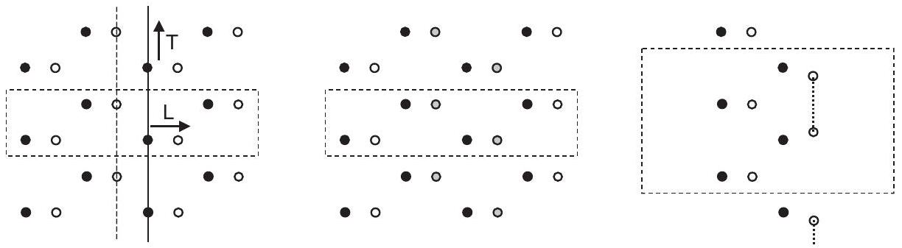

**13**

**Plane Waves and Real-Space Methods: Full Calculations**

**Abstract**

Summary The subject of this chapter is the role of plane waves and grids in modern electronic structure calculations, which builds on the basic formulation of Chapter 12. Plane waves have played an important role from the early OPW calculations to widely used methods involving ab initio pseudopotentials and related methods in Chapter 11. Plane waves continue to be the basis of choice for many new developments, such as quantum molecular dynamics simulations (Chapter 19), owing to the simplicity of operations. Efficient iterative methods (Appendix M) have made it feasible to apply plane waves to large systems, and methods such as "ultrasoft" pseudopotentials and projector augmented waves (PAWs) reduce the number of plane waves required to treat difficult cases such as materials containing transition metals. Real-space grids are an intrinsic part of efficient plane wave calculations and there is a growing development of real-space methods, including finite difference, multigrids, finite elements, and wavelets described in Chapter 12.

Plane waves are by far the method most used in present-day calculations for electronic structure, which is made possible by the combination of two things: (1) efficient methods using fast Fourier transforms (FFTs) and iterative methods in the previous chapter and Appendix M and (2) accurate $a b$ initio pseudopotentials and related methods described in Chapter 11. Because of the simplicity of operations with plane waves or real-space grids, it is straightforward to combine the parts to create methods for full self-consistent KohnSham calculations. This is a short chapter where needed aspects are worked out; at the end are pointers to places in other chapters where the methods are applied.

The previous chapter has brought out some of the real-space approaches that have important advantages. However, they are not as well developed or tested; references to ongoing work is given there and we can only describe a few applications.

# 13.1 $\boldsymbol{A} \boldsymbol{b}$ initio Pseudopotential Method

## 13.1.1 Expressions for Total Energy, Force, and Stress in Fourier Space

The starting point for derivation of the full Kohn-Sham theory is the total energy and the Kohn-Sham equations for which general expressions have been given in Chapter 7; the subject of this section is the derivation of explicit expressions in reciprocal space. For example, the variational expression for energy (Eqs. (7.5) or (7.20)) in terms of the output wavefunctions and density can be written [102, 372, 562, 599]

$$
\begin{aligned}
E_{\text {total }}\left[V_{\text {eff }}\right]= & \frac{1}{N_{k}} \sum_{\mathbf{k}, i} w_{k, i}\left\{\sum_{m, m^{\prime}} c_{i, m}^{*}(\mathbf{k})\left[\frac{\hbar^{2}}{2 m_{e}}\left|\mathbf{K}_{m}\right|^{2} \delta_{m, m^{\prime}}+V_{\text {ext }}\left(\mathbf{K}_{m}, \mathbf{K}_{m^{\prime}}\right)\right] c_{i, m^{\prime}}(\mathbf{k})\right\} \\
& +\sum_{\mathbf{G}} \epsilon_{\mathrm{xc}}(\mathbf{G}) n(\mathbf{G})+\frac{1}{2} 4 \pi e^{2} \sum_{\mathbf{G} \neq 0} \frac{n(\mathbf{G})^{2}}{G^{2}}+\gamma_{\text {Ewald }}+\left(\sum_{\kappa} \alpha_{\kappa}\right) \frac{N_{e}}{\Omega} .
\end{aligned}
$$

Since $E_{\text {total }}$ is the total energy per cell, the average over $\mathbf{k}$ and sum over bands is the same as for the density in Eq. (12.27). Similarly, the sums can be reduced to the IBZ just as in Eq. (4.44). The potential terms involve $\mathbf{K}_{m} \equiv \mathbf{k}+\mathbf{G}_{m}$; the xc term is the total exchangecorrelation energy; and the final three terms are considered below. Alternatively, one can use Eq. (7.20) for the energy, in which the eigenvalues replace the term in square brackets in Eq. (13.1). As discussed in Chapter 7, the form in Eq. (13.1) is manifestly a functional of $V_{\text {eff }}$, which determines each term (except the final two terms that depend only on the structure and number of electrons).

Correct treatment of the Coulomb terms is accomplished by consistently separating out the $\mathbf{G}=0$ components in the potential and the total energy. The Hartree term in Eq. (13.1) is the Coulomb interaction of the electrons with themselves excluding the divergent term due to the average electron density. Similarly, the $\mathbf{G}=0$ Fourier component of the local potential is defined to be zero in Eq. (13.1). Both these terms are included in the Ewald term $\gamma_{\text {Ewald }}$, which is the energy of point ions in a compensating background (see Appendix F, Eq. (F.6)), i.e., this term includes the ion-ion terms as well as the interactions of the average electron density with the ions and with itself. Only by combining the terms together is the expression well defined. The final term in Eq. (13.1), is a contribution due to the nonCoulombic part of the local pseudopotential (see Eq. (12.22)), where $\frac{N_{e}}{\Omega}$ is the average electron density.

Following the analysis of Section 7.3, one can define a functional ${ }^{1}$

$$
\begin{aligned}
\tilde{E}_{\text {total }}= & \frac{1}{N_{k}} \sum_{\mathbf{k}, i} w_{k, i} \varepsilon_{i}+\sum_{\mathbf{G}}\left[\epsilon_{\mathrm{xc}}(\mathbf{G})-V_{\mathrm{xc}}(\mathbf{G})\right] n(\mathbf{G}) \\
& +\left[\gamma_{\text {Ewald }}-\frac{1}{2} 4 \pi e^{2} \sum_{\mathbf{G} \neq 0} \frac{n(\mathbf{G})^{2}}{G^{2}}\right]+\left(\sum_{\kappa} \alpha_{\kappa}\right) \frac{N_{e}}{\Omega},
\end{aligned}
$$

[^0]where all terms involve the input density $n \equiv n^{\text {in }}$. This expression is not variational but instead is a saddle point as a function of $n^{\text {in }}$ around the consistent solution $n^{\text {out }}=n^{\text {in }}$. It is very useful because it often converges faster to the final consistent energy so that it is useful at every step of a self-consistent calculation. Furthermore, it is the basis for useful approximations, e.g., stopping after one step and never evaluating any output quantity other than the eigenvalues [172, 359, 361-363].

The force on any atom $\tau_{\kappa, j}$ can be found straightforwardly from the "force theorem" or "Hellmann-Feynman theorem" given in Section 3.3. For this purpose, Expression (13.1) is the most useful and the explicit expression for (3.20) in Fourier components can be written

$$
\begin{aligned}
\mathbf{F}_{j}^{\kappa}=-\frac{\partial E}{\partial \tau_{\kappa, j}}= & -\frac{\partial \gamma_{\text {Ewald }}}{\partial \tau_{\kappa, j}}-i \sum_{m} \mathbf{G}_{m} \mathrm{e}^{\mathrm{i}\left(\mathbf{G}_{m} \cdot \tau_{\kappa, j}\right)} V_{\text {local }}^{\kappa}\left(\mathbf{G}_{m}\right) n\left(\mathbf{G}_{m}\right) \\
& \frac{-i}{N_{k}} \sum_{\mathbf{k}, i} w_{k, i} \sum_{m, m^{\prime}} c_{i, m}^{*}(\mathbf{k})\left[\mathbf{K}_{m, m^{\prime}} \mathrm{e}^{\mathrm{i}\left(\mathbf{K}_{m, m^{\prime}} \cdot \tau_{\kappa, j}\right)} \delta V_{\mathrm{NL}}^{\kappa}\left(\mathbf{K}_{m}, \mathbf{K}_{m^{\prime}}\right)\right] c_{i, m^{\prime}}(\mathbf{k}),
\end{aligned}
$$

where the Ewald contribution is given in Eq. (F.11). Here the external pseudopotential has been separated into the local part, which contains the long-range terms, and the short-range nonlocal operator $\delta V_{\text {ext }}^{\kappa}\left(\mathbf{K}_{m}, \mathbf{K}_{m^{\prime}}\right)$, with $\mathbf{K}_{m, m^{\prime}} \equiv \mathbf{K}_{m}-\mathbf{K}_{m^{\prime}}$. The expression for stress in Fourier components is given in Section G.3.

## 13.1.2 Solution of the Kohn-Sham Equations

The Kohn-Sham equation is given by Eqs. (12.9) and (12.10) with the local and nonlocal parts of the pseudopotential specified by the formulas of Section 12.4. Consistent with the definitions above, the local part of the potential in the Kohn-Sham equation can be written straightforwardly as the Fourier transform of the external local potential Eq. (12.16), Hartree, and xc potentials in Eq. (7.13),

$$
V_{\mathrm{KS}, \text { local }}^{\sigma}(\mathbf{G})=V_{\text {local }}(\mathbf{G})+V_{\text {Hartree }}(\mathbf{G})+V_{\mathrm{xc}}^{\sigma}(\mathbf{G}),
$$

where all $\mathbf{G}=0$ Fourier components are omitted. The $\mathbf{G}=0$ term represents the average potential, which is only a shift in the zero of energy that has no consequence for the bands, since the zero of energy is arbitrary in an infinite crystal [213,254,600]. The full potential is Eq. (13.4) plus the nonlocal potential Eqs. (12.23) or (12.24).

The equations are solved by the self-consistent cycle shown in Fig. 7.2, where the solution of the equations for a fixed potential is the same as for a non-self-consistent EPM calculation. The new steps that must be added are as follows:

- Calculation of the output density $n^{\text {out }}(\mathbf{G})$
- Generation of a new input density $n^{\text {in }}(\mathbf{G})$, which leads to the new effective potential
- After self-consistency is reached, calculation of the total energy (Eqs. (13.1), (13.2), or related variational formulas using the expressions of Section 7.3), forces, stress, etc.

# 13.2 Approach to Self-Consistency and Dielectric Screening

The plane waves framework affords a simple case in which to discuss the approach to selfconsistency, bringing out issues addressed in Section 7.4. The simplest approach - that works very well in many cases - is linear mixing:

$$
V_{i+1}^{\sigma, \text { in }}(\mathbf{G})=\alpha V_{i}^{\sigma, \text { out }}(\mathbf{G})+(1-\alpha) V_{i}^{\sigma, \text { in }}(\mathbf{G}) .
$$

Choice of $\alpha$ by trial and error is often sufficient since the same value will apply to many similar systems.

In order to go further and analyze the convergence, one can treat the region near convergence, where the error in the output density or potential is proportional to the error in the input potential $\delta V^{\mathrm{in}}$. Using the definition of the dielectric function, the error in the output potential is given by ${ }^{2}$

$$
\delta V^{\text {out }}(\mathbf{G})=\sum_{\mathbf{G}^{\prime}} \epsilon\left(\mathbf{G}, \mathbf{G}^{\prime}\right) \delta V^{\text {in }}\left(\mathbf{G}^{\prime}\right) .
$$

(Note that this does not apply to the $\mathbf{G}=0$ component, which is fixed at zero.) It follows that the error in the output density $\delta n^{\text {out }}(\mathbf{G})=\delta V^{\text {out }}(\mathbf{G})\left(G^{2} / 4 \pi e^{2}\right)$ is also governed by the dielectric function, and the kernel $\chi$ in Eq. (7.34) is related by $\chi\left(\mathbf{G}, \mathbf{G}^{\prime}\right)=\epsilon\left(\mathbf{G}, \mathbf{G}^{\prime}\right) G^{\prime 2} / G^{2}$. In general the dielectric function approaches unity for large $\mathbf{G}$ or $\mathbf{G}^{\prime}$; however, it may be much larger than unity for small wavevectors. For example, for $\mathrm{Si}, \epsilon \approx 12$ for small wavevectors, so that the error in the output potential (or density) is 12 times larger than the error in the input! For a metal, the problem may be worse since $\epsilon$ diverges.

How can the iterations reach the solution? There are two answers. First, for crystals with small unit cells, this is not a problem because all the $\mathbf{G} \neq 0$ components of the potential are for large values of $|\mathbf{G}|$, and the $\mathbf{G} \equiv 0$ is taken care of in combination with the Ewald term (see Appendix F). It is only if one has small nonzero components that problems arise. This happens for large unit cells and is called the "charge sloshing problem." It is worst for cases like metal surfaces, where the charge can "slosh" to and from the surface with essentially no cost in energy. In such cases the change is in the right direction but one must take only small steps in that direction. If a linear mixing formula is used, then the mixing of the output must be less than $1 / \epsilon\left(G_{\text {min }}\right)$ for convergence.

The relation to the dielectric function also suggests an improved way to reach convergence. It follows from Eq. (13.6) that the exact potential can be reached after one step (see also Eqs. (7.34) and (7.36)) by solving the equation

$$
\delta V^{\text {out }}(\mathbf{G}) \equiv V^{\text {out }}(\mathbf{G})-V_{\mathrm{KS}}(\mathbf{G})=\sum_{\mathbf{G}^{\prime}} \epsilon\left(\mathbf{G}, \mathbf{G}^{\prime}\right)\left[V^{\text {in }}\left(\mathbf{G}^{\prime}\right)-V_{\mathrm{KS}}\left(\mathbf{G}^{\prime}\right)\right]
$$

for the converged Kohn-Sham potential $V_{\mathrm{KS}}(\mathbf{G})$. The input and output potentials are known from the calculation; however, the problem is that it is very difficult to find $\epsilon\left(\mathbf{G}, \mathbf{G}^{\prime}\right)$ - a more difficult problem than solving the equations. Nevertheless, approximate forms for

[^1]$\epsilon\left(\mathbf{G}, \mathbf{G}^{\prime}\right)$ such as the diagonal Thomas-Fermi form, Eq. (12.26), can be used to improve the convergence [373]. One can also take advantage of the fact that a linear mixing leads to exponential convergence (or divergence) near the solution; by fitting three points to an exponential, the solution for an infinite number of steps can be predicted [601].

From a numerical point of view the dielectric matrix (or the second derivatives defined in Chapter 7) are nothing more than the Jacobian. Since it is in general not known, approximations (such as approximate dielectric functions) are really "preconditioners" as discussed in the chapter on iterative methods and in Appendix M. This leads to practical approaches that involve combinations of the methods, For example, for high Fourier components the dielectric function is near unity and nearly diagonal, so one can use Eq. (13.5) with $\alpha \approx 0.5$ to 1; for low Fourier components one can use general numerical approaches to build up the Jacobian iteratively as the calculations proceed, e.g., the Broyden-type methods described in Section 7.4 or the RMM-DIIS method (see Section M.7). For some cases there are large problems caused by charge sloshing, i.e., large response of the system to errors. This can be analyzed in terms of the dielectric function and model functions are very useful in reaching convergence. ${ }^{3}$

# 13.3 Projector Augmented Waves (PAWs)

The projector augmented wave (PAW) method [542-545] described in Section 11.12 is analogous to pseudopotentials in that it introduces projectors acting on smooth valence functions $\tilde{\psi}^{v}$ that are the primary objects in the calculation. It also introduces auxiliary localized functions like the "ultrasoft" pseudopotential method. However, the localized functions actually keep all the information on the core states like the OPW and APW (see Chapter 16) methods. Thus many aspects of the calculations are identical to pseudopotential calculations; e.g., all the operations on smooth functions with FFTs, generation of the smooth density, etc. are the same. However, since the localized functions are rapidly varying, augmentation regions around each nucleus (like the muffintin spheres in Chapter 16) are introduced and integrals within each sphere are done in spherical coordinates.

The expressions given in Section 11.12 apply here also. The linear transformation to the all-electron valence functions $\psi^{v}=\mathcal{T} \tilde{\psi}^{v}$ is assumed to be a sum of nonoverlapping atomcentered contributions $\mathcal{T}=\mathbf{1}+\sum_{\mathbf{R}} \mathcal{T}_{\mathbf{R}}$, each localized to a sphere denoted $\Omega_{\text {vecr }}$. If the smooth wavefunction is expanded in spherical harmonics inside each sphere, omitting the labels $v$ and $i$ as in Eq. (11.60),

$$
|\tilde{\psi}\rangle=\sum_{m} c_{m}\left|\tilde{\psi}_{m}\right\rangle,
$$

[^2]with the corresponding all-electron function,
$$
|\psi\rangle=\mathcal{T}|\tilde{\psi}\rangle=\sum_{m} c_{m}\left|\psi_{m}\right\rangle
$$

Hence the full wavefunction in all space can be written

$$
|\psi\rangle=|\tilde{\psi}\rangle+\sum_{\mathbf{R} m} c_{\mathbf{R} m}\left\{\left|\psi_{\mathbf{R} m}\right\rangle-\left|\tilde{\psi}_{\mathbf{R} m}\right\rangle\right\}
$$

The biorthogonal projectors $\left\langle\tilde{p}_{\mathbf{R} m}\right|$ in each sphere are the same as defined in Eq. (11.62) since the spheres are nonoverlapping. In much of the work using PAW the core functions are "frozen" and assumed to be the same as in reference atomic-like systems. In [545] are efficient ways to update the core functions self-consistently in the calculations.

Thus the expressions carry over with the generalization to many spheres, for example, the density given by Eqs. (11.68)-(11.71). Here it is particularly relevant to give the form for the total energy, from which follow the basic Kohn-Sham equations and expressions for forces, etc. [542,544]. Like the density, the energy can be written as a sum of three terms:

$$
E_{\text {total }}=\tilde{E}_{\text {total }}+E_{\text {total }}^{1}+\tilde{E}_{\text {total }}^{1}
$$

where $\tilde{E}$ denotes the energy due to the smooth functions evaluated in Fourier space or a grid that extends throughout space, $\tilde{E}^{1}$ denotes the same terms evaluated only in the spheres on radial grids, and $E^{1}$ the energy in the spheres with the full functions. The classical Coulomb terms are straightforward in the sense that they are given directly by the density; however, they can be rearranged in different ways to improve convergence of the Coulomb sums. In the PAW approach, an additional density is added to both auxiliary densities in $\tilde{n}(\mathbf{r})$ and $\tilde{n}^{1}(\mathbf{r})$ so that the multipole moments of the terms $n^{1}(\mathbf{r})-\tilde{n}^{1}(\mathbf{r})$ in Eq. (11.68) vanish. Thus the electrostatic potential due to these terms vanishes outside the augmentation spheres around each atom, just as is accomplished in full-potential LAPW methods [602]. A discussion of different techniques for the additional density terms [542,544] is given in [544]. The expression for $E_{\mathrm{xc}}$ also divides into three terms with each involving the total density evaluated in the different regions [544]. It is not hard to derive the expressions for the Kohn-Sham equations by functional derivatives of the total energy and a detailed account can be found in [542].

It is advantageous that expressions for the total energy are closely related in the ultrasoft and the PAW formulations, differing only in the choice of auxiliary functions and technical aspects. Thus the expressions for forces and stress are also essentially the same. In particular, the large intra-atomic terms do not enter the derivatives and forces can be derived by derivatives of the structure constants [603]. Stress can also be derived as referred to in [544].

# 13.4 Hybrid Functionals and Hartree-Fock in Plane Wave Methods

Hybrid functionals that have a fraction of Hartree-Fock exchange are increasingly important in electronic structure calculations because they are often much more accurate than
local or semilocal functionals, especially for bandgaps. However, there are difficulties to treat the nonlocal exchange in Hartree-Fock using plane waves. In methods with localized orbitals the calculations are straightforward and the exchange term decreases rapidly with distance as described in Section 3.6. In a plane wave basis, the problem is the $1 / q^{2}$ singularity of the Coulomb interaction, which must be addressed in order to use hybrid functionals. There are two main approaches: methods to treat the divergence using analytical functions, and transformation to localized orbitals. For a short-range hybrid like HSE (see Section 9.3) there is no problem in principle; nevertheless, efficient ways to handle the exchange term are useful.

The Hartree-Fock exchange energy and potential are given in Eqs. (3.44)-(3.48), which are expressed in real space. In a plane wave basis matrix elements of the exchange term can be written as

$$
\hat{V}_{x}^{\sigma}\left(\mathbf{k}, \mathbf{G}_{m} ; \mathbf{k}, \mathbf{G}_{m^{\prime}}\right)=-\frac{4 \pi e^{2}}{\Omega} \sum_{j, \mathbf{k}^{\prime \prime}} \sum_{\mathbf{G}_{m^{\prime \prime}}} \frac{c_{j, \mathbf{k}^{\prime \prime}}^{*}\left(\mathbf{G}_{m}+\mathbf{G}_{m^{\prime \prime}}\right) c_{j, \mathbf{k}^{\prime \prime}}\left(\mathbf{G}_{m^{\prime}}+\mathbf{G}_{m^{\prime \prime}}\right)}{\left|\mathbf{k}-\mathbf{k}^{\prime \prime}-\mathbf{G}_{m^{\prime \prime}}\right|^{2}},
$$

where $c_{j, \mathbf{k}^{\prime \prime}}(\mathbf{G})$ is the coefficient of the Bloch function $j$ with momentum $\mathbf{k}^{\prime \prime}$ (see Section 12.1). Comparison with Eq. (12.7) for a local potential shows immediately that Eq. (13.12) is much more complicated. Since the calculation is done on a discrete set of $\mathbf{k}$-points, the sum in Eq. (13.12) does not properly account for the integral over the divergence in the $\mathbf{G}_{m^{\prime \prime}}=0$ term. Gygi and Baldereschi [604] proposed a method to handle the divergence for $\left|\mathbf{k}-\mathbf{k}^{\prime \prime}\right| \rightarrow 0$ by adding a function $c_{j, \mathbf{k}}^{*}\left(\mathbf{G}_{m}\right) c_{j, \mathbf{k}}\left(\mathbf{G}_{m^{\prime}}\right) F\left(\mathbf{k}-\mathbf{k}^{\prime \prime}\right)$ to the $\mathbf{G}_{m^{\prime \prime}}=0$ term in Eq. (13.12) that cancels the divergence, so that the sum is over terms that vary smoothly. The final result is given by subtracting the integral over the same terms calculated analytically. This approach, combined with techniques using FFTs [605], was developed in [606] to make an efficient method that scales almost linearly with the number of plane waves and quadratically with the number of Bloch functions $j, \mathbf{k}$. For a large calculation with periodic boundary conditions (only $\mathbf{k}=0$ ) this means a quadratic scaling in the size.

A different approach is to transform the Bloch functions into localized functions, i.e., Wannier or related localized functions, as described in Chapter 23. The problem is thus transformed to be the same as for localized basis functions described in Section 3.6. A linear-scaling method has been created in [607], which uses maximally localized functions that are generated using the minimization method in Section 23.3. The calculations require treating all pairs of overlapping Wannier functions, but the efficiency of the calculations can be improved significantly by methods such as the fast multiple approach used in [607]. An example of an application is a simulation of water in [198].

# 13.5 Supercells: Surfaces, Interfaces, Molecular Dynamics

Because plane waves are inherently associated with periodic systems, an entire approach has been developed: to create "supercells" that are large enough to treat problems that are intrinsically nonperiodic. The problem is made artificially periodic and all the usual plane

Figure 13.1. Examples of the use of "supercells" for the case of zinc blende crystals with the long axis in the [1 00 ] direction and the vertical axis in the [ 110 l 1 direction. The unit cell is shown by the dashed boundary. Left: perfect crystal with one plane of atoms displaced; as described in Section 20.2, calculation of forces on other planes, e.g., the one shown by the dashed line, allows calculation of longitudinal $(\mathrm{L})$ or transverse $(\mathrm{T})$ phonon dispersion curves in the [1 00 0 direction. Middle: interface between two crystals, e.g., GaAs-AlAs, which allows calculation of band offsets, interface states, etc. Right: two surfaces of a slab created by removing atoms, leaving a vacuum spacer. Complicated reconstructions often lead to increased periodicity in the surface and larger unit cells as indicated.

wave methods apply. Despite the obvious disadvantage that many plane waves are required, the combination of efficient iterative methods (Appendix M) and powerful computers makes this an extremely effective approach. From a more fundamental point of view, the variation in calculated properties with the size of the "supercell" is an example of finitesize scaling, which is a powerful method to extrapolate to the large-system limit. This is the opposite of the approach in Chapter 18 to treat localized properties; each has advantages and disadvantages. Of course, other methods can be used as well. ${ }^{4}$

Schematic examples of supercells in one dimension are shown in Fig. 13.1: a crystal with a displaced plane, a superlattice formed by different atoms, and a slab with vacuum on either side. In fact, the periodic cell made by repeating the cell shown is potentially a real physical problem of interest in its own right. In addition, the limit of infinite horizontal cell size can be used in various ways to represent the physical limit of an isolated plane of displaced atoms, an isolated interface, and a pair of surfaces. Although each case may be better treated by some other method, the fact that a plane wave code can treat all cases with only changing a few lines of input information can be used to describe the limits accurately is an enormous advantage.

It is essential to treat the long-range Coulomb interaction carefully. In methods that use periodic boundary conditions, it is not hard to calculate terms that behave as $1 /|\mathbf{k}+\mathbf{G}|^{2}$, but it is often very tricky to interpret them properly! See Section F. 5 and Appendix F.

## 13.5.1 "Frozen" Phonons and Elastic Distortions

An example of the use of supercells in calculating phonon properties is given in Section 20.2. Any particular cell can be used to calculate all the vibrational properties at

[^3]the discrete wavevectors corresponding to the reciprocal lattice vectors of the supercell. This is very useful for many problems, and a great advantage is that nonlinear, anharmonic effects can be treated with the same method (see, e.g., Fig. 2.10) as well as phase transitions such as in $\mathrm{BaTiO}_{3}$ and Zr in Fig. 2.10. Furthermore, it is possible [608-610] to derive full dispersion curves from the direct force calculations on each of the atoms in a supercell, like those shown on the left-hand side of Fig. 13.1. The requirement is that the cell must be extended to twice the range of the forces. An example of phonon dispersion curves in GaAs in the [100] direction is shown in Fig. 20.1. The inverse dielectric constant $\epsilon^{-1}$ and the effective charges $Z_{I}^{*}$ can also be calculated from the change in the potentials due to an induced dipole layer in the supercell [608] or by finite wavevector analysis [611].

## 13.5.2 Interfaces

Interfaces between bulk materials are a major factor in determining the properties of materials: grain boundaries in metals that determine ductility; heterostructures that are very important in creating man-made semiconductor devices; oxide interfaces that form atomically thin electronic states; and so forth. In general, the different bonding of atoms at the interface leads to displacements of atoms and often superstructures; because the positions of the atoms may be crucial and it is very difficult to determine the structure experimentally, it makes a qualitative difference to have methods to reliably determine the structures. Superlattices provide a way to do the calculations in an unbiased way for many different structures. The "polar catastrophe" is a particular problem that is exemplified for oxide interfaces in Fig. 22.6. Representative examples for semiconductors and oxide interfaces are in Chapter 22.

## 13.5.3 Surfaces

Even though surfaces are interfaces of a solid with vacuum, surface science is a field in itself because surfaces are experimentally accessible and have untold number of uses. At a surface atoms have much more degrees of freedom and examples of surface structures determined by plane wave total energy calculations are given in Section 2.11 for ZnSe, which illustrate issues that occur in polar semiconductors. Catalysis is a great challenge for electronic structure methods to play a major role in sorting out the mechanisms and developing new catalysts.

## 13.5.4 Molecular Dynamics

Molecular dynamics (MD) in condensed matter is a venerable area of simulations, where boundary conditions have been studied in depth. Methods in which forces are calculated by calculating the electronic state at each step (quantum MD in Chapter 19) are far more computationally intensive than with atomic force models. Cells are smaller, boundary conditions are much more important, and periodic boundary conditions are almost always the best. Plane waves have been the method of choice for the great majority of quantum MD
calculations, which have made a qualitative change in the types of problems in the realm of electronic structure, with examples in Chapters 2 and 19.

# 13.6 Clusters and Molecules

For finite systems such as clusters and molecules real-space methods are an obvious choice using open boundary conditions. In the case of plane waves, it is essential to construct a supercell in each dimension in which the system is localized. Since the supercell must be large enough so that any spurious interactions with the images are negligible, which means that many plane waves must often be used, and Coulomb interactions require special care; nevertheless, it may still be an effective way of solving the problem.

Calculations that employ grids are featured in Chapter 21 on excitations, where finite difference methods [569, 570] have been used effectively for total energy minimization and time-dependent DFT studies of finite systems from atoms to clusters of hundreds of atoms [575]. An application of multigrid methods is a boron nitride-carbon nanotube junction [612].

Two examples of plane wave calculations in one-dimensional systems involve a patterned graphene nanoribbon in Section 26.7 and a small-diameter carbon nanotube in Section 22.9. Figure 22.9 shows the bands for the nanotube, where the generality of plane waves led to discovery of an effect that is very different from a simple picture of tubes as rolled graphene. In the graphene nanoribbon, tight-binding models are often sufficient, but the plane wave calculations provide quantitative results with no parameters.

# 13.7 Applications of Plane Wave and Grid Methods

Because plane waves are so pervasive, many applications are given in other chapters, listed here along with a few salient comments:

- prediction of structures and calculation of equations of state (the pioneering work of Yin and Cohen [101, 599] for the phase transition of Si under pressure shown in Fig. 2.3; prediction [139] of a new structure of nitrogen under pressure in Fig. 2.5; prediction of the structure and transition temperature of sulfur hydride superconductors (Figs. 2.6 and 2.7); phase transition in $\mathrm{MgSiO}_{3}$ and the equation of state of Fe at pressures and temperatures found deep in the earth in Figs. 2.12 and 2.13; thermal simulations of water in Fig. 2.15, the catalysis problem shown schematically in Fig. 2.16, and the phase diagram of carbon at high temperature and pressure in Fig. 19.2)
- phonons in Fig. 2.11 and Chapter 20.
- effective charges and spontaneous polarization in Section 24.5.
- tests of various functionals in the phase transitions of Si and $\mathrm{SiO}_{2}$ under pressure in Fig. 2.4
- band structures and excitations of many materials including Ge in Fig. 2.23, GaAs and LiF in Figs. 2.25 and 2.26, $\mathrm{MoS}_{2}$ in Fig. 22.8, HgTe and CdTe in Fig. 27.10, and $\mathrm{Bi}_{2} \mathrm{Se}_{3}$ in Fig. 28.4
- surface states of gold in Fig. 22.3 and $\mathrm{Bi}_{2} \mathrm{Se}_{3}$ in Fig. 28.5, and end states of a patterned graphene nanoribbon in Section 26.7
- excitations in molecules and clusters, using plane waves for small metal clusters in Fig. 21.1 and $\mathrm{C}_{60}$ in Fig. 21.4, and the finite difference grid method in Figs. 21.2 and 21.3

**SELECT FURTHER READING**

General references are given in Chapter 12. For developments with plane waves:
Kohanoff, J., Electronic Calculations for Solids and Molecules: Theory and Computational Methods (Cambridge University Press, Cambridge, 2003).
Payne, M. C., Teter, M. P., Allan, D. C., Arias, T. A., and Joannopoulos, J. D., "Iterative minimization techniques for ab initio total-energy calculations: molecular dynamics and conjugate gradients," Rev. Mod. Phys. 64:1045-1097, 1992.
Pickett, W. E., "Pseudopotential methods in condensed matter applications," Comput. Phys. Commun. 9:115, 1989.
Singh, D. J., Planewaves, Pseudopotentials, and the APW Method (Kluwer Academic Publishers, Boston, 1994), and references therein.
Srivastava, G. P. and Weaire, D., "The theory of the cohesive energy of solids," Adv. Phys. 36:463-517, 1987.

PAW method:
Blöchl, P. E., "Projector augmented-wave method," Phys. Rev. B 50:17953-17979, 1994.
Holzwarth, N. A. W., Tackett, A. R., and Matthews, G. E., "A projector augmented wave (PAW) code for electronic structure calculations, part I: ATOMPAW for generating atom-centered functions," Comp. Phys. Commun. 135:329-347, 2001.
Holzwarth, N. A. W., Tackett, A. R., and Matthews, G. E., "A projector augmented wave (PAW) code for electronic structure calculations, part II: PWPAW for periodic solids in a plane wave basis," Comp. Phys. Commun. 135:348-376, 2001.
Kresse, G. and Joubert, D., "From ultrasoft pseudopotentials to the projector augmented-wave method," Phys. Rev. B 59:1758-1775, 1999.

Grid methods:
Beck, T. L., "Real-space mesh techniques in density-functional theory," Rev. Mod. Phys. 72:1041-1080, 2000.
Also see other references cited in Chapter 12.

**Exercises**

13.1 There are excellent open-source codes available online for DFT calculations using plane waves (see Appendix R). Two well-known ones are ABINIT and quantumESPRESSO, which have large user groups. These codes can be used in the calculations for metallic H in Eq. (13.4) and other problems in the book. The codes often have tutorials similar to the exercises and also many examples for materials.
13.2 Show that the Eq. (7.20) leads to the expression (13.2) written in Fourier components. In particular, show that the groupings of terms lead to two well-defined neutral groupings: the
difference of the ion and the electron terms in the square bracket and the sum of eigenvalues that are the solution of a the Kohn-Sham equation with a neutral potential.
13.3 Derive the result that the $\alpha$ parameter in the linear-mixing scheme Eq. (13.5) must be less than $1 / \epsilon\left(G_{\min }\right)$ for convergence. Show that this is a specific form of the general equations in Section 7.4 and is closely related to Exercise 7.21. In this case it is assumed that $\epsilon_{\max }$ occurs for $G=G_{\min }$. Discuss the validity of this assumption. Justify it in the difficult extreme case of a metal surface as discussed in Section 13.2.
13.4 This exercise is to calculate the band structure of metallic H at high density ( $r_{s}=1$ is a good choice) in the fcc structure and to compare with (1) the free-electron bands expected for that density and (2) bands calculated with the Thomas-Fermi approximation for the potential (Exercise 12.13). Use the Coulomb potential for the proton and investigate the number of plane waves required for convergence. (There is no need to use a pseudopotential at high density, since a feasible number of planes is sufficient.) Comparison with the results of Exercise 12.13 can be done either by comparing the gaps at the $X$ and $L$ points of the BZ in lowest non-zeroorder perturbation theory, or by carrying out the full band calculation with the Thomas-Fermi potential.

[^0]:    ${ }^{1}$ The electron Coulomb term on the second line cancels the double counting in the eigenvalues. The terms are arranged in two neutral groupings: the difference of the ion and the electron terms in the square bracket and the sum of eigenvalues that are the solution of the Kohn-Sham equation with a neutral potential.

[^1]:    ${ }^{2}$ Note the similarity to the Thomas-Fermi expression, (12.25). The reason that we have $\epsilon$ here instead of $\epsilon^{-1}$ is that here we are considering the response to an internal field.

[^2]:    ${ }^{3}$ An example is the combination of dielectric screening and RMM-DIIS residual minimization, which is described in the online information on optimization in the VASP code.

[^3]:    ${ }^{4}$ Real-space approaches can treat such systems without assuming artificial periodicity; however, it is only for the surface that it is straightforward to impose correct boundary conditions.

