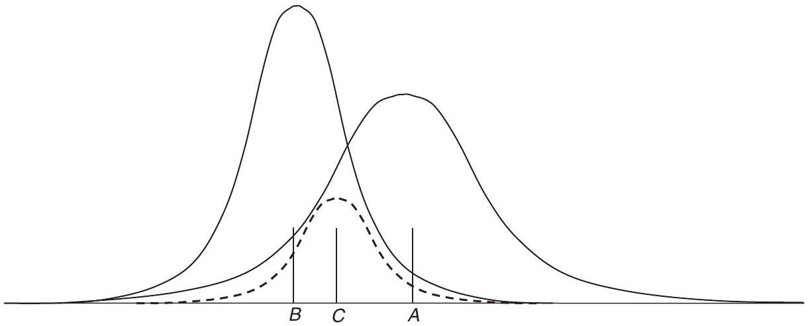
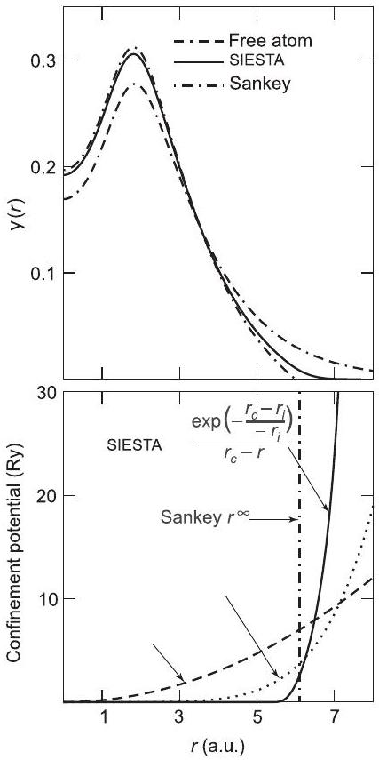

**15**

**Localized Orbitals: Full Calculations**

**Summary**

As emphasized in the previous chapter, localized functions provide an intuitive description of electronic structure and bonding. This chapter is devoted to quantitative methods in which the wavefunction is expanded as a linear combination of localized atomic(-like) orbitals, such as gaussians, Slater-type orbitals, and numerical radial atomic-like orbitals. Such calculations can be very efficient; they can also be very accurate, as shown by the highly developed codes used in chemistry; and they provide the basis for creation of new methods, such as "order- $N$ " (Chapter 18) and Green's function approaches. There is a cost, however: full self-consistent DFT calculations require specification of the basis, and the price paid for efficiency is loss of generality (in contrast to the "one basis fits all" philosophy of plane wave methods). Since details depend on the basis, we can only describe general principles with limited examples.

It is instructive to note that there are important connections to localized muffin-tin orbitals (MTOs) (Chapter 16), the linear LMTO method (Chapter 17). This has led to an "ab initio tight-binding" method (Section 17.7) in which a minimal basis of orthogonal localized orbitals is derived from the Kohn-Sham hamiltonian.

# 15.1 Solution of Kohn-Sham Equations in Localized Bases

The subject of this chapter is the class of general methods for electronic structure calculations in terms of the localized atom-centered orbitals defined in Section 14.1. The orbitals may literally be atomic orbitals, leading to the LCAO method or various atomic-like orbitals. These are powerful methods widely used in chemistry (see, e.g., [274, 275, 641-643]) and of increasing importance in condensed matter (see, e.g., [643-646]). Unlike the tight-binding methods of the previous chapter, these methods are fully " $a b$ initio," i.e., they involve no parameters and solve the full Kohn-Sham or Hartree-Fock equations in a basis of orbitals. Unlike plane waves, however, the orbitals must be chosen for the given system to be accurate and efficient, and there is a problem of "overcompleteness" if one attempts to go to convergence. Nevertheless, there is great experience in constructing appropriate orbitals, so that localized orbitals are often the basis
of choice, providing crucial understanding and calculational procedures that can be both fast and accurate with careful choice of orbitals.

In constructing desirable localized basis functions, there are two (often competing) considerations: reduction of the number of basis functions and ease of computation of the needed integrals. The former consideration means each function must be well tailored to the problem, which has led to many choices; only a few examples can be considered here. These competing requirements have led to the two general classes of orbitals discussed in Sections 15.2 and 15.4, which involve, respectively, analytic basis functions and numerical orbitals.

The goal of having a small basis leads to some overall conclusions that can be seen from general principles. The most common approach is to use atom-centered orbitals that are the products of radial functions and spherical harmonics defined in Eq. (14.8). The primary degrees of freedom are captured by a small set of $l, m$ and radial functions, the shape of which must be optimized. It is often advantageous to choose a small set of radial functions that are optimal for a given environment. However, we shall concentrate on more general, flexible methods with a basis of several radial orbitals for each $l, m$ channel.

## 15.1.1 Basis Functions: Naming Conventions and Examples

The common notation in the field is that multiple radial functions for the same $l, m$ are denoted "multiple zeta," i.e., single- $\zeta$ or "SZ," double- $\zeta$ or "DZ," triple- $\zeta$ or "TZ" for one, two, or three radial functions, etc. The nomenclature arises from the use of $\zeta$ to denote the range of the basis functions. There are some general guidelines for the choice of optimal radial basis functions. For example, it is well known that in a molecule or solid, the localized orbitals typically are best described by atomic-like orbitals with shorter range and larger amplitude at the nucleus than in the atom [274,643]. This is a direct consequence of the fact that the fundamental driving force for the binding of molecules or solids is the lowering of total energy because the electrons can be closer to the nuclei without paying as much cost in kinetic energy, compared to electrons in isolated atoms. Furthermore, the long-range exponential tails of the atomic orbitals are irrelevant or incorrect in regions that overlap other atoms. Thus basis orbitals tend not to be as extended as atomic functions. Different radial functions can be generated in many ways. One of the most elegant uses the ideas of the energy derivative of the wavefunction $\dot{\psi}$ derived in Section 17.2. Using the same principles as invoked in the LMTO approach and in norm-conserving pseudopotentials (Section 11.9), the change in the wavefunction in different environments is described to linear order by a combination of $\psi$ and $\dot{\psi}$. Thus, $\psi, \dot{\psi}, \ddot{\psi}$, etc., form a possible set of localized orthonormal radial functions. On the other hand, it is often essential to include longer-range functions, e.g., to describe the decay of wavefunctions in the vacuum around molecules or at surfaces.

Since the environment of an atom in a molecule or solid is not spherical, in general the basis requires higher angular momenta than the minimal basis in the atom. The first such functions are called "polarization functions," which have angular momentum $l^{+}$one unit larger than the maximum occupied state in the atom. It is pertinent to note that it is not appropriate to use the atomic state of angular momentum $l^{+}$. Such a state tends to be
very diffuse and not relevant to the actual change in the function in the molecule or solid. A much better choice [274, 643, 646] is the actual change in the wavefunction of angular momentum $l$ upon application of a weak electric field; this is a real "polarization function" that is localized and captures the essence of the lowest-order effect of the nonspherical environment. Inclusion of polarization functions in the basis is denoted by "P," e.g., "TZP" for triple- $\zeta$ with polarization functions.

The solution of the Kohn-Sham equations has exactly the same form as for the tightbinding equations of Chapter 14 except that the matrix elements must be computed explicitly and the potential must be derived self-consistently. Thus, as in all Kohn-Sham or Hartree-Fock methods, the key problem is to calculate the integrals for the matrix elements of the hamiltonian, the solution of the Poisson equation, and the generation of the potential in the self-consistency cycle. The ease with which one can do these operations is greatly affected by the choice of the basis functions, which has led to a number of methods. Furthermore, it is one of the major reasons for the development of standard sets of basis functions, as given in references such as [274, 275, 641, 642].

# 15.2 Analytic Basis Functions: Gaussians

By far the most useful and used basis functions for electronic structure calculations of molecules are gaussians multiplied by polynomials, apparently first adopted by Boys [647] and expounded upon in many texts such as [274, 275, 641, 642]. The great virtue is that all matrix elements can be computed analytically, greatly simplifying and speeding up calculations. ${ }^{1}$

Gaussians have the property, illustrated in Fig. 15.1, that the product of any two gaussians is a gaussian

$$
\mathrm{e}^{-\alpha\left|\mathbf{r}-\mathbf{R}_{A}\right|^{2}} \mathrm{e}^{-\beta\left|\mathbf{r}-\mathbf{R}_{B}\right|^{2}}=K_{A B} \mathrm{e}^{-\gamma\left|\mathbf{r}-\mathbf{R}_{C}\right|^{2}},
$$

where (Exercise 15.2)

$$
\begin{gathered}
\gamma=\alpha+\beta, \\
\mathbf{R}_{C}=\frac{\alpha \mathbf{R}_{A}+\beta \mathbf{R}_{B}}{\alpha+\beta},
\end{gathered}
$$

${ }^{1}$ The general principle that determines the usefulness of the analytic basis functions is the existence of an "expansion theorem" for the orbital centered on one site in terms of the basis functions on neighboring sites

$$
\chi_{\alpha}(\mathbf{r}-\mathbf{R})=\sum_{\alpha^{\prime}} B_{\alpha \alpha^{\prime}}\left(\mathbf{R}, \mathbf{R}^{\prime}\right) \chi_{\alpha^{\prime}}\left(\mathbf{r}-\mathbf{R}^{\prime}\right),
$$

which greatly facilitates evaluation of the integrals. Examples of functions that possess this property are polynomials multiplied by gaussians ( $r^{\beta} \mathrm{e}^{-\alpha r^{2}}$ ), Slater-type orbitals ( $r^{\beta} \mathrm{e}^{-\alpha r}$ ), and spherical Bessel, Neumann, and Hankel functions. The advantages of the expansion theorem are emphasized in Chapters 16 and 17, where the expansion formulas for spherical Bessel, Neumann, and Hankel functions are crucial to the formulation of the KKR and (L)MTO methods.

Figure 15.1. The overlap of two gaussians is another gaussian, with center, width, and weight given by Eqs. (15.2)-(15.5). From this basic result, matrix elements of kinetic energy and polynomials can be constructed by simple procedures (see text).

and

$$
K_{A B}=\left[\frac{2 \alpha \beta}{\pi(\alpha+\beta)}\right]^{3 / 4} \mathrm{e}^{-\frac{\alpha \beta}{\gamma}\left|\mathbf{R}_{A}-\mathbf{R}_{B}\right|^{2}} .
$$

Analytic relations can be found for gaussians multiplied by any polynomial of the radius by differentiating the above formulas using the fact that $(\mathrm{d} / \mathrm{d} x) \mathrm{e}^{x^{2}}=2 x \mathrm{e}^{x^{2}}$ and so forth up to any power. Similarly, it is straightforward to evaluate the laplacian applied to any gaussian multiplied by a polynomial. Thus for a basis set consisting of gaussians times polynomials (and spherical harmonics) centered at any site, all multicenter integrals can be evaluated analytically.

The expressions for the overlap and kinetic energy matrix elements can be easily derived (Exercise 15.3). The charge density $|\psi(\mathbf{r})|^{2}$, where $\psi(\mathbf{r})$ is a sum of such basis functions, is also readily expressed as a sum of gaussians. Potential matrix elements depend on the form of the potential. Two cases are of particular interest: if the potential is a sum of gaussians, the matrix elements are simply a sum of analytic three-center integrals; in addition, matrix elements of the Coulomb interaction with the nuclei and between the electrons can be computed analytically in terms of "Boys functions." Since these are the only integrals needed in Hartree-Fock calculations, gaussians have long enjoyed their status as the basis of choice. (For density functional theory some of the advantage is lost since the exchangecorrelation potential is a nonlinear functional of the density that is not directly expressible as gaussians even if the density is a sum of gaussians.) Detailed expressions for the total energy, etc., are not given here, since they can be found from the expressions in Section 15.5. However, here is one major point. The Hartree-Fock equations can be written directly in terms of four center integrals, since the Coulomb matrix elements involve four orbitals. This is an effective approach for small systems; however, it scales as $N_{\text {orbital }}^{4}$. For large systems, especially for the Kohn-Sham equations, it is more effective to generate the total potential due to all occupied orbitals and to evaluate the matrix elements using grids [648].

The downside of gaussians is that they are eigenstates of a harmonic oscillator, which has little in common with potentials in a material made of atoms. For this reason there is great use of standardized "Slater-type orbitals" (STOs), which are sums of gaussians with fixed coefficients [274, 275, 641, 642]. An STO retains all the nice features of gaussians while at the same time having a form closer to an atomic-type orbital. In essence, an STO is a radial orbital that is expanded in a convenient basis; however, instead of allowing all the coefficients of the gaussians to vary, standard optimized sets have been generated that can be used to compare calculations with identical bases and to achieve different levels of accuracy with different bases.

# 15.3 Gaussian Methods: Ground-State and Excitation Energies

Electronic structure calculations using gaussians and STOs are extensively used in calculations for molecules that are far too numerous to attempt to summarize here and they are covered in great detail elsewhere. The methods are so successful that there are many commercially available codes adapted to molecular systems. One of the great advantages of gaussians is that Coulomb integrals can be computed analytically. It is for this reason that gaussians have been the workhorse of Hartree-Fock calculations and they are useful in problems that involve Coulomb integrals. This includes Hartree-Fock, exact exchange (EXX; Section 9.5), hybrid functionals (Section 9.3), and many-body GW calculations (see the companion volume [1]), all of which involve computation of exchange integrals.

Gaussian can also be efficient for periodic systems that are relevant for condensed matter. Many calculations have used the CRYSTAL code [644, 645], for example, using hybrid functionals for materials such as $\mathrm{La}_{2} \mathrm{CuO}_{4}$ [649] and $\mathrm{UO}_{2}$ [650], where the correct insulating antiferromagnetic state is found unlike the usual LDAs or GGAs that predict a metallic nonmagnetic state. The GAUSSIAN code has been extended to periodic systems; an example is the bandgaps for crystals using hybrid functionals shown in Fig. 2.24 taken from [242].

The efficiency and flexibility of gaussians is illustrated by application to complex systems, e.g., to electronic bands for the dimerized Ge ( 100 ) surface [651] shown in Fig. 22.4, which compares LDA and GW quasiparticle bands with experimental results. Another example is linear-scaling "order- $N$ " methods have been developed and applied to problems such as the structures of large RNA molecules [652] (see caption of Fig. 18.8).

# 15.4 Numerical Orbitals

Efficient algorithms using numerical orbitals can be constructed for either all-electron [113, 653, 654] or pseudopotential methods [646, 655]. Construction of the orbitals is very similar in either case. However, evaluation of the matrix elements in a local orbital calculation may be different. Since pseudopotentials and pseudofunctions are smooth, it is possible to carry out many integrals directly on a grid. For all-electron states, on the other hand, it is essential to have a method that accurately integrates the region around each nucleus where the wavefunctions vary rapidly.

## 15.4.1 Construction of Orbitals

Localized orbitals can be constructed from atomic-like programs with spherically symmetric potentials. It is possible to use the atomic orbitals themselves, but their long-range tails are not desirable. Since they are not really appropriate in a solid or molecule, the tails actually decrease the accuracy of the calculations and at the same time introduce troublesome long-range terms. It is more desirable to define shorter-range, more "compressed" orbitals that are better suited to the final application. The effects are relevant primarily for the valence states since the core states are localized and little affected by boundary conditions.

Many different procedures have been proposed for generation of compressed, short-range orbitals. Each involves modification of the atomic potential so that it is strongly repulsive at large distance. This makes the orbitals confined, which is more realistic and, in addition, has advantages for the calculation since fewer matrix elements need be included. However, such confined orbitals may not be sufficient, especially at surfaces, since they cut off the charge density in the vacuum in an unphysical way. Examples of types of potentials for generating orbitals that have been used for calculations on solids include those shown in Fig. 15.2. The orbitals [620] constructed by the hard-wall confining potential have the advantage that they

Figure 15.2. Confining potentials and pseudowavefunctions for numerical basis functions of Mg . The orbital is the solution with an atomic potential modified by the addition of a confining potential as shown at the bottom for various choices. The confining functions in the FHI-aims code [113] are similar to those in the SIESTA code [646] except that $1 /\left(r_{c}-r\right)$ is replaced by $1 /\left(r_{c}-r\right)^{2}$. Figure from [656].

are strictly localized, but the disadvantage that the second derivative has a divergence that makes a finite contribution to kinetic matrix elements. The other confining potentials are constructed to have chosen degrees of confinement versus smoothness.

## 15.4.2 Integrals Involving the Orbitals

Many of the needed integrals depend only on the positions of the atoms. Efficiency is not a premium for these terms because they can be calculated in advance and used later. This includes the overlap, kinetic energy matrix element, and nonlocal pseudopotential terms in Eqs. (14.2) and (14.1). The first two are two-center terms that are functions only of the distance $R$ between the centers for the case where the angular momentum axis is along the line joining the centers. Rotation to treat the general case is given in Section 14.2. An effective procedure is to calculate the values at many discrete values of $R$ and interpolate to find the matrix elements during a calculation. Thus we can view these matrix elements as known two-body functions,

$$
S_{m, m^{\prime}}(R)=\int \mathrm{d} \mathbf{r} \chi_{m}^{*}(\mathbf{r}) \chi_{m^{\prime}}(\mathbf{r}-\mathbf{R}),
$$

and

$$
T_{m, m^{\prime}}(R)=\int \mathrm{d} \mathbf{r} \chi_{m}^{*}(\mathbf{r}) \frac{1}{2} \nabla^{2} \chi_{m^{\prime}}(\mathbf{r}-\mathbf{R}),
$$

where $m$ denotes the atom type and orbital on that atom.
Potential terms are not so easy to express since they involve three centers (wavefunctions on two centers and the potential on a third). However, nonlocal pseudopotential terms have special features that can be used to advantage. First, nonlocal terms are fixed for each atom and never change during a calculation. Second, if a separable form (the KleinmanBylander form of Section 11.8, the "ultrasoft" pseudopotential of Section 11.11, or the PAW in Section 11.12) is used, then all three-center terms factorize into sums of products of two-center terms. These can be tabulated in advance as a function of distance.

Thus we are left with the problem of treating the matrix elements of the local potentials. This includes the full Kohn-Sham potential or any local parts of the potential. In a pseudopotential method, this can be treated exactly as is done with plane waves - sums on a grid. All operations on the grid, such as finding the density and exchange-correlation functions, can be done exactly as for plane waves. The only differences are that the wavefunctions in the local orbital basis must be transferred to the grid and the integrals are done by summing on the grid points to find the matrix elements

$$
V_{m, m^{\prime}}^{\text {local }}(\mathbf{T})=\int \mathrm{d} \mathbf{r} \chi_{m}^{*}\left(\mathbf{r}-\tau_{m}\right) V^{\text {local }}(\mathbf{r}) \chi_{m^{\prime}}\left(\mathbf{r}-\left(\tau_{m^{\prime}}+\mathbf{T}\right)\right)
$$

If the wavefunctions are smooth, for example, with pseudopotentials, the integral in Eq. (15.8) can be carried out on a regular grid [646]. In an all-electron method, the integration must be done carefully around each nucleus since the wavefunctions vary rapidly. One approach [657] is to use the "muffin-tin" partitioning of space illustrated in

Fig. 16.1, in which case the integration can be done on radial grids around each nucleus and uniform grids in the interstitial regions very much like the procedures in augmented methods. Another general approach is to break up the integral into overlapping domains using functions $\alpha_{i}(\mathbf{r})$ that together cover all space. If we define the normalized weight functions $w_{i}(\mathbf{r})=\alpha_{i}(\mathbf{r}) / \sum_{j} \alpha_{j}(\mathbf{r})$, any integral can be written as

$$
\int \mathrm{d} \mathbf{r} f(\mathbf{r})=\sum_{i} \int \mathrm{~d} \mathbf{r} w_{i}(\mathbf{r}) f(\mathbf{r}) .
$$

Each integral on the right-hand side can be done on a different grid; in particular, radial grids can be used around each atom to deal with the rapid variations near the nucleus [653, 654, 658].

# 15.5 Localized Orbitals: Total Energy, Force, and Stress

Any of the expressions for the total energy in Section 7.3 can be used in a local orbital basis. The expressions can be written most compactly in terms of the density matrix $\rho_{m m^{\prime}}$. If the eigenvectors are $\psi_{i}(\mathbf{r})=\sum_{m} c_{i m} \chi_{m}\left(\mathbf{r}-\mathbf{R}_{m}\right)$, then $\rho_{m m^{\prime}}$ is given by

$$
\rho_{m m^{\prime}}=\sum_{i} f\left(\varepsilon_{i}\right) c_{i m}^{*} c_{i m^{\prime}}
$$

In the present case, $\chi_{m}\left(\mathbf{r}-\mathbf{R}_{m}\right)$ are the localized basis functions, where $m$ denotes both orbital $\alpha$ and site $I$, and $\mathbf{R}_{m}$ denotes the position of atom $\mathbf{R}_{I}$ on which orbital $m$ is centered.

All quantities in the total energy expressions can be cast in terms of $\rho_{m m^{\prime}}$. In particular, the sum of eigenvalues in Eqs. (7.17) and (7.19) is given by

$$
E_{s}=\sum_{i=1}^{N} \varepsilon_{i} f\left(\varepsilon_{i}\right)=\sum_{m m^{\prime}} \rho_{m m^{\prime}}\left[H_{K S}\right]_{m m^{\prime}},
$$

where $\left[H_{K S}\right]_{m m^{\prime}}$ denotes matrix elements of the Kohn-Sham effective hamiltonian, and the spatial electron density is given by

$$
n(\mathbf{r})=\sum_{i} f\left(\varepsilon_{i}\right)\left|\psi_{i}(\mathbf{r})\right|^{2}=\sum_{m m^{\prime}} \rho_{m m^{\prime}} \chi_{m}^{*}\left(\mathbf{r}-\mathbf{R}_{m}\right) \chi_{m^{\prime}}\left(\mathbf{r}-\mathbf{R}_{m^{\prime}}\right) .
$$

These are sufficient to determine the energy in any of the various expressions in the KohnSham approach.

It is useful to be more specific because certain forms are advantageous in a localized basis [646, 659]. In particular, calculation of forces, stress, and Coulomb energies can be facilitated by the choice of the energy functional. Calculation of Coulomb terms (including the local pseudopotential term) can be done conveniently by grouping terms due to each nucleus (or ion) $I$ with a compensating localized, spherical charge $n_{I}(\mathbf{r})$, as is described in Section F.4. Any convenient localized electron density can be used; if the orbitals are constructed from an atomic-like calculation, an obvious choice is the density resulting from
these orbitals. The needed expressions for the Coulomb terms are given in Sections F. 3 and F. 4 in terms of the electron density written as

$$
n(\mathbf{r}) \equiv \sum_{I} n_{I}(\mathbf{r})+\delta n(\mathbf{r}),
$$

which is equivalent to Eq. (F.18).
Inserting the expression for the Coulomb and local potential terms, Eqs. (F.19) and (F.20), into that for total energy Eq. (F.16), a convenient form ${ }^{2}$ for the total energy is [646, 659]

$$
\begin{aligned}
E_{t o t}= & \sum_{m m^{\prime}} \rho_{m m^{\prime}}\left[T_{m m^{\prime}}+V_{m m^{\prime}}^{N L}\right]+\sum_{I<J} U_{I J}^{\mathrm{NA}}\left(\left|\mathbf{R}_{I}-\mathbf{R}_{J}\right|\right)+\sum_{I} U_{I}^{\mathrm{NA}} \\
& +\int \mathrm{d} \mathbf{r} V^{\mathrm{NA}}(\mathbf{r}) \delta n(\mathbf{r})+\frac{1}{2} \int \mathrm{~d} \mathbf{r} \delta V_{\text {Hartree }}(\mathbf{r}) \delta n(\mathbf{r}) \\
& +\int \mathrm{d} \mathbf{r} \epsilon_{\mathrm{xc}}(\mathbf{r}) n(\mathbf{r}) .
\end{aligned}
$$

Here $U_{I}^{\mathrm{NA}}$ denotes the potential energy of the neutral atom, $U_{I J}^{\mathrm{NA}}\left(\left|\mathbf{R}_{I}-\mathbf{R}_{J}\right|\right)$ is the classical interaction of two neutral atom densities, and the two terms involving $\delta n(\mathbf{r})$ are the first- and second-order changes in the potential energy due to the changes in the density in the solid. As discussed in Section F.4, the local part of the pseudopotential is included in $U_{I}^{\text {NA }}$ and $V^{\mathrm{NA}}(\mathbf{r})$. Since the exchange-correlation energy is a nonlinear functional of $\rho$, it cannot be divided in the same way and is left as the usual expression. Similarly, it is more convenient to express the first term that involves the density matrix directly as shown.

## 15.5.1 Force and Stress

Expression (15.14) is particularly appropriate for calculation of derivatives. The solution of the self-consistent Kohn-Sham equations leads to a minimization of the total energy with respect to the coefficients $c_{i m}$ in the wavefunction. Therefore the derivative of $E_{\text {tot }}$ with respect to $\rho_{m m^{\prime}}$ vanishes. Thus the derivatives of the first three terms in Eq. (15.14) can be considered as functions of the distances between the atoms, since $T_{m m^{\prime}}$ and $V_{m m^{\prime}}^{N L}$ are functions only of distances, as shown in Section 15.4. It is straightforward [646, 659] to express their contribution to the force on atom $I$ in terms of derivatives that involve its position relative to other atoms $\mathbf{R}_{I}-\mathbf{R}_{J}$. The contribution of such two-body terms to the stress can be derived from the analysis of Section G.2. The fourth term is a constant that has no effect.

The fifth term involving $V^{\mathrm{NA}}$ contributes a term of exactly the same form

$$
-\int \mathrm{d} \mathbf{r} \frac{\partial V^{\mathrm{NA}}}{\partial \mathbf{R}_{I}} \delta n(\mathbf{r}),
$$

[^0]since the "NA" terms move rigidly with the atom. For the stress this term can be included by scaling the density.

The last three terms all involve $n$ or $\delta n$. They contribute to stress as in other formulas involving the density; however, their contributions to the force would vanish if the density had no explicit dependence on the atom positions. Indeed, this is the case for plane waves where the basis is not related to atom positions. However, the local orbitals are displaced with the atom; if the basis is not complete (Exercise 15.4), there are "Pulay corrections" due to the fact that the density changes to first order. These terms can be calculated using the fact that they arise from the change in $n(\mathbf{r})$ for fixed $\rho_{\alpha \beta}$. For any functional $F[n]$, the derivative is

$$
-\frac{\partial F[n]}{\partial \mathbf{R}_{I}}=-\int \mathrm{d} \mathbf{r} \frac{\delta F[n]}{\delta n(\mathbf{r})} \frac{\partial n(\mathbf{r})}{\partial \mathbf{R}_{I}}
$$

where (here $m \rightarrow \alpha, I$ to clarify the role of the position $R_{I}$ )

$$
\frac{\partial n(\mathbf{r})}{\partial \mathbf{R}_{I}}=\sum_{\alpha, \beta J}\left[\rho_{\alpha, \beta J} \frac{\partial \chi_{\alpha}^{*}\left(\mathbf{r}-\mathbf{R}_{I}\right)}{\partial \mathbf{R}_{I}} \chi_{\beta}\left(\mathbf{r}-\mathbf{R}_{J}\right)+\text { c.c. }\right]
$$

Since the functions $\chi_{\alpha}$ are localized, the sum can be restricted to only include atoms $J$ within some range of $I$.

# 15.6 Applications of Numerical Local Orbitals

Numerical local orbitals are used in all-electron [653, 654] and pseudopotential methods [646, 655], and they are convenient for both localized and extended systems. There are several examples in this book.

- Local orbital methods are one of the efficient ways to carry out all-electron calculations, taking into account the localized core states. This is the approach in the FHI-aims codes used for comparison of functionals in Table 2.1 where high accuracy is required.
- Local orbitals are particularly efficient for complicated systems with many atoms per cell or with vacuum regions, where plane waves become expensive to use. Linear-scaling calculations based on numerical orbitals have been developed and applied to problems such as quantum molecular dynamics, structural relaxation, and electronic states. An example using the SIESTA code is the application to a large DNA molecule, as illustrated in Fig. 18.8.
- They are also used in the real-time approach for time-dependent density functional theory for the $\mathrm{C}_{60}$ molecule and the optical spectra of LiF crystals.

# 15.7 Green's Function and Recursion Methods

One of the primary uses of local orbitals is Green's function-type methods that take advantage of the locality. For example, self-consistent calculations of localized defects in
semiconductors were calculated using Green's functions to treat the infinite medium around the defect [660,661]. Similarly, adatoms on metal surfaces have been treated using Green's function gaussian orbital codes [662, 663]. Although Green's function methods are widely used with simpler tight-binding hamiltonians (Chapter 18), these approaches have not been extensively used in fully self-consistent density functional theory calculations because of difficulties in calculation of the hamiltonian. Most self-consistent work has involved "supercell" methods (Section 13.5) and quantum molecular dynamics (Chapter 19) to treat such problems with periodic boundary conditions.

With the reemergence of interest in local nonperiodic methods and the advent of linearscaling methods, there is now renewed interest in Green's function approaches. Indeed, many approaches described in Chapter 18 are variations of Green's function methods that utilize localized functions.

# 15.8 Mixed Basis

Mixed-basis methods utilize a combination of localized and delocalized bases, e.g., the appealing choice of gaussians and plane waves [664]. This gives the possibility of two widely used methods, plane waves and gaussians, and any linear combination. The hallmark of a mixed-basis approach is that both bases are used in the same region of space and the equations are expressed in terms of the usual overlap and hamiltonian matrix elements. The motivations have much in common with ultrasoft pseudopotential and projector augmented wave methods, which also include additive localized functions that augment the smooth functions near the nuclei. However, those methods transform the problem so that one needs to solve equations that involve only the smooth plane waves and the localized functions do not appear as explicit basis functions. This is a great advantage that allows much of the additional work to be done once and for all on the atomic reference state, simplifying the final calculation.

A different use of the mixed-basis idea is to utilize plane waves and Gaussians in different spatial directions [665]. This can be used to advantage, for example, for surfaces that are periodic in two directions but not in the third. Thus the basis functions become

$$
\chi_{\mathbf{k}, m, n}(\mathbf{r})=\mathrm{e}^{\mathrm{i}\left(\mathbf{k}+\mathbf{G}_{m}\right) \cdot \mathbf{r}} \mathrm{e}^{-\alpha\left|z-z_{n}\right|^{2}},
$$

which denotes a Fourier component $\mathbf{k}+\mathbf{G}_{m}$ in the $x, y$ plane of the surface and multiplied by a gaussian centered at position $z_{n}$. A surface or interface can thus be represented by "layer" wavefunctions that are extended in the plane and centered on atomic layers.

**SELECT FURTHER READING**

Books and papers on localized orbital methods used in condensed matter applications (there is a vast literature for methods used for molecules in the chemistry community):
Delley, B., "From molecules to solids with the DMol3 approach," J. Chem. Phys. 113:7756-7764, 2000.

Eschrig, H., Optimized LCAO Methods (Springer, Berlin, 1987).
Orlando, V. R., Dovesi, R., Roetti, C. and Saunders, V. R., "Ab initio Hartree-Fock calculations for periodic compounds: application to semiconductors," J. Phys. Condens. Matter 2:7769, 1990.
Saunders, V. R., Dovesi, R., Roetti, C., Causa, M., Harrison, N. M., Orlando, R., and ZicovichWilson, C. M., CRYSTAL 98 User's Manual (University of Torino, Torino, 2003). See www.theochem.unito.it/, 2003.
Soler, J. M., Artacho, E., Gale, J., Garcia, A., Junquera, J., Ordejon, P., and Sanchez- Portal, D., "The SIESTA method for ab intio order- $N$ materials simulations," J. Phys.: Condens. Matter 14:2745-2779, 2002.

**Exercises**

15.1 There are excellent open-source codes (see Appendix R) freely available online for DFT calculations using gaussian, such as CRYSTAL, and numerical orbitals, such as FHI-aims and SIESTA. These codes can be used for localized systems and crystals. (Plane waves can be used for localized systems also, but that is not appropriate for examples since many plane waves are needed. Real-space grids, wavelets, etc. also require large basis sets.) The codes often have tutorials similar to the exercises and also many examples for materials.
15.2 Show that the product of two gaussians is a gaussian as in Eq. (15.2), and derive the expressions for the coefficients in the product gaussian Eqs. (15.3)-(15.5).
15.3 Find the analytic formula for the kinetic energy matrix element between gaussian basis functions with spreads $\alpha$ and $\beta$ and separated by displacement $\mathbf{R}$.
(a) First consider only simple gaussians with s symmetry and not multiplied by powers of the radius.
(b) Then show that the formulas can be generalized to any $l, m$ and power $r^{p}$ by taking appropriate derivatives of expressions derived in (a). You do not need to work out all the detailed formulas, which can be found in texts.
15.4 Derive Eq. (15.17) using a chain rule and show that the right-hand side vanishes if the basis is complete. Hint: use the completeness relation.
15.5 Construct a simple computer program for a gaussian s band in one dimension. This entails calculating the overlap and hamiltonian matrix elements that are analytic if we assume the potential is also a sum of gaussians centered on each atom. Vary the band shapes from nearly-nearest-neighbor tight-binding-like given in Eq. (14.15) to nearly-free-electron-like.
15.6 Use the results for the eigenvectors from Exercise 15.5 to construct Wannier functions. Construct the atom-centered "maximally projected" form defined in Section 23.2 with the phase (sign) chosen to maximize the function on the central atom.
(a) Show that the function has positive and negative values (a plot is best) and it is longer range than the gaussian basis function.
(b) With a careful fit to the long-range behavior (the log of the absolute value) of the Wannier function, show it decays exponentially as a function of distance as claimed in Section 23.2.

[^0]:    ${ }^{2}$ The term $\delta E_{I I}$ in Eq. (F.16) is omitted here. It should be added to cancel an unphysical term if the extent of the smeared ion cores is allowed to be so large that they overlap.

