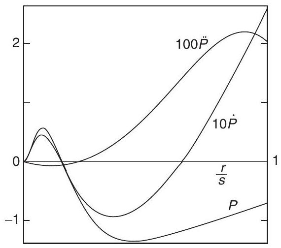
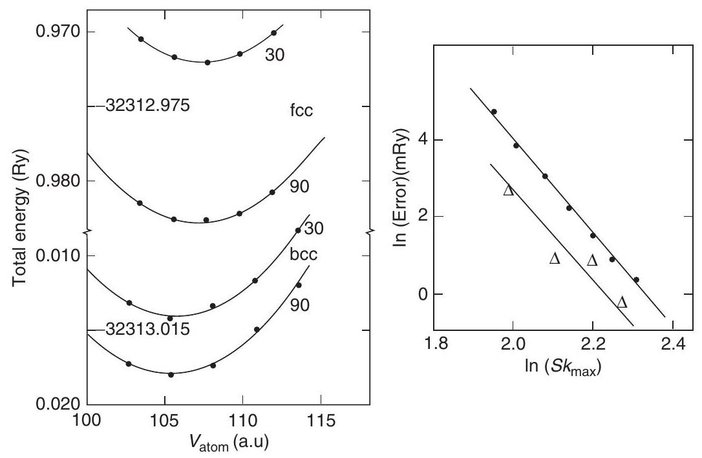
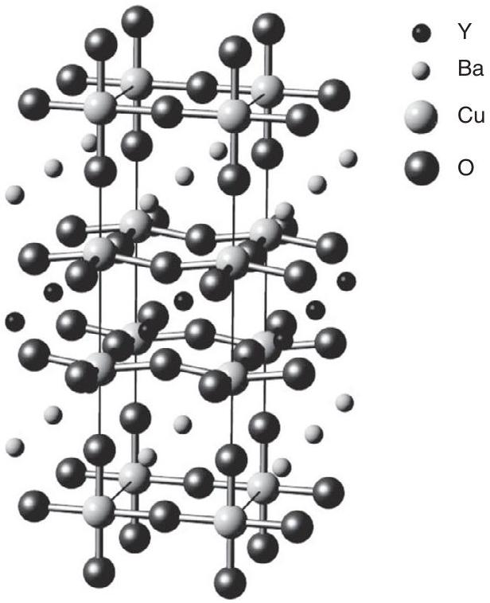
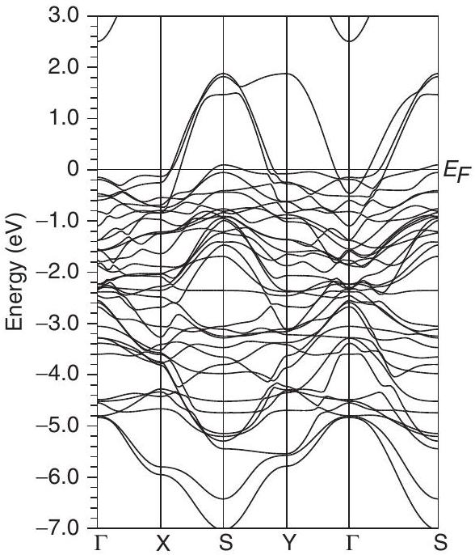
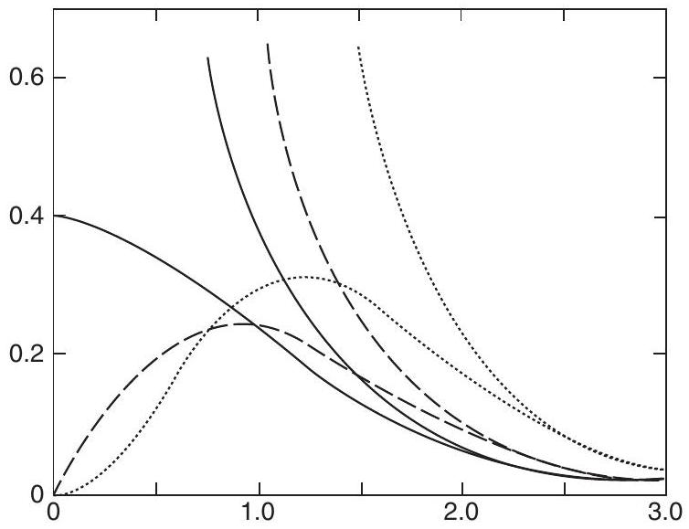
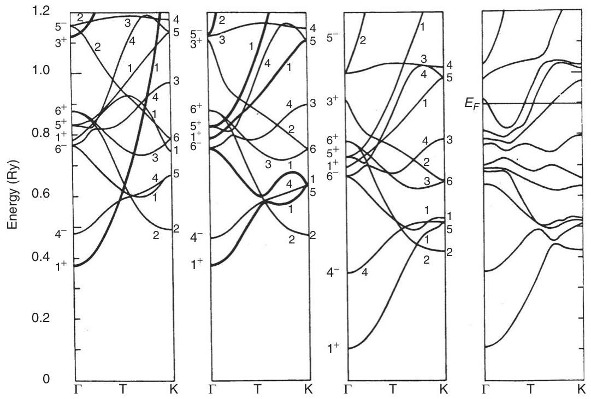
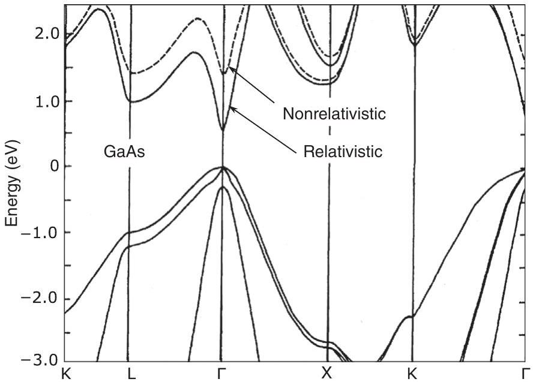
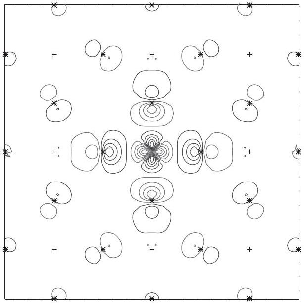
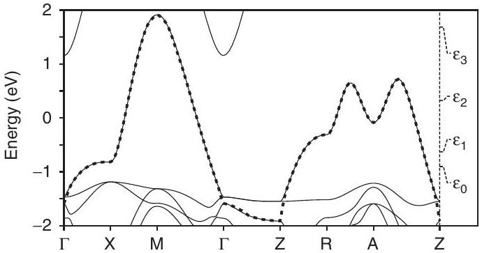

**17**

**Augmented Functions: Linear Methods**

**Abstract**

Summary The great disadvantage of augmentation is that the basis functions are energy dependent, so that matching conditions must be satisfied separately for each eigenstate at its (initially unknown) eigenenergy. This leads to nonlinear equations that make such methods much more complicated than the straightforward linear equations for the eigenvalues of the hamiltonian expressed in fixed energy-independent bases such as plane waves, atomic orbitals, gaussians, etc. Linearization is achieved by defining augmentation functions as linear combinations of a radial function $\psi\left(E_{\nu}, r\right)$ and its energy derivative $\dot{\psi}\left(E_{\nu}, r\right)$ evaluated at a chosen fixed energy $E_{\nu}$. In essence, $\psi\left(E_{\nu}, r\right)$ and $\dot{\psi}\left(E_{\nu}, r\right)$ form a basis adapted to a particular system that is suitable for calculation of all states in an energy "window." Any of the augmented methods can be written in linearized form, leading to secular equations like the familiar ones for fixed bases. The simplification has other advantages, e.g., it facilitates construction of full potential methods not feasible in the original nonlinear problem. In addition, the hamiltonian thus defined leads to linear methods that take advantage of the fact that the original problem has been reduced to a finite basis. This approach is exemplified in the LMTO method, which defines a minimal basis that both provides physical insight and quantitative tools for interpretation of electronic structure.

# 17.1 Linearization of Equations and Linear Methods

It should be emphasized from the outset that the terms "nonlinear" and "linear" have nothing to do with the fundamental linearity of quantum mechanics. Linearity of the governing differential equation, the Schrödinger equation, is at the heart of the quantum nature of electrons and any nonlinearities would have profoundly undesirable consequences. Linearization and linear methods have to do with practical matters of solving and interpreting the independent-particle Schrödinger equations.

Formulations in which the wavefunctions are expressed as linear combinations of fixed basis functions, such as plane waves, gaussians, atomic-like orbitals, etc., are manifestly linear. This leads directly to standard linear algebra eigenvalue equations, which is a great
advantage in actual calculations. Since the same basis is used for all states, it is simple to express the conditions of superposition, orthogonality, etc., and it is simple to determine many eigenfunctions together in one calculation.

Augmented methods are also linear in the fundamental sense that the wavefunctions can be expressed as linear combinations of basis functions. However, nonlinear equations for the eigenstates arise because the basis is energy dependent. This choice has great advantages, effectively representing electronic wavefunctions both near the nucleus and in the interstitial regions between the atoms. But there is a high price. The matching conditions lead to nonlinear equations due to the intrinsic energy dependence of the phase shifts that determine the scattering from the atoms. This results in greatly increased computational complexity since each eigenstate must be computed separately, as described in Chapter 16.

Linearization of nonlinear equations around selected reference energies allows the construction of operators that act in the same way as ordinary familiar linear operators, while at the same time taking advantage of the desirable attributes of the augmentation and achieving accurate solutions by choice of the energies about which the problem is linearized. The LAPW approach illustrates clearly the advantages of linearization.

Linear methods result from the same process but lead to different formulation of the problem. The resulting hamiltonian matrix is expressed in terms of the wavefunctions and their energy derivatives, which are determined from the original independent-particle Schrödinger equation. Thus this defines a hamiltonian matrix in a reduced space. Working with this derived hamiltonian leads to a class of linear methods that provide physically motivated interpretations of the electronic structure in terms of a minimal basis. This is the hallmark of the LMTO method.

In a nutshell the key idea of linearization is to work with two augmented functions, $\psi_{l}(r)$ and its energy derivative denoted by $\dot{\psi}_{l}(r)$, each calculated at the chosen reference energy. These two functions give greater degrees of freedom for the augmentation, which allow the functions to be continuous and to have continuous derivatives at the matching boundaries. However, the basis does not double in size: the energy dependence is taken into account to first order by the change of the wavefunction with energy. The wavefunction is correct to first order $\alpha(\Delta \varepsilon)$, where $\Delta \varepsilon$ is the difference of the actual energy from the chosen linearization energy; therefore, the energies are correct to $(\Delta \varepsilon)^{2}$ and variational expressions [699] are correct to $(\Delta \varepsilon)^{3}$, illustrating the " $2 n+1$ " theorem (Section D.6), which is important in actual applications. The methods can be used with any augmentation approach and have led to the widely used LAPW, LMTO, and other methods.

# 17.2 Energy Derivative of the Wavefunction: $\psi$ and $\dot{\psi}$

In this section we assume that the potential has muffin-tin form, i.e., spherically symmetric within a sphere of radius $S$ about each atom and flat in the interstitial. The equations can be generalized to non-muffin-tin potentials using the same basis functions. Initially, we consider a single spherical potential. The analysis involves radial equations exactly like those for atoms and scattering problems (Section J.1) and the analysis has useful relations to

Figure 17.1. Radial d function, $P \equiv S^{1 / 2} \psi(r)$, and energy derivatives, $\dot{P} \equiv S^{-2} \partial P / \partial E$, and $\ddot{P} \equiv S^{-4} \partial^{2} P / \partial E^{2}$, for ytterbium

the derivation of norm-conserving pseudopotentials in Section 11.4 although the application is quite different.

The goal is to sidestep the problems of the nonlinear methods of Chapter 16. Linearized methods achieve this by expanding the solution of the single-sphere Schrödinger equation in terms of $\psi_{l}(\varepsilon, r)$ belonging to one arbitrarily chosen energy, $\varepsilon=E_{v}$, i.e., ${ }^{1}$

$$
\left(-\frac{\hbar^{2}}{2 m_{e}} \frac{\mathrm{~d}^{2}}{\mathrm{~d} r^{2}}+V_{\text {sphere }}-E_{v}\right) r \psi_{l}\left(E_{v}, r\right)=0
$$

and its energy derivative

$$
\left.\dot{\psi}(\varepsilon, r) \equiv \frac{\partial}{\partial \varepsilon} \psi(\varepsilon, r)\right|_{\varepsilon=E_{v}} .
$$

If we define the derivative with respect to energy to mean a partial derivative keeping $\psi$ normalized to the same value in the sphere (even though it is not an eigenfunction at an arbitrary $E_{\nu}$ ), then it is easy to show that $\psi$ and $\dot{\psi}$ are orthogonal,

$$
\langle\psi \mid \dot{\psi}\rangle=0,
$$

so that the two functions indeed span a larger space. Furthermore, one can readily show that

$$
(\hat{H}-\varepsilon) \dot{\psi}(\varepsilon, r)=\psi(\varepsilon, r)
$$

and similar relations in Eq. (17.36) in Exercise 17.1. It is also straightforward to show that each successive energy derivative of the function $\psi(r)$ is given by simple relations like

$$
\langle\dot{\psi} \mid \dot{\psi}\rangle=-\frac{1}{3} \frac{\ddot{\psi}(S)}{\psi(S)} .
$$

The functions $\psi, \dot{\psi}$, and $\ddot{\psi}$ are illustrated in Fig. 17.1 for ytterbium [700], where it is shown that each order of derivative corresponds to a decrease in size by an order of magnitude.

[^0]The augmentation functions as a function of energy can be specified in terms of the dimensionless logarithmic derivative, which is defined as

$$
D(\varepsilon)=\left[\frac{r}{\psi(\varepsilon, r)} \frac{\mathrm{d} \psi(\varepsilon, r)}{\mathrm{d} r}\right]_{r=S} .
$$

The linear combination of $\psi$ and $\dot{\psi}$ that has logarithmic derivative D is given by

$$
\psi(D, r)=\psi(r)+\omega(D) \dot{\psi}(r)
$$

where $\omega(D)$ has dimensions of energy and is given by

$$
\omega(D)=-\frac{\psi(S)}{\dot{\psi}(S)} \frac{D-D(\psi)}{D-D(\dot{\psi})}
$$

with $D(\dot{\psi})$ denoting the logarithmic derivative of $\dot{\psi}$. If $\psi(r)$ and $\dot{\psi}(r)$ are calculated at a reference energy $E_{v}$, then Eq. (17.7) is the wavefunction to first order in the energy $E(D)-E_{\nu}$. It then follows that the variational estimate of the eigenvalue,

$$
E(D)=\frac{\langle\psi(D)| \hat{H}|\psi(D)\rangle}{\langle\psi(D) \mid \psi(D)\rangle}=E_{v}+\frac{\omega(D)}{1+\omega(D)^{2}\langle\dot{\psi}(D) \mid \dot{\psi}(D)\rangle},
$$

is correct to third order and the simpler expression $E_{v}+\omega(D)$ is correct to second order [493].

The logarithmic derivative at the sphere radius $S$ can also be expressed in a Taylor series in $E-E_{\nu}$. The first term is given by the analysis in Section 11.4, where Eq. (11.28) shows that to first order

$$
D(E)-D\left(E_{v}\right)=-\frac{m_{e}}{\hbar^{2}} \frac{1}{S \psi_{l}(S)^{2}}\left(E-E_{v}\right)
$$

where we have substituted $\psi=\phi / r$. (The factor $m_{e} / \hbar^{2}=1$ in Hartree atomic units and $m_{e} / \hbar^{2}=1 / 2$ in Rydberg units.) In deriving Eqs. (17.10) from (11.28), it is assumed that the charge $Q_{l}(S)$ in the sphere is unity. This is not essential to the logic, but it is convenient and valid in the atomic sphere approximation and is a good approximation in many cases. Higher-order expressions are given in [493] and [699] and related expressions in the pseudopotential literature in [526].

# 17.3 General Form of Linearized Equations

We are now in a position ${ }^{2}$ to define an energy-independent orbital $\chi_{j}(\mathbf{r})$ everywhere in space for a system of many spheres,

$$
\chi_{j}(\mathbf{r})=\chi_{j}^{e}(\mathbf{r})+\sum_{L, s}\left[\psi_{l, s}\left(\mathbf{r}-\tau_{s}\right) \Pi_{L s j}+\dot{\psi}_{l, s}\left(\mathbf{r}-\tau_{s}\right) \Omega_{L s j}\right] i^{l} Y_{L}\left(\widehat{\mathbf{r}-\tau_{s}}\right)
$$

where $\psi_{l, s}$ and $\dot{\psi}_{l, s}$ are the radial functions in each sphere and $\Pi$ and $\Omega$ are factors to be determined. Between the spheres the function is defined by the envelope function $\chi_{j}^{e}(\mathbf{r})$,

[^1]which is a sum of plane waves in the LAPW method. In the LMTO approach, $\chi_{j}^{e}(\mathbf{r})$ is a sum of Neumann or Hankel functions as specified in Eq. (16.36) or is proportional to $(r / S)^{-l-1}$ in the $\kappa=0$ formulation of Eq. (16.37).

The explicit form of the linearized equations depends on the choice of the envelope function, but first we can give the general form. The result is quite remarkable: because of the properties of $\psi$ and $\dot{\psi}$ expressed in Eqs. (17.3) and (17.4) (see Exercise 17.1), the form of the hamiltonian can be greatly simplified. Furthermore, the "hamiltonian" is expressed in terms of the solution for the wavefunctions; this allows a reinterpretation of the problem as a strictly linear solution of the new hamiltonian expressed as matrix elements in the reduced space of states that span an energy range around the chosen linearization energy.

For a crystal the label $s$ can be restricted to the atoms in one cell, and a basis function with Bloch symmetry can be defined at each $\mathbf{k}$ by a sum over cells $\mathbf{T}$,

$$
\psi_{L s \mathbf{k}}(\mathbf{r})=\sum_{\mathbf{T}} \mathrm{e}^{\mathrm{i} \mathbf{k} \cdot \mathbf{T}} \psi_{L s}(\mathbf{r}-\mathbf{T})
$$

and similarly for $\dot{\psi}_{L s}$, so that Eq. (17.11) becomes

$$
\chi_{j \mathbf{k}}(\mathbf{r})=\chi_{j \mathbf{k}}^{e}(\mathbf{r})+\sum_{L, s}\left[\psi_{L s \mathbf{k}}(\mathbf{r}) \Pi_{L s j}(\mathbf{k})+\dot{\psi}_{L s \mathbf{k}}(\mathbf{r}) \Omega_{L s j}(\mathbf{k})\right] i^{l} Y_{L}\left(\widehat{\mathbf{r}-\tau_{s}}\right)
$$

The wavefunction is defined by the coefficients $\Pi_{L s j}$ and $\Omega_{L s j}$ that are constructed at each $\mathbf{k}$ so that the basis function $\chi_{j \mathbf{k}}(\mathbf{r})$ satisfies the continuity conditions, with actual equations that depend on the choice of basis (see sections below). The construction of the hamiltonian $H_{i j}(\mathbf{k})$ and overlap matrices $S_{i j}(\mathbf{k})$ can be divided into the envelope part and the interior of the spheres at each $\mathbf{k}$, yielding (see Exercise 17.2)

$$
S_{i j}(\mathbf{k})=\langle i \mathbf{k} \mid j \mathbf{k}\rangle^{e}+\sum_{L, s}\left[\Pi_{L s i}^{\dagger}(\mathbf{k}) \Pi_{L s j}(\mathbf{k})+\Omega_{L s i}^{\dagger}(\mathbf{k})\left\langle\dot{\psi}_{l s} \mid \dot{\psi}_{l s}\right\rangle \Omega_{L s j}(\mathbf{k})\right]
$$

and

$$
H_{i j}(\mathbf{k})-E_{v} S_{i j}(\mathbf{k})=\langle i \mathbf{k}| H-E_{v}|j \mathbf{k}\rangle^{e}+\sum_{L, s} \Pi_{L s i}^{\dagger}(\mathbf{k}) \Omega_{L s j}(\mathbf{k})
$$

The secular equation $\sum_{j}\left[H_{i j}(\mathbf{k})-\varepsilon S_{i j}(\mathbf{k})\right] a_{j}(\mathbf{k})=0$ becomes

$$
\sum_{j}\left[\langle i \mathbf{k}| H-E_{\nu}|j \mathbf{k}\rangle^{e}+V_{i j}(\mathbf{k})-\varepsilon^{\prime} S_{i j}(\mathbf{k})\right] a_{j}(\mathbf{k})=0
$$

where $\varepsilon^{\prime}=\varepsilon-E_{\nu}$ is the energy relative to $E_{\nu} .{ }^{3}$ The potential operator acting inside the spheres is given by

$$
V_{i j}(\mathbf{k})=\frac{1}{2} \sum_{L s}\left[\Pi_{L s i}^{\dagger}(\mathbf{k}) \Omega_{L s j}(\mathbf{k})+\Pi_{L s i}(\mathbf{k}) \Omega_{L s j}^{\dagger}(\mathbf{k})\right]
$$

[^2]which has been made explicitly hermitian [709]. Note that unlike the APW operator $V^{\mathrm{APW}}$ in Eq. (16.9), there is no energy dependence in $V_{i j}(\mathbf{k})$. The linear energy dependence is absorbed into the overlap term $\varepsilon^{\prime} S_{i j}(\mathbf{k})$ in Eq. (17.16).

As promised, the resulting equations are remarkable, with the "hamiltonian" expressed in terms of $\Pi$ and $\Omega$, i.e., in terms of the wavefunctions $\psi$ and $\dot{\psi}$ calculated in the sphere at the chosen energy $E_{\nu}$. However, this is not the whole story. It would appear that the basis must be doubled in size by adding the function $\dot{\psi}$ along with each $\psi$; this is exactly what happens in the usual local orbital formulation where one possible way to improve the basis is by adding $\dot{\psi}$ to the set of basis functions. Similarly, the basis is doubled in the related "augmented spherical wave" (ASW) approach [710], which uses functions at nearby energies $\psi\left(E_{\nu}\right)$ and $\psi\left(E_{\nu}+\Delta E\right)$ instead of $\psi\left(E_{\nu}\right)$ and $\dot{\psi}\left(E_{\nu}\right)$. However, as we shall see in the following two sections, there is a relation between $\Pi$ and $\Omega$ provided by the boundary conditions. Therefore, it will turn out that the basis does not double in size, but nevertheless the wavefunction is correct to linear order in $\varepsilon-E_{\nu}$. Thus errors in the energy are $\propto\left(\varepsilon-E_{v}\right),{ }^{2}$ and variational estimates of the energy ([699], Section 3.5) are accurate to $\propto\left(\varepsilon-E_{\nu}\right),{ }^{3}$ an example of the " $2 n+1$ " theorem, Section D.6.

# 17.4 Linearized Augmented Plane Waves (LAPWs)

If we choose a plane wave for the envelope function, we obtain the LAPW method [709] (see also [711-715]). The quantum label $j$ becomes a reciprocal lattice vector $\mathbf{G}_{m}$ and the form of Eq. (16.2) for an APW can be adapted

$$
\chi_{\mathbf{k}+\mathbf{G}_{m}}^{\mathrm{LAPW}}(\mathbf{r})= \begin{cases}\exp \left(\mathrm{i}\left(\mathbf{k}+\mathbf{G}_{m}\right) \cdot \mathbf{r}\right), & r>S, \\ \sum_{L s} C_{L s}\left(\mathbf{k}+\mathbf{G}_{m}\right) \psi_{L s}\left(D_{l s\left|\mathbf{K}_{m}\right|}, \mathbf{r}\right) i^{l} Y_{L}\left(\widehat{\mathbf{r}-\tau_{s}}\right), & r<S,\end{cases}
$$

where $s$ denotes the site in the unit cell, $L \equiv l, m_{l}, \mathbf{K}_{m} \equiv \mathbf{k}+\mathbf{G}_{m}$. The solution inside the sphere of radius $S_{s}$ is fixed by matching the plane wave, requiring the function to be continuous and have continuous first derivative. This boundary condition leads to $\psi_{l s}\left(D_{l s\left|\mathbf{K}_{m}\right|}, \mathbf{r}\right)$ as a combination of $\psi_{l s}$ and $\dot{\psi}_{l s}$ as given below. It is this step that includes energy dependence to first order without increasing the size of the basis.

Since the expansion of the plane wave is given by Eq. (J.1), this is accomplished if the logarithmic derivative is the same as for the plane wave,

$$
D_{l s K}=\left[x \frac{j_{l}^{\prime}(x)}{j_{l}(x)}\right]_{x=K S_{s}}
$$

which fixes the solution inside the sphere $s$ for a given $L$ and $\mathbf{K}$ to be given by (see Eq. (17.7))

$$
\psi_{l s}\left(D_{l s K}, r\right)=\psi_{l s}(r)+\omega_{l s K} \dot{\psi}_{l s}(r)
$$

and the total solution in the sphere is given by Eq. (16.5) with

$$
j_{l}\left(K_{m} r\right) \rightarrow \frac{j_{l}\left(K_{m} S_{s}\right)}{\psi_{l s}\left(D_{l s K}, S_{s}\right)} \psi_{l s}\left(D_{l s K}, r\right)[] *[]
$$

Thus coefficients $\Pi$ and $\Omega$ are given by

$$
\Pi_{L s \mathbf{G}_{m}}(\mathbf{k})=4 \pi \mathrm{e}^{\mathrm{i} \mathbf{K}_{m} \cdot \tau_{s}} \frac{j_{l}\left(K_{m} S_{s}\right)}{\psi_{l s}\left(D_{l s} K_{m}, S_{s}\right)} Y_{L}\left(\hat{K}_{m}\right)
$$

and

$$
\Omega_{L s \mathbf{G}_{m}}(\mathbf{k})=\Pi_{L s \mathbf{G}_{m}}(\mathbf{k}) \omega_{l s G_{m}},
$$

where $\mathbf{K}_{m}=\mathbf{k}+\mathbf{G}_{m}$ and $K_{m}=\left|\mathbf{K}_{m}\right|$.
The resulting equations have exactly the same form as the APW equations Eqs. (16.9) and (16.10), with the addition of the overlap term and the simplification that the operator $V_{\mathbf{G}^{\prime}, \mathbf{G}}^{\mathrm{LAPW}}(\mathbf{k})$ is independent of energy. The explicit kinetic energy terms are the same as in Eq. (16.9), which is energy independent. The remaining terms in the secular equation, (17.16), involving $\Pi, \Omega$, and the overlap can be used conveniently in actual calculations [709] in the form given in Eqs. (17.14)-(17.16) with relations Eqs. (17.21) and (17.22). The expressions can also be transformed into a form for $V_{\mathbf{G}^{\prime}, \mathbf{G}}^{\mathrm{LAPW}}(\mathbf{k})$ that is very similar to the APW expression (16.10), with additional terms but with no energy dependence [157, 673].

Major advantages of the LAPW method are its general applicability for different materials and structures, its high accuracy, and the relative ease with which it can treat a general potential (Section 17.10). Disadvantages are increased difficulty compared to plane wave pseudopotential methods (so that it is more difficult to develop techniques such as Car-Parrinello simulations based on the LAPW method) and the fact that a large basis set is required compared to KKR and LMTO methods (so that it is more difficult to extract the simple physical interpretations than for those methods).

## 17.4.1 More on the LAPW Basis

How large is the basis required in realistic LAPW calculations? A general idea can be derived from simple reasoning [709]. The number of plane waves, chosen to have wavevector $G<G_{\text {max }}$, is expected to be comparable to pseudopotential calculation for materials without d and f electrons (since the rapidly varying part of the d and f states are taken care of by the radial functions), e.g., $\approx 100$ plane waves/atom, typical for highquality pseudopotential calculations on Si (see also Section 16.2). The size of the basis is somewhat larger than for the APW since each function is continuous in value and slope. The expansion in angular harmonics is then fixed by the requirement that the plane waves continue smoothly into the sphere of radius $S$ : since a $Y_{l m}$ has $2 l$ zeros around the sphere, an expansion up to $l_{\text {max }}$ can provide resolution $\approx 2 \pi S / l_{\text {max }}$ in real space or a maximum wavevector $\approx l_{\text {max }} / S$. Thus, in order for the angular momentum expansion to match smoothly onto plane waves up to the cutoff $G_{\text {max }}$, one needs $l_{\text {max }} \approx S G_{\text {max }}$, which finally results in $l_{\max } \approx 8$ (see Exercise 17.3) and larger for accurate calculations in complex cases [709, 716].

# 17.5 Applications of the LAPW Method

The LAPW method, including the full-potential generalization of Section 17.10, is the most accurate and general method for electronic structure at the present time. It is the benchmark for other methods, e.g., in the comparison of many methods in [406]. The calculations can be done for structures of arbitrary symmetry with no bias if the basis is extended to convergence. Extensive tests of convergence are illustrated in Fig. 17.2 taken from the work of Jansen and Freeman [717] in the early development of the full-potential LAPW method. The figure shows the total energy of W in the bcc and fcc crystal structures as a function of volume. The total energy is $\approx-16,156 \mathrm{Ha}$ and the energy is converged to less than 0.001 Ha , including the basis set convergence and integration over the BZ. On the righthand side of Fig. 17.2 is shown the convergence as a function of plane wave cutoff $k_{\text {max }}$ plotted on a logarithmic scale.

However, the generality and accuracy of LAPW comes at a price: there is a large basis set of plane waves and high angular momentum functions, which in turn means that the potentials must be represented accurately (to twice the cutoffs in wavevectors and angular moments used for the wavefunctions) as described in Section 17.10. Other methods are faster, in which case LAPW calculations can serve as a check. Other methods are much more adaptable for generation of new developments that are the subject of Part V, Chapters 18-19. In fact all the developments of quantum molecular dynamics, polarization and localization, excitations, and $\mathrm{O}(N)$ methods were stimulated by other approaches and have been adapted to LAPW in only a few cases.

Figure 17.2 Full-potential LAPW calculations of the total energy of W in bcc and fcc structures. Note the break in the vertical scale. The two curves for each structure denote integrations over the irreducible BZ with 30 and 90 points, respectively. The absolute value of the energy is given in the figure on the left. On the right is shown the convergence with plane wave cutoff $S k_{\max }$, where $S$ is the radius of the muffin-tin sphere. From [717].

Examples of total energies and bands have already been shown in Chapter 2. One is the energy versus displacement for the unstable optic mode that leads to the ferroelectric distortion in $\mathrm{BaTiO}_{3}$ shown in Fig. 2.10. The LAPW results [169] are the standard to which the other calculations are compared for this relatively simple structure. As shown in Fig. 2.10, local orbital pseudopotential methods (and also plane wave calculations) give nearly the same results when done carefully. When using a pseudopotential, it has been found to be essential to treat the Ba semicore states as valence states for accurate calculations. Figure 2.10 also shows the phonons for Mo and Nb and the instability that occurs in Zr. LAPW is the benchmark for the equation of state of Fe at high pressure shown in Fig. 2.13. Another example is the DOS for ferromagnetic Fe shown in Fig. 14.10, where it is compared to tight-binding fit to the LAPW bands.

Perhaps the most important class of application in which the LAPW approach is particularly adapted are compounds involving transition metals and rare earth elements. Understanding many properties of these interesting materials often involves small energy differences due to magnetic order and/or lattice distortions. Linearization simplifies the problem so that one can use full-potential methods with no shape approximations. Since the LAPW approach describes the wavefunctions with unbiased spherical and plane waves, it is often the method of choice.

Perhaps the best example are the bands and total energies for the high-temperature superconductors [716]. For example, the structure of $\mathrm{YBa}_{2} \mathrm{Cu}_{3} \mathrm{O}_{7}$ is shown in Fig. 17.3.

Figure 17.3. Crystal structure of $\mathrm{YBa}_{2} \mathrm{Cu}_{3} \mathrm{O}_{7}$ showing two $\mathrm{CuO}_{2}$ planes that form a double layer sandwiching the Y atoms, the CuO chain, and the two Ba-O layers per cell. The orthorhombic BZ is shown with the $y$-direction along the chain axis. Other high-temperature superconductors have related structures all involving $\mathrm{CuO}_{2}$ planes. Provided by W. Pickett; similar to fig. 6 in [716]

Figure 17.4. Band structure of $\mathrm{YBa}_{2} \mathrm{Cu}_{3} \mathrm{O}_{7}$ computed using the LAPW method [719]. Other calculations [716] with various methods give essentially the same results. The band that protrudes upward from the "spaghetti" of other bands is the antibonding (out-of-phase) $\mathrm{Cu}-\mathrm{O}$ band that is mainly O 2p in character. Simple counting of electrons (Exercise 17.8) shows that the highest band has one missing electron per Cu , leading to the Fermi level in the band, as shown. Provided by W. Pickett; similar to Fig. 25 in [716]

There are two $\mathrm{CuO}_{2}$ planes that form a double layer sandwiching the Y atoms, one CuO chain, and two Ba-O layers per cell. The structure must be optimized with respect to all the degrees of freedom and three independent cell parameters. The O atoms in the planes are not exactly in the same plane as the Cu atoms and the "dimpling" has significant effects on the bands. The process of energy minimization with respect to the atomic positions leads to comparison with experiment, including phonon energies that are found to be in very good agreement with experiment, e.g., for $\mathrm{YBa}_{2} \mathrm{Cu}_{3} \mathrm{O}_{7}$ in [718].

Figure 17.4, as an example, shows one of the host of calculations [716] that have led to similar conclusions. The most important conclusion is that the states near the Fermi energy are primarily the one simple band made up of states that involve the $\mathrm{Cu} \mathrm{d}_{x^{2}-y^{2}}$ and O p states in an antibonding combination. The number of electrons is just enough to almost fill the bands, and there is one hole per Cu atom in the band that crosses the Fermi energy (Exercise 17.8). The properties of this band on a square lattice representing one plane have been emphasized in Section 14.9 and a quantitative description of this band, disentangled from the rest, is given later in Figs. 17.8 and 17.9.

Thus the Kohn-Sham equations indicate which states are important at the Fermi energy. Yet there is a fundamental failure of the simplest forms of density functional theory, i.e., the LDA and GGA approximations. Experimentally the CuO systems with one hole per Cu are antiferromagnetic insulators, not metals with half-filled bands. It is far beyond the subject of this book to attempt to summarize all the issues. Let it suffice to say that it appears to be
essential to describe both nonlocal exchange (which can be done in Hartree-Fock or exact exchange methods (Chapter 9) and correlation among the electrons in the band near the Fermi energy.

# 17.6 Linear Muffin-Tin Orbital (LMTO) Method

The LMTO method [699, 700] builds on the properties of muffin-tin orbitals, which have been defined in Section 16.5 in terms of the energy $\varepsilon$ and the decay constant $\kappa$ that characterizes the envelope function. For a fixed value of $\kappa$ an LMTO basis function inside a sphere is defined to be a linear combination of $\psi(\varepsilon, r)$ and $\dot{\psi}(\varepsilon, r)$ evaluated at the energy $\varepsilon=E_{\nu}$ as in Eq. (17.11). The differences from an MTO defined in Eq. (16.36) are as follows: (1) inside the "head sphere" in which a given LMTO is centered, it is a linear combination of $\psi_{l}\left(E_{\nu}, r\right)$ and $\dot{\psi}_{l}\left(E_{\nu}, r\right)$; and (2) the tail in other spheres is replaced by a combination of $\dot{\psi}_{l}\left(E_{\nu}, r\right)$. The form of an LMTO can be expressed in a very intuitive and compact form by defining functions $J_{l}$ and $N_{l}$, which play a role analogous to the Bessel and Neumann functions $j_{l}$ and $n_{l}$ in Eq. (16.36):

$$
\chi_{L}^{\mathrm{LMTO}}(\varepsilon, \kappa, \mathbf{r})=i^{l} Y_{L}(\hat{\mathbf{r}}) \begin{cases}\psi_{l}(\varepsilon, r)+\kappa \cot \left(\eta_{l}(\varepsilon)\right) J_{l}(\kappa r), & r<S, \\ \kappa N_{l}(\kappa r), & r>S .\end{cases}
$$

The form of $J_{l}$ is fixed by the requirement that the energy derivative of $\chi_{L}^{\text {LMTO }}$ vanishes at $\varepsilon=E_{\nu}$ for $r \leq S$,

$$
\frac{\mathrm{d}}{\mathrm{~d} \varepsilon} \chi_{L}^{\mathrm{LMTO}}(\varepsilon, \kappa, \mathbf{r})=i^{l} Y_{L}(\hat{r})\left[\dot{\psi}_{l}(\varepsilon, r)+\kappa \frac{\mathrm{d}}{\mathrm{~d} \varepsilon} \cot \left(\eta_{l}(\varepsilon)\right) J_{l}(\kappa, r)\right]=0
$$

which leads to (Exercise 17.4)

$$
J_{l}(\kappa r)=-\frac{\dot{\psi}_{l}\left(E_{\nu}, r\right)}{\kappa \frac{\mathrm{d}}{\mathrm{~d} \varepsilon} \cot \left(\eta_{l}\left(E_{\nu}\right)\right)}, \quad r \leq S .
$$

This defines an energy-independent LMTO basis function $\chi_{L}^{\mathrm{LMTO}}\left(E_{\nu}, \kappa, \mathbf{r}\right)$ inside the sphere, given by the first line of Eq. (17.23) with $\varepsilon=E_{\nu}$.

The augmented Neumann functions $N_{L}$ can be defined as the usual $n_{l}$ in the interstitial, with the tails in other spheres given by the same expansion as in Eq. (16.36) with $n_{l} \rightarrow N_{l}$ and $j_{l} \rightarrow J_{l}$,

$$
N_{L}(\kappa, \mathbf{r}-\mathbf{R})=4 \pi \sum_{L^{\prime}, L^{\prime \prime}} C_{L L^{\prime} L^{\prime \prime}} n_{L^{\prime \prime}}^{*}\left(\kappa, \mathbf{R}-\mathbf{R}^{\prime}\right) J_{L^{\prime}}\left(\kappa, \mathbf{r}-\mathbf{R}^{\prime}\right),
$$

where $N_{L}(\kappa, \mathbf{r}) \equiv i^{l} Y_{L}(\hat{\mathbf{r}}) N_{l}(\kappa r)$, etc. Thus an LMTO is a linear combination of $\psi$ and $\dot{\psi}$ in the central sphere, which continues smoothly into the interstitial region and joins smoothly to $\dot{\psi}$ in each neighboring sphere.

If we chose $\kappa=0$ for the orbital in the interstitial region, as was done for an MTO in Section 16.6, then the expressions can be simplified in a way analogous to Eq. (16.41).

The wavefunction inside the sphere is chosen to match the solution $\alpha(r / S)^{-l-1}$ in the interstitial; this is accomplished for $r<S$ by choosing the radial wavefunction with $D=-l-1$ as defined in Eq. (17.7), i.e., $\psi_{l}(D=-l-1, r) \equiv \psi_{l-}(r)$. In turn this can be expressed in terms of $\psi$ and $\dot{\psi}$ at a chosen reference energy together with $\omega$ from Eq. (17.8). The tails from other spheres continued into the central sphere must replace the tail $\propto(r / S)^{l}$ keeping the same logarithmic derivative, i.e., $(r / S)^{l} \rightarrow \psi_{l}(D=l, r) \equiv \psi_{l+}(r)$ with the proper normalization. The result is

$$
\chi_{L, \mathbf{k}}^{\mathrm{LMTO}}(\mathbf{r})=\frac{\psi_{L-}(\mathbf{r})}{\psi_{l-}(S)}-\frac{1}{\psi_{l+}(S)} \sum_{L^{\prime}} \psi_{L^{\prime}+}(\mathbf{r}) \frac{1}{2\left(2 l^{\prime}+1\right)} S_{L L^{\prime}}(\mathbf{k})
$$

This defines an energy-independent LMTO orbital, along with the continuation into the interstitial region. The orbital itself contains effects of the neighbors through the structure constants and through a second effect, the requirement on the logarithmic derivative $D=-l-1$ in the first term needed to make the wavefunction continuous and have continuous slope. Thus the orbital contains the tail cancellation to lowest order and the energy dependence to linear order has been incorporated into the definition of the LMTO basis function.

The LMTO method then finds the final eigenvalues using the LMTO basis and a variational expression with the full hamiltonian. This has many advantages: the energy is thus accurate to second order (and third order using appropriate expressions [699]) and the equations extend directly to full-potential methods. This is analogous to the expression for a single sphere and is accomplished by solving the eigenvalue equation,

$$
\left.\operatorname{det}|\langle\mathbf{k} L| \hat{H}| \mathbf{k} L^{\prime}\right\rangle-\varepsilon\left\langle\mathbf{k} L \mid \mathbf{k} L^{\prime}\right\rangle \mid=0,
$$

by standard methods. It is clear from the form of Eq. (17.26) that the matrix elements of the hamiltonian and overlap will be expressed as a sum of one-, two- and three-center terms, respectively, involving the structure constants to powers 0,1 , and 2 . The expressions can be put in a rather compact form after algebraic manipulation, and we will only quote results [157, 699]. Here we consider only a muffin-tin potential, which simplifies the expressions. If we define $\omega_{l-}=\omega_{l}(-l-1), \omega_{l+}=\omega_{l}(l), \Delta_{l}=\omega_{l+}-\omega_{l-}$, and $\tilde{\psi}_{l}=\psi_{l-} \sqrt{(S / 2)}$, then the expression for $\chi_{j \mathbf{k}}(\mathbf{r})$ in Eq. (17.13) can be specified by

$$
\Pi_{L L^{\prime \prime}}(\mathbf{k})=\tilde{\psi}_{l}^{-1} \delta_{L L^{\prime \prime}}+\frac{\tilde{\psi}_{l^{\prime \prime}}}{\Delta_{l^{\prime \prime}}} S_{L L^{\prime \prime}}(\mathbf{k})
$$

and

$$
\Omega_{L L^{\prime \prime}}(\mathbf{k})=\omega_{l^{\prime \prime}}-\tilde{\psi}_{l}^{-1} \delta_{L L^{\prime \prime}}+\frac{\tilde{\psi}_{l^{\prime \prime}}}{\Delta_{l^{\prime \prime}}} \omega_{l^{\prime \prime}}+S_{L L^{\prime \prime}}(\mathbf{k})
$$

The expressions for the matrix elements are, in general, complicated since they involve the interstitial region, but the main points can be seen by considering only the atomic sphere approximation (ASA) as used in Section 16.6 in which the interstitial region is eliminated. Also the equations are simplified if the linearization energy $E_{\nu}$ is set to zero, i.e., the energy
$\varepsilon$ is relative to $E_{\nu}$; this is always possible and it is straightforward to allow $E_{\nu}$ to depend on $l$ as a diagonal shift for each $l$. The resulting expressions have simple forms [157,699]

$$
\begin{aligned}
\langle L \mathbf{k}| H\left|\mathbf{k} L^{\prime}\right\rangle= & \frac{\omega_{l-}}{\tilde{\psi}_{l}^{2}} \delta_{L L^{\prime}}+\left[\frac{\omega_{l+}}{\Delta_{l}}+\frac{\omega_{l^{\prime}+}}{\Delta_{l^{\prime}}}\right] S_{L L^{\prime}}(\mathbf{k}) \\
& +\sum_{L^{\prime \prime}} S_{L L^{\prime \prime}}(\mathbf{k})\left[\tilde{\psi}_{l^{\prime \prime}}^{2} \frac{\omega_{l^{\prime \prime}+}}{\Delta_{l^{\prime \prime}}^{2}}\right] S_{L^{\prime \prime} L^{\prime}}(\mathbf{k})
\end{aligned}
$$

and

$$
\begin{aligned}
\left\langle\mathbf{k} L \mid \mathbf{k} L^{\prime}\right\rangle= & \left\{\left(1+\omega_{-}^{2}\left\langle\dot{\psi}^{2}\right\rangle\right) / \tilde{\psi}^{2}\right\}_{l} \delta_{L L^{\prime}} \\
& +\left\{\left\{\left(1+\omega_{+} \omega_{-}\left\langle\dot{\psi}^{2}\right\rangle\right) / \Delta\right\}_{l}+\{\cdots\}_{l^{\prime}}\right\} S_{L L^{\prime}}^{k} \\
& +\sum_{L^{\prime \prime}} S_{L L^{\prime \prime}}^{k}\left[\tilde{\psi}^{2}\left(1+\omega_{+}^{2}\left\langle\dot{\psi}^{2}\right\rangle\right) / \Delta^{2}\right]_{l^{\prime \prime}} S_{L^{\prime \prime} L^{\prime}}^{k}
\end{aligned}
$$

The terms involving $\delta_{L L^{\prime}}$ are one-center terms (which are diagonal in $L$ for spherical potentials); terms with one factor of $S_{L L^{\prime \prime}}$ are two center; and those with two factors are three-center terms. The hamiltonian has the interpretation that the on-site terms involve the energy $\omega_{l-}=\omega_{l}(-l-1)$ of the state with $D=-l-1$, whereas all terms due to the tails involve the energy $\omega_{l+}=\omega_{l}(l)$ for the state with $D=l$. Similarly, the overlap terms involve $\left\langle\dot{\psi}^{2}\right\rangle$ and combinations of $\omega_{+}$and $\omega_{-}$.

Thus, within the ASA the LMTO equations have very simple structure, with each term in Eqs. (17.30) and (17.31) readily calculated from the wavefunctions in the atomic sphere. Within this approximation, the method is extremely fast, and the goal has been reached of a minimal basis that is accurate. Only wavefunctions with $l$ corresponding to the actual electronic states involved are needed. This is in contrast to the LAPW method where one needs high $l$ in order to match the spherical and plane waves at the sphere boundary. Furthermore, the interstitial region and a full potential can be included; the same basis is used but the expressions for matrix elements are more cumbersome. The size of the basis is still minimal and the method is very efficient.

There is a price, however, for this speed and efficiency. The interstitial region is not treated accurately since the LMTO basis functions are single inverse powers or Hankel or Neumann functions as in Eq. (17.23). Open structures can be treated only with correction terms or by using "empty spheres." The latter are useful in static, symmetric structures, but the choice of empty spheres is problematic in general cases, especially if the atoms move. Finally, there is no "knob" to turn to achieve full convergence as there is in the LAPW method. Thus the approximations in the LMTO approach are difficult to control and care is needed to ensure robust results.

## 17.6.1 Improved Description of the Interstitial in LMTO Approaches

One of the greatest problems with the LMTO approach, as presented so far, is the approximate treatment of the interstitial region. The use of a single, energy-independent
tail outside each sphere was justified in the atomic sphere approximation (Fig. 16.9) where the distances between spheres is very small (and in the model the interstitial is nonexistent). This approximation fails for open structures where the interstitial region is large, e.g., in the diamond structure, and applications of the LMTO method depend on tricks like the introduction of empty spheres [702, 703]. This can be done for high-symmetry structures, but the method cannot deal with cases like the changing structures that occur in a simulation.

An alternative approach is to generalize the form of the envelope function, generalizing the single Hankel or power law function given in Eqs. (16.37), (16.36), or (17.23). One approach is to work with multiple Hankel functions with different decay constants $\kappa_{i}$ that can better describe the interstitial region and yet keep the desirable features of Hankel functions [720, 721]. Using this approach, a full-potential LMTO method has been proposed [722] that combines features of the LMTO, LAPW, and PAW approaches. Like the LAPW it has multiple functions outside the spheres, but many fewer functions. Like the PAW method, the smooth functions are continued inside the sphere where additional functions are included as a form of "additive augmentation."

The form of the basis function proposed is an "augmented smooth Hankel function." In Eq. (17.23), the tail of the LMTO function is a Neumann function, which at negative energy (imaginary $\kappa$ ) becomes a Hankel function, which is the solution of

$$
\left(\nabla^{2}+\kappa^{2}\right) h_{0}(\mathbf{r})=-4 \pi \delta(\mathbf{r}) .
$$

This function decays as $i^{-l} \mathrm{e}^{-|\kappa| r} /|\kappa| r$ at large $r$ and it diverges at small $r$ as illustrated in Fig. 17.5. The part inside the sphere is not used in the usual LMTO approach and it makes the function unsuitable for continuation in the sphere. Methfessel and van Schilfgaarde [722] instead defined a "smooth Hankel function" that is a solution of

$$
\left(\nabla^{2}+\kappa^{2}\right) \tilde{h}_{0}(\mathbf{r})=-4 \pi g(\mathbf{r}) .
$$

Figure 17.5. Comparison of standard and "smooth" Hankel functions for $l=0$ (solid lines), $l=1$ (dashed), and $l=2$ (dotted) for the case $\kappa=i$ and the smoothing radius $R_{S m}=1.0$ in the gaussian. From [722].

If $g(\mathbf{r})$ is chosen to be a gaussian, $g(\mathbf{r}) \propto \exp \left(r^{2} / R_{s m}^{2}\right)$, then $\tilde{h}_{0}(\mathbf{r})$ is a convolution of a gaussian and a Hankel function. It has the smooth form shown in Fig. 17.5 and has many desirable features of both functions, including analytic formulas for two-center integrals and an expansion theorem. It is proposed that the form of the smooth function near the muffintin radius more closely resembles the true function than the Hankel function, and that the sum of a small number of such functions can be a good representation of the wavefunctions in the interstitial region [722].

# 17.7 Tight-Binding Formulation

It has been pointed out in Section 16.7 that the MTO approach provides a localized basis and tight-binding-type expressions for the Kohn-Sham equations. With a unitary transformation that is equivalent to "screening of electrostatic multipoles," one can transform to a compact short-range form [701]. The transformation applies in exactly the same way in the LMTO approach since it depends only on the form of the envelope function outside the sphere. The matrix elements between different MTOs decrease as $R^{-\left(l+l^{\prime}+1\right)}$, which leads to shortrange interactions for large $l$. Matrix elements for $l+l^{\prime}=0,1$, or 3 can be dealt with by suitable transformations [701].

There are two new features provided by linearization. Most important, the linear equations have the same form as the usual secular equations so that all the apparatus for linear equations can be applied. Second, transformation of the equations leads to very simple expressions for the on-site terms and coupling between sites in terms of $\psi$ and $\dot{\psi}$. The shortrange LMTO is the $\psi$ function in one sphere coupled continuously to the tails in neighboring spheres, which are $\dot{\psi}$ functions. This provides an orthonormal minimal basis tight-binding formulation in which there are only two-center terms, with all hamiltonian matrix elements determined from the underlying Kohn-Sham differential equation. The disadvantage is that all the terms are highly environment dependent, i.e., each matrix element depends in detail on the type and position of the neighboring atoms.

This ab initio tight-binding method is now widely used for many problems in electronic structure. Because the essential calculations are done in atomic spheres, determination of the matrix elements can be done very efficiently. Combination of the recursion method (Section 18.4) and the tight-binding LMTO [701] provides a powerful method for densityfunctional calculations for complex systems and topologically disordered matter [724, 725]. For example, in Fig. 18.3 is shown the electronic density of states of liquid Fe and Co determined using tight-binding LMTO and recursion [726]. The calculations were done on 600 atom cells with atomic positions, representing a liquid structure generated by classical Monte Carlo and empirical interatomic potentials. Such approaches have been applied to many problems in alloys, magnetic systems, and other complex structures.

# 17.8 Applications of the LMTO Method

In its simplest form, the LMTO method can be very effective and informative in addition to providing quantitative results. An example is the calculation of the equation of state,
equilibrium volume, and bulk moduli. It is a great advantage to calculate the pressure directly using the formulas valid in the ASA given in Section I.3. The equilibrium volume per atom $\Omega$ is the volume for which the pressure $P=0$, and the bulk modulus is the slope $B=-\mathrm{d} P / \mathrm{d} \Omega$. The results for 4 d and 5 d transition metals [498] compare well with the calculations using the KKR method presented in Fig. 2.2. The results are quite impressive and show the way that important properties of solids can be captured in simple calculations with appropriate interpretation.

Band structures of materials with d and f bands often are a jumble of lines like a plate of spaghetti. A helpful way to understand the complicated structure is the progression of energy bands from the simplest unhybridized "canonical" form to the full calculation. Figure 17.6 shows this progression for hcp Os along one line in the BZ from unhybridized canonical bands on the left to fully hybridized relativistic bands on the right.

Although MTOs were originally designed for close-packed metals, the methods can be applied to materials with open structures. By including empty spheres [702, 703] the structure becomes effectively close packed and accurate calculations can be done with only a few basis functions per empty sphere. An example is the calculation of Wannier functions [728] described in Section 23.2 and band offsets of semiconductor structures [729, 730]. As an example of band structure calculations, Fig. 17.7 shows calculations for GaAs LMTO illustrating the large effects of relativity and core relaxation, and spin-orbit interaction [727]. The same work also considered only the scalar relativistic level and showed that

Figure 17.6. Development of the band structure of hcp Os in the LMTO method. From left to right: non-relativistic "canonical" (Section 16.6) bands neglecting hybridization of d and s, p bands (shown dark); including hybridization (with dark lines indicating the most affected bands); relativistic bands without spin orbit; fully relativistic bands. From [498]; original calculations in [723].

Figure 17.7. Fully relativistic band structure of GaAs (solid lines) calculated using the local density approximation (LDA) and the LMTO method [727]. Dashed line in the conduction band calculated with no relativistic effects. The difference shows the large scalar relativistic effect that lowers the $s$ states in the conduction band. The spin-orbit interaction is evident at the top of the valence band. From [727].

the results are the same as using a pseudopotential. In addition it was the first work to show that Ge is a metal in the LDA! (See Fig. 2.23 and related discussion.)

An example that illustrates many different features of the LMTO approach is the work of Duthi and Pettifor [731], which provided a simple explanation for the sequence of structures observed in the series of rare earths elements. The energy differences are very small and the authors used the expressions (I.7) in terms of the difference of the sum of eigenvalues, together with the tight-binding form of LMTO and the recursion method (Section M. 5 and [732]). Stabilization results from filling of the d bonding states which is an example of the Friedel argument [733], but it took the combination of ideas in [731] to sort out the way in which bonding varies with structure.

# 17.9 Beyond Linear Methods: NMTO

Later developments in MTO methods show how approximations that were introduced during development of the LMTO approach can be overcome. The NMTO approach [734, 735] provides a more consistent formalism, treats the interstitial region accurately, and goes beyond the linear approximation.

In the MTO and LMTO approaches, energy-independent orbitals were generated using the approximation of a fixed $\kappa$ in the envelope function that describes the interstitial region. This breaks the relation of $\kappa$ and the eigenvalue that causes nonlinearities in the KKR method. However, it also is an approximation that is justified only in close-packed solids. In contrast, the wavefunction inside the sphere is treated more accurately through
linearization. The NMTO method treats the sphere and interstitial equally by working with MTO-type functions $\psi_{L}\left(E_{n}, \mathbf{r}-\mathbf{R}\right)$ localized around site $\mathbf{R}$ and calculated at fixed energies $E_{n}$ both inside the sphere and in the interstitial (assumed to have a flat muffin-tin potential). The NMTO basis function is then defined to be a linear combination of $N$, such functions evaluate at $N$ energies,

$$
\chi_{\mathbf{R} L}^{\mathrm{NMTO}}(\varepsilon \mathbf{r})=\sum_{n=0}^{N} \sum_{\mathbf{R}^{\prime} L^{\prime}} \psi_{L^{\prime}}\left(E_{n}, \mathbf{r}-\mathbf{R}^{\prime}\right) L_{n L^{\prime} \mathbf{R}^{\prime}, L \mathbf{R}}^{N}(\varepsilon, \mathbf{r}),
$$

where $L_{n}^{N}(\varepsilon)$ is the transformation matrix that includes the idea of screening (mixing states on different sites) and a linear combination of states evaluated at $N$ fixed energies.

As it stands, the NMTO function is energy dependent and appears to be merely a way to expand the basis. However, Andersen and coworkers [734, 735] have shown a way of generating energy-independent functions $\chi_{\mathbf{R} L}^{\text {NMTO }}(\mathbf{r})$ using a polynomial approximation so that the Schrödinger equation is solved exactly at the $N$ chosen energies. The ideas are a generalization of the transformation given in Section 11.9, which were chosen to give the correct phase shifts at an arbitrary set of energies. The basic ideas can be understood, following the steps in Exercise 11.12, where the exact transformation, Eq. (11.47), is easily derived. In the present case, the transformation is more general, mixing states of different angular momenta on different sites as indicated in Eq. (17.34). The result of the transformation is that each eigenfunction is accurate to order $\left(\varepsilon-E_{0}\right)\left(\varepsilon-E_{1}\right) \cdots\left(\varepsilon-E_{N}\right)$ and the eigenvalue to order $\left(\varepsilon-E_{0}\right)^{2}\left(\varepsilon-E_{1}\right)^{2} \cdots\left(\varepsilon-E_{N}\right)^{2}$.

As an illustration of the NMTO approach, Fig. 17.8 shows the $\mathrm{d}_{x^{2}-y^{2}}$ orbital centered on a Cu atom in $\mathrm{YBa}_{2} \mathrm{Cu}_{3} \mathrm{O}_{7}$. This orbital is not unique; it is chosen to represent the mixed $\mathrm{Cu}-\mathrm{O}$ band that crosses the Fermi level, as shown in Fig. 17.4. Note that the state centered

Figure 17.8. Orbital of $\mathrm{d}_{x^{2}-y^{2}}$ symmetry centered on a Cu atom in $\mathrm{YBa}_{2} \mathrm{Cu}_{3} \mathrm{O}_{7}$ chosen to describe the actual band crossing the Fermi energy and derived using the NMTO method [735]. The resulting band derived from this single orbital is shown in Fig. 17.9. From [735].

Figure 17.9. Band from the orbital shown in Fig. 17.8 (dark symbols) compared to the full bands (light symbols), which are essentially the same as the bands in Fig. 17.4. Also shown are the energies at which the band is designed to agree. The band is well described even when it has complicated shape and crosses other bands. From [735].

on one Cu atom is extended, with important contributions of neighboring O and Cu sites. The band resulting from that single orbital is shown as dark circles in Fig. 17.9, which can be compared with the states near the Fermi energy in Fig. 17.4. (Also shown are the energies at which the state is required to fit the full-band structure.) The important point is that the procedure leads to an accurate description of the desired band, without the "spaghetti" of other bands. Such a function is derived by focusing on the energy of interest and by "downfolding" the effects of all the other bands by identifying the angular momentum channels of interest in the transformation, Eq. (17.34).

Although it is beyond the scope of this book, we can draw two important conclusions about the promise of the NMTO approach. First, for MTO-type methods, it appears to remove the limitation to close-packed structures, and, second, it allows accurate solution for general structures. This means that the MTO approach can provide a "first-principles tight-binding approach" (see Sections 16.7 and 17.6) applicable to general structures of crystals and molecules. Furthermore, if calculations can be done efficiently, then NMTO calculations can provide forces and can be used in molecular dynamics. Taking a broader perspective, the NMTO approach is a promising addition to all-band structure methods, potentially providing new approaches beyond the present linearized methods.

# 17.10 Full Potential in Augmented Methods

One of the most important outcomes of linearization is the development of full-potential augmented methods, e.g., for LAPW [709, 713-715] and LMTO [736] methods. Although actual implementations may be cumbersome and cannot be described here, the basic ideas can be stated very simply. Since the linearized methods have been derived in terms of matrix elements of the hamiltonian in a fixed basis, one simply needs to calculate matrix elements of the full nonspherical potential $\Delta V$ in the sphere and the full spatially varying potential in the interstitial. The basis functions are still the same APW, PAW, or LMTO functions $\chi_{L}$, which are derived from a spherical approximation to the full potential. However, the spheres merely denote convenient boundaries defining the regions where the basis functions
and the potential have different representations. In principle, there are no approximations on the wavefunctions or the potential except for truncations at some $l_{\max }$ and $G_{\max }$. If the basis is carried to convergence inside and outside the spheres, the accuracy is, in principle, limited only by the linearization.

Inside each sphere the potential is expanded in spherical harmonics,

$$
V(r, \theta, \phi)=\sum_{L} V_{l}(r) i^{l} Y_{l m}(\theta, \phi),
$$

so that matrix elements $\langle L| V\left|L^{\prime}\right\rangle$ can be calculated in terms of radial integrals. Similarly, the interstitial matrix elements are no longer diagonal in plane waves, but they can be found straightforwardly by integrating in real space. In the PAW method and the multiple- $\kappa$ LMTO method, the smooth functions continue into the sphere and it is convenient also to define the potential as a smooth part everywhere plus a sharply varying part restricted to spheres. In that case, the matrix elements of the smooth part can be calculated by FFT methods just as is done in pseudopotential methods (Section 13.1).

Of course, in the self-consistent calculation one also needs to calculate the potential arising from the density. This necessitates a procedure in which the Poisson equation is solved taking into account the sharply varying charge density inside the spheres. This is always possible since the field inside can be expanded in spherical harmonics and outside the spheres can be represented by smooth functions plus multipole fields due to the charge inside the spheres. Perhaps the simplest approach is to define both the density and the potential as smooth functions everywhere, with sharply varying components restricted to spheres [542, 709].

There is a quantitative difference between the LAPW and LMTO approaches in the requirements on the full potential. Since the minimal basis LMTO only involves functions with $l_{\text {max }}$ given by the actual angular momenta of the primary states making up the band (e.g., $l=2$ for transition metals), only angular momenta up to $2 l_{\text {max }}$ are relevant. However, for the LAPW methods, much higher angular momenta in the wavefunctions (typically $l_{\text {max }} \approx 8-12$ for accurate calculations) are required to satisfy the continuity conditions accurately. In principle, very large values of $l_{\text {max }}$ are needed for the potential, and in practice accurate numerical convergence can be reached with $l_{\max } \approx 8-12$. The difference results from the fact that the LAPW basis is much larger; in order to represent the interstitial region accurately many plane waves are needed, which leads to the need for high angular momenta in order to maintain the continuity requirements (see Exercises 17.5-17.7).

**SELECT FURTHER READING**

The references at the end of Chapter 16 also treat the lineraized methods.
Andersen, O. K. and Jepsen, O., "Explicit, first-principles tight-binding theory," Physica 91B: 317, 1977.

Blaha, P., Schwarz, K., Sorantin, P., and Trickey, S.B., "Full-potential, linearized augmented plane wave programs for crystalline systems," Computer Phys. Commun. 59(2): 399, 1990.

**Exercises**

17.1 Derive Eq. (17.4) from the definition of $\dot{\psi}$. In addition, show the more general relation

$$
(\hat{H}-\varepsilon) \psi^{(n)}(\varepsilon, r)=n \psi^{(n+1)}(\varepsilon, r),
$$

where $n$ is the order of the derivative. Hint: use the normalization condition.
17.2 Carry out the manipulations to show that the hamiltonian and overlap matrix elements can be cast in the linearized energy-independent form of Eqs. (17.14) to (17.17). Thus the matrix elements are expressed in terms of $\Pi$ and $\Omega$, which are functions of the wavefunctions $\psi$ and $\dot{\psi}$ calculated in the sphere at the chosen energy $E_{\nu}$.
17.3 Derive the result that $l_{\max } \approx 8$ in LAPW calculations. Consider a simple cubic crystal with one atom/cell with the volume of the atomic sphere $\approx 1 / 2$ the volume of the unit cell. The order of magnitude of $\approx 100$ planes waves is reasonable since it corresponds to a resolution of $\approx 100^{1 / 3}$ points in each direction. If the plane waves are in a sphere of radius $G_{\text {max }}$, find $G_{\text {max }}$ in terms of the lattice constant $a$. This is sufficient to find an estimate of $l_{\text {max }}$ using the arguments in the text. If the number of plane waves were increased to 1,000 , what would be the corresponding $l_{\text {max }}$ ?
17.4 The condition Eq. (17.23) requires that the LMTO be independent of the energy to first order and is the key step that defines an LMTO orbital; this removes the rather arbitrary form of the MTO and leads to the expression in terms of $\dot{\psi}$. Show that this condition leads to the expression, (17.24), for the $J$ function proportional to $\dot{\psi}$ inside the sphere.
17.5 If the augmented wavefunction (LAPW or LMTO) is expanded in $Y_{l m}$ up to $l_{\text {max }}$, what is the corresponding $l_{\text {max }}^{\text {density }}$ needed in an exact expansion for the charge density for the given wavefunction? Give reasons why it may not be essential to have $l_{\text {max }}^{\text {density }}$ this large in an actual calculation.
17.6 If the density is expanded in $Y_{l m}$ up to $l_{\max }^{\text {density }}$, what is $l_{\max }$ for the Hartree potential? For $V_{\mathrm{xc}}$ ?
17.7 What is the maximum angular momentum $l_{\text {max }}^{\text {pot }}$ of the potential Eq. (17.35) needed for exact evaluation of matrix elements $\langle L| V\left|L^{\prime}\right\rangle$ if the wavefunction is expended up to $l_{\text {max }}$ ? Just as in Exercise 17.5, give reasons why smaller values of $l_{\text {max }}^{\text {pot }}$ may be acceptable.
17.8 Consider the compound $\mathrm{YBa}_{2} \mathrm{Cu}_{3} \mathrm{O}_{7}$. Determine the number of electrons that would be required to fill the oxygen states to make a closed-shell ionic compound. Show that for $\mathrm{YBa}_{2} \mathrm{Cu}_{3} \mathrm{O}_{7}$ there is one too few electrons per Cu atom. Thus, this material corresponds to one missing electron (i.e., one hole per Cu ).

[^0]:    ${ }^{1}$ The factor $\hbar^{2} / 2 m_{e}$ is included explicitly to avoid confusion with the equations given in other sources.

[^1]:    ${ }^{2}$ This section follows the approach of Kübler and V. Eyert [157].

[^2]:    ${ }^{3}$ For simplicity, a single linearization energy $E_{\nu}$ is used here; in general, $E_{\nu}$ depends on $l$ and $s$, leading to expressions that are straightforward but more cumbersome.

