**2**

**Overview**

It is of great importance how atoms are put together. Of particular relevance are arrangement, distances, bonding, collisions, and motion.

Titus Lucretius Carus, On the Nature of Things, bk. 2, 60 BCE

**Summary**

The theory of electronic structure of matter provides understanding and quantitative methods that describe the great variety of phenomena observed. A list of these phenomena reads like the contents of a textbook on condensed matter physics, which naturally divides into ground-state and excited-state electronic properties. The aim of this chapter is to provide an introduction to electronic structure without recourse to mathematical formulas; the purpose is to lay out the role of electrons in determining the properties of matter and to present an overview of the challenges for electronic structure theory.

# 2.1 Electronic Structure and the Properties of Matter

The properties of matter naturally fall into two categories determined, respectively, by the ground state and by excited states of the electrons. This distinction is evident in the physical properties of materials and also determines the framework for theoretical understanding and development of the entire field of electronic structure. In essence, the list of groundstate and excited-state electronic properties is the same in most textbooks on condensed matter physics:

- Ground state: cohesive energy, equilibrium crystal structure, phase transitions between structures, elastic constants, charge density, magnetic order, static dielectric and magnetic susceptibilities, nuclear vibrations and motion (in the adiabatic approximation), and many other properties.
- Excited states: low-energy excitations in metals involved in specific heat, Pauli spin susceptibility, transport, etc.; higher-energy excitations that determine insulating gaps in insulators, optical properties, spectra for adding or removing electrons, and many other properties.

The reason for this division is that materials are composed of nuclei bound together by electrons. Since typical energy scales for electrons are much greater than those associated with the degrees of freedom of the more massive nuclei, the lowest-energy ground state of the electrons determines the structure and low-energy motions of the nuclei. The vast array of forms of matter - from the hardest material known, diamond carbon, to the soft lubricant, graphite carbon, to the many complex crystals and molecules formed by the elements of the periodic table - are largely manifestations of the ground state of the electrons. Motion of the nuclei, e.g., in lattice vibrations, in most materials is on a time scale much longer than typical electronic scales, so that the electrons may be considered to be in their instantaneous ground state as the nuclei move. This is the well-known adiabatic or Born-Oppenheimer approximation [90, 91] (see Appendix C).

Since the ground state of the electrons is an important part of electronic structure, a large part of current theoretical effort is devoted to finding accurate, robust methods to treat the ground state. To build up the essential features required in a theory, we need to understand the typical energies involved in materials. To be able to make accurate theoretical predictions, we need to have very accurate methods that can distinguish small energy differences between very different phases of matter. By far the most widespread approach for "first principles" quantitative calculations of solids is density functional theory, which is therefore a central topic of this book. In addition, the most accurate manybody method to find the properties of the ground state or thermal equilibrium is quantum Monte Carlo, which is treated in detail in the companion book [1] and only a few selected results are given as benchmarks in this book.

On the other hand, for given structures formed by nuclei, electronic excitations are the essence of the "electronic properties" of matter - including electrical conductivity, optical properties, thermal excitation of electrons, phenomena caused by extrinsic electrons in semiconductors, etc. These properties are governed by the spectra of excitation energies and the nature of the excited states. There are two primary types of excitation: addition or subtraction of single electrons, and excitations keeping the number of electrons constant. Excitations are not supposed to be given by Kohn-Sham DFT, but time-dependent DFT in principle is exact (and in practice often very good as brought out in Chapter 21) for excitations that preserve particle number like optical spectra, and there is a generalized Kohn-Sham approach (see Chapter 9) for addition and removal spectra. Green's function methods to treat excitations are covered in detail in [1], and they provide valuable insights and results referred to in this book.

Electronic excitations also couple to nuclear motion, which leads to effects such as electron-phonon interaction. This leads to broadening of electronic states and to potentially large effects in metals, since normal metals always have excitation energies at arbitrarily low energies, which therefore mix with low-energy nuclear excitations. The coupling can lead to phase transitions and qualitative new states of matter, such as the superconducting state. Here, we will consider the theory that allows us to understand and calculate electronphonon interactions (for example in Chapter 20), but we will not deal explicitly with superconductivity itself.

# 2.2 Electronic Ground State: Bonding and Characteristic Structures

Stable structures of solids are most naturally classified in terms of the electronic ground state, which determines the bonding. Extensive discussion of characteristic structures can be found in many references, such as the texts listed at the end of this chapter. It is useful here to point out the characteristic types of bonding:

- Closed-shell systems, typified by rare gases and molecular solids, have electronic states qualitatively similar to those in the atom (or molecule), with only small broadening of the bands. Characteristic structures are close-packed solids for the rare gases and complex structures for solids formed from nonspherical molecules. In order to treat these systems it is essential to deal with weak van der Waals ${ }^{1}$ bonding; developed functionals are described in Section 9.8.
- Ionic crystals are compounds formed from elements with a large difference in electronegativity. They can be characterized by charge transfer to form closed-shell ions, leading to structures with large anions in a close-packed arrangement, with small cations in positions to maximize Coulomb attraction, such as fcc NaCl and bcc CsCl .
- Metallic systems are conductors because there is no energy gap for electronic excitation. The bands can accept different numbers of electrons, leading to the ability of metals to form alloys among atoms with different valency and to the tendency for metals to adopt close-packed structures, such as fcc, hcp, and bcc. The homogeneous electron gas (Chapter 5) is an informative starting point for understanding condensed matter, especially the sp-bonded metals, but transition metals have partially filled $d$ or $f$ states with both atomic-like and band-like character that sometimes are ferromagnets and often are a challenge to theory.
- Covalent bonding involves a complete change of the electronic states, from those of isolated atoms or ions to well-defined bonding states in solids with an energy gap, illustrated by the crossover in Fig. 1.1. Directional covalent bonds lead to open structures, very different from the close packing typical of other types of bonding. A major success of quantitative theory is the description of semiconductors and the transition to more close-packed metallic systems under pressure.
- Hydrogen bonding is often identified as another type of bonding [98]. Hydrogen is unique because it has no core states; the proton is attracted to the electrons, with none of the repulsive terms that occur for other elements due to their cores. Hydrogen bonding

[^0]is crucial in myriads of problems in biology and other fields that cannot be covered here, but the effects are illustrated by the interaction between different molecules in water (Section 2.10) and formation of sulfur hydride superconductors at high pressure (Section 2.6).

The bonding in a real material is, in general, a combination of types of bonding. For example, molecular crystals and so-called van der Waals heterostructures (see Section 2.12) involve strong covalent and ionic intramolecular or intralayer bonds and van der Waals or other weak bonding between the molecule or layers. Heteropolar covalent-bonded systems, such as BN, SiC, GaAs, etc., all have some ionic bonding, which goes hand in hand with a reduction of covalent bonding.

## 2.2.1 Electron Density in the Ground State

The electron density $n(\mathbf{r})$ plays a fundamental role in the theory and understanding of the system of electrons and nuclei. The density can be measured by scattering of X-rays and high-energy electrons. Except for the lightest atoms, the total density is dominated by the core. Therefore, determination of the density reveals several features of a material: (1) the core density, which is essentially atomic-like; (2) the Debye-Waller factor, which describes smearing of the average density due to thermal and zero-point motion (dominated by the cores); and (3) the change in density due to bonding and charge transfer.

A thorough study [99] of Si has compared experimental and theoretical results calculated using the LAPW method (Chapter 17) and different density functional approximations. The total density can be compared to the theoretical value using an approximate DebyeWaller factor, which yields information about the core density. The primary conclusion is that, compared to the local density approximation (LDA), the generalized-gradient approximation (GGA) (see Chapter 8) improves the description of the core density where there are large gradients; however, there is little change in the valence region where gradients are small. In fact, nonlocal Hartree-Fock exchange is more accurate for determining the core density. This is a general trend that is relevant for accurate theoretical description of materials and is discussed further in Chapter 10.

The covalent bonds are revealed by a maximum in the difference between the crystal density and that of a sum of superimposed neutral spherical atoms. This is shown in Fig. 2.1, which presents a comparison of experimental (left) with theoretical results for the LDA (middle) and GGA (right). From the figure it is apparent that the basic features are reproduced by both functionals; in addition, other calculations using LAPW [100] and pseudopotential [101, 102] methods are in good agreement. The conclusion is that the density can be measured and calculated accurately, with agreement in such detail that differences are at the level of the effects of anharmonic thermal vibrations (see [99] and references cited there).

Theory also allows one to break the density into contributions due to each band and to a decomposition in terms of localized Wannier functions (Chapter 23) that provide much

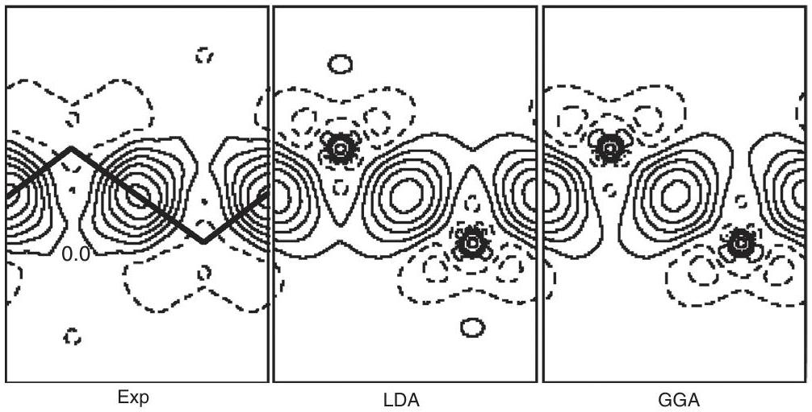
Figure 2.1. Electron density in Si shown as the difference of the total density from the sum of spherical atomic densities. The left-hand figure shows a contour plot of experimental (exp) measurements using electron scattering. The theoretical results were found using the linear augmented plane wave (LAPW) method (Chapter 17) and different density functionals (see text and Chapters 8 and 9). The difference density is in very good agreement with experimental measurements, with the differences in the figures due primarily to the thermal motion of the atoms in the experiment. LDA, local density approximation; GGA, generalized-gradient approximation. Provided by J. M. Zuo; similar to figure in [99].

more information than the density alone. For example, electric polarization of a crystal can be expressed in terms of Wannier functions even though it is not possible to determine the polarization from only the knowledge of the charge density in the bulk crystal. As described in Chapter 24, this has resolved a long-standing confusion in the literature and was an instrumental step in the progress leading up to the role of topology in electronic structure.

# 2.3 Volume or Pressure As the Most Fundamental Variable

The equation of state as a function of pressure and temperature is perhaps the most fundamental property of condensed matter. The stable structure at a given $P$ and $T$ determines all the other properties of the material. The basic quantities involved are the free energy $F(\Omega, T)=E(\Omega, T)-T S(\Omega, T)$, where the volume $\Omega$ and temperature $T$ are the independent variables, or the Gibbs free energy $G(P, T)=H(P, T)-T S(P, T)$, where the pressure $P$ and $T$ are the independent variables and $H=E+P \Omega$ is the enthalpy. Most work considers only $T=0$ because it is usually the dominant effect for solids and because it is much more difficult to calculate entropy, which requires a weighted integration over vibrational modes. In some cases thermal effects are added as a second step. ${ }^{2}$ The total energy $E$ at $T=0$ as a function of volume $\Omega$ is the most convenient quantity for theoretical

[^1]analysis because it is more straightforward to carry out electronic structure calculations at fixed volume. In essence, volume is a convenient "knob" that can be tuned to control the system theoretically. At $T=0$ the fundamental quantities are energy $E$, pressure $P$, bulk modulus $B$,
$$
\begin{aligned}
& E=E(\Omega) \equiv E_{\text {total }}(\Omega) \\
& P=-\frac{\mathrm{d} E}{\mathrm{~d} \Omega} \\
& B=-\Omega \frac{\mathrm{d} P}{\mathrm{~d} \Omega}=\Omega \frac{\mathrm{d}^{2} E}{\mathrm{~d} \Omega^{2}}
\end{aligned}
$$
and higher derivatives of the energy. All quantities are for a fixed number of particles, e.g., in a crystal, $E$ is the energy per cell of volume $\Omega=\Omega_{\text {cell }}$.

Comparison of theory and experiment is one of the touchstones of $a b$ initio electronic structure theory, providing direct tests of the approximations made to treat electron-electron interactions. The first test is to determine the theoretical prediction for the equilibrium volume $\Omega^{0}$, where $E$ is minimum or $P=0$, and the bulk modulus $B$ is given by Eq. (2.1). Since $\Omega^{0}$ and $B$ can be measured with great accuracy (and extrapolated to $T=0$ ), this is a rigorous test for the theory. One procedure is to calculate the energy $E$ for several values of the volume $\Omega$ and fit to an analytic form, e.g., the Murnaghan equation of state [105]. The minimum gives the predicted volume $\Omega^{0}$ and total energy, and the second derivative is the bulk modulus $B$. Alternatively, $P$ can be calculated directly from the virial theorem or its generalization (Section 3.3), and $B$ from response functions (Chapter 20).

During the 1960s and 1970s computational power and algorithms, using mainly atomic orbital bases (Chapter 15) or the augmented plane wave (APW) method (Chapter 16), made possible the first reliable self-consistent calculations of total energy as a function of volume for high-symmetry solids. Examples of calculations include ones for KCl [106, 107], alkali metals [108, 109], and Cu [110]. ${ }^{3}$ A turning point was the work of Janak, Moruzzi, and Williams [103, 111], who established the efficacy of the Kohn-Sham density functional theory as a practical approach to computation of the properties of solids. They used the Koringa-Kohn-Rostocker (KKR) method (Section 16.3) to calculate the equilibrium volume and bulk modulus for the entire series of transition metals using the local approximation, with results shown in Fig. 2.2. Except for a few cases where magnetic effects are essential, the calculated values are remarkably accurate - within a few percent of experiment. The overall shape of the curves has a very simple interpretation: the bonding is maximum at half-filling, leading to the maximum density, binding energy, and bulk modulus. Such comparisons of the predicted equilibrium properties with experimental values are now one of the routine tests of modern calculations.

[^2]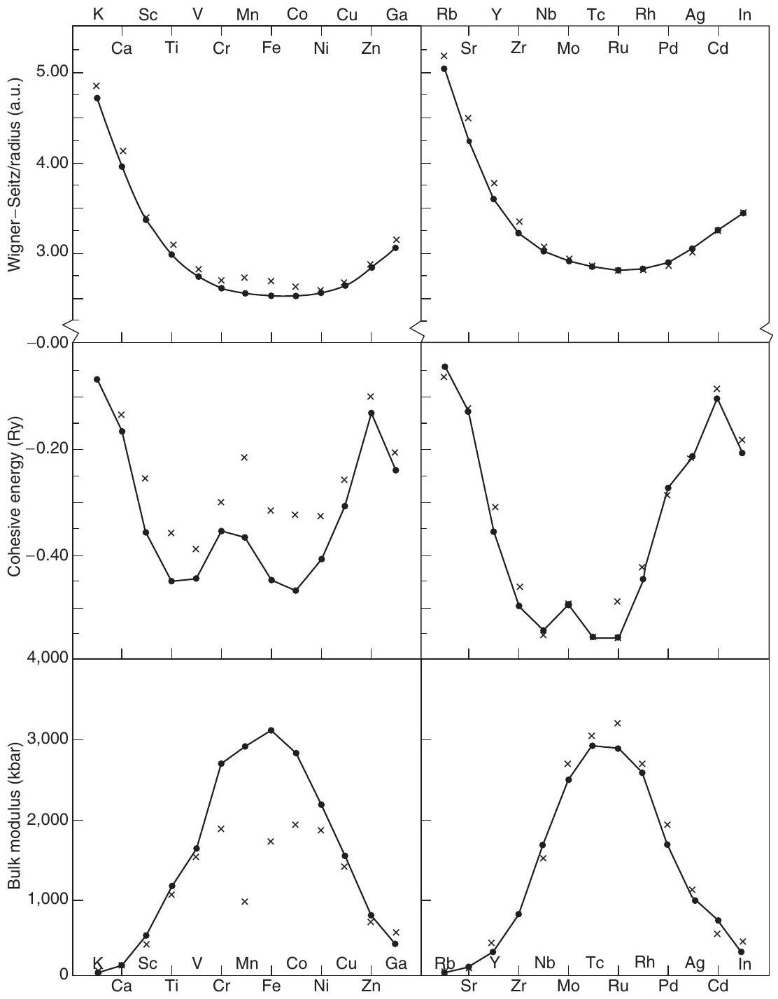
Figure 2.2. One of the first density functional calculations of the structures of solids: lattice constants (proportional to Wigner-Seitz radii), cohesive energy, and bulk moduli for the 3d and 4d series of transition metals, compared to experimental values denoted by points $x$. From Moruzzi, Janak, and Williams [103] (see also [104]).

# 2.4 How Good Is DFT for Calculation of Structures?

The title is meant to be thought provoking. Density functional theory is exact by construction (Chapter 6), but all functionals are approximations. The appropriate questions are: How good are useful, feasible approximations? For what classes of materials has a particular functional been tested?

Table 2.1. Calculated values of the lattice constant $a$ and bulk modulus $B$ compared to experiment for representative functionals and materials, selected from the results for 64 materials in [112]. MARE denotes the mean absolute relative error in \% and MAX is the maximum relative error for the materials considered in [112]. Values for the magnetic moment of Fe are from [116].
| Method | C |  | Si |  | LiF |  | bcc Fe |  |  | MARE |  | MAX |  |
| :--- | :--- | :--- | :--- | :--- | :--- | :--- | :--- | :--- | :--- | :--- | :--- | :--- | :--- |
|  | $a$ | B | $a$ | B | $a$ | B | $a$ | $B$ | $m$ | $a$ | B | $a$ | $B$ |
| LDA | 3.53 | 467 | 5.41 | 96 | 3.91 | 85 | 2.75 | 252 | 2.00 | 1.4 | 10.6 | 10.9 | 46.0 |
| PBE | 3.57 | 434 | 5.47 | 89 | 4.06 | 67 | 2.83 | 195 | 2.18 | 1.2 | 11.6 | 2.8 | 33.0 |
| HSE06 | 3.55 | 469 | 5.43 | 98 | 4.00 | 78 | 2.90 | 151 |  | 0.8 | 8.6 | 3.2 | 35.0 |
| SCAN | 3.55 | 460 | 5.44 | 99 | 3.97 | 87 | 2.82 | 185 | 2.60 | 0.6 | 5.9 | 2.7 | 26.1 |
| EXP | 3.57 | 443 | 5.43 | 99 | 4.01 | 70 | 2.86 | 173 | 2.13 |  |  |  |  |

One of the great successes of density functional theory is the prediction of structural properties of crystals. From the very first calculations with the original local density approximation, for example, as illustrated in Fig. 2.2, the results were a qualitative improvement over anything that had been available before. Since that time there have been great improvements in functionals that are the topic of Chapters 8 and 9. In addition, computational power and algorithms for calculation have improved so much that different methods for computation agree and the results are a true test of the functionals.

In Table 2.1 are listed the lattice constants and bulk moduli of a few selected crystals representing semiconductors, wide-gap covalent and ionic materials, and ferromagnetic transition metals, compared to experiment. These are taken from [112], which used the FHI-AIMS all-electron code (see [113] and Appendix R) to treat 64 different crystals with average performance (MARE) and maximum error (MAX). The values are in general agreement with many other references, which in total treat many hundreds of solids and thousands of molecules. ${ }^{4}$ The functionals considered in the table are described in detail in Chapters 8 and 9: LDA, the local density approximation; PBE, the most widely used generalized gradient approximation; HSE06, a representative range-separated hybrid; and SCAN a functional of the density and the kinetic energy density called a meta functional.

One conclusion is that the more advanced functionals are all significant improvements over the LDA. The hybrid and meta functionals perform best in many ways. However, they require more complex codes and hybrid functionals are significantly more costly in computer time. ${ }^{5}$ Meta functionals do not require as much computation as hybrids but they

[^3]have not been as widely tested. Consequently, GGA functionals such as PBE are very widely used as a very successful improvement over the LDA for structural properties.

A general rule of thumb is that the lattice constants are predicted to within approximately $1 \%$ and the bulk moduli (also other elastic constants and vibrational frequencies) are predicted to within around $5 \%-10 \%$. This is a remarkable achievement that has made a qualitative change in the way theory is used along with experiment and modern-day research. The agreement with experiment is sufficiently accurate that zero-point motion should be taken into account to compare to experiment; also it should be noted that there is uncertainty in experimental values extrapolated to $T=0$.

However, it must be stressed that in every individual case great care must be taken to assure that the calculations are done properly and the conclusions are justified. The maximum errors listed in the last column of Table 2.1 are up to $\approx 6 \%$ for the lattice constant $a$ and approximately $35 \%$ for the bulk modules $B$ for the more advanced functionals and more for the LDA. The largest errors tend to be for alkali metals and transition metals.

Each functional has deficiencies and there are no systematic proofs of when a functional works well and when it does not; there is only experience to justify the use in various classes of materials. Much of this book is devoted to analyzing classes materials and properties where we can expect a given functional to work well. Effort is made to point out cases in which there are problems and deficiencies, and the companion book [1] is devoted to many-body methods that are essential a many cases and provide benchmarks for functionals.

# 2.5 Phase Transitions under Pressure

Advances in experimental methods have made it possible to study matter over large ranges of pressures, sufficient to change the properties of ordinary materials completely; see, e.g., [117] and earlier references given there. In general, as the distance between the atoms is decreased, there is a tendency for all materials to transform to metallic structures, which are close packed at the highest pressures. Thus many interesting examples involve materials that have large-volume open structures at ordinary pressure and that transform to more closepacked structures under pressure.

Pressure different from zero (positive or negative!) is no problem for calculations, since the volume "knob" is easily turned to smaller or larger values. However, it is a great problem and a challenge of theory. It is an exacting requirement for a theory to predict the stability of phases with very different bonding, and it is only with the advent of density functional theory that it has been possible to make reliable predictions, and accurate prediction of stable structures and transition pressures provides a stringent test of different functionals.

Experiments are limited to structures that can actually be formed, but theory has no such restrictions. Understanding is gained by studying structures to quantify the reasons they are unfavorable and to find new structures that might be metastable. This is a double-edged sword: it is very difficult for a theorist to truly "predict" the most stable structures because of the difficulty in considering all possible structures. Nevertheless, great progress is being made with search methods discussed in Section 2.6.

The stability of phases of matter is determined by the free energy as a function of the temperature and pressure or temperature and volume. Fortunately for large classes of materials the most important effects are described by the energy at zero temperature, and the effects of temperature can be considered as a correction. At temperature $T=0$, the condition for the stable structure at constant pressure $P$ is that enthalpy $H=E+P \Omega$ be minimum. Transition pressures can be determined by calculating $E(\Omega)$ for different structures and using the Gibbs construction of tangent lines between the $E(\Omega)$ curves, the slope of which is the pressure for the transition between the phases.

Semiconductors are important examples that illustrate qualitative changes under pressure. The structures undergo various structural transitions and transformation from covalent open structures to metallic or ionic close-packed phases at high pressures [120, 121]. Figure 2.3 shows the energy versus volume for Si calculated [101] using the ab initio plane wave pseudopotential method and the local density approximation (LDA). This approach was pioneered by Yin and Cohen [101], a work that was instrumental in establishing the viability of theoretical predictions for stable structures of solids. The stable structure at $P=0$ is cubic diamond as expected, and Si is predicted to transform to the $\beta$-Sn phase at the pressure indicated by the slope of the tangent line, $\approx 8 \mathrm{GPa}$. The right-hand figure includes phases labeled bc8 and st12, dense distorted metastable tetrahedral phases that are

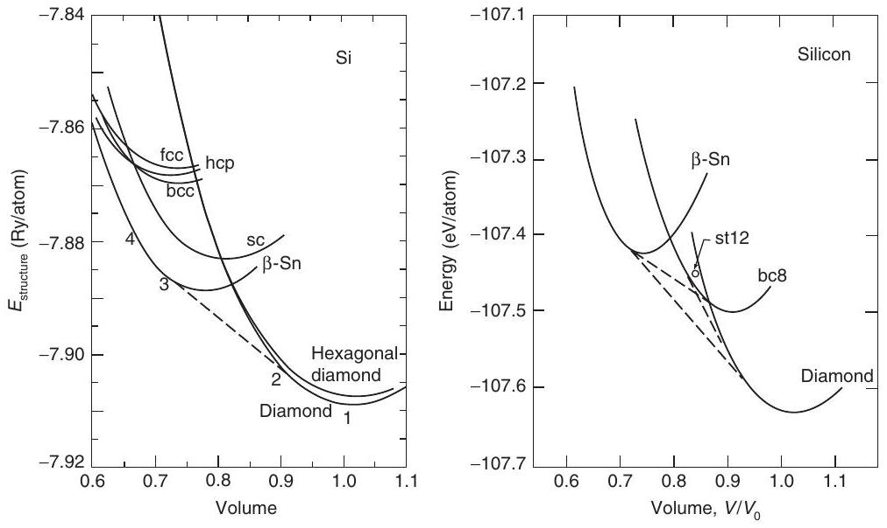
Figure 2.3. Energy versus volume for various structures of Si found using $a b$ initio plane wave pseudopotential calculations. The left-hand figure, from the work of Yin and Cohen [101], is the first such fully self-consistent calculation, the success of which greatly stimulated the field of research. The tangent construction is indicated by the dashed line, the slope of which is the transition pressure. The right-hand figure is an independent calculation [118], which includes the dense tetrahedral phases bc8 and st12. The calculations find the phases to be metastable in Si but stable in C (see Fig. 19.2); similar results were found by Yin [119]. The calculations were done long before the widely used public codes were constructed. More recent calculations (e.g., in Fig. 2.4) are very similar for these phases and show that improved functionals tend to lead to higher transition pressures closer to experiment.

predicted to be almost stable; indeed they are well-known forms of Si produced upon release of pressure from the high-pressure metallic phases [122]. Many calculations have confirmed the general results and have considered many other structures [121, 123], including the simple hexagonal structure that was discovered experimentally [124, 125] and is predicted to be stable over a wide pressure range.

Similar calculations for carbon [118, 119, 126] correctly find the sign of the small energy difference between graphite and diamond at zero pressure and predict that diamond will undergo phase transitions similar to those in Si and Ge but at much higher pressures, $\sim 3,000$ GPa . Interestingly, the dense tetrahedral phases are predicted to be stable above $\approx 1,200$ GPa, as is indicated in the phase diagram in Fig. 19.2.

The transitions also provide tests of functionals. The left side of Fig. 2.4 shows the equations of state for Si in the diamond and $\beta$-Sn structures using various functionals. Because the LDA favors dense structures it tends to predict transition pressures that are too low, and the improved functionals increase the transition pressure. The experimental transition pressure is $\approx 11 \mathrm{GPa}$, and it is clear that the pressure is underestimated by the LDA and improved significantly by the other functionals. However, in many cases it is difficult to compare directly with experiment because of hysteresis in the forward and backward transitions (often producing metastable bc8 structure as the pressure is decreased).

The stark contrast between the predictions of different functionals is illustrated for $\mathrm{SiO}_{2}$ in the right side of Fig. 2.4. At low pressure there are many possible structures with

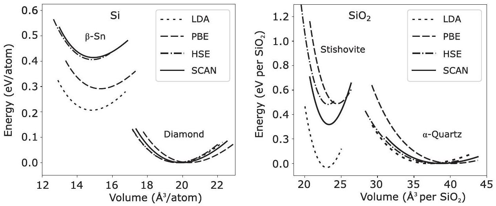
Figure 2.4. Energy versus volume for Si and $\mathrm{SiO}_{2}$ for various functionals that are defined in Chapters 8 and 9. Transition pressures are determined common by tangent lines (not shown for simplicity), but it is clear that transition pressures are increased for all the other functionals compared to LDA. Comparison with experiment is discussed in the text for both Si and $\mathrm{SiO}_{2}$. Left: for Si, calculated transition pressures are $7.1,9.8,13.3,14.5 \mathrm{GPa}$, respectively, for LDA, PBE, HSE06, and SCAN functionals. Right: for $\mathrm{SiO}_{2}$, results are shown for $\alpha$-quartz and high-density stishovite phases. The LDA favors high density and even predicts the wrong structure at zero pressure, whereas the other functionals predict the correct low-pressure $\alpha$-quartz structure. Modified from figures provided by Jefferson Bates; original references for Si [127, 128] and $\mathrm{SiO}_{2}$ [127, 129].

networks of tetrahedrally coordinated Si typified by the well-known $\alpha$-quartz structure. At high pressure there is a qualitative change in the bonding to a high-density stishovite structure with octahedrally coordinated Si atoms. The figure shows that the LDA predicts the stishovite structure to be most stable, i.e., a qualitatively incorrect prediction of the nature of $\mathrm{SiO}_{2}$. The other functionals are qualitatively in agreement with experiment but the actual transition in $\mathrm{SiO}_{2}$ is very sluggish and occurs to the intermediate coesite structure so that the experiment does not provide definitive tests of the functionals.

There have been many such calculations and much work combining theory and experiment for the whole range of semiconductors. The tendency of LDA to underestimate transition pressures has been brought out in reviews such as [120,121]. Extensive tests of functionals for group IV, III-V, and II-VI compounds can be found in [128] for LDA, GGA, and the SCAN metafunctional, and in [115] for various hybrid functionals.

# 2.6 Structure Prediction: Nitrogen Solids and Hydrogen Sulfide Superconductors at High Pressure

Structure Searches

Electronic structure has reached the point where it is an indispensable part of one of the great goals of the physical sciences: to create new, useful materials and systems. Certainly a major factor is the capability to predict stable compositions and structures. The power of computers has made it possible to calculate the energies for enormous numbers of structures and to use a variety of approaches to search for materials with desired properties. Often this involves conditions that are not readily accessible experimentally. For example, predictions of stability under conditions in the mantle or core of the earth is of great importance for geophysics and can add to understanding of materials that exist under ordinary conditions. Essentially all work that attempts to calculate the energies in an $a b$ initio manner with no empirical parameters uses density functional theory and the accuracy of the results depends on the ability of DFT to treat many different structures, compounds, stoichiometries, etc.under different conditions. Other methods such as quantum Monte Carlo can be used to study a few most favorable cases, but DFT is the method that makes large-scale searches possible.

A number of methods have been developed to search for stable or metastable structures. ${ }^{6}$ Finding the most stable (lowest in energy or free energy) structure of a system with many atoms is a very difficult problem. In general, the potential energy surface as a function of positions of the atoms has many minima and a rugged landscape making it difficult to find the global minimum. A sobering message is the no-free-lunch theorem, which states that any search algorithm suffers the fate that if it performs better for one class of problems, it will be worse in some other classes [132]. Nevertheless, the set of reasonable possibilities

[^4]for a collection of atoms is much less than the set of all possible structures and there are methods proven to be useful.

One approach is simulated annealing that builds upon the early work of Kirkpatrick et al. [133]. For small systems thermal annealing is very useful for generating stable configurations, for example, the clusters in Fig. 2.20. For large systems like solids, however, barriers make it very difficult to generate transitions between structures.

In random search methods one starts with randomly generated structures, each of which is relaxed to find the minimum energy for that starting point. By limiting the random starting structures to ones that are "reasonable," e.g., without having atoms too close, Pickard and Needs [130] showed that their $a b$ initio random structure searching (AIRS) method can successfully identify structures such as nitrogen solids. Their approach is to run the algorithm until the same lowest-energy structure has been found several times from different starting structures.

Particle swarm optimization (PSO) was developed by Kennedy and Eberhart in 1995 based on swarm behavior observed in fish and birds in nature. ${ }^{7}$ The movement of a swarming particle (here it denotes a configuration of atoms) has a stochastic component and a deterministic component; it is attracted toward the position of the current global best of all the particles and its own best location in history, while at the same time it has a tendency to move randomly. There are many variations and one that has been used for structures of materials is CALYPSO (Crystal structure AnaLYsis by Particle Swarm Optimization) which was used in studies of $\mathrm{H}_{2} \mathrm{~S}$ structures under pressure.

Evolutionary algorithms are optimization techniques inspired by biological evolution, involving concepts such as reproduction, mutation and recombination, fitness, and selection [136]. They are widely used in many fields, and an example used in the materials community is the USPEX code (Universal Structure Predictor: Evolutionary Xtallography) [137] (original paper [138]) employed in finding structures of hydrogen sulfide materials.

## 2.6.1 Nitrogen

Molecular crystals are ideal to illustrate qualitative changes under pressure. A great example of the power of computational methods combined with intuition is nitrogen. The triplebonded $\mathrm{N}_{2}$ molecule is the most strongly bound of all diatomic molecules. At ordinary $P$ and $T$ nitrogen occurs only as $\mathrm{N}_{2}$ gas or weakly bonded molecular solids and liquid. A great challenge for many years has been to create nonmolecular solid nitrogen. In the early 1990s Mailhiot, Yang, and McMahan [139] carried out calculations using a normconserving pseudopotential and the local density approximation, with results shown in Fig. 2.5 for the calculated energy versus volume for different structures. At low pressure there are various molecular phases, but at high pressures phases with higher coordination are more stable. That work found a new structure called "cubic gauche" (cg), perhaps the

[^5]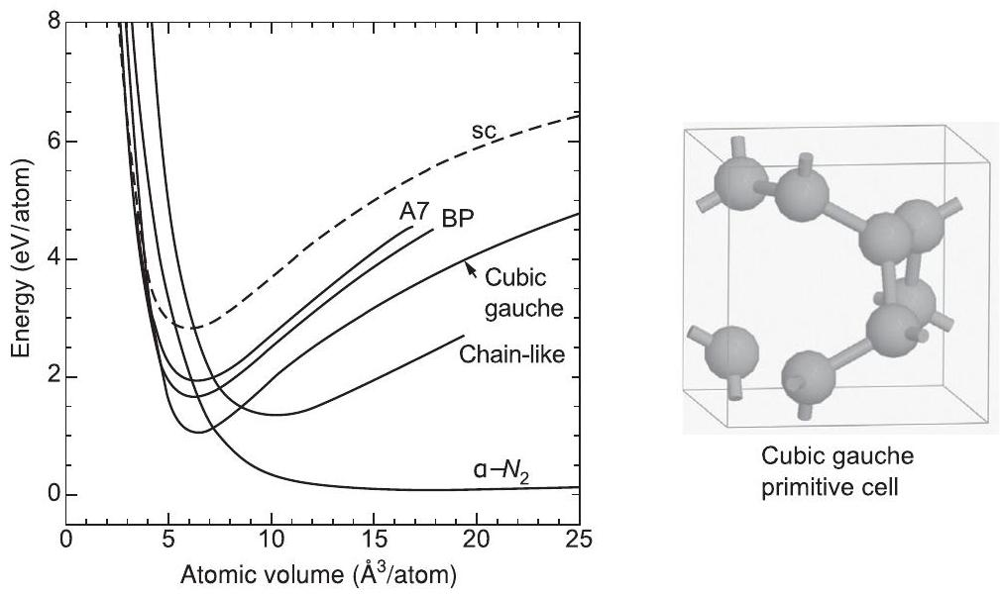
Figure 2.5. Total energy of nitrogen versus volume in molecular structures and the "cubic gauche" nonmolecular structure predicted at high pressure [139]. This is perhaps the first time DFT calculations have discovered a new structure never before known for any material; it was produced under pressure years later [140, 141].

first example of using DFT to predict a new structure that had never before been observed in any material. The cg structure is bcc with eight atoms per primitive cell as shown in Fig. 2.5; even though it has high symmetry, a glance at the configuration in Fig. 2.5 shows why it might be hard to guess.

The cubic gauche form of nitrogen was made experimentally years afterward by heating to a temperature above $2,000 \mathrm{~K}$ and pressure above 110 GPa in a laser-heated diamond cell [140, 141]. The structure was identified by X-ray scattering and it was found to have a bulk modulus greater than 300 GPa , characteristic of strong covalent solids, consistent with the theoretical prediction. Preparation of nonmolecular nitrogen at ambient pressure has been reported [142]; if indeed strongly bound solid nitrogen is metastable at low pressure the stored energy will be exceptional, more than five times that of the most powerfully energetic materials.

A later study using the random search method [143] found the cg structure to be lowest energy for a large pressure range and also identified a number of other stable structures. In some ways the behavior of nitrogen is analogous to carbon, which transforms under pressure from graphite with three neighbors double bonded to diamond with four neighbors and single bonds. The transition in nitrogen is from molecules where each atom has one neighbor with a triple bond to a three-dimensional crystal with threefold coordination and single bonds.

## 2.6.2 Hydrogen Sulfide Superconductors

There has been a long quest for metallic hydrogen, which has proven to be very difficult (see, e.g., [144]). Part of the impetus is the expectation that it would be a high-temperature

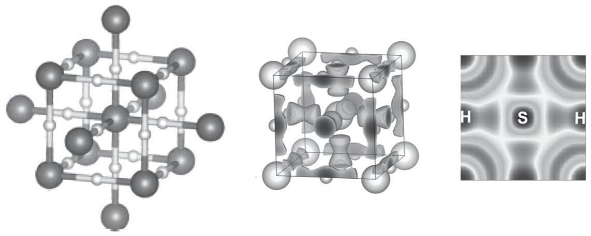
Figure 2.6. Left: Body-centered cubic structure of $\mathrm{H}_{3} \mathrm{~S}$ with sulfur atoms (large dark spheres) bonded to six hydrogens (small light spheres). Center and right: the electron localization function (ELF) in three-dimensions and in a(100) plane, which shows the bonding through the hydrogens. Provided by D. Duan, parts of figures in [146].

superconductor due to the high frequency of phonons and expected strong electron-phonon interaction. This has led to much work to find materials containing hydrogen that could have similar properties, in large part inspired by a paper by Niel Ashcroft [145]. A recounting of the story of studies of hydrogen-rich materials under pressure can be found in the review [117], and here we focus upon the discovery of superconductivity in hydrogen sulfides, where theory has played a key role.

Two theory papers published in 2014 set the stage for the discoveries. The paper by Li et al. [147] considered $\mathrm{H}_{2} \mathrm{~S}$ and optimized structures were identified using the particle swarm method CALYPSO structure search code. The result was that metallization occurs above 130 GPa with superconducting transition temperature predicted to be $\approx 80 \mathrm{~K}$. The other paper by Duan et al. [146] considered the system $\left(\mathrm{H}_{2} \mathrm{~S}\right)_{2} \mathrm{H}_{2}$. This is one of the examples of closed-shell atoms or molecules that can absorb additional $\mathrm{H}_{2}$ at high pressure to form $\mathrm{H}_{2}$-containing stoichiometric compounds, and the structure of $\left(\mathrm{H}_{2} \mathrm{~S}\right)_{2} \mathrm{H}_{2}$ had already been established at relatively low pressure where it is still a molecular solid. The studies in [146] optimized the structures using an evolutionary algorithm method USPEX code and found a sequence of structures. At low pressure the structures of the molecular crystal were found in agreement with experiment. Above 111 GPa the $\mathrm{H}_{2}$ molecules disappeared and $\mathrm{H}_{3} \mathrm{~S}$ molecules formed; there was a large volume collapse and the system became metallic. At 180 GPa the structure of $\mathrm{H}_{3} \mathrm{~S}$ molecules transformed smoothly into the high-symmetry bcc lattice shown at the left in Fig. 2.6 with hydrogen atoms symmetric between S atoms, and a predicted superconducting transition temperature between 191 and 204 K at 200 GPa .

The next year (2015) experimental results were reported by Drozdov et al. [148], who compressed $\mathrm{H}_{2} \mathrm{~S}$ and found that above $\approx 100 \mathrm{GPa}$, it becomes a superconductor with $\mathrm{T}_{c}$ that increases with pressure until it abruptly jumps to $\approx 200 \mathrm{~K}$ at pressures above 160 GPa . This work was inspired by the prediction of Li et al. [147], who studied $\mathrm{H}_{2} \mathrm{~S}$; however, the results were actually consistent with the predictions of Duan et al. [146]. In addition, they
found evidence for elemental sulfur and suggested the decomposition of $\mathrm{H}_{2} \mathrm{~S}$ to become more hydrogen rich. This was followed by synchrotron X-ray diffraction measurements reported in 2016 [149], which found that the structure of the superconducting phase is in good agreement with the predicted body-centered cubic (bcc) structure and confirmed the presence of elemental sulfur.

The nature of the bonding in the bcc phase of $\mathrm{H}_{3} \mathrm{~S}$ is revealed by the calculated electron localization function (ELF) shown in Fig. 2.6. As discussed in Section H.4, the ELF is derived from the kinetic energy density and it is defined in such a way that a large value indicates a region of space where there is a low probability of two electrons having the same spin-e.g., in a covalent bond with paired electrons of opposite spin. As indicated in Fig. 2.6, the value of ELF in the region of S-H bonds is large, which suggests a strong polar covalent bond; it is low between the nearest H atoms, indicating the absence of a covalent bonding, (i.e., no tendency for formation of $\mathrm{H}_{2}$ molecules).

The calculation of the superconducting transition temperature in [146] and [147] was done with methods that have become standard. Although the theory of superconductivity is outside the scope of this volume, the basic ingredients in the theory of phonon-mediated superconductivity are the bread and butter of electronic structure (see Section 20.8): the electronic bands, the Fermi surface, the single-particle densities of states, phonon dispersion, and electron-phonon interactions. Calculations have also been done by others [150, 151] with general agreement that the high $\mathrm{T}_{c}$ is due to the high phonon frequencies but varying interpretations of the importance the electron-phonon interactions and the sharp peak in the electronic density of states at the Fermi energy.

In [146] the structures were derived in simulations that started from molecules of $\mathrm{H}_{2} \mathrm{~S}$ and $\mathrm{H}_{2}$, with a fixed number of atoms. However, the ranges of stability of various hydrides and the transitions can be pinpointed most directly by calculations of the enthalpy $H=E+P V$ as a function of the pressure for each of the relevant stoichiometry and structures identified in the search. In Fig. 2.7 are the calculated enthalpies plotted as a function of the ratio $\mathrm{H}_{2} /\left(\mathrm{S}+\mathrm{H}_{2}\right)$ in the range 0 (pure S ) to 1 (pure $\mathrm{H}_{2}$ ). The lines shown represent limits of stability for intermediate compounds; if the enthalpy is above the line, it is unstable to phase separation. For example, in the lower figures at 100 and 200 GPa , an $\mathrm{H}_{2} \mathrm{~S}$ compound has higher enthalpy than the same number of atoms separated into $\mathrm{H}_{3} \mathrm{~S}$ and elemental sulfur phases, and $\mathrm{H}_{n} \mathrm{~S}$ will separate into $\mathrm{H}_{3} \mathrm{~S}$ and $\mathrm{H}_{2}$ for $n>3$.

It is interesting to contrast the behavior of $\mathrm{H}_{2} \mathrm{~S}$ and $\mathrm{H}_{2} \mathrm{O}$. At low pressure $\mathrm{H}_{2} \mathrm{O}$ molecules form structures with each O atom strongly bonded to two H atoms and weakly bonded to two other H atoms by hydrogen bonds, following ice rules. Under pressure, ice forms new structures including ice-X, in which the O atoms form a bcc lattice with four neighboring H atoms in tetrahedral positions midway between O atoms. It stays insulating and does not decompose up to pressures in the TPa range. See, for example, [153], which describes simulations of various phases and gives references to the literature.

Superhydrides. There are also other hydrogen-rich materials that are superconductors and theory plays a key role in identifying the most likely candidates. Perhaps the highest transition temperatures to date are in materials known as superhydrides. Two theoretical

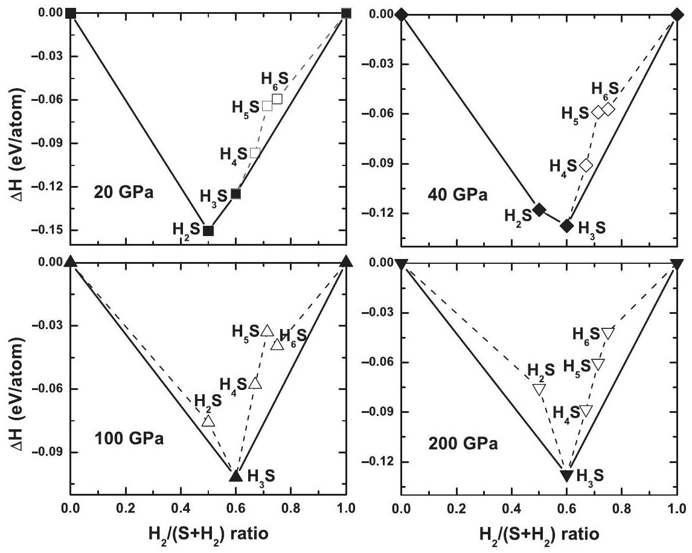
Figure 2.7. Phase diagram of the $\mathrm{H}-\mathrm{S}$ system as a function of stoichiometry defined as $\mathrm{H}_{2} /\left(\mathrm{S}+\mathrm{H}_{2}\right)$ so that 0 denotes pure S and 1 denotes pure $\mathrm{H}_{2}$. Provided by D . Duan; parts of figures in [152].

papers have predicted that $\mathrm{LaH}_{10}$ and $\mathrm{YH}_{10}$ have a clathrate structure with 32 hydrogen atoms surrounding each La or Y atom [154, 155]. The hydrogen is so dense that the $\mathrm{H}-\mathrm{H}$ distances are like that expected for atomic hydrogen at comparable pressures. Each paper reports DFT calculations and structure searches using the swarm-intelligencebased CALYPSO method (with random search methods in some cases [155]), with $\mathrm{T}_{c} \approx 280 \mathrm{~K}$ for $\approx 200 \mathrm{GPA}$ for $\mathrm{LaH}_{10}$ [154], and even higher $\mathrm{T}_{c}$ in $\mathrm{YH}_{10}$ [154, 155]. Subsequent experiments [156] found evidence for superconductivity above 260 K in $\mathrm{LaH}_{10}$ at $\approx 200 \mathrm{GPa}$.

# 2.7 Magnetism and Electron-Electron Interactions

Magnetic systems are ones in which the ground state has a spontaneous broken symmetry with spin and/or orbital moments of the electrons. In ferromagnets there is a net moment and in antiferromagnets there are spatially varying moments that average to zero by symmetry. The existence of a magnetic ground state is intrinsically a many-body effect caused by electron-electron interactions. Before the advent of quantum mechanics, it was recognized that the existence of magnetic materials was one of the key problems in physics, since it can be shown that within classical physics it is impossible for the energy of the system to be
affected by an external magnetic field [72-74]. The solution was recognized in the earliest days of quantum mechanics, since a single electron has half-integral spin and interacting electrons can have net spin and orbital moments in the ground state. In open-shell atoms, this is summarized in Hund's rules that the ground state has maximum total spin and maximum orbital momentum consistent with the possible occupations of electrons in the states in the shell.

In condensed matter, the effects are often due to localized atomic-like moments and the correlation of moments on different sites leads to phase transitions and phenomena often called "strongly correlated." For that reason magnetic phenomena are treated more thoroughly in [1], which is devoted to the theory of interacting electrons. However, the average magnetization in an ordered state can be described by electrons in some average potential that is spin dependent. The effects of exchange and correlation among the electrons is replaced by an effective Zeeman field $H_{\text {Zeeman }}$ represented by an added term in the Hamiltonian $m(\mathbf{r}) V_{m}(\mathbf{r})$, where $m$ is the spin magnetization $m=n^{\uparrow}-n^{\downarrow}$ and $V_{m}= \mu H_{\text {Zeeman }} .{ }^{8}$ In analogy to the considerations of energy versus volume in Section 2.3, it is most convenient to find energy for fixed field $V_{m}$ and the problem is to find the minimum of the energy and the susceptibility. The basic equations are

$$
\begin{aligned}
E & =E\left(V_{m}\right) \equiv E_{\text {total }}\left(V_{m}\right), \\
m(\mathbf{r}) & =-\frac{\mathrm{d} E}{\mathrm{~d} V_{m}(\mathbf{r})}, \\
\chi\left(\mathbf{r}, \mathbf{r}^{\prime}\right) & =-\frac{\mathrm{d} m(\mathbf{r})}{\mathrm{d} V_{m}\left(\mathbf{r}^{\prime}\right)}=\frac{\mathrm{d}^{2} E}{\mathrm{~d} V_{m}(\mathbf{r}) \mathrm{d} V_{m}\left(\mathbf{r}^{\prime}\right)} .
\end{aligned}
$$

If the electrons did not interact, the curvature of the energy $\chi$ would be positive with a minimum at zero magnetization, corresponding to bands filled with paired spins. However, exchange tends to favor aligned spins, so that $V_{m}(\mathbf{r})$ itself depends upon $m\left(\mathbf{r}^{\prime}\right)$ and can lead to a maximum at $m\left(\mathbf{r}^{\prime}\right)=0$ and a minimum at nonzero magnetization, ferromagnetic if the average value $\bar{m}$ is nonzero antiferromagnetic otherwise. In general, $V_{m}(\mathbf{r})$ and $m\left(\mathbf{r}^{\prime}\right)$ must be found self-consistently.

The mean-field treatment of magnetism is a prototype for many problems in the theory of electronic structure. Magnetic susceptibility is an example of response functions described in Appendix D, where self-consistency leads to the mean-field theory expression (D.14); for magnetism the expressions for the magnetic susceptibility have the form first derived by Stoner [158, 159],

$$
\chi=\frac{N(0)}{1-I N(0)},
$$

where $N(0)$ is the density of states at the Fermi energy and the effective field has been expanded at linear order in the magnetization $V_{m}=V_{m}^{\text {ext }}+I m$ for the effective

[^6]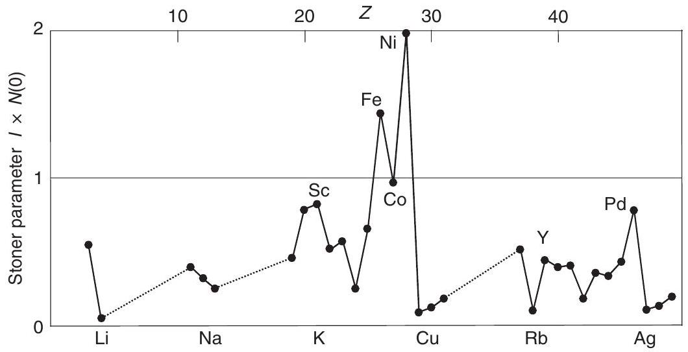
Figure 2.8. Stoner parameter for the elemental metals derived from densities of states and spin-dependent mean-field interactions from density functional theory. This shows the basic tendency for magnetism in the 3 d elements $\mathrm{Mn}, \mathrm{Fe}, \mathrm{Co}$, and Ni , due to the large density of states and interactions, both of which are consequences of the localized atomic-like nature of the 3d states discussed in the text. Data from Kübler and Eyert [157], originally from Moruzzi et al. [104].

interaction. ${ }^{9}$ The denominator in Eq. (2.3) indicates a renormalization of the independentparticle susceptibility $\chi^{0}=N(0)$, and an instability to magnetism is heralded by the divergence when the Stoner parameter $I N(0)$ equals unity. Figure 2.8 shows a compilation by Moruzzi et al. [104] of $I N(0)$ from separate calculations of the two factors $I$ and $N(0)$ using density functional theory. Clearly, the theory is quite successful since the Stoner parameter exceeds unity only for the actual ferromagnetic metals $\mathrm{Fe}, \mathrm{Co}$, and Ni , and it is near unity for well-known enhanced paramagnetic cases like Pd. An example of the calculated average magnetization of Fe is given in Table 2.1.

Modern calculations can treat the spin susceptibility and excitations within density functional theory using either "frozen" spin configurations or response functions, with forms that are the same as for phonons described in the following section, Section 2.9, and Chapter 20. An elegant formulation of the former approach based on a Berry phase [160,161] is described in Section 20.2. Examples of both Berry phase and response function approaches applied to Fe are given in Figs. 20.2 and 20.4.

# 2.8 Elasticity: Stress-Strain Relations

The venerable subject of stress and strain in materials has also been brought into the fold of electronic structure. This means that the origins of the stress-strain relations are traced back

[^7]to the fundamental definition of stress in quantum mechanics, and practical equations have been derived that are now routine tools in electronic structure theory [102, 162]. Because the development of the theory has occurred in recent years, the subject is discussed in more detail in Appendix G.

The basic definition of the stress tensor $\sigma_{\alpha \beta}$ is the generalization of Eq. (2.1) to anisotropic strain,

$$
\sigma_{\alpha \beta}=-\frac{1}{\Omega} \frac{\partial E_{\text {total }}}{\partial u_{\alpha \beta}},
$$

where $u_{\alpha \beta}$ is the symmetric strain tensor defined in Eq. (G.2). Likewise, the theoretical expressions are the generalization of the virial theorem for pressure to anisotropic stress [102, 162].

Figure 2.9 shows the first reported calculation [163] of stress in a solid from the electronic structure, which illustrates the basic ideas. This figure shows stress as a function of uniaxial strain in Si . The linear slopes yield two independent elastic constants, and nonlinear variations can be used to determine nonlinear constants. Linear elastic constants have been calculated for many materials, with generally very good agreement with experiment, typically $\sim 5 \%-10 \%$. Nonlinear constants are much harder to measure, so that the theoretical values are often predictions.

As an example of predictions of theory, Nielsen [164] has calculated the properties of diamond for general uniaxial and hydrostatic stresses, including second-, third-, and fourthorder elastic constants, internal strains, and other properties. The second-order constants agree with experiment to within $\approx 6 \%$ and the higher-order terms are predictions. At

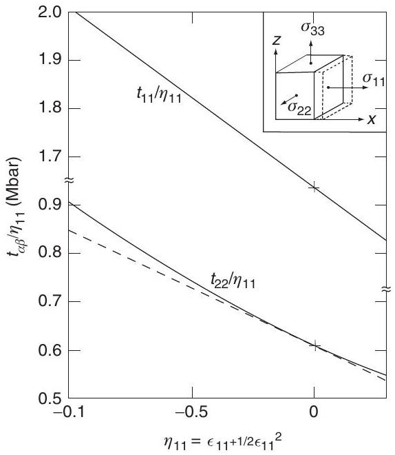
Figure 2.9. Stress in Si calculated as a function of strain in the ( 100 ) direction [ 163 ]. Two elastic constants can be found from the linear slopes; the nonlinear variation determines nonlinear constants. For nonlinear strains it is most convenient to use Lagrange stress and strain, $t_{\alpha \beta}$ and $\eta_{\alpha \beta}$ (see [163]), which reduce to the usual expression in the linear regime. From [163].

extremely large uniaxial stresses ( 4 Mb ) the electronic bandgap collapses, and a phonon instability of the metallic diamond structure is found for compressions along the [110] and [111] crystal axes. This may be relevant for ultimate stability of diamond anvils in highpressure experiments.

# 2.9 Phonons and Displacive Phase Transitions

A wealth of information about materials is provided by the vibrational spectra that are measured experimentally by infrared absorptions, light scattering, inelastic neutron scattering, and other techniques. The same holds for the response of the solid to electric fields, etc. Such properties are ultimately a part of electronic structure, since the electrons determine the changes in the energy of the material if the atoms are displaced or if external fields are applied. So long as the frequencies are low, the electrons can be considered to remain in their ground state, which evolves as a function of the displacements of the nuclei. The total energy can be viewed as a function of the positions of the nuclei $E\left(\left\{\mathbf{R}_{I}\right\}\right)$ independent of the nuclear velocities. This is the adiabatic or Born-Oppenheimer regime (see Chapter 3 and Appendix C), which is an excellent approximation for lattice vibrations in almost all materials. In exact analogy to Eq. (2.1), the fundamental quantities are energy $E\left(\left\{\mathbf{R}_{I}\right\}\right)$, forces on the nuclei $\mathbf{F}_{I}$, force constants $C_{I J}$,

$$
\begin{aligned}
E & =E\left(\left\{\mathbf{R}_{I}\right\}\right) \equiv E_{\mathrm{total}}\left(\left\{\mathbf{R}_{I}\right\}\right), \\
\mathbf{F}_{I} & =-\frac{\mathrm{d} E}{\mathrm{~d} \mathbf{R}_{I}}, \\
C_{I J} & =-\frac{\mathrm{d} \mathbf{F}_{I}}{\mathrm{~d} \mathbf{R}_{J}}=\frac{\mathrm{d}^{2} E}{\mathrm{~d} \mathbf{R}_{I} \mathrm{~d} \mathbf{R}_{J}},
\end{aligned}
$$

and higher derivatives of the energy.
Quantitatively reliable theoretical calculations have added new dimensions to our understanding of solids, providing information that is not directly available from experiments. For example, except in a few cases, only frequencies and symmetries of the vibration modes are actually measured; however, knowledge of eigenvectors is also required to reconstruct the interatomic force constants $C_{I J}$. In the past this has led to a plethora of models for the force constants that all fit the same data (see, e.g., [165, 166], and references therein). For example, large differences in eigenvectors were predicted for certain phonons in GaAs, and the issues were resolved only when reliable theoretical calculations became possible [167]. Modern theoretical calculations provide complete information directly on the force constants, which can serve as a database for simpler models and understanding of the nature of the forces. Furthermore, the same theory provides much more information: static dielectric constants, piezoelectric constants, effective charges, stress-strain relations, electron-phonon interactions, and much more.

As illustrated in the examples given here and in Chapter 20, theoretical calculations for phonon frequencies have been done for many materials, and agreement with experimental frequencies within $\approx 5 \%$ is typical. Since there are no adjustable parameters in the theory,
the agreement is a genuine measure of the success of current theoretical methods for such ground-state properties. This is an example where theory and experiment can work together, with experiment providing the crucial data and new discoveries, and the theory providing solid information on eigenvectors, electron-phonon interactions, and many other properties.

There are two characteristic approaches in quantitative calculations:

- Direct calculation of the total energy as a function of the positions of the atoms. This is often called the "frozen phonon" method.
- Calculations of the derivatives of the energy explicitly at any order. This is called the "response function" or "Green's function" method.

## 2.9.1 Frozen Phonons

The term "frozen phonons" denotes the direct approach in which the total energy and forces are calculated with the nuclei "frozen" at positions $\left\{\mathbf{R}_{I}\right\}$. This has the great advantage that the calculations use exactly the same computational machinery as for other problems: for example, the same program (with only slightly different input) can be used to calculate phonon dispersion curves (Chapter 20), surface and interface structures (Chapter 22), and many other properties. Among the first calculations were phonons in semiconductors, calculated in 1976 using empirical tight-binding methods [171] and again in 1979 using density functional theory and perhaps the first such calculation to find the small changes in energy [172]. Today these are standard applications of total energy methods.

## 2.9.2 Frozen Polarization and Ferroelectricity

The left side of Fig. 2.10 shows the calculated energy versus displacement of Ti atoms in $\mathrm{BaTiO}_{3}$, where the origin corresponds to atoms in centrosymmetric positions of the perovskite structure shown in Fig. 4.8. If the energy had increased with displacement the structure would be stable and the curvature would determine the frequency of an optic mode. The negative curvature at the centrosymmetric position indicates an instability, and calculations for displacements in different directions are needed to determine the lowest energy minimum. From this information one can extract the various orders of the anharmonic terms; for example, the terms needed to construct a microscopic model (see, e.g., [173, 174]), which can be used to construct free energy models, and to study thermal phase transitions.

Incredible as it may seem, the problem of calculation of the electric polarization of a ferroelectric was only solved in the 1990s, despite the fact that expressions for the energy and forces have been known since the 1920s. As described in Chapter 24, the advance in recent years [175, 176] relates a change in polarization to a Berry phase [177] involving the change in phases of the electron wavefunctions. The theory provides practical methods for calculation of polarization in ferroelectrics and pyroelectrics, as well as effective charges and piezoelectric effects to all orders in lattice displacements and strains.

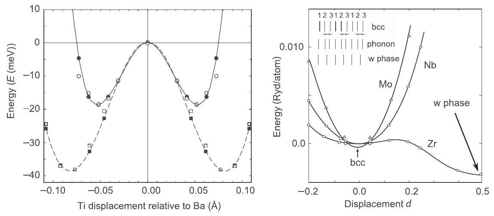
Figure 2.10. Frozen phonon calculations of energy versus displacement. Left: displacements of Ti atoms in $\mathrm{BaTiO}_{3}$ is in two directions with dark symbols for calculations using local orbitals [168] (see Chapter 15) and open symbols from using full-potential LAPW methods [169] (Chapter 17). The centrosymmetric position is unstable, and the most stable minimum is for the rhombohedral direction resulting in a ferroelectric phase in agreement with experiment. Provided by R . Weht and J. Junquera (similar to the figure in [168]). Right: energy versus displacement for longitudinal displacements with wavevector $\mathbf{k}=\left(\frac{2}{3}, \frac{2}{3}, \frac{2}{3}\right)$ in the bcc structure [170]. For Mo and Nb the minimum energy is for bcc structure. The curvature agrees well with measured phonon frequencies and corresponds to a sharp dip in the phonon dispersion curves, which is a precursor to the phase transition that actually occurs in Zr. The minimum energy structure for Zr at low temperature is the " $\omega$ phase," which forms by displacements shown in the inset, with each third plane undisplaced and the other two planes forming a more dense bilayer. From [170].

## 2.9.3 Calculations with Supercells

The right side of Fig. 2.10 shows the results of calculations for three transition metals using a cell that corresponds to tripling the size of the cell [170]. For Mo and Nb , the curvature determines the frequency of the phonon at wavevector $\mathbf{k}=\left(\frac{2}{3}, \frac{2}{3}, \frac{2}{3}\right)$ in the bcc structure, but for Zr there is an instability to forming the $\omega$ phase where layers of atoms are displaced in the pattern shown in the figure. This is an example of instabilities that can occur in systems with strong electron-phonon interactions and narrow bands as found in many transition metals and discussed in Section 20.2.

Frozen phonon methods can also be used to calculate dispersion curves by taking a large enough supercell. The example in Fig. 20.1 shows this is feasible with cells that are manageable; however, the method based on response functions and Green's functions is more elegant and effective, and it is the method most widely used.

## 2.9.4 Linear (and Nonlinear) Response

Response function approaches denote methods in which the force constants are calculated based on expansions in powers of the displacements from equilibrium positions. This has the great advantage that it builds upon the theory of response functions (Appendix D), which

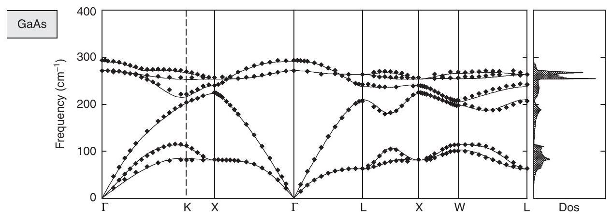
Figure 2.11. Phonon dispersion curves calculated for the semiconductor GaAs [182]. The points are from experiment and the curves from density functional theory using the response function method (Chapter 20). Similar agreement is found for the entire family of semiconductors. Calculations for many types of materials, e.g., in Figs. 20.3 and 20.4, have shown the wide applicability of this approach.

can be measured in experiments and was formulated [178-180] in the 1960s. Methods using Green's functions (see the review [181] and Chapter 20) have cast the expressions in forms much more useful for computation so that it is now possible to calculate phonon dispersion curves on an almost routine basis.

Figure 2.11 shows a comparison between experimental and theoretical phonon dispersion curves for GaAs [182]; such near-perfect agreement with experiment is found for many semiconductors using plane wave pseudopotential methods. In Chapter 20 examples of results for metals are shown, where the results are also impressive but the agreement with experiment is not as good for the transition metals. Similar results are found for many materials, agreeing to within $\approx 5 \%$ with experimental frequencies. The response function approach is also especially efficient for calculations of dielectric functions, effective charges, electron-phonon matrix elements, and other properties, as discussed in Chapter 20.

# 2.10 Thermal Properties: Solids, Liquids, and Phase Diagrams

One of the most important advances in electronic structure theory of recent decades is "quantum molecular dynamics" (QMD) pioneered by Car and Parrinello in 1985 [85] and often called "Car-Parrinello" simulations. As described in Chapter 19, QMD denotes classical molecular dynamics simulations for the nuclei, with the forces on the nuclei determined by solution of electronic equations as the nuclei move. By treating the entire problem of electronic structure and motion of nuclei together, this has opened the way for electronic structure to study an entire range of problems far beyond previous capabilities, including liquids and solids as a function of temperature beyond the harmonic approximation, thermal phase transitions such as melting, chemical reactions including molecules in solution, and many other problems. This work has stimulated many advances that are now standard features of electronic structure methods so that calculations on molecules and complex crystals routinely optimize the structure in addition to calculating the electronic structure.

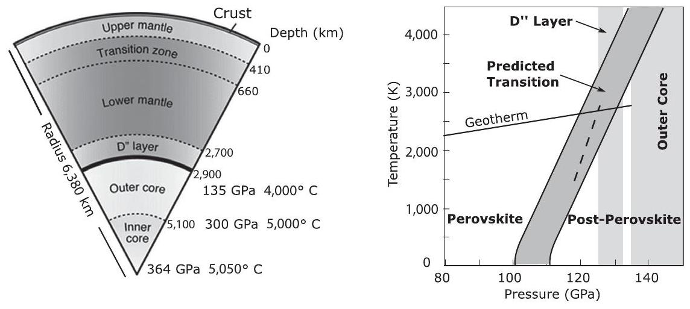
Figure 2.12. Left: structure of the interior of the earth, with pressure and temperature deep in the earth (adapted from figure at www.spring8.or.jp/). The different regions are determined from analysis of seismic waves, but experiments and theoretical calculations at high pressure and temperature are essential to determine the composition. The temperature follows the adiabatic geotherm shown at the right until it increases dramatically in the $\mathrm{D}^{\prime \prime}$ layer at the mantle/outer core boundary. Right: predicted transition to a postperovskite structure corresponding to the $\mathrm{D}^{\prime \prime}$ layer, with results that are significant for understanding the state of the lower mantle. The structure at high pressure is described in the text and the dark-shaded band is the estimated range of pressures based on the quasi-harmonic approximation with LDA and PBE GGA as lower and upper bounds. The slope from the Clausius-Clapeyron equation (see also Section 19.6) is consistent with the dashed line that was proposed earlier based on seismic data. Adapted from figure from [183].

## 2.10.1 Geophysics

One of the great challenges of geophysics is to understand the nature of the interior of the earth. As shown in the left side of Fig. 2.12, the pressure and temperature are estimated to be $\approx 135 \mathrm{GPa}, \approx 4,000 \mathrm{~K}$ at the mantle/core boundary and $\approx 330 \mathrm{GPa}, \approx 5,000 \mathrm{~K}$ at the boundary of the outer and inner core, conditions that are very difficult to reproduce in the laboratory. This is a great opportunity for simulations to make major contributions in areas described in sources such as [184] and the issue of Reviews in Mineralogy and Geochemistry on "Theoretical and Computational Methods in Mineral Physics: Geophysical Applications" [185] (https://pubs.geoscienceworld.org/rimg/issue/71/1).

The crust and the mantle are composed of silicate minerals, and $\mathrm{MgSiO}_{3}$ in the highpressure perovskite phase is believed to be the most abundant mineral in the earth's lower mantle. The possibility of a phase transition associated with the $\mathrm{D}^{\prime \prime}$ layer has been controversial, and a combination of experiment and theory led to the discovery of a transition to a new postperovskite phase, which may have important implications for the lower mantle [183]. The simulations were a milestone for applications to minerals at high pressure including thermal effects by self-consistent calculations of lattice vibrations and the quasiharmonic approximation, with results for the transition shown at the right in Fig. 2.12. The line marked geotherm is the temperature/pressure relation in the earth and the calculations show that the transition occurs in the region of the $\mathrm{D}^{\prime \prime}$ layer. The upper and

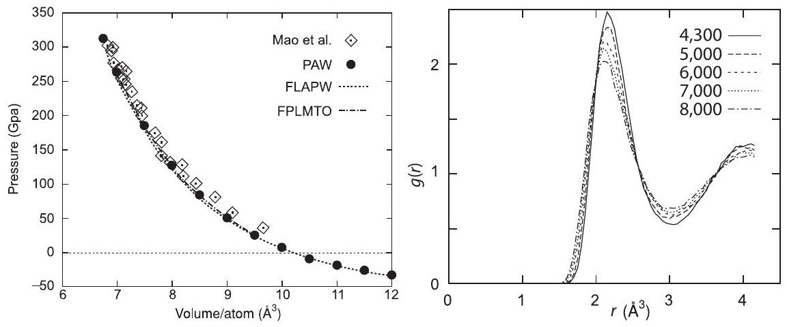
Figure 2.13. Left: pressure versus volume for hcp Fe at low temperature, which illustrates the agreement of calculations performed using ultrasoft pseudopotentials, the PAW method, and full-potential LMTO and LAPW calculations [186] and experiment [187]. Right: calculated radial density distribution $g(r)$ of liquid Fe as a function of temperature [186]. The density and the lowest temperatures $T \approx 5,000 \mathrm{~K}$ are the values expected at the inner/outer core boundary in the earth. The $\sim$ integral under the first peak is $\approx 12$ atoms indicating a close-packed liquid at all pressures. Figures from [186].

lower bounds for the theoretical prediction are based on two calculations using the LDA and PBE GGA functionals, and the experience in many materials that calculated transition pressures tend to be low using the LDA and high using PBE. The new high-pressure phase has the $\mathrm{CaIrO}_{3}$ structure with $\mathrm{SiO}_{3}$ layers intercalated by eightfold coordinated Mg ions, and the slope from the Clausius-Clapeyron equation agrees with that inferred from seismic data. The conclusion is that the solid-solid transition to an anisotropic structure may be the explanation for the inhomogeneity and topography that are key for understanding the $\mathrm{D}^{\prime \prime}$ layer in the deep lower mantle.

The core is made of Fe with other elements, and the simulations provide an example of the predictions that can be made. Before considering the calculations for the liquid, it is instructive to examine the equation of state for an Fe crystal at zero temperature. The left side of Fig. 2.13 shows the equation of state of hcp Fe up to pressures relevant for the core. The curves show that calculations made using ultrasoft pseudopotentials, the PAW method, and full-potential LMTO and LAPW calculations [186] are in agreement. They also agree with the experimental measurements made in diamond cells at low temperature [187], which gives confidence in the simulations of the liquid.

The radial density distribution for liquid Fe with fixed density $\rho=10,700 \mathrm{~kg} / \mathrm{m}^{3}$ (the value at the core/mantle boundary) is shown in the right side of Fig. 2.13 for several temperatures in which the calculated pressure ranges from 172 to 312 GPa [186]. This was done using the PAW method (Section 13.3) with forces calculated at each step of the molecular dynamics calculation, as in Section 19.2. The weight of the peak in $g(r)$ corresponds to slightly over 12 neighbors, i.e., to a close-packed liquid. As expected, the peak broadens with increasing temperature, with no abrupt transitions. The melting curve has been determined in several works, as discussed in [188].

An interesting case is carbon. Diamond is metastable at ordinary pressure but is formed under pressure deep in the earth. Simulations described in Section 19.6 find that crystalline diamond is the stable phase of carbon even under the conditions at the center of the earth. The stable structure under ordinary conditions is graphite. The many structures with threefold bonding that have been made are among the most fascinating of all materials and are central tropics in many places in this book.

## 2.10.2 Water and Aqueous Solutions

Certainly, water is the liquid most important for life. As a liquid, or in ice crystalline forms, it exemplifies the myriad of complex features due to hydrogen bonding [190-192]. Isolated molecules of $\mathrm{H}_{2} \mathrm{O}$ and small clusters can be treated accurately by the methods of quantum chemistry, and many properties of the condensed states are described by potentials that have been fitted with great effort. QMD can play a special role in determining cases that are not understood from current experimental information. Examples include the actual atomicscale nature of diffusion processes, which involves rearrangements of many molecules, the behavior of water under extreme conditions of pressure and temperature, and high-pressure phases of ice.

There are a vast number of QMD simulations of water and aqueous solutions. An example that illustrates the great advantage of methods that treat both the nuclei motion and the electronic states is the transfer of protons and accompanying transfer of electronic orbitals as shown in Fig. 2.14, which also illustrates the use of maximally localized Wannier functions (Chapter 23) to describe the electronic states. An example of a study of representative aqueous solutions containing solvated $\mathrm{Na}^{+}, \mathrm{K}^{+}$, and $\mathrm{Cl}^{-}$ions is in [193], which has references to many earlier works.

A challenge is to describe intermolecular bonding in water accurately using density functional theory. A review by Gillan et al. in 2016 [197], "Perspective: How Good Is

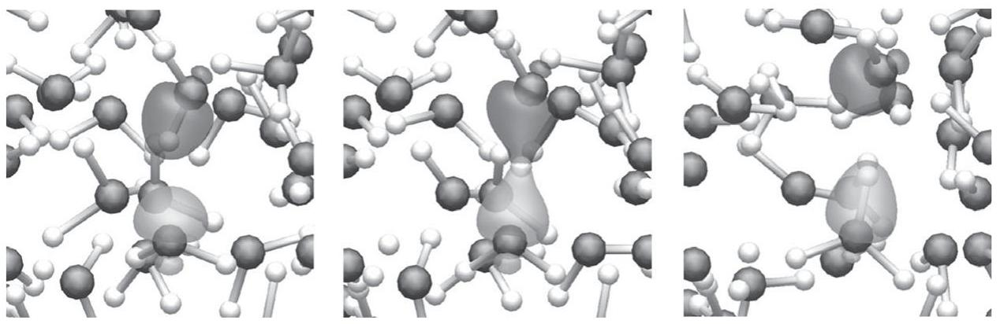
Figure 2.14. "Snapshots" of the configurations of H and O atoms in a QMD simulation of water under high-pressure, high-temperature conditions [189]. A sequence of the motion of the atoms is shown from left to right, centered on one proton that transfers, and the Wannier function for the electronic state that transfers to form $\mathrm{H}^{+}$and $\left(\mathrm{H}_{3} \mathrm{O}\right)^{-}$. (The Wannier functions are defined by the "maximal localization" condition of Chapter 23.) Provided by E. Schwegler; essentially the same as fig. 2 of [189].

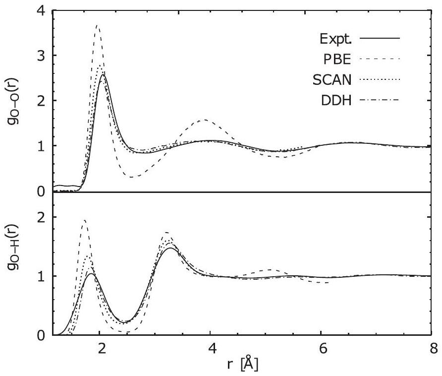
Figure 2.15. Radial density distribution functions for $\mathrm{O}-\mathrm{O}$ and $\mathrm{O}-\mathrm{H}$ in water at 300 K comparing results using different functionals described in the text: DDH [194], SCAN [195], PBE [193], and experiment [196]. Note that PBE leads to a $g(r)$ that is too structured, whereas the others are in much better agreement with experiment. Other functionals can also describe $g(r)$ with comparable accuracy [197]. Adapted from figure provided by Alex Gaiduk.

DFT for Water?," considers various configuration of molecules, ice, and simulations of the liquid; it gives many references and paints a picture that results are very sensitive to the approximations and improvements are required to unravel many issues. The local approximation gives bonding that is much too strong and some correlation functionals give bonding much too weak. As an example of recent work, the calculated radial density distributions for $\mathrm{O}-\mathrm{O}$ and $\mathrm{O}-\mathrm{H}$ distances are compared with experimental results in Fig. 2.15. Even though the PBE GGA functional is a significant improvement over LDA (not shown), it still leads to overstructure, i.e., correlations that are too strong with peaks sharper than experiment. The other functionals shown are much better: the SCAN meta functional (Section 9.4) and the DDH hybrid functional with screened long-range part (Section 9.3). Many other functionals have been tested (see the review [197]), for example, the effect of adding van der Waals functionals can improve the results [198].

There are many phases of ice, but for our purposes it is most relevant to point out that above $\approx 60 \mathrm{GPa}$ [199] the molecular form of $\mathrm{H}_{2} \mathrm{O}$ transforms to a strongly bonded structure where the hydrogen symmetric between oxygen atoms, which is a wide gap insulator as described by theoretical calculations [200]. It is interesting to note the difference from the hydrogen sulfides (see Section 2.6), where $\mathrm{H}_{2} \mathrm{~S}$ decomposes to $\mathrm{H}_{3} \mathrm{~S}$ and elemental sulfur under pressure. At high pressures $\mathrm{H}_{3} \mathrm{~S}$ also forms a structure with hydrogen in symmetric positions, but in this case it is metallic and a superconductor.

## 2.10.3 Reactions at Surfaces and Catalysis

A greater challenge yet is to describe chemical reactions catalyzed in solutions or on surfaces also in solution. As an example of the important role of theoretical calculations in understanding materials science and chemistry, QMD simulations [201, 202] have apparently explained a long-standing controversy in the Ziegler-Nata reaction that is a key step in the formation of polymers from the common alpha olefins, ethylene, and propylene. This is the basis for the huge chemical industry of polyethylene manufacture, used for "plastic" cups, grocery bags, the covers for CDs, etc. Since propylene is not as symmetric as ethylene, special care must be paid to produce a stereoregular molecular chain, where each monomer is bound to the next with a constant orientation. These high-quality polymers are intended for special use, e.g., for biomedical and space applications. The Ziegler-Nata process allows these cheap, harmless polymers to be made from common commercial gas, without strong acids, high temperatures, or other expensive procedures.

The process involves molecular reactions to form polymers at Ti catalytic sites on $\mathrm{MgCl}_{2}$ supports; an example of a good choice for the support is made by cleaving $\mathrm{MgCl}_{2}$ to form a (110) plane, as shown in Fig. 2.16. On this surface $\mathrm{TiCl}_{4}$ sticks efficiently, giving a high density of active sites. The QMD simulations find that the relevant energetics, as well as the reactivity in the alkyl chain formation process, strongly depend on the local geometry. The dynamical approach follows the reaction pathway in an unbiased way during deposition of $\mathrm{TiCl}_{4}$ and complex formation, which are energetically downhill. Constrained dynamics can then be used to determine free-energy profiles and estimate activation barriers in the alkene insertion processes. Steps in the insertion of a second ethylene molecule shown in the sequence in Fig. 2.16 offers insight into the chain growth process and the stereochemical character of the polymer, providing a complete picture of the reaction mechanism.

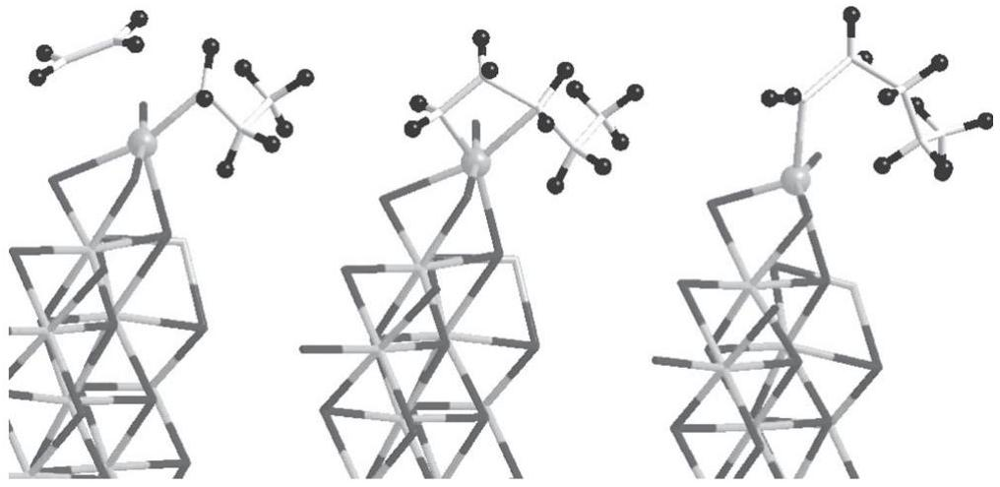
Figure 2.16. Simulation of the Ziegler-Nata reaction, which is an essential step in the production of polyethylene. Predicted steps in the main phases of the second insertion leading to the chain propagation: the $\pi$-complex (left), the transition state (middle), and insertion (right) of the ethylene molecule lengthening the polymer. Figure provided by M. Boero; essentially the same as fig. 11 of [201].

# 2.11 Surfaces and Interfaces

There is no infinite crystal in nature; every solid has a surface. More and more experiments can probe the details of the surface on an atomic scale, e.g., the scanning tunneling microscope and X-ray and electron diffraction from surfaces. Surface science is a vast subject that cannot be covered here, but a few examples are selected to illustrate the role of electronic structure theory and calculations, primarily in Chapter 22, which is devoted to surfaces, interfaces, and lower-dimensional systems, and in Chapters 25-28 on topological insulators where there are surface states with properties that were completely unknown only a few years ago. Reactions at surfaces of catalysts are particularly interesting and challenging for theory; an example is the Ziegler-Nata reaction described in Section 2.10.

## 2.11.1 Structure and Stoichiometry

It is sometimes stated that a surface is just one form of interface, an interface between a bulk solid and vacuum. But this is misleading. The so-called vacuum is really a very active, variable environment. Atoms at the surface can move and rebond and the stoichiometry can be changed by the overpressure of gasses. It is a major challenge to determine the structure, which may differ greatly from the bulk, for example, in semiconductors where the disruption of the strong covalent bonding leads to a variety of reconstructions of the surface. An example of reconstruction is the buckled dimer for Si or $\mathrm{Ge}(100)$ surfaces illustrated in Fig. 2.17. If the atoms remained in the positions as if they were in the bulk, there would be two dangling bonds, but the energy can be reduced by dimerizing to make a bond at the surface. This still leaves one dangling bond per surface atom, i.e., two halffilled states per dimer. The energy may be further reduced by a buckling as shown in the figure; one atom moves up and the other down to form a "lone pair" state primarily on one atom that is filled and an empty state primarily on the other atom. This final result in two surface bands in the bulk bandgap that are filled and empty respectively, as shown in the calculations in Fig. 22.4.

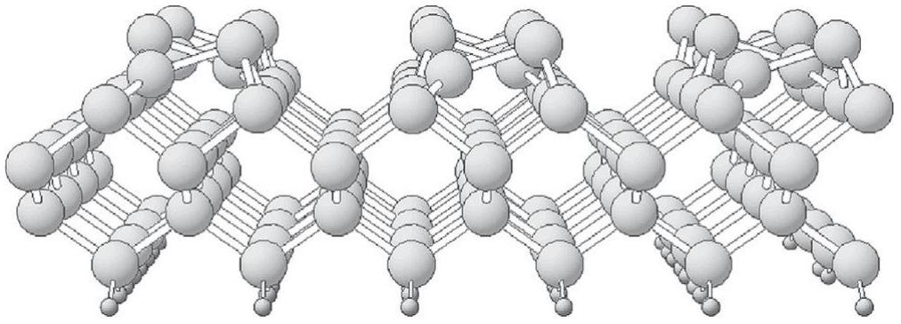
Figure 2.17. Illustration of the ( 100 ) surface of Si or Ge with buckled dimer reconstruction, where the surface atoms pair to make dimers and each dimer is buckled, i.e., one atom moves up and the other down. As explained in the text, the two atoms in the dimer are not equivalent and the electronic states of the dimer split with one filled and one empty, which finally result in two surface bands as shown in Fig. 22.4. Adapted from figure in [203].

Ionic semiconductors, such as III-V and II-VI crystals, present additional issues: not only must the total energy be compared for various possible reconstructions with the same numbers of atoms, but also one must compare anion and cation terminations with different numbers of atoms of each type, i.e., different stoichiometries. As an illuminating first step, the stoichiometry of the atoms for different types of structures can be predicted from simple electron counting rules [204, 205], i.e., charge compensation at the surface by the filling of all anion dangling bonds and the emptying of cation dangling bonds. The full analysis, however, requires that the surface energy be determined with reference to the chemical potential $\mu_{I}$ for each type of atom $I$, which can be controlled by the temperature and partial pressure in the gas (or other phase) in contact with the surface [206,207], thereby allowing experimental control of the surface stoichiometry. Assuming the bulk, surface, and gas are in equilibrium, ${ }^{10}$ the quantity to be minimized is not the free energy $E-T S$ but the grand potential [208],

$$
\Omega=E-T S-\sum_{I} \mu_{I} N_{I}
$$

How can this be properly included in the theory? Fortunately, there are simplifications in a binary AB compound [208]:

- Pressure has negligible effect on the solid and the energy $E_{\mathrm{AB}}$ is close to its value at $T=0$ (corrections for finite $T$ can be made if needed).
- Assuming that the surface is in equilibrium with the bulk, there is only one free chemical potential, which can be taken to be $\mu_{\mathrm{A}}$ since $\mu_{\mathrm{A}}+\mu_{\mathrm{B}}=\mu_{\mathrm{AB}} \approx E_{\mathrm{AB}}$.
- In equilibrium, the ranges of $\mu_{\mathrm{A}}$ and $\mu_{\mathrm{B}}$ are limited since each can never exceed the energy of the condensed pure element, $\mu_{\mathrm{A}} \leq E_{\mathrm{A}}$, and $\mu_{\mathrm{B}} \leq E_{\mathrm{B}}$.
- Therefore the allowed ranges of $\mu_{\mathrm{A}}$ and $\mu_{\mathrm{B}}$ can be determined by calculations for the elements and compound in the solid state, without any need to deal with gas phases.

This is sufficient for the theory to predict reconstructions of the surface assuming equilibrium as a function of the experimental conditions.

An instructive example is the study of various ZnSe ( 100 ) surface reconstructions [209] illustrated in Fig. 2.18. A $c(2 \times 2)$ reconstruction with half-monolayer coverage of twofold coordinated Zn atoms is stable in the Zn -rich limit. Under moderately Se-rich conditions, the surface adopts a ( $2 \times 1$ ) Se-dimer phase. In the extreme Se-rich limit, the theoretical calculations predicted a new structure with one and a half monolayer coverage of Se, proposed as an explanation for the high growth rates and migration observed in atomic layer epitaxy.

The structures in Fig. 2.18 also illustrate the importance of electrostatic effects in determining the pattern of a surface reconstruction that involves charge transfer within certain "building blocks." The preference for $c(2 \times 2)$ or ( $2 \times 1$ ) ordering of the building blocks is determined so that the electrostatic interaction (i.e., minimization of the surface Madelung energy - see Appendix F) is optimized, which was pointed out for GaAs (0 0 1) surfaces [210].
${ }^{10}$ Nonequilibrium involves kinetics that may allow other stoichiometries to be formed.

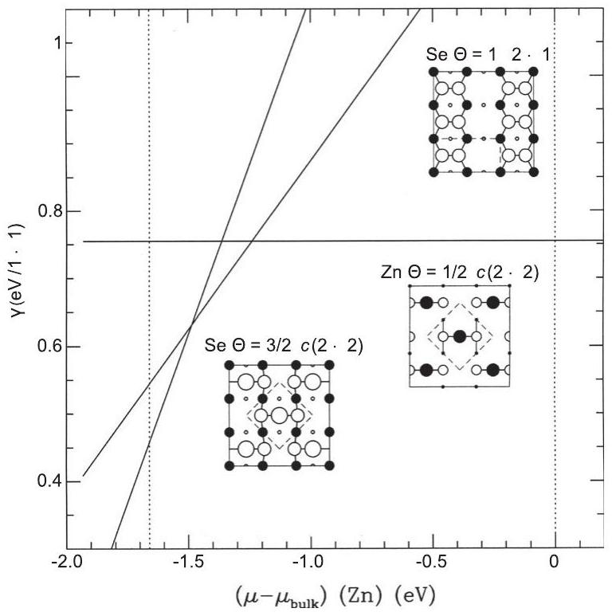
Figure 2.18. Energies of selected structures of the ( 100 ) surface of ZnSe as a function of the chemical potential (see text) calculated by the plane wave pseudopotential method. The Se-rich structure is an example of a theoretical prediction later found in experiment. Provided by A. Garcia and J. E. Northrup; essentially the same as in [209].

## 2.11.2 Surface States

Electronic states at surfaces are crucial for many properties of materials and they have a renewed relevance in electronic structure owing to the discovery of topological insulators. In Chapter 22 are two examples with comparison of theory and experiment. Gold is one of the classic examples of a metal with a Shockley surface state. Figure 22.3 illustrates the surface state in a way that brings out the importance of spin-orbit interaction and the Rashba effect. A powerful technique that allows photoemission measurements of states above the Fermi level, together with DFT calculations, show that the bands have nontrivial topological character even though gold is a metal. The theory also shows that if the spinorbit interaction were larger, there would be a full gap with surface bands due to the topology. The results have simple interpretations in models in Chapter 27, which show similar evolution of the bands as the spin-orbit interaction is increased.

Surface states of semiconductors are strongly modified from the bulk because of the disruption of the covalent bonds, and there are many examples of reconstructions. One of the simpler reconstructions is the buckled dimer structure in Fig. 2.17 and the resulting bands for Ge are shown in Fig. 22.4. There are two dangling bonds for each dimer, which are split into two surface bands since buckling makes the two sites inequivalent, with the lower energy state filled to create a lone pair and a gap to the empty surface band.

## 2.11.3 Interfaces

Owing to their importance for technology, semiconductor interfaces have been prepared and characterized with great control. Of particular importance are the "band offsets" at an interface, which confine the carriers in semiconductor quantum devices [211]. Calculation of the offset involves two aspects of electronic structure. The energies of the states in each of the two materials is defined relative to a reference for that material; this is an intrinsic property independent of the interface. However, the reference energies are shifted by long-range Coulomb terms and relative energies in the two materials depends on the interface dipole (Section F.5), which requires a calculation of the interface. Sorting out these effects are topics of Sections 22.6 and 22.7. Studies of semiconductors, described briefly in Section 22.6, are a story of theory working with experiment, with a revision of previously held rules due to theoretical calculations [211-213]. More recent calculations are providing greater accuracy and confidence in the results.

One of the great advances in man-made structures is the growth of oxide interfaces with atomic-scale precision that rivals the well-known semiconductors. This has opened an entire field of two-dimensional systems with metallic bands, and many phenomena including magnetism and superconductivity. The spark for the field was the 2004 paper by Ohtomo and Hwang [214], which reported a high-mobility electron gas at the $\mathrm{LaAlO}_{3} / \mathrm{SrTiO}_{3}$ (LAO/STO) interface. There is much work with a variety of materials and Section 22.7 brings out some of the issues related to the origin of the carriers (the "polarization catastrophe" and ways to avoid it in Fig. 22.6) and the nature of the interface bands that have common features in many of the examples shown in Fig. 22.7.

# 2.12 Low-Dimensional Materials and van der Waals Heterostructures

There is great interest in two-dimensional materials formed as sheets a single atom thick, like graphene or BN , or a single cell of compounds like $\mathrm{MoS}_{2}, \mathrm{MoSe}_{2}, \mathrm{WSe}_{2}$, and many others. They can exhibit properties completely different from usual three-dimensional materials. Graphene is the model system in many places in this book; it is the real twodimensional material that is the strongest material known in the plane; and it has exceptional thermal and electronic transport, and many other properties. Other materials are metals, insulators, piezoelectrics, superconductors, magnets, etc. An example of the materials that may be of technological importance is single-layer $\mathrm{MoS}_{2}$. Whereas bulk $\mathrm{MoS}_{2}$ has an indirect gap and only weak optical absorption, a single layer has a direct gap and absorbs light strongly. This was predicted theoretically [216] and later realized experimentally in two works about the same time [217, 218]. In Figure 22.8 are shown the bands resulting from the calculation, which also provides a simple explanation for the effects.

One of the most promising developments in new materials this century is the ability to create an almost unlimited variety of new materials by stacking layers like Lego blocks, called "van der Waals heterostructures" since the layers are weakly bonded [219, 220]. Nevertheless, they are enough in contact to stabilize the solid and influence one another so that they form entirely new materials. Figure 2.19 shows the exquisite control with

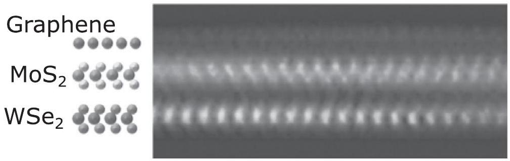
Figure 2.19. Electron microscope image of layers of graphene, $\mathrm{MoS}_{2}$, and $\mathrm{WSe}_{2}$ grown by chemical vapor deposition (CVD). This combination of layers was chosen to have large mismatch of mass densities and phonons, with the result that the thermal conductivity perpendicular to the layers is very low, less than air [215]. Provided by H. Zhang, S. Vaziri, and E. Pop.

which such structures can be made. In this case, graphene and single layers of $\mathrm{MoS}_{2}$ and $\mathrm{WSe}_{3}$ all have triangular Bravais lattices, as shown in Figs. 4.5 and 4.6, but they have very different properties. The structure in Fig. 2.19 was shown [215] to have extremely low thermal conductivity in the direction perpendicular to the layers, which is due to the large mismatch of mass density and phonon energies between the layers. The thermal resistance is greater than a layer of $\mathrm{SiO}_{2} 100$ times as thick and may be useful for thermal isolation and routing of heat flow in nanoscale systems.

# 2.13 Nanomaterials: Between Molecules and Condensed Matter

In some ways clusters with nanometer size are just large molecules, but they share the property of condensed matter that clusters can have varying size. Yet they are small enough that their properties depend on finite-size quantization effects and by the fact that a large fraction of the atoms are in surface regions. Because the structure is extremely hard to determine directly from experiment, theory has a great role to play. This is exemplified by metallic clusters, the size of which can be varied from a few atoms to macroscopic dimensions. The observation of "magic numbers" for small clusters can be understood in terms of the filling of shells in a sphere [221,222], but the details are more complex. The atomic-scale structures and optical spectra of such clusters are described in more detail in Chapter 21.

Semiconductor nanostructures have been of particular interest because confinement effects lead to large increases in the bandgaps and efficient light emission has been observed, even in Si , for which coupling to light is extremely weak in the bulk crystal. In the case of a semiconductor, broken bonds lead to reconstruction of the surface, and in the smallest clusters there is little resemblance to the bulk structures, as illustrated in Fig. 2.20. For example, in $\mathrm{Si}_{13}$ there is competition between a symmetric structure with 12 outer atoms surrounding a central atom and the low-symmetry structure found by Car-Parrinello methods and simulated annealing [223]. The symmetric structure was argued [224] to be stabilized by correlations not accounted for in the local approximation in density functional theory; however, quantum Monte Carlo calculations [225, 226] found the low-symmetry structure to be the most stable, in agreement with Car-Parrinello simulations.

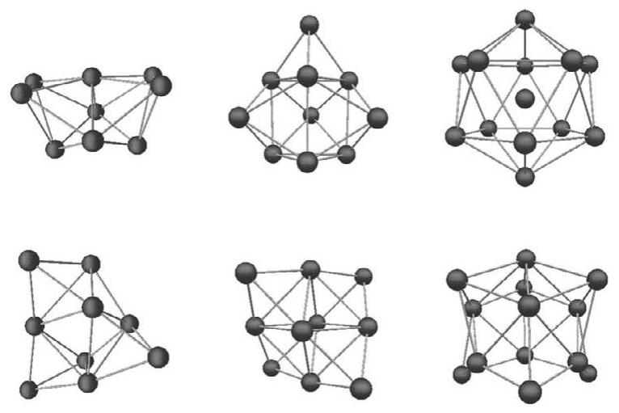
Figure 2.20. Atomic positions in competing $S i_{n}$ clusters consisting of $n=9,10$, and 13 atoms. In each case, two very different structures are shown. The correct structure is not known from direct experiments, and theory plays an important role in sorting out likely candidates. Provided by J. Grossman; from among the cases studied in [225].

On the other hand, if the surface is terminated by atoms such as hydrogen or oxygen, which remove the dangling bonds, then the cluster is much more like a small, terminated piece of the bulk. The energy of the light emitted is increased by quantum confinement of the electron states in the cluster, and the emission strength is greatly increased by breaking of bulk selection rules due to the cluster size, shape, and detailed structure. This is an ideal case for combined theoretical and experimental work to interpret experiments and improve the desired properties. Calculations using time-dependent density functional theory (Section 21.2) are used as an illustration of the methods in Chapter 21, e.g., the variation of the gaps versus size, shown in Fig. 21.3.

Many of the materials that initiated the great interest in nanomaterials are the wealth of structures that can be made from carbon: fullerenes, $\mathrm{C}_{60}, \mathrm{C}_{70}, \ldots$, [227], nanotubes in the early 1990s [228], graphene [229], and graphene ribbons in the 2000s. They are extraordinary not only because of their exceptional properties but also because of their versatility and elegant simplicity. $\mathrm{C}_{60}$ is the most symmetric molecule in the sense that its point group (icosahedral) with 120 symmetry operations is the largest point group of the known molecules. A "buckyball" has the shape of a football (soccer ball in the USA), made of 60 carbon atoms arranged in 20 hexagons and 12 pentagons. ${ }^{11}$ Interest in fullerenes increased dramatically with the discovery [230] of how to produce $\mathrm{C}_{60}$ in large enough quantities to make solids. In rapid succession it was found that intercalation of alkali-metal atoms in solid $\mathrm{C}_{60}$ leads to metallic behavior [231] and that some alkali-doped compounds (fullerides) are superconductors with transition temperatures surpassed only by the cuprates at the time.

[^8]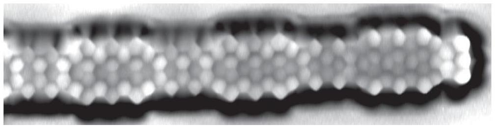
Figure 2.21. Graphene nonoribbon grown by a technique that uses self-assembled molecule precursors as a pattern [235]. This example is repeated segments of seven and nine atom widths that have different topological indices and a state at the end only for one case, as discussed in Section 26.7. Provided by Daniel Rizzo.

Nanotubes are made from graphene-like sheets (or multiple sheets) rolled into a tube [232-234] as illustrated in Fig. 14.6, which can form a great variety of semiconductors and metals. These are ideal systems in which the bands are beautifully described by theoretical rolling of the Brillouin zone of graphene. However, the curvature adds a coupling on the $\sigma$ and $\pi$ bonds not present in flat graphene sheets [232,233] and large changes in the bands can occur in tubes with very small radii, as described in Sections 13.6 and 14.8.

Graphene is a single layer of atoms, the strongest material known in the plane, a model system that is an example of a simple band structure with a Dirac point (Section 14.7), one of the first topological insulators (Section 27.8), and it can form ribbons of varying widths. Figure 2.21 shows an STM image of a patterned graphene nanoribbon synthesized on an Ag substrate using a "bottom-up" procedure that provides atomically precise control through self-assembly of small-molecule precursors [235]. The repeated patten of sevenand nine-atom width segments illustrates the fine detail that can be engineered in nanoscale systems, and it provides a realization of a one-dimensional system that can be considered to be a crystalline topological insulator (see [236] and Section 26.7).

# 2.14 Electronic Excitations: Bands and Bandgaps

Electronic excitations can be grouped into two types: excited states with the same number $N$ of electrons as the ground state, and single-particle excitations in which one electron is subtracted $N \rightarrow N-1$ or added $N \rightarrow N+1$. The former excitations determine the specific heat, linear response, optical properties, etc., whereas the latter are probed experimentally by tunneling and by photoemission or inverse photoemission.

The most important quantity for adding and removing electrons is the fundamental gap, which is the minimum difference between the energy for adding and subtracting an electron. The lowest gap is not an approximate concept restricted to independent-particle approximation. It is defined in a general many-body system as the difference in energy between adding an electron and removing one: if the ground state has $N$ electrons, the fundamental gap is

$$
E_{\mathrm{gap}}^{\min }=\min \{[E(N+1)-E(N)]-[E(N)-E(N-1)]\} .
$$

Metals are systems in which the gap vanishes and the lowest-energy electron states are delocalized. On the other hand if the fundamental gap is nonzero or if the states are localized (due to disorder) the system is an insulator.

## 2.14.1 Angle- and Energy-Resolved Photoemission (ARPES)

The primary tool for direct observation of the spectrum of energies for removing an electron as a function of the crystal momentum $\mathbf{k}$ is angle-resolved photoemission [238, 239], shown schematically in Fig. 2.22. Because the electrons are restricted to a surface region, photoemission is a surface probe and care must be taken to separate surface and bulk information. The momentum of the excitation in the crystal parallel to the surface is determined by momentum conservation as illustrated in Fig. 2.22. The dispersion perpendicular to the surface can be mapped out from the dependence on the photon energy and information about the dispersion of the excited electron inside the crystal [238,239]. In an independentparticle picture there are sharp peaks in the energies of the emitted electrons that are the eigenvalues or bands for the electrons as illustrated in Fig. 2.22. Weak interactions lead to small broadenings and shifts of the peaks, whereas strong interactions can lead to qualitative changes.

Angle-resolved photoemission was demonstrated as a quantitative experimental method in the late 1970s, as illustrated by the results for GaAs in Fig. 12.2. With dramatic improvements in resolution using synchrotron radiation, ARPES has become a powerful tool to measure the detailed dispersion and many-body effects for the one-electron removal spectrum in crystals. Inverse photoemission makes it possible to map out the electron addition spectrum. Schematically, it is inverse of ARPES shown in Fig. 2.22 but it is more difficult in practice. In many cases there are sharp peaks that describe well-defined bands

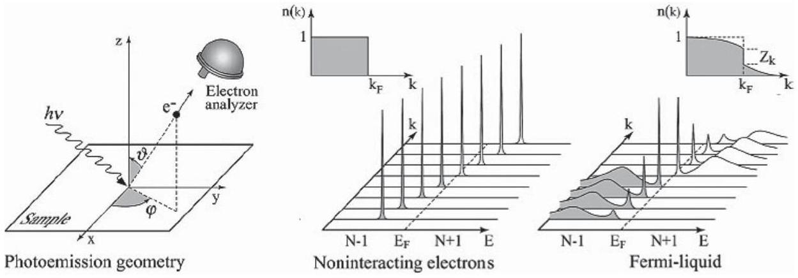
Figure 2.22. Schematic illustration of angle-resolved photoemission spectroscopy (ARPES). The middle figure shows an independent-particle spectrum of delta functions with occupation 1 or 0 . The right figure exemplifies a spectrum for interacting electrons with "quasiparticle" peaks (i.e., peaks due to dressed one-particle excitations) that correspond to bands if the peaks are very sharp. However, there are also many-body effects that cause the panels to have fractional weight and "satellites" or "sidebands" due to additional excitations that are induced in the system. These are topics of [1] and are not addressed here. (Figure modified from [237].)

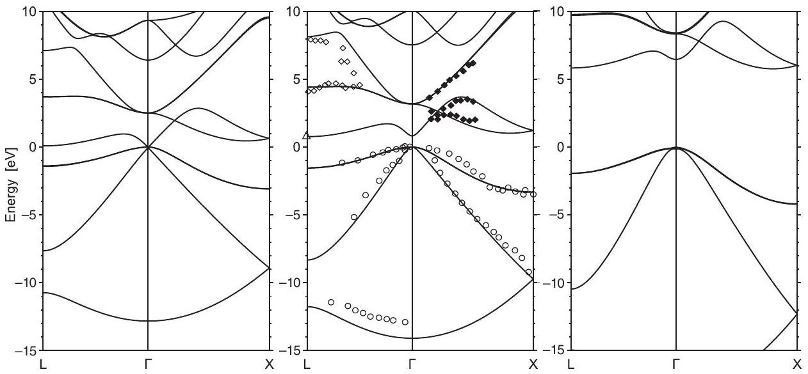
Figure 2.23. Bands for Ge from experiment (dots in the central panel) and theory using three different approximations. Left: the local density approximation where the infamous bandgap problem is so severe that it predicts Ge to be a metal. Right: the Hartree-Fock approximation with the well-known problem that the gaps are much too large. Center: the results using the HSE06 functional that is a combination of a density functional and Hartree-Fock-like exchange, as described in Section 9.3. Hybrid functionals often lead to bandgaps in much better agreement with experiment than the LDA or GGA functionals as shown in Fig. 2.24. Provided by J. Voss.

like those plotted as the points in the central Fig. 2.23 for Ge. In other cases the spectra are broader and show additional features due to interactions, as illustrated in the right side of Fig. 2.22. This is a primary topic in [1] and there are excellent reviews such as [240].

## 2.14.2 Theory and Experiment for Bands and Bandgaps

Despite the impressive agreement with experiment of many density functional theory calculations for ground state properties, the same calculations for insulators often lead to mediocre (or disastrous) predictions for excitations. Figure 2.23 illustrates the comparison of theory and experiment for Ge for both addition and removal spectra. This example is chosen because it illustrates a spectacular failure of the widely-used approach to interpret the eigenvalues of a Kohn-Sham calculation as the energies for adding and removing electrons.

The left-hand panel shows the results for the bands using the local density approximation which results in Ge predicted to be a metal, an extreme example of the "bandgap problem" which is found in many materials, as shown in Fig. 2.24. (The problem also occurs using a GGA functional such as PBE.) The central panel shows the results using a hybrid functional HSE06. The filled valence bands are almost unchanged but the conduction bands are lifted relative to the valence bands to open the gap to close to the experimental value. The improvement occurs in all the examples in Fig. 2.24 which are representative of many more materials.

The right-band panel in Fig. 2.23 shows the results of Hartree-Fock calculation for Ge. The gap is much too large, which is due to the large effect of exchange in a theory

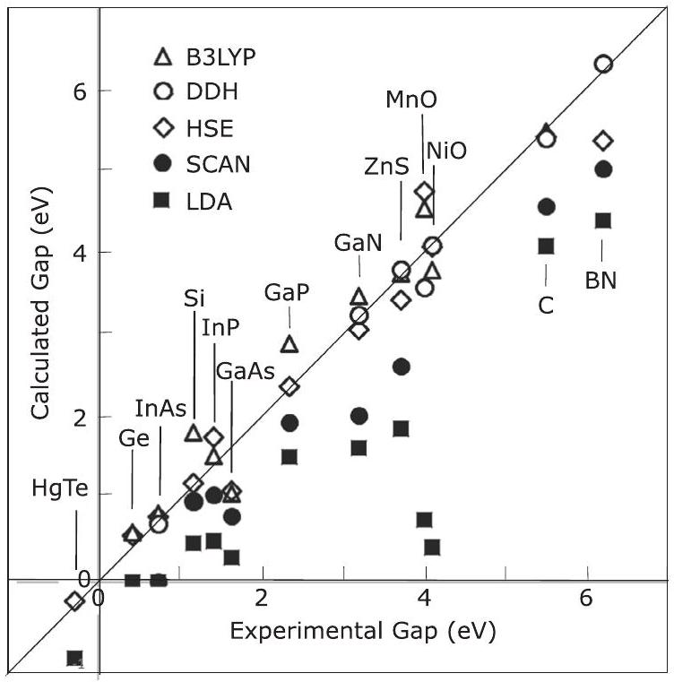
Figure 2.24. Bandgaps compared to experiment for various functionals described in Chapters 8 and 9. The LDA and meta-GGA functionals are denoted by closed symbols, and hybrid functionals by open symbols. In general, hybrid functionals are much better for gaps, but they require considerably more computational effort. Experiment, HSE06, and BLYP from [242]; LDA and SCAN from [243]; DDH from [244].

that explicitly excludes correlation. Even though it is a poor approximation, nevertheless, it is a proper theory in which it is correct to identify the eigenvalues with removal and addition energies. ${ }^{12}$ A simplistic way to understand the results of the HSE06 calculation is that it is a mixture of a density functional and Hartree-Fock. However, there is much deeper reasoning. As explained in Chapter 9, the generalized Kohn-Sham (GKS) approach provides the framework for theories to describe more than just the ground state. Within that approach, the eigenvalues of the equations can properly be viewed as approximations to the energies for adding and removing electrons.

The fundamental gap is the key issue, and widely used approximate functionals in density functional theory lead to gaps (Eq. (2.7)) that are significantly below experimental values for essentially all materials. This is illustrated by results of calculations using the local density approximation (LDA) for a range of materials, shown by the dark square symbols in Fig. 2.24. The major effect of the improved functionals is to shift the empty bands almost rigidly up relative to the filled bands, as indicated in Fig. 2.23 for Ge and the left

[^9]side of Fig. 2.25 for GaAs. Improvements also occur for wide-gap materials not shown; for example, the gap in LiF is 14.2 (exp), 8.9 (LDA), 10.0 (SCAN), 11.5 (HSE ${ }^{13}$ ), and $16.1(\mathrm{DDH})$.

Improvement in the theory of excitations in insulators is an active area of electronic structure research. In the generalized Kohn-Sham theory in Chapter 9, there are whole families of auxiliary systems that in principle lead to exact ground-state density and energy. The Kohn-Sham auxiliary system consists of independent particles, which means the exchange-correlation functional has to incorporate all aspects of exchange and correlation. If the auxiliary system has particles that interact in some way, then it could take some of the burden and make it easier to construct a functional that has to incorporate only the remaining aspects of exchange and correlation. The goal is a formulation that works at least as well as the usual Kohn-Sham approach for the ground state and also improves other properties.

# 2.15 Electronic Excitations and Optical Spectra

Dielectric functions and conductivity are among the most important response functions in condensed matter physics because they determine the optical properties of materials, electrical conductivity, and a host of technological applications. Optical spectra are perhaps the most widespread tool for studying the electronic excitations themselves. In addition, the response of the electrons to applied electric fields is directly related to the Coulomb interactions among the electrons. The phenomenological formulation of Maxwell's equations in the presence of polarizable or conducting media can be cast in terms of the complex frequency-dependent dielectric function $\epsilon(\omega)$ or conductivity $\sigma(\omega)$. The relations are summarized in Appendix E and the formulation in terms of electronic excitations is the subject of Chapter 21.

An excitation that does not change the number of electrons, e.g., an excitation created by absorbing a photon, can be viewed as the simultaneous addition of an electron and a hole, which can interact with one another. This is a traditional view that is very useful because it relates the excitation to the addition/removal spectra that can be measured separately and identifies the interaction as a quantity to be studied, e.g., in many-body pertubation theory as described in [1] and many other sources. However, it can also be viewed as an excitation of the density, which evokes the idea of a time-dependent (or frequencydependent) density functional theory. This idea was used in early work like [245] and the theory of time-dependent density functional theory (TDDFT) was put on a firm footing by derivations [246] analogous to the theorem for static density functional theory. As described in Chapter 21 TDDFT describes excitation spectra in principle exactly, and in practice feasible approximations have proven to be extremely successful.

TDDFT is now widely used, especially in the chemistry community, for optical spectra of confined systems such as molecules and clusters [247-250]. Examples of metallic clusters

[^10]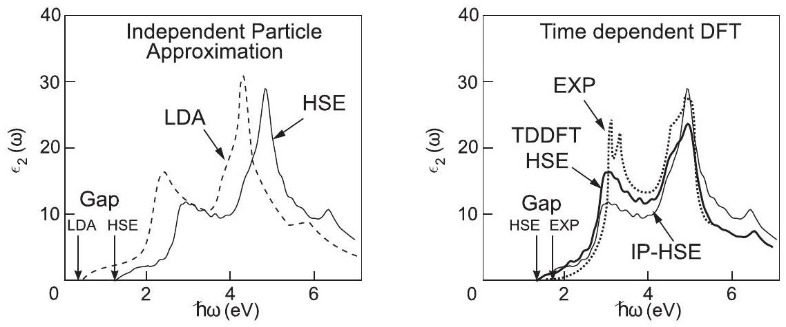
Figure 2.25. Optical spectra of GaAs comparing independent-particle and time-dependent DFT (TDDFT) for LDA and HSE functionals. The LDA has the well-known problem that the gap is much too small; the independent-particle spectrum (left) for the hybrid HSE06 functional shifted almost rigidly and the gap is closer to experiment. The gap is not changed in the TDFT spectra (right) but the weight is shifted to lower energy to be closer to experiment. LDA and experiment from [251]; HSE06 from [252].

and hydrogen-terminated Si clusters are described in Section 21.7, calculated assuming the usual adiabatic LDA functional. However, the adiabatic functional misses important physics, and the search for improved time-dependent functionals is a topic of much current research.

TDDFT is used less in condensed matter, where there are challenging issues for TDDFT. An example of optical absorption spectra is shown in Fig. 2.25 for the semiconductor GaAs. At the left is the independent-particle spectra, which is just the convolution of the filled and empty bands. The spectra for the LDA and the HSE06 hybrid functional illustrate a feature observed in many systems: the effect of the improved functional is mainly just a rigid shift of the empty states relative to the filled ones. The shift is sometimes called a scissor operation that has the effect of cutting the graph into two pieces and shifting the higher-energy part to increase the gap. At the right in Fig. 2.25 is shown the HSE06 independent-particle spectrum (the same as at the left) compared with TDDFT using the HSE functional. The first observation is that the gap does not change. As explained in Chapter 21 this is a general result, and TDDFT cannot be used to fix errors in the gap! The other observation is that the spectral weight is shifted by TDDFT so that it is closer to experiment, and we see that TDDFT has the potential to be very useful.

There is, however, a much more striking feature brought out by calculations for widegap insulators, as shown for LiF in Fig. 2.26. This is a case where the optical spectrum is dominated by excitons. The independent-particle spectrum is zero for any energy less than the gap of 14.2 eV , but the great peak is at lower energy and is completely different from the independent-particle spectrum. Furthermore, as explained in Chapter 21, the exciton peak cannot be described by any short-range functional like LDA, GGA, HSE, etc. Even though a functional like HSE06 improves the gap, it fails completely for excitons. The problem is illustrated for LDA in Fig. 2.26 and for HSE06 in the left panel of Fig. 21.5.

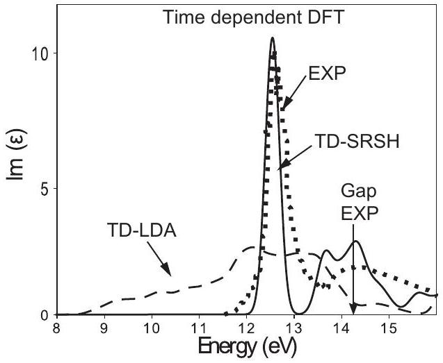
Figure 2.26. Optical spectra of LiF which is dominated by the exciton peak at 12.6 eV , which is more than 1 eV below the gap. The exciton is well described by the hybrid functional called SRSH, which has a long-range component as described in the text. That functional has been adjusted so the gap agrees with experiment, and the figure shows that there are two other exciton features below the gap. The TD-LDA has the well-known problem that the gap is much too low, but the most important point for this purpose is that it completely fails to describe the exciton peak. Any short-range functional (including hybrid HSE06 and related functionals) has the same failure to describe the dominant feature in the spectrum. See Section 21.8, especially Fig. 21.5, for a more complete discussion. Modified from a figure provided by S. Refaely-Abramson with information the same as in [253].

The difficulty in describing excitons in TDDFT is that the functional must have nonlocal character, which is very difficult to formulate in terms of the density only. Fortunately, hybrid functionals that have some fraction of long-range Hartree-Fock long exchange provide a practical solution. As shown in Fig. 2.26 such a functional can lead to exciton states below the gap and even provide quantitative descriptions of the spectrum, as discussed further in Chapter 21. In general one should not expect such quantitative agreement with experiment. The functional used for the calculations in Fig. 2.26 is a "tuned range-separated hybrid" that has been adjusted to fit the gap. Any similar function would lead to excitons very much like experiment, but the energy at which the peak occurs might not agree as well as the example in the figure.

It is ironic to resort to functionals that include long-range Hartree-Fock exchange, which is a disaster in metals (see Section 5.2), completely at variance with experiment as pointed out by Bardeen [254] in 1936. Yet the functional must have such terms in order to describe the spectra of insulators. How can this be overcome? One approach is to scale the part of the functional involving Hartree-Fock exchange by $1 / \epsilon$ so that it vanishes for metals and is large in wide-gap insulators where the dielectric constant is small. This is the guiding principle for a class of functionals described in Section 9.3 and is incorporated in the functional used in the calculations in Fig. 2.26. Another example of this type of functional is used for the molecular dynamics simulations of water in Fig. 2.15.

# 2.16 Topological Insulators

The discovery of topological insulators in 2005-2006 by Kane and Mele [86, 87] and Bernevig and Zhang [88] was one of the greatest developments in the conceptual structure of condensed matter theory since the Bloch theorem. There is a long history of topological classification of electronic states, perhaps most famously in the Hall effect (QHE) (see Appendix Q) where Thouless and coworkers in 1982 showed that the precise integer multiples of the resistance is a consequence of topology and is given by a topological invariant. However, the QHE occurs only in the presence of a strong magnetic field with no need for quantitative calculations. The discovery of topological insulators, where spin-orbit interaction leads to related effects in the absence of a magnetic field, has brought topology squarely into electronic structure.

In this book, the theme is that the topology can be understood with only knowledge of band structure and spin-orbit interaction at the level of an undergraduate solid state physics textbook. The presentation in Chapters 25-28 builds upon the concepts of Berry phases. Appendix P shows that Berry phases can be understood in general terms using only the superposition principle of quantum mechanics, and it is only a few steps to Chern numbers that are the topological invariants. The topology essential for our purposes is for the electronic system as a whole as a function of momentum $\mathbf{k}$ in the Brillouin zone, which is brought out in Chapter 25. Another theme is that there are precedents in the work of Shockley in 1939 [42], Thouless in 1984 [256], and the theory of polarization by KingSmith and Vanderbilt in 1993 [175]. This background can be found in the theory of Shockley transition and surface states in Chapter 22, electron pumps in Chapter 26 and polarization in Chapter 24. The topological character of the states in graphene nanoribbons in Fig. 2.21 is described in Section 26.7.

There is qualitatively new physics in topological insulators, the topic of Chapters 27 and 28. By including spin and spin-orbit interaction entirely new effects were found and shown to be described by a topological invariant different from any of the previous works.

In this chapter the purpose is to illustrate experimental measurements that definitively demonstrate the effects. The cover of this book is an illustration of the surface state on $\mathrm{Bi}_{2} \mathrm{Se}_{3}$ observed by photoemission [255], and the left side of Fig. 2.27 shows the same data as a cut showing the dispersion of the surface state. The right side of the figure shows the theoretical calculation [257] on the same scale, which is described in more detail in Section 28.3. This is but one of the examples of topological character, which also occurs in gold (Section 22.4), $\mathrm{HgTe} / \mathrm{CdTe}$ quantum wells (Section 27.7), graphene (Section 27.8), and many models in Chapters 26-28.

# 2.17 The Continuing Challenge: Electron Correlation

The competition between correlation due to interactions and delocalization due to kinetic energy leads to the most challenging problems in the theory of electrons in condensed

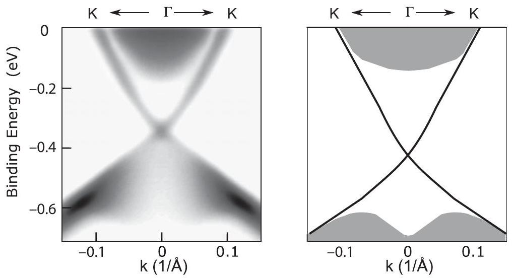
Figure 2.27. Left: ARPES measurement of the surface state of the topological insulator $\mathrm{Bi}_{2} \mathrm{Se}_{3}$, showing the Dirac point along with the continuum of bulk bands, which is the cross-section of the data shown on the cover of this book. Right: theoretical calculations taken from Fig. 28.5, plotted on the same energy and momentum scales as the experimental graph. There is no adjustment of the scales except that the theory has been positioned to approximately line up with the experimental Fermi energy for this sample, which is doped so that the Fermi energy is in the conduction band. The left figure was provided by Yulin Chen and is similar to figure 1b of [255].

matter. Correlations are responsible for metal-insulator transitions, the Kondo effect, heavy fermion systems, high-temperature superconductors, and many other phenomena (see, e.g., [240]). Low dimensionality leads to larger effects of correlation and new phenomena such as the quantum Hall effect. In one dimension, the Fermi liquid is replaced by a Luttinger-Tomanaga liquid in which the excitations are "holons" and "spinons." The broadening of quasiparticle peaks and sidebands in Fig. 2.22 requires explicit many-body methods.

These are the aspects of interactions that are the topics of [1]. However, it should be emphasized again that interactions must be taken into account in any theory that aspires to be quantitative. It is only because DFT incorporates effects of interactions with sufficient accuracy that it is now by far the dominant method in the theory of electrons in materials. It provides the wavefunctions used as the starting point for most quantitative many-body calculations. It is the method used to develop databases for materials by design and has many other uses.

As the theory of electronic structure becomes more powerful and more predictive, it is even more relevant to keep in mind the "big picture" of the possible consequences of many-body electron-electron interactions. Not only is a proper accounting of the effects of interactions essential for quantitative description of real materials, but also imaginative exploration of correlation can lead to exciting new phenomena qualitatively different from predictions of usual mean-field theories. As emphasized in the introduction, Section 1.4, the concepts are captured in the notion [81] of "more is different" with recent developments summarized in More Is Different: Fifty Years of Condensed Matter Physics [82].

**SELECT FURTHER READING**

The companion book [1] addresses many of the same issues, focusing on aspects that require manybody methods beyond density functional theory and the Kohn-Sham equations.
See the classic references at the end of Chapter 1.
More recent books that address the field of condensed matter as a whole:
Ashcroft, N. and Mermin, N., Solid State Physics (W. B. Saunders Company, New York, 1976).
Chaikin, P. N. and Lubensky, T. C., Principles of Condensed Matter Physics (Cambridge University Press, Cambridge, 1995).
Cohen, M. L. and Louie, S. G., Fundamentals of Condensed Matter Physics (Cambridge University Press, Cambridge, 2016).
Girvin S. M. and Yang K., Modern Condensed Matter Physics (Cambridge University Press, Cambridge, 2019).
Ibach, H. and Luth, H., Solid State Physics: An Inroduction to Theory and Experiment (SpringerVerlag, Berlin, 1991).
Kittel, C., Introduction to Solid State Physics (John Wiley \& Sons, New York). Many editions.
Marder, M. Condensed Matter Physics (John Wiley and Sons, New York, 2000).
Books that focus upon electronic structure:
Giustino, F., Materials Modelling Using Density Functional Theory: Properties and Predictions (Oxford University Press, Oxford, 2014).
Harrison, W. A., Elementary Electronic Structure (World Publishing, Singapore, 1999).
Kaxiras, E., Atomic and Electronic Structure of Solids (Cambridge University Press, Cambridge, 2003).

Kaxiras, E. and Joannopoulos, J. D., Quantum Theory of Materials, 2nd rev. ed. (Cambridge University Press, Cambridge, 2019).
Kohanoff, J., Electronic Calculations for Solids and Molecules: Theory and Computational Methods (Cambridge University Press, Cambridge, 2003).

[^0]:    ${ }^{1}$ Johannes van der Waals received the Nobel prize in 1910 for the equation of state for gases and liquids, first proposed in his thesis in Leiden in 1873 and developed by him in many contexts, for example, capillary action due to the weak attractive interactions. See [92] and his Nobel lecture [93] (available online at www.nobelprize.org). The explanation of the attractive force as due to polarizability was suggested by Debye in 1920, and a quantum theory was proposed by Wang in 1927 (see references in [94] and [95]); a systematic theory was developed in 1930 by Eisenschitz and London and [96, 97] for the dispersion or "London" force. We will use "dispersion" to denote the attraction via electromagnetic fields and "van der Waals" to denote weak interactions that may include other effects. See also the companion book [1].

[^1]:    ${ }^{2}$ See Table 2.1 and Section 2.5 for examples. Of course, entropy is essential for liquids and is very important for problems like the phase diagrams for minerals under deep earth conditions in Section 2.10.

[^2]:    ${ }^{3}$ A theme of the work was comparison Slater average exchange with the Kohn-Sham formula (a factor of $2 / 3$ smaller). For example, Snow [110] made a careful comparison for Cu and found the lattice constant and other properties agreed with the experiment best for a factor 0.7225 instead of $2 / 3$, the value in density functional theory.

[^3]:    ${ }^{4}$ For example, over 1,000 materials are treated in [114], which concludes that SCAN leads to significantly more accurate predicted crystal volumes and mildly improved bandgaps as compared to PBE, but calculations are about five times slower than for PBE. Hybrid functionals are compared for many systems in [115].
    ${ }^{5}$ There is another very important consideration. A main purpose for the development of hybrid functionals is to improve the prediction of bandgaps, which is a major deficiency that plagues the LDA and GGA functionals. The improvement is stressed in many places in this book, such as the gaps shown in Fig. 2.24 and there are special considerations for solids illustrated by the optical spectra in Figs. 2.25, 2.26, and 21.5.

[^4]:    ${ }^{6}$ Much of the discussion of search methods follows the review [130], which focuses on the random search methods and has an appendix with a summary of other methods. See also [131], which is about the role of structure prediction in materials discovery and design.

[^5]:    ${ }^{7}$ See, for example, the book [134]. The original reference by J. Kennedy and R. C. Eberhart [135] is a six-page paper with over 54,000 citations.

[^6]:    ${ }^{8}$ Density functional theory, discussed in the following chapters, shows that there exists a unique mean-field potential; however, no way is known of finding it exactly and there are only approximate forms at present.

[^7]:    ${ }^{9}$ The Stoner parameter $I N(0)$ can be understood simply as the product of the second derivative of the exchangecorrelation energy with respect to the magnetization (the average effect per electron) times the density of independent-particle electronic states at the Fermi energy (the number of electrons able to participate). This idea contains the essential physics of all mean-field response functions as exemplified in Appendix D and Chapters 20 and 21.

[^8]:    ${ }^{11}$ The name for the structures derives from R. Buckminster Fuller, professor at Southern Illinois University in Carbondale and a visionary engineer who conceived the geodesic dome.

[^9]:    ${ }^{12}$ It is useful to note that many-body "GW" methods are essentially random phase approximation (RPA) calculations (see Section 5.5) for the quasiparticle self-energy, originally developed for the electron gas [241]. It can be considered to be a dynamically screened exchange that reduces the effect of the Hartree-Fock exchange. See [1] for extensive discussion.

[^10]:    ${ }^{13}$ Provided by J. Paier.

