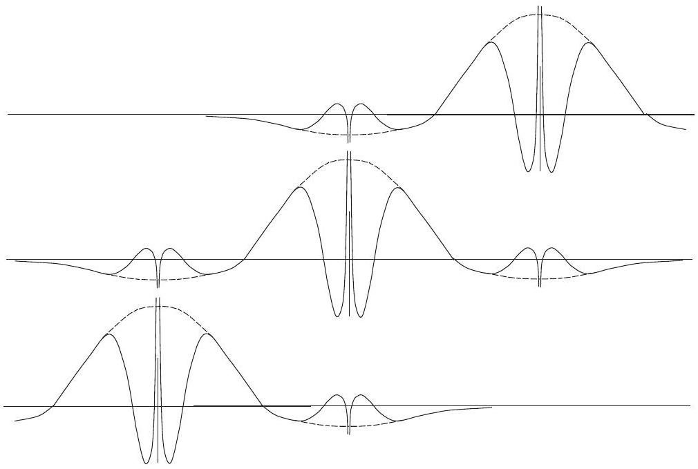
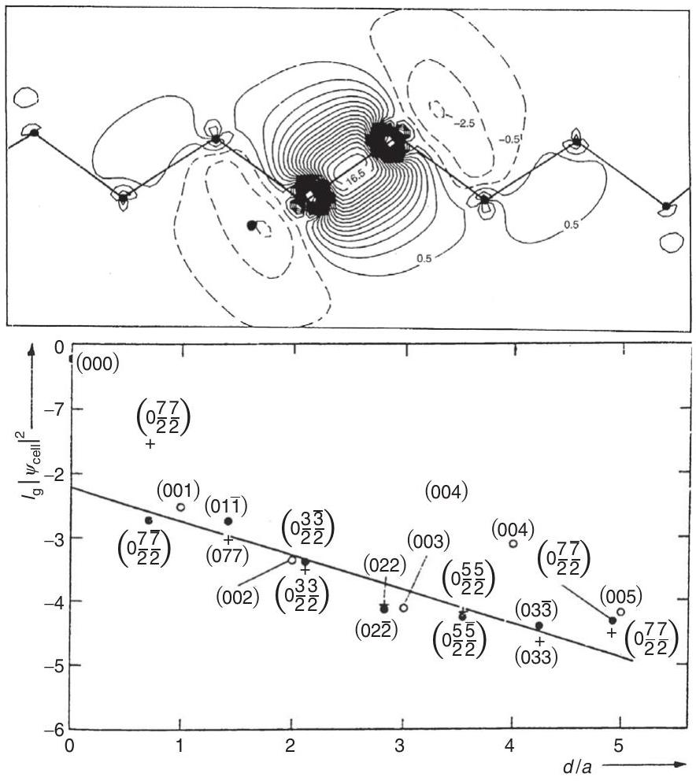
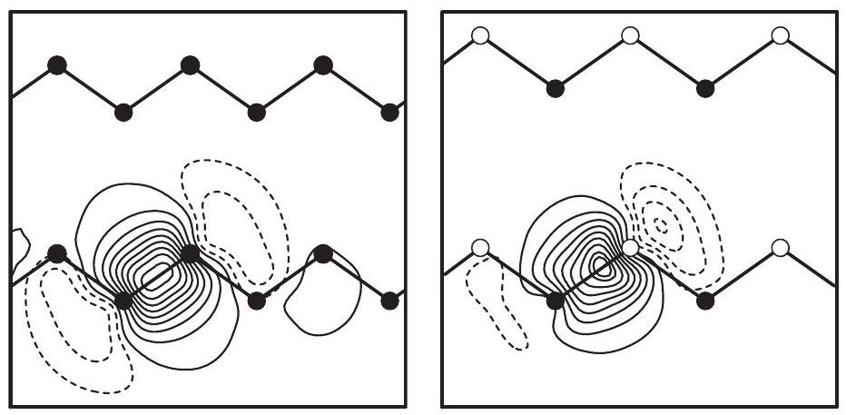
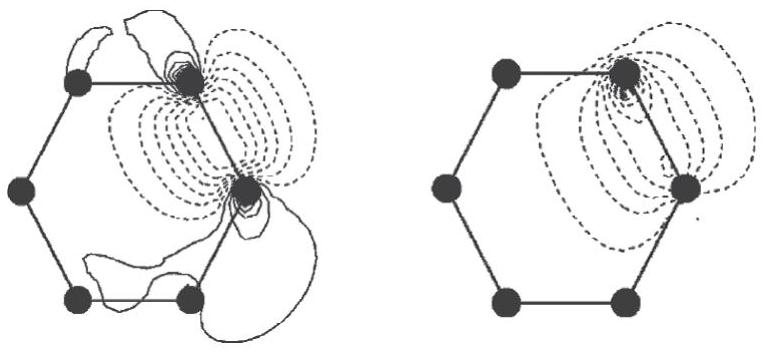
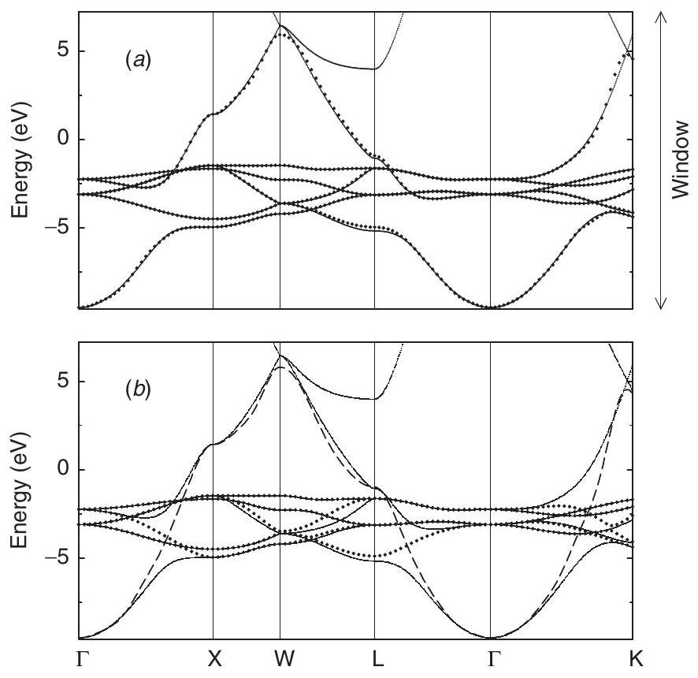

**23**

**Wannier Functions**

**Summary**

Wannier functions are enjoying a renaissance as practical tools with deep conceptual significance in electronic structure theory. There is a long history building upon the description of properties of crystals in terms of localized Wannier functions, even though their properties were not well understood and they are inherently nonunique. The focus of this chapter is the construction of functions that provide a natural description of electronic properties and are very useful, for example, in the intuitive understanding of bonds in molecules and solids, reduction of large problems to a system of only a few relevant bands with no loss of information, and in "order- $N$ " methods (Chapter 18) that require localized functions. Maximally localized Wannier functions defined in Section 23.3 are especially useful and they provide a bridge to the role of Berry phases and such important phenomena as electric polarization and topological insulators, the topics of Chapters 24-28. In this chapter it is assumed that Wannier functions exist, and it is comforting that topological arguments provide the long-sought proof for when it is possible to construct localized Wannier functions and when it is not.

# 23.1 Definition and Properties

Wannier functions are orthonormal localized functions that span the same space as the eigenstates of a band or a group of bands. They were first derived by Wannier in 1937 [889] and there are extensive reviews by Wannier [348], Blount [890], Nenciu [349], and Marzari et al. [891]. In this chapter we focus on the role of Wannier functions in practical calculations and in understanding the electronic properties of materials. However, it is very useful to point out that Wannier functions also play a central role in the theoretical advances that are providing new paradigms for condensed matter physics in terms of Berry phases and topology, which are the topics of Chapters 24-28. ${ }^{1}$

[^0]The eigenstates of electrons in a crystal are extended throughout the crystal with each state having the same magnitude in each unit cell. This has been shown in the independentparticle approximation (Section 4.3) using the fact that the hamiltonian $\hat{H}$ in Eq. (4.22) commutes with the translations operations $\hat{T}_{\mathbf{n}}$ in Eq. (4.23). Thus eigenstates of hamiltonian $\hat{H}$ are also eigenstates of $\hat{T}_{\mathbf{n}}$, leading to the Bloch theorem, Eqs. (4.33) or (12.11),

$$
\psi_{i \mathbf{k}}(\mathbf{r})=\mathrm{e}^{\mathrm{i} \mathbf{k} \cdot \mathbf{r}} u_{i \mathbf{k}}(\mathbf{r})
$$

which here is taken to be normalized in one cell. However, Eq. (23.1) does not uniquely specify the functions since overall phase of each eigenstate is arbitrary. If we are given a set of functions $\tilde{\psi}_{i \mathbf{k}}(\mathbf{r})$, e.g., the output of a diagonalization routine, we can choose functions $\psi_{i \mathbf{k}}(\mathbf{r})$ related by a "gauge transformation"

$$
\psi_{i \mathbf{k}}(\mathbf{r})=\mathrm{e}^{\mathrm{i} \alpha_{i}(\mathbf{k})} \tilde{\psi}_{i \mathbf{k}}(\mathbf{r})
$$

The transformation is a $\mathbf{k}$-dependent change of the phase of each wavefunction, which leaves all physically meaningful quantities unchanged, but it can be chosen so that the functions $\psi_{i \mathbf{k}}(\mathbf{r})$ obey desired conditions. ${ }^{2}$

Wannier functions are the Fourier transforms of the $\mathbf{k}$-dependence of the Bloch eigenstates. In this chapter we assume that there exists some set of functions denoted $\psi_{i \mathbf{k}}(\mathbf{r})$ that are smooth functions of $\mathbf{k} .^{3}$ It is also convenient to require that the Bloch functions $\psi_{i \mathbf{k}}(\mathbf{r})$ are periodic in reciprocal space, i.e., a "periodic gauge" (See also Eq. (25.2) where this is also used in the Berry phase formulation.) where they satisfy the condition

$$
\psi_{i \mathbf{k}}(\mathbf{r})=\psi_{i \mathbf{k}+\mathbf{G}}(\mathbf{r})
$$

for all reciprocal lattice vectors $\mathbf{G}$. For a single band $i$ separated from other bands, the Wannier function associated with the cell $\mathbf{n}=\left(n_{1}, n_{2}, \ldots\right)$ at position $\mathbf{T}_{\mathbf{n}}$ is defined by

$$
w_{i \mathbf{n}}(\mathbf{r})=\frac{\Omega_{\text {cell }}}{(2 \pi)^{3}} \int_{\mathrm{BZ}} \mathrm{~d} \mathrm{ke}^{-\mathrm{i} \mathbf{k} \cdot \mathbf{T}_{\mathbf{n}}} \psi_{i \mathbf{k}}(\mathbf{r})
$$

The notation $w_{i \mathbf{n}}$ for the function associated with cell $n$ is analogous to the Bloch function $\psi_{i \mathbf{k}}$ for momentum $\mathbf{k}$. The functional form can be defined as $w_{i}(\mathbf{r})$, and for other cells it is the same function translated by $\mathbf{T}_{m} w_{i \mathbf{n}}(\mathbf{r})=w_{i}\left(\mathbf{r}-\mathbf{T}_{m}\right)$, as shown schematically in Fig. 23.1. Conversely, Eq. (23.4) leads to

$$
\psi_{i \mathbf{k}}(\mathbf{r})=\sum_{m} \mathrm{e}^{-\mathrm{i} \mathbf{k} \cdot \mathbf{T}_{m}} w_{i}\left(\mathbf{r}-\mathbf{T}_{m}\right)
$$

localized functions in higher dimensions have been derived only recently [893]. The proof uses the topological properties summarized in Section 25.8 to show that it is possible to construct exponentially localized Wannier functions for crystals in which the electronic structure has "trivial topology." This justifies the assumption of localized Wannier functions for large classes of crystals, like those considered in this chapter. But one must be aware that there are other cases with nontrivial topology where it is not possible to construct localized functions.
${ }^{2}$ The properties of Wannier functions are closely related to Berry phases where it is also useful to choose a smooth gauge. The analysis in Eqs. (P.7)-(P.9) is the proof that Berry phases are gauge invariant.
${ }^{3}$ It is natural to expect that this is required for a Fourier transformation to lead to localized Wannier functions. In fact, the derivation of the conditions under which such a set of smooth functions can be found is a topological property as shown in Section 25.8.

Figure 23.1. Schematic example of Wannier functions that correspond to the Bloch functions in Fig. 4.11. Each line shows a function centered on a different site. These are for a band made of 3s atomic-like orbitals and the smooth functions denote the smooth part of the wavefunction as illustrated in Fig. 11.2.

The Bloch functions defined by Eq. (23.5) clearly obey the periodic gauge requirement (Eq. (23.3)) and in practice this is a convenient way to generate Bloch functions that are smooth functions of $\mathbf{k}$, provided it is possible to find localized Wannier functions (see footnote 1).

It is most useful to work with the periodic parts of the Bloch functions so that Eq. (23.4) can be written

$$
w_{i \mathbf{n}}(\mathbf{r})=\frac{\Omega_{\text {cell }}}{(2 \pi)^{3}} \int_{\mathrm{BZ}} \mathrm{~d} \mathbf{k} \mathrm{e}^{\mathrm{i} \mathbf{k} \cdot\left(\mathbf{r}-\mathbf{T}_{\mathbf{n}}\right)} u_{i \mathbf{k}}(\mathbf{r}) .
$$

Wannier functions, labeled $i=1,2, \ldots$, can be defined for a set of bands separated by an energy gap from other bands, as in insulator. In general, the functions are defined as a linear combination of the Bloch functions of different bands, so that the definition is an extension of Eq. (23.2). Each Wannier function is given by Eq. (23.6) with

$$
u_{i \mathbf{k}}=\sum_{j} U_{j i}^{\mathbf{k}} u_{j \mathbf{k}}^{(0)},
$$

where $U_{j i}^{\mathbf{k}}$ is a $\mathbf{k}$-dependent unitary transformation. For example, in the diamond or zinc blende semiconductors, four occupied bands together are needed to form Wannier functions with $\mathrm{sp}^{3}$ character, which have a simple interpretation in terms of chemical bonding.

It is straightforward to show (Exercise 23.3) that the Wannier functions are orthonormal

$$
\left\langle i \mathbf{m} \mid j \mathbf{m}^{\prime}\right\rangle=\int \mathrm{d} \mathbf{r} w_{i}^{*}\left(\mathbf{r}-\mathbf{T}_{\mathbf{m}}\right) w_{j}\left(\mathbf{r}-\mathbf{T}_{\mathbf{m}^{\prime}}\right)=\delta_{i j} \delta_{\mathbf{m m}^{\prime}},
$$

using Eq. (23.4) and the fact that the eigenfunctions $\psi_{i \mathbf{k}}(\mathbf{r})$ are orthonormal. The integral in Eq. (23.8) is over all space to account for the tails of the Wannier functions.

Expressions for moments of the Wannier functions can be derived by noting that

$$
\left\langle u_{i \mathbf{k}} \mid u_{j \mathbf{k}+\mathbf{q}}\right\rangle=\left\langle\psi_{i \mathbf{k}}\right| \mathrm{e}^{-\mathrm{i} \mathbf{q} \cdot \mathbf{r}}\left|\psi_{j \mathbf{k}+\mathbf{q}}\right\rangle=\sum_{\mathbf{n}} \mathrm{e}^{-\mathrm{i} \mathbf{k} \cdot \mathbf{T}_{\mathbf{n}}}\langle i \mathbf{n}| \mathrm{e}^{-\mathrm{i} \mathbf{q} \cdot \mathbf{r}}|0 j\rangle,
$$

and expanding in powers of $\mathbf{q}$. For example, the first moment is the expectation value of the position operator $\hat{\mathbf{r}}$, which can be expressed using notation analogous to Eq. (23.8) as

$$
\langle i \mathbf{n}| \hat{\mathbf{r}}|0 j\rangle=i \frac{\Omega}{(2 \pi)^{3}} \int \mathrm{~d}_{\mathbf{k}} \mathrm{e}^{-i \mathbf{k} \cdot \mathbf{T}_{\mathbf{n}}}\left\langle u_{i \mathbf{k}}\right| \nabla_{\mathbf{k}}\left|u_{j \mathbf{k}}\right\rangle
$$

Conversely

$$
\left\langle u_{i \mathbf{k}}\right| \nabla_{\mathbf{k}}\left|u_{j \mathbf{k}}\right\rangle=-i \sum_{m} \mathrm{e}^{-\mathrm{i} \mathbf{k} \cdot \mathbf{T}_{\mathbf{n}}}\langle i \mathbf{n}| \hat{\mathbf{r}}|0 j\rangle
$$

where it is understood that $\nabla_{\mathbf{k}}$ acts only to the right. Of particular importance is the first moment, which is called a "Wannier center," which is given by

$$
\langle 0 i| \hat{\mathbf{r}}|0 i\rangle=i \frac{\Omega}{(2 \pi)^{3}} \int \mathrm{~d} \mathbf{k}\left\langle u_{i \mathbf{k}}\right| \nabla_{\mathbf{k}}\left|u_{i \mathbf{k}}\right\rangle
$$

for cell 0 and is simply shifted by the lattice vector $\mathbf{T}_{\mathbf{n}}$ for other cells. Expansion to second order in $\mathbf{q}$ leads to (see Exercise 23.4)

$$
\langle i \mathbf{n}| \hat{\mathbf{r}}^{2}|0 j\rangle=-\frac{\Omega}{(2 \pi)^{3}} \int \mathrm{~d} \mathbf{k} \mathrm{e}^{-\mathrm{i} \mathbf{k} \cdot \mathbf{T}_{\mathbf{n}}}\left\langle u_{i \mathbf{k}}\right| \nabla_{\mathbf{k}}^{2}\left|u_{j \mathbf{k}}\right\rangle
$$

Even though Eqs. (23.10) and (23.12) may appear to be an innocuous integral over the Brillouin zone, this is where Berry phases and topology come into play, as discussed below and in Chapter 25.

A drawback of the Wannier representation is that the functions are not uniquely defined, i.e., there are many choices with different shapes and ranges. This can be seen from Eq. (23.4) together with Eqs. (23.2) or (23.7): the Wannier function changes because variations in $\alpha_{i}(\mathbf{k})$ or $U_{j i}^{\mathbf{k}}$ change the relative phases and amplitudes of Bloch functions for band $i$ as a function of $\mathbf{k}$.

In addition, for decades there was no proof that exponentially localized Wannier exist except for the proof by Kohn [892, 894]. The proof has finally been provided by topological analysis, which shows that it is possible for band structures that have trivial topology, and it is not possible to construct localized Wannier functions that have the crystal symmetry for cases with nontrivial topology as discussed in Section 25.8.

Nevertheless, there is an important property of Wannier functions that is unique: it is invariant to the choice of gauge, i.e., it is the same for all choices of $\alpha_{i}(\mathbf{k})$ and $U_{j i}^{\mathbf{k}} \cdot{ }^{4}$ The first moment of a Wannier function $\langle 0 i| \hat{\mathbf{r}}|0 i\rangle$ is the mean position, termed a Wannier center,

[^1]is given in Eq. (23.12). Blount [890] has shown that the sum of the centers of the Wannier functions in a cell is invariant, and a more recent proof based on Berry phases is derived in Chapter 24. Of course, Blount and others understood that a rigid shift of all the Wannier functions by a lattice constant must have no effect except possibly an overall phase. It is now understood that this can be incorporated in the theory in terms of Berry phases that are invariant except for additions of multiples of $2 \pi$, with profound implications in the quantum mechanical theory of polarization and topological insulators, which are the topics of Chapters 24 and 25.

# 23.2 Maximally Projected Wannier Functions

The term "maximally projected Wannier functions" is introduced here to describe a simple, intuitive approach for construction of Wannier functions sufficient to choose the phases of the Bloch functions so that the Wannier function is maximum at a chosen point. The simplest example has been analyzed by Kohn [892, 894]: for a crystal with one atom per cell and a single band derived from s-symmetry orbitals, the Wannier function $w_{i}(\mathbf{r})$ on site $\mathbf{T}_{m}=0$ can be chosen to be the sum of Bloch functions $\psi_{\mathbf{k}}(\mathbf{r})$ with phases such that $\psi_{\mathbf{k}}(0)$ is real and positive for each $\mathbf{k}$. The Wannier function thus defined by Eq. (23.6) is maximal on site 0 and decays as a function of distance from 0 . In the case of a onedimensional crystal, it has been proven [892, 894] that the decay is exponential and that this is the only exponentially decaying Wannier function that is real and symmetric about the origin.

This approach can be extended to more general cases by requiring that the phase of the Bloch function be chosen to have maximum overlap with a chosen localized function, i.e., maximum projection of the function. An example is a p-symmetry atom-centered Wannier function chosen to have maximal overlap with a p atomic-like state on an atom in the cell at the origin. Maximum projection on any orbital in the basis is easy to accomplish in localized basis representations, simply by choosing the phase of each Bloch function so that the amplitude is real and positive for the given orbital. In a plane wave calculation, for example, it means taking a projection much like the projectors for separable pseudopotentials (Section 11.8). For bond-centered functions, one can require maximal overlap with a localized bonding-like function.

Stated in this broad way, the construction leads to a transformation of the electronic structure problem into a new basis of localized orthonormal orbitals. This is the basis of the formulations of Bullett [895] and Anderson [896], which provide a fundamental way of deriving generalized Hubbard-type models [460, 461]. This approach is used, for example, to calculate model parameters for orbitals centered on Cu and O in $\mathrm{CuO}_{2}$ materials [897] and for orbitals that span a space of d and s symmetry functions in Cu metal [898].

A construction often used in "order- $N$ " calculations is to find functions localized to a sphere within some radius around a given site. This can be interpreted as "maximal overlap" with a function that is unity inside the sphere and zero outside, usually applied with the boundary condition that the function vanish at the sphere boundary.

Figure 23.2. Top: bond-centered Wannier function for Si calculated [728] by requiring the phases of the Bloch functions to have real, positive amplitude at one of the four equivalent band centers. Note the similarity to Fig. 23.3. Bottom: the decay of the Wannier function in various directions, plotted on a log scale.

## 23.2.1 Bond-Centered Wannier Function in Silicon

The construction of bond-centered Wannier functions in diamond structure crystals is discussed by Kohn [894], and careful numerical calculations have been done by Satpathy and Pawlowska [728] for Si - the standard test case, of course. The calculations used the LMTO method (Chapter 17), in which the orbitals are described in terms of functions centered on the atoms (and on empty spheres). A bond-centered Wannier function is generated simply by choosing the phases of the Bloch functions to be positive on one of the four bond centers in a unit cell. The function can then be plotted in real space as shown in Fig. 23.2; note the striking resemblance to the "maximally localized" function shown below on the left-hand side of Fig. 23.3.

Satpathy and Pawlowska [728] also showed numerically that the bond-centered function decays exponentially, as shown in Fig. 23.2. This is perhaps the first such accurate numerical test of the exponential decay in solids like Si , which has since been found in many other calculations. Presumably the reason for the similarity of the Wannier functions for Si in Figs. 23.2 and 23.3 is related to Kohn's proof in one dimension that the function is uniquely
fixed by the requirements that the function be real, symmetric, and exponentially decaying, bolstered by the knowledge that such exponentially decaying functions exist in systems like Si with trivial topology of the electronic structure.

# 23.3 Maximally Localized Wannier Functions

Finding highly localized Wannier functions (or transforms of Wannier functions) with desired properties is a venerable subject chemistry (see, e.g., the paper of Boys [899] and many references cited in the review [891], where they are called "localized molecular orbitals''). Such functions are useful in constructing efficient methods (see Chapter 18 on "order- $N$ " algorithms) and in providing insight through simple descriptions of the electronic states using a small number of functions.

Although there are many possible ways to define "maximally localized," ${ }^{5}$ one stands out: minimization of the mean square spread $\Omega$ defined by

$$
\Omega=\sum_{i=1}^{N_{\mathrm{bands}}}\left[\left\langle r^{2}\right\rangle_{i}-\langle\mathbf{r}\rangle_{i}^{2}\right],
$$

where $\langle\cdots\rangle_{i}$ means the expectation value over the $i$ th Wannier function in the unit cell (whose total number $N_{\text {bands }}$ equals the number of bands considered). As shown by Marzari and Vanderbilt [900], this definition leads to an elegant formulation, in which a part of the spread, Eq. (23.14), can be identified as an invariant (Eq. (23.16) below). Furthermore, this invariant part leads to a physical measure of localization as shown by Souza et al. [901] (see Section 24.6).

Because the Wannier functions are not unique, the $\Omega$ defined in Eq. (23.14) is not invariant under gauge transformations of the Wannier functions [900]. Nevertheless, Marzari and Vanderbilt were able to decompose $\Omega$ into a sum of two positive terms: a gauge-invariant part $\Omega_{I}$, plus a gauge-dependent term $\widetilde{\Omega}$ :

$$
\begin{aligned}
\Omega & =\Omega_{I}+\widetilde{\Omega}, \\
\Omega_{I} & \left.=\left.\sum_{i=1}^{N_{\text {bands }}}\left[\left\langle r^{2}\right\rangle_{i}-\sum_{\mathbf{T} j}|\langle\mathbf{T} j| \hat{\mathbf{r}}| 0 i\right\rangle\right|^{2}\right], \\
\widetilde{\Omega} & \left.=\sum_{i=1}^{N_{\text {bands }}} \sum_{\mathbf{T} j \neq 0 i}|\langle\mathbf{T} j| \hat{\mathbf{r}}| 0 i\right\rangle\left.\right|^{2} .
\end{aligned}
$$

Clearly, the second term $\widetilde{\Omega}$ is always positive. The clever part of the division in Eq. (23.15), however, is that $\Omega_{I}$ is both invariant and always positive. Furthermore, it has a simple interpretation that may be seen by identifying the projection operator $\hat{P}$ onto the space spanned by the $N_{\text {bands }}$ bands, ${ }^{6}$

[^2]$$
\hat{P}=\sum_{i=1}^{N_{\text {bands }}} \sum_{\mathbf{T}}|\mathbf{T} i\rangle\langle\mathbf{T} i|=\sum_{i=1}^{N_{\text {bands }}} \sum_{\mathbf{k}}\left|\psi_{i \mathbf{k}}\right\rangle\left\langle\psi_{i \mathbf{k}}\right|,
$$
and $\hat{Q}=1-\hat{P}$ defined to be the projection onto all other bands. Writing out Eq. (23.16) leads to the simple expression (here $\alpha$ denotes the vectors index for $\mathbf{r}$ )
$$
\Omega_{I}=\sum_{i=1}^{N_{\text {bands }}} \sum_{\alpha=1}^{3}\langle 0 i| \hat{\mathbf{r}}_{\alpha} \hat{Q} \hat{\mathbf{r}}_{\alpha}|0 i\rangle,
$$
which is manifestly positive (Exercise 23.5). The presence of the $\hat{Q}$ projection operator leads to an informative interpretation of Eq. (23.19) as the quantum fluctuations of the position operator from the space spanned by the Wannier functions into the space of the other bands. This can also be viewed as a consequence of the fact that the position operator does not commute with $\hat{P}$ or $\hat{Q}$ (Exercise 23.8), so that expression (23.19) is not simply the mean square width of the Wannier function. Instead $\Omega_{I}$ is an invariant, as is apparent in the explicit expressions in $\mathbf{k}$ space given below. ${ }^{7}$ Furthermore, the fact that Eq. (23.19) represents fluctuations leads to the physical interpretation of $\Omega_{I}$ is brought out in Section 24.6.

## 23.3.1 Practical Expressions in k Space

Expressions for $\Omega_{I}$ and $\widetilde{\Omega}$ in terms of the Bloch states can be derived by substituting the definitions of the Wannier functions, Eq. (23.6), into Eqs. (23.16) and (23.17). It is an advantage for practical calculations to write the formulas in terms of discrete sums instead of integrals using Eq. (12.14). If one uses a finite difference approximation for the derivatives w.r.t $\mathbf{k}$ in Eqs. (23.10) and (23.13), one finds [900]

$$
\langle\mathbf{r}\rangle_{j}=\frac{i}{N_{k}} \sum_{\mathbf{k b}} w_{\mathbf{b}} \mathbf{b}\left[\left\langle u_{j \mathbf{k}} \mid u_{j \mathbf{k}+\mathbf{b}}\right\rangle-1\right],
$$

and

$$
\left\langle r^{2}\right\rangle_{j}=\frac{1}{N_{k}} \sum_{\mathbf{k b}} w_{\mathbf{b}}\left[2-\operatorname{Re}\left\langle u_{j \mathbf{k}} \mid u_{j \mathbf{k}+\mathbf{b}}\right\rangle\right],
$$

where $\mathbf{b}$ denotes the vectors connecting the points $\mathbf{k}$ to neighboring points $\mathbf{k}+\mathbf{b}$, and $w_{\mathbf{b}}$ denotes the weights in the finite difference formula.

Although these formulas reduce to the integral in the limit $\mathbf{b} \rightarrow 0$, they are not acceptable because they violate the fundamental requirement of translation invariance for any finite $\mathbf{b}$. If one makes the substitution $\psi_{i \mathbf{k}}(\mathbf{r}) \rightarrow \mathrm{e}^{-\mathrm{ik} \cdot \mathbf{T}_{m}} \psi_{i \mathbf{k}}(\mathbf{r})$, the expectation values should change by a translation,

[^3]$$
\begin{aligned}
\langle\mathbf{r}\rangle_{j} & \rightarrow\langle\mathbf{r}\rangle_{j}+\mathbf{T}_{m} \\
\left\langle r^{2}\right\rangle_{j} & \rightarrow\left\langle r^{2}\right\rangle_{j}+2\langle\mathbf{r}\rangle_{j} \cdot \mathbf{T}_{m}+T_{m}^{2}
\end{aligned}
$$
so that $\Omega$ is unchanged. These properties are not obeyed by Eqs. (23.20) or (23.21).
Acceptable expressions can be found [900] that have the same limit for $\mathbf{b} \rightarrow 0$ yet satisfy Eq. (23.22). Functions with the desired character are complex log functions that have a Taylor series expansion, $\ln (1+i x) \rightarrow i x-x^{2}+\cdots$ for small $x$ (similar to Eqs. (23.20) and (23.21) for $x$ real), but are periodic functions for large $\operatorname{Re}\{x\}$. If we define $\left\langle u_{i \mathbf{k}} \mid u_{j \mathbf{k}+\mathbf{b}}\right\rangle \equiv M_{i j}(\mathbf{k}, \mathbf{b})$, Eqs. (23.20) and (23.21) can be replaced by ${ }^{8}$ (Exercise 23.6)
$$
\langle\mathbf{r}\rangle_{j}=\frac{i}{N_{k}} \sum_{\mathbf{k b}} w_{\mathbf{b}} \mathbf{b} \operatorname{Im} \ln M_{j j}(\mathbf{k}, \mathbf{b}),
$$
and
$$
\left\langle r^{2}\right\rangle_{j}=\frac{1}{N_{k}} \sum_{\mathbf{k b}} w_{\mathbf{b}}\left\{1-\left|M_{j j}(\mathbf{k}, \mathbf{b})\right|^{2}+\left[\operatorname{Im} \ln M_{j j}(\mathbf{k}, \mathbf{b})\right]^{2}\right\}
$$

The invariant part can be found in a way similar to Eq. (23.24) with the result

$$
\Omega_{I}=\frac{1}{N_{k}} \sum_{\mathbf{k b}} w_{\mathbf{b}}\left[N_{\text {bands }}-\sum_{i j}^{N_{\text {bands }}}\left|M_{i j}(\mathbf{k}, \mathbf{b})\right|^{2}\right],
$$

which is positive (Exercise 23.7). The meaning of this term and closely related expressions are given in Section 24.6.

In one dimension it is possible to choose Wannier functions so that $\widetilde{\Omega}=0$, i.e., the minimum possible spread. However, in general, it is not possible for $\widetilde{\Omega}$ to vanish in higher dimensions. This follows (Exercise 23.8) from the expression for $\widetilde{\Omega}$, given later in Eq. (23.30), and the fact that the projected operators $\{\hat{P} \hat{x} \hat{P}, \hat{P} \hat{y} \hat{P}, \hat{P} \hat{z} \hat{P}\}$ do not commute, i.e., the matrices representing the matrix elements $\langle\mathbf{T} i| \hat{x}\left|\mathbf{T}^{\prime} j\right\rangle$ do not commute.

## 23.3.2 Minimization by Steepest Descent

Finding Wannier functions that are maximally localized can be accomplished by minimizing the spread, Eq. (23.24), as a function of the Bloch functions. (This means minimizing $\widetilde{\Omega}$ since $\Omega_{I}$ is invariant.) For a given set of Bloch functions $u_{j \mathbf{k}}^{(0)}$, one can consider all possible unitary transformations given by Eq. (23.7), which can be written in the form

$$
\mathbf{M}(\mathbf{k}, \mathbf{b})=\left[\mathbf{U}^{\mathbf{k}}\right]^{\dagger} \mathbf{M}^{(\mathbf{0})}(\mathbf{k}, \mathbf{b}) \mathbf{U}^{\mathbf{k}+\mathbf{b}}
$$

where $\mathbf{M}$ and $\mathbf{U}$ are understood to be matrices in the band indices. To minimize, one can vary $\mathbf{U}^{\mathbf{k}}$, which is done most conveniently by defining

$$
\mathbf{U}^{\mathbf{k}}=\mathrm{e}^{\mathbf{W}^{\mathbf{k}}}
$$

[^4]
Figure 23.3. "Maximally localized" Wannier functions for Si (left) and GaAs (right) from [900]. Each figure shows one of the four equivalent functions found for the four occupied valence bands. Provided by N. Marzari

where $\mathbf{W}^{\mathbf{k}}$ is an antihermitian matrix (Exercise 23.15). The solution can be found by the method of steepest descent (Appendix L). The gradient can be found by considering infinitesimal changes, $\mathbf{U}^{\mathbf{k}} \rightarrow \mathbf{U}^{\mathbf{k}}\left(\mathbf{1}+\delta \mathbf{W}^{\mathbf{k}}\right)$. Expressions for the gradient,

$$
\frac{\delta \Omega}{\delta \mathbf{W}^{\mathbf{k}}}=\mathbf{G}^{\mathbf{k}},
$$

in $\mathbf{k}$ space are given in [900]; we will give equivalent expressions in (23.30) and (23.31) that bring out the physical meaning. Choosing $\delta \mathbf{W}^{\mathbf{k}}=\epsilon \delta \mathbf{G}^{\mathbf{k}}$ along the steepest decent direction leads to a useful minimization algorithm, which corresponds to updating the $\mathbf{M}$ matrices at each step $n$

$$
\mathbf{M}^{(\mathbf{n}+\mathbf{1})}(\mathbf{k}, \mathbf{b})=\mathrm{e}^{-\delta \mathbf{W}^{\mathbf{k}}} \mathbf{M}^{(\mathbf{n})}(\mathbf{k}, \mathbf{b}) \mathrm{e}^{\delta \mathbf{W}^{\mathbf{k}+\mathbf{b}}},
$$

where the exponentiation can be done by diagonalizing $\delta \mathbf{W}$.
Examples of Wannier functions calculated by this "maximal localization" prescription are shown in Fig. 23.3 for Si and GaAs [900]. These functions are derived by considering the full set of four occupied valence bands, leading to four equivalent bonding-like orbitals. For GaAs there is an alternative possibility: since the four valence bands consist of one wellseparated lowest band plus three mixed bands at higher energy, Wannier functions can be derived separately for the two classes of bands. The result is one function that is primarily s-like centered on the As atom and three functions primarily p-like on the As atom [900]. However, these Wannier functions do not lead to the maximum overall localization, so that the bonding orbitals appear to provide the most natural picture of local chemical bonding.

## 23.3.3 Wannier Functions in Disordered Systems

Up to now the derivations have focused entirely on crystals and have used Bloch functions. How can one find useful maximally localized functions for noncrystalline systems, such as molecules or disordered materials? This is particularly important for interpretation
purposes and for calculations of electric polarization in large Car-Parrinello-type simulations (Chapter 19), where often calculations are done only for periodic boundary conditions, i.e., for $\mathbf{k}=0$. Many properties, such as the total dipole moment of the sum of Wannier functions, are invariant (Section 24.4), so any approach that finds accurate Wannier functions is sufficient. For other properties, it is desirable to derive maximally localized functions.

The most direct approach is to construct "maximally projected" functions (Section 23.2) that are chosen to have weight at a center or maximum overlap with a chosen function. A closely related procedure is actually used in the "order- $N$ " linear-scaling methods (see Section 18.6) that explicitly construct Wannier-like functions constrained to be localized to a given region [777]. These methods provide an alternative approach for direct construction of Wannier functions without ever constructing eigenstates.

It is also useful to construct "maximally localized" functions. For example, they are directly useful in the concept of localization (Section 24.6). The functions can be derived by minimizing $\widetilde{\Omega}$ given by Eq. (23.17). It follows from the definitions (as shown in Appendix A of [900] and further elucidated in [902] and [903]), that Eq. (23.17) can be written as

$$
\widetilde{\Omega}=\operatorname{Tr}\left[\hat{X}^{\prime 2}+\hat{Y}^{\prime 2}+\hat{Z}^{\prime 2}\right]
$$

where $X_{i j}=\langle 0 i| \hat{x}|0 j\rangle,\left[X_{D}\right]_{i j}=X_{i i} \delta_{i j}$, and $X_{i j}^{\prime}=X_{i j}-\left[X_{D}\right]_{i j}$, with corresponding expressions for $\hat{Y}$ and $\hat{Z}$. For an infinitesimal unitary transformation $|i\rangle \rightarrow|i\rangle+ \sum_{j} \delta W_{j i}|j\rangle$, the gradient of Eq. (23.30) can be written as (see Exercise 23.16) $\delta \Omega= 2 \operatorname{Tr}\left[\hat{X}^{\prime} \delta \hat{X}+\hat{Y}^{\prime} \delta \hat{Y}+\hat{Z}^{\prime} \delta \hat{Z}\right]$, where $\delta \hat{X}=[\hat{X}, \delta \hat{W}]$, etc. Finally, one finds $\delta \Omega=\operatorname{Tr}[\delta \hat{W} \hat{G}]$, where

$$
\frac{\delta \widetilde{\Omega}}{\delta \hat{W}}=\hat{G}=2\left\{\left[\hat{X}^{\prime}, \hat{X}_{D}\right]+\left[\hat{Y}^{\prime}, \hat{Y}_{D}\right]+\left[\hat{Z}^{\prime}, \hat{Z}_{D}\right]\right\}
$$

These forms are the most compact expressions for $\widetilde{\Omega}$ and its gradient. They are directly useful in real-space calculations in terms of Wannier functions $w_{i}(\mathbf{r})$; the corresponding forms in $\mathbf{k}$ space [900] can be derived using the transformations of Section 23.1 and used in Eq. (23.28).

Examples of Wannier functions calculated at steps in a quantum molecular dynamics simulation of water under high-pressure, high-temperature conditions are shown in Fig. 2.14. Three "snapshots" during a simulation show a sequence that involves a proton transfer and the associated transfer of a Wannier function (only this one of all the Wannier functions is shown) to form $\mathrm{H}^{+}$and $\left(\mathrm{H}_{3} \mathrm{O}\right)^{-}$.

# 23.4 Nonorthogonal Localized Functions

One can also define a set of nonorthogonal localized orbitals $\tilde{w}_{i}$ that span the same space as the Wannier functions $w_{i}$ and which can be advantageous for practical applications and for intuitive understanding. Just as for Wannier functions, one must choose some criterion for "maximal localization" to fix the $\tilde{w}_{i}$. The work of Liu et al. [774] is particularly illuminating
since it uses the same mean square radius criterion as in Eq. (23.14). It provides a practical approach for calculating the functions directly related to optimizing functionals in $\mathrm{O}(N)$ methods (Section 18.6).

The transformation to nonorthogonal $\tilde{w}_{i}$ can be defined by

$$
\tilde{w}_{i}=\sum_{j=1}^{N_{\text {bands }}} A_{i j} w_{j}
$$

where $A$ is a non-singular matrix that must satisfy

$$
\sum_{i=1}^{N_{\mathrm{bands}}}\left(A_{i j}\right)^{2}=1
$$

since the $\tilde{w}_{i}$ are defined to be normalized. The mean square spread, Eq. (23.14), generalizes to [774]

$$
\Omega[A]=\sum_{i=1}^{N_{\mathrm{bands}}}\left[\left\langle\tilde{w}_{i}\right| r^{2}\left|\tilde{w}_{i}\right\rangle-\left\langle\tilde{w}_{i}\right| \mathbf{r}\left|\tilde{w}_{i}\right\rangle^{2}\right],
$$

which is to be minimized as a function of the matrix $A$ subject to two conditions: $A$ is nonsingular and satisfies Eq. (23.33). It is simple to enforce the latter condition; however, it is not so simple to search only in the space of nonsingular matrices. It is shown in [774] that one can use the fact that a nonsingular matrix must have full rank, i.e., $\operatorname{rank}(A)=N$. Using $\operatorname{rank}(A)=\operatorname{rank}\left(A^{\dagger} A\right)$ and the variational principle, Eq. (18.33), developed for minimizing the energy functional [746] with $S \rightarrow A^{\dagger} A$, the result is

$$
\operatorname{rank}(A)=-\min \left\{\operatorname{Tr}\left[\left(-A^{\dagger} A\right)\left(2 X-X A^{\dagger} A X\right)\right]\right\},
$$

which is minimized for all hermitian matrices $X$. Defining a constraint functional $\Omega_{a}[A, X]=\left(N-\operatorname{Tr}\left(\left(A^{\dagger} A\right)\left(2 X-X A^{\dagger} A X\right)\right)\right)^{2}$, it follows that maximally localized nonorthogonal orbitals $\tilde{w}_{i}$ can be found by minimizing $\Omega[A]+C_{a} \min \left\{\Omega_{a}[A, X]\right\}$, for all matrices $A$ that satisfy Eq. (23.33). Here $C_{a}$ is an adjustable positive constant and the second term ensures that the final transformation matrix $A$ is nonsingular (Exercise 23.17).

An example of maximally localized orbitals for a benzene molecule is shown in Fig. 23.4, where we see that the nonorthogonal orbitals are much more localized and much easier to interpret as simple bonding orbitals than the corresponding orthogonal orbitals. The short range of the nonorthogonal orbitals can be used in calculations to reduce the cost, for example, in $\mathrm{O}(N)$ methods as discussed in Section 18.6.

# 23.5 Wannier Functions for Entangled Bands

The subject of this section is construction of Wannier-type functions that describe bands in some energy range even though they are not isolated and are "entangled" with other bands. Strictly speaking, Wannier functions as defined in Section 23.1 will not be useful; if the bands cannot be disentangled then there will be nonanalytic properties resulting

Figure 23.4. Comparison of orthogonal and nonorthogonal maximally localized orbitals for $\mathrm{C}-\mathrm{C} \sigma$ bonds (left) and $\mathrm{C}-\mathrm{H}$ bonds (right) in benzene $\mathrm{C}_{6} \mathrm{H}_{6}$. The nonorthogonal orbitals are more localized and more transferrable than the orthonormal ones. In order to be orthonormal they must have tails that extend into neighboring atoms, and the tails must change when transferred to another system with different neighbors. From [774].

from mixing with other bands in the integrals over the Brillouin zone. However, one can define useful functions that have real-space properties like Wannier functions and form an orthonormal, localized basis for a subspace of bands that span a desired range of energies.

There are two basic approaches for construction of functions that span a desired subspace. One approach is to identify the type of orbitals involved and to generate a reduced set of localized functions that describes the energy bands over a given range. Outside that range, the full band structure is, of course, not reproduced: the reduced set of bands has an upper and a lower bound, i.e., they form a set of isolated bands in the reduced space. This is in essence the idea of "maximally projected" functions in Section 23.2, but now constrained only to match the bands over some range. An example of such an approach is the "downfolding" method [735, 905], the results of which are illustrated in Figs. 17.8 and 17.9. The single orbital centered on a Cu atom is sufficient to accurately describe the main band that crosses the Fermi energy without explicitly including the rest of the "spaghetti" of bands.

The second approach [898, 904] generalizes the idea of "maximally localized" Wannier functions (Section 23.3) to maximize the overlap with Bloch functions only over an energy window. This also generates a finite subspace of bands that describes the actual bands only within the chosen range. Of course, the functions are not unique since there are many choices for the energy range and weighting functions. Two calculations for Cu , done using pseudopotentials and plane waves [904] and the LMTO method [898], give very similar results for the desired bands, but with different localized functions. For example, maximally localized functions constructed from 6d and s bands taken together are each centered in interstitial positions near the Cu atom [904]. The bands for the six-dimensional subspace of orbitals are given in Fig. 23.5, which shows that the band structure is accurately represented for energies extended to well above the Fermi energy, even though the higher bands are missing. The lower panel of the figure shows a different decomposition with the subspace decomposed into 5d orbitals (which have the expected form of atom-centered d orbitals in a cubic symmetry crystal) plus the complement that is an optimal s-symmetry orbital. Similar results for the bands are found using the LMTO method [898] where the authors also showed that the functions decay exponentially (or at least as a very high power).

Figure 23.5. Bands of Cu produced by maximally localized Wannier-like functions [904]. Top panel: functions that span the six-dimensional subspace for the five d states and one s state compared to the full band structure. Similar results for the bands are found in [898]. The bands are accurately reproduced up to well above the Fermi energy, even though the higher bands are missing. The lower panel shows results if the subspace is decomposed into the five d orbitals (chosen as maximally localized with a narrow energy window around the primarily d bands) plus the complement that is the s orbital. From [904].

# 23.6 Hybrid Wannier Functions

The derivations in the previous section can be modified to define functions that are "hybrid" Wannier and Bloch functions. ${ }^{9}$ In dimensions greater than one, these are localized along only one direction but extended in the other perpendicular directions. The crystal can be considered to be composed of planes separated by the distance $L_{\text {cell }}$, the length of the cell in the $\hat{x}$ direction, and $X_{n}$ denotes translations that are integral multiples of $L_{\text {cell }}$. If $x$ denotes the position and $\mathbf{k}$ is resolved into components $k, \mathbf{k}_{\perp}$, where $k$ is along the $\hat{x}$ direction and $\mathbf{k}_{\perp}$ along the perpendicular directions, a hybrid function can be defined by the one-dimensional integral over a cell,

$$
w_{i n, \mathbf{k}_{\perp}}(\mathbf{r})=\frac{L_{\text {cell }}}{2 \pi} \int \mathrm{~d} k \mathrm{e}^{\mathrm{i} k\left(x-X_{n}\right)} u_{i k, \mathbf{k}_{\perp}}(\mathbf{r}),
$$

[^5]which is a function of the momentum $\mathbf{k}_{\perp}$ along the perpendicular directions. A hybrid is a function of position $\mathbf{r}$ like the usual Wannier and Bloch functions, but it is expressed as a function that is localized in one direction and extended in the other directions with momentum $\mathbf{k}_{\perp}$. Hybrid functions can be used like one-dimensional Wannier functions of a single variable $x$ with $\mathbf{k}_{\perp}$ considered as a parameter. For example, an important property is the Wannier center in the $x$ direction for function $i$ in the one-dimensional cell 0 for each $\mathbf{k}_{\perp}$ given by
$$
\langle 0 i| x|0 j\rangle_{\mathbf{k}_{\perp}}=i \frac{L_{\text {cell }}}{2 \pi} \int \mathrm{~d} k\left\langle u_{i k, \mathbf{k}_{\perp}}\right| \partial_{k}\left|u_{i k, \mathbf{k}_{\perp}}\right\rangle,
$$
for each $\mathbf{k}_{\perp}$.
Hybrid functions are especially useful for problems that involve surfaces or interfaces that are periodic in a plane (or a line for the edge of a two-dimensional system) but there may be bands of states that are localized in the direction parallel to the surface normal. The centers of the hybrid functions play a central role in understanding topological insulators as described in Chapters 25-28.

# 23.7 Applications

There are a host of uses of Wannier functions or Wannier-like localized functions. Here we list a few examples and refer to the review [891] for a host of other examples and references.

One major use is to construct Bloch functions with desired properties using the reverse transformation in Eq. (23.5). For example, the fine details of band structures can be worked out using Bloch functions that vary smoothly with $\mathbf{k}$, called Wannier interpolation. This is much more efficient and instructive than a brute force method of calculation on a very fine grid in $\mathbf{k}$. A relatively crude interpolation may not provide the most accurate energies, but the fact that the Bloch functions vary smoothly can reveal the details of bands near critical points and avoid crossings with very small gaps. Great accuracy in the energies and the fine details can be achieved by high-quality interpolation. An example is the details of the band structure of Fe including spin-orbit interaction where there are many tiny features that have large effects in transport [906]. The details are especially important for phenomena due to Weyl nodes (Section 28.4), both for quantitative accuracy and for qualitative understanding. A much more extensive discussion of applications is in [891].

Wannier functions appear often in the following chapters on polarization and topology. The theoretical expressions often assume smooth Bloch functions to derive the elegant formulations in terms of Berry phases. In turn, the results are often best expressed in terms of Wannier functions, which provide intuitive, instructive interpretations.

Another category of applications is large-scale calculations where localized functions present great advantages. Examples are cases like calculation of the band structure and conductance of complex nanostructures [907]. One of the methods in Section 13.4 to treat nonlocal exchange in hybrid functionals in plane wave calculations uses a transformation to Wannier functions. Even if they are not used in the calculation, they are very useful
in analysis, for example, the snapshots of the Wannier function for an electron associated with a proton that is transferred in a simulation of water in Fig. 2.14. Linear-scaling $\mathrm{O}(N)$ methods in Chapter 18 are based on the fact that the hamiltonian is sparse in localized functions. There are many choices and in general it is best not to use orthogonal Wannier functions, which are longer range and less transferable than nonorthogonal functions. However, generalized Wannier functions (see Section 18.6) are an effective approach.

Wannier functions are also a means to develop models that go beyond the purview of standard Kohn-Sham or other independent-particle calculations. Essentially all models used in interacting many-body problems are based on localized orthogonal basis functions, for example, the Hubbard model. In order to apply the models to actual problems in materials the parameters must be gotten from some other method, and more and more, they are derived from Wannier functions from Kohn-Sham calculations. This is often the approach to derive the interaction $U$ in the DFT+U methods in Section 9.6, which is also the basis for the parameters in the models used in dynamical mean field theory (see [1]). Despite the inherent nonuniqueness, there are arguments supporting the choices and often maximally localized functions are used. The issues and applications are a major topic of [1].

**SELECT FURTHER READING**

Basic theory of Wannier functions:
Ashcroft, N. W. and Mermin, N. D., Solid State Physics (W. B. Saunders Company, Philadelphia, 1976).

Weinreich, G., Solids: Elementary Theory for Advanced Students (John Wiley \& Sons, New York, 1965).

In-depth presentation including topology and relation to polarization:
Vanderbilt, D. H., Berry Phases in Electronic Structure Theory (Cambridge University Press, Cambridge, 2018).

Review of maximally localized functions with many references to older work:
Marzari, N., Mostofi, A. A., Yates, J. R., Souza, I., and Vanderbilt, D. H., "Maximally localized Wannier functions: Theory and application," Rev. Mod. Phys. 84:1419-1475, 2012.

**Exercises**

23.1 This exercise is to construct a localized Wannier function for the s bands described in Section 14.5 and Exercises 14.6 and 14.7. The hamiltonian has only nearest-neighbor matrix elements $t$ and the basis is assumed to be orthogonal. For all cases (line, square, and simple cubic lattices), show that one can choose the periodic part of the Bloch functions $u_{i \mathbf{k}}(\mathbf{r})$ to be real, in which case they are independent of $\mathbf{k}$. Next, show from the definition, Eq. (23.6), that this choice leads to the most localized possible Wannier function, which is identical to the basis function.
23.2 This exercise is to analyze Wannier functions for s bands as described in Exercise 23.1, except that the basis is nonorthogonal with nearest-neighbor overlap $s$. Show that one can choose the
periodic part of the Bloch functions $u_{i \mathbf{k}}(\mathbf{r})$ to be real, and find the $\mathbf{k}$ dependence of $u_{i \mathbf{k}}(\mathbf{r})$ as a function of $s$. (Hint: for nonorthogonal functions, the normalization coefficient given in Exercise 14.4 is $\mathbf{k}$ dependent, which is relevant for constructing the Wannier function using Eq. (23.6).) Show that the resulting Wannier function has infinite range; even though it decays rapidly, its amplitude does not vanish at any finite distance.
23.3 Derive Eq. (23.8) using definition Eq. (23.6) and properties of the eigenfunctions.
23.4 Show that Expression (23.13) to second order in $\mathbf{q}$ follows in analogy to the expansion that leads to Eq. (23.9).
23.5 Show that $\Omega_{I}$ is always positive by noting that $\hat{Q}=\hat{Q}^{2}$ so that Eq. (23.19) can be written as the sum of expectation values of squares of operators.
23.6 Show that Eqs. (23.23) and (23.24) have the same limit for $\mathbf{b} \rightarrow 0$ as Eqs. (23.20) and (23.21), and that they obey the translation invariance conditions, Eq. (23.22). Show further that this means that $\Omega$ is unchanged.
23.7 Show that $\Omega_{I}$ in Eq. (23.25) is positive using the definition of the $\mathbf{M}$ matrices and the fact that the overlap of Bloch functions at different $\mathbf{k}$ points must be less than unity.
23.8 Explain why it is not possible to make $\widetilde{\Omega}$ vanish in higher dimensions.
(a) First show that the projected operators $\{\hat{P} \hat{x} \hat{P}, \hat{P} \hat{y} \hat{P}, \hat{P} \hat{z} \hat{P}\}$ do not commute. Show this is equivalent to the statement that $\hat{x}$ and $\hat{P}$ do not commute. Then show that $\hat{x}$ and $\hat{P}$ do not commute.
(b) Use the fact that noncommuting operators cannot be simultaneously diagonalized to complete the demonstration.
23.9 Demonstrate that it is possible to find functions with $\widetilde{\Omega}=0$ in one dimension by explicitly minimizing $\widetilde{\Omega}$ for a one-band, nearest-neighbor tight-binding model with overlap (see definitions in Section 14.5):

$$
H_{i, i \pm 1}=t ; \quad S_{i, i \pm 1}=s,
$$

where $S_{i, i}=1$.
(a) First consider the case with $s=0$ : show that in this artificial model the minimum spread is the spread of the basis function. However, one can also choose more delocalized states, e.g., the eigenstates.
(b) For $s \neq 0$, find the minimum spread $\Omega_{I}$ as a function of $t$. Show it is greater than in part (a). For explicit evaluation of the spread $\Omega_{I}$, use Eq. (21.23) with the eigenvectors given by analytic solution of the Schrödinger equation and the sum over $k$ done approximately on a regular grid of values in one dimension.
23.10 See exercises in Chapter 26 for solutions for the two-site model in Fig. 26.2, which is also used in Exercises 23.11 and 23.12.
23.11 This exercise is to construct maximally localized Wannier functions for the one-dimensional ionic dimer model in Fig. 26.2 using the fact that the gauge-dependent term in it can be made to vanish.
(a) Let $t_{1}=t_{2}$ so that each atom is at a center of symmetry. Show that the maximally localized Wannier function for the lower band is centered on the atom with lower energy $\varepsilon_{A}$ or $\varepsilon_{B}$, and the function for the upper band is centered on the atom with higher
energy. (Hint: if there is a center of inversion the periodic part of the Bloch functions can be made real.)
(b) Similarly, there are two centers of inversion if $\varepsilon_{A}=\varepsilon_{B}$ and $t_{1} \neq t_{2}$. Show that in this case the Wannier functions are centered respectively on the strong and the weak bonds between the atoms.
(c) In each of the cases above, calculate the maximally localized Wannier function as a sum of localized basis functions. The eigenfunctions can be calculated analytically and the Wannier functions constructed using the definition in Eq. (21.3) and approximating the integral by a sum over a regular grid of $k$ points. (This can be done with a small computer code. Note that the grid spacing must be small for a small gap between the bands.)
23.12 Using the model of Exercise 23.11 and the methods described in Section 23.3, construct a computer code to calculate the centers of the Wannier functions in a general case, $\varepsilon_{A} \neq \varepsilon_{B}$ and $t_{1} \neq t_{2}$. This can be used to find polarization and effective charges as described in Exercises 24.8 and 24.9.
23.13 Construct the maximally localized Wannier function for the lowest band in the onedimensional continuum model of Exercise 12.5. Show that the function is centered at the minimum of the potential. Calculate the functions using the analytic expressions for the Bloch functions and the same approach as in Exercise 23.11, part (c).
23.14 See Exercise 15.6 for a project to construct Wannier functions in one dimension.
23.15 Show that $\mathbf{U}^{\mathbf{k}}$, defined in Eq. (23.27), is unitary if $\mathbf{W}^{\mathbf{k}}$ is antihermitian, i.e., $W_{i j}=-W_{j i}^{*}$.
23.16 Show that the gradient, Eq. (23.31), follows from the definitions. To do this, verify the operator commutation relations, and note that $\operatorname{Tr}\left[\hat{X}^{\prime} \hat{X}_{D}\right]=0$, etc.
23.17 Show that the minimization of the functional $\Omega[A]+C_{a} \min \left\{\Omega_{a}[A, X]\right\}$ leads to the desired solution of a nonsingular transformation to nonorthogonal orbitals. Hint: use the conditions stated following Eq. (18.33) and the relations given in Eqs. (23.32)-(23.35).

[^0]:    ${ }^{1}$ As far as the present chapter is concerned, the essential assumption is that it is possible to find localized Wannier functions. The proof in one dimension was given years ago by Kohn [892], but the conditions for existence of

[^1]:    ${ }^{4}$ There are some restrictions on the allowed choices of $\alpha_{i}(\mathbf{k})$ and $U_{j i}^{\mathbf{k}}$ that they must be continuous and obey the boundary conditions. See also Section P.2.

[^2]:    ${ }^{5}$ For example, a widely used criterion is to maximize the self-Coulomb interaction.
    ${ }^{6}$ This is the same as defined in Eq. (20.20), except that here the sum need not be over all occupied states.

[^3]:    ${ }^{7}$ An interesting feature is that $\Omega_{I}$ can be expressed in terms of a "metric" that defines the "quantum distance" along a given path in the Brillouin zone [900]. This "distance" quantifies the change of character of the occupied states $u_{n \mathbf{k}}$ as one traverses the path, leading to the heuristic interpretation of $\Omega_{I}$ as representing a measure of the dispersion throughout the Brillouin zone [900].

[^4]:    ${ }^{8}$ These forms are not unique and alternatives are pointed out in [900]. See Eq. (24.13) for the corresponding expressions derived using Berry phases.

[^5]:    ${ }^{9}$ It would be more accurate and informative to call these hybrid Wannier-Bloch functions, but we choose the simpler notation hybrid Wannier functions.

