Classification of crystals and their excitations by symmetry is a general approach applicable to electronic states, vibrational states, and other properties. The first part of this chapter deals with translational symmetry, which has the same universal form in all crystals and which leads to the Bloch theorem that rigorously classifies excitations by their crystal momentum. (The discussion here follows Ashcroft and Mermin, [280], chapters 4-8.) The other relevant symmetries are time reversal and point symmetries. The latter depend on the specific crystal structure and are treated only briefly; detailed classification can be found in texts on group theory. Timereversal symmetry is relatively simple to formulate but has profound consequences.

# 4.1 Structures of Crystals: Lattice + Basis

A crystal is an ordered state of matter in which the positions of the nuclei (and consequently all properties) are repeated periodically in space. It is completely specified by the types and positions of the nuclei in one repeat unit (primitive unit cell) and the rules that describe the repetition (translations).

- The positions and types of atoms in the primitive cell are called the basis. The set of translations, which generates the entire periodic crystal by repeating the basis, is a lattice of points in space called the Bravais lattice. Specification of the crystal can be summarized as
Crystal structure = Bravais lattice + basis.
- The crystalline order is described by its symmetry operations. The set of translations forms a group because the sum of any two translations is another translation. ${ }^{1}$ In addition

[^0]there may be other point operations that leave the crystal the same, such as rotations, reflections, and inversions. This can be summarized as
$$
\text { Space group }=\text { translation group }+ \text { point group. }{ }^{2}
$$

## 4.1.1 The Lattice of Translations

First we consider translations, since they are intrinsic to all crystals. The set of all translations forms a lattice in space, in which any translation can be written as integral multiples of primitive vectors,

$$
\mathbf{T}(\mathbf{n}) \equiv \mathbf{T}\left(n_{1}, n_{2}, \ldots\right)=n_{1} \mathbf{a}_{1}+n_{2} \mathbf{a}_{2}+\ldots,
$$

where $\mathbf{a}_{i}, i=1, \ldots, d$ are the primitive translation vectors and $d$ denotes the dimension of the space. For convenience we write formulas valid in any dimension whenever possible and we define $\mathbf{n}=\left(n_{1}, n_{2}, \ldots, n_{d}\right)$.

In one dimension, the translations are simply multiples of the periodicity length $a$, $T(n)=n a$, where $n$ can be any integer. The primitive cell can be any cell of length $a$; however, the most symmetric cell is the one chosen symmetric about the origin ( $-a / 2, a / 2$ ) so that each cell centered on lattice point $n$ is the locus of all points closer to that lattice point than to any other point. This is an example of the construction of the Wigner-Seitz cell.

The left-hand side of Fig. 4.1 shows a portion of a general lattice in two dimensions. Space is filled by the set of all translations of any of the infinite number of possible choices of the primitive cell. One choice of primitive cell is the parallelogram constructed from the two primitive translation vectors $\mathbf{a}_{i}$. This cell is often useful for formal proofs and for simplicity of construction. However, this cell is not unique since there are an infinite number of possible choices for $\mathbf{a}_{i}$. A more informative choice is the Wigner-Seitz cell, which is symmetric about the origin and is the most compact cell possible. It is constructed by drawing the perpendicular bisectors of all possible lattice vectors $\mathbf{T}$ and identifying the Wigner-Seitz cell as the region around the origin bounded by those lines.

In two dimensions there are special choices of lattices that have additional symmetry when the angles between the primitive vectors are $90^{\circ}$ or 60 . In units of the length $a$, the translation vectors are given by

$$
\begin{array}{lll}
\quad & \text { square } & \text { rectangular } \\
\mathbf{a}_{1}=(1,0) & (1,0) & (1,0) \\
\mathbf{a}_{2}=(0,1) & \left(0, \frac{b}{a}\right), & \left(\frac{1}{2}, \frac{\sqrt{3}}{2}\right) .
\end{array}
$$

Examples of crystals having, respectively, square and triangular Bravais lattices are shown later in Fig. 4.5.

[^1]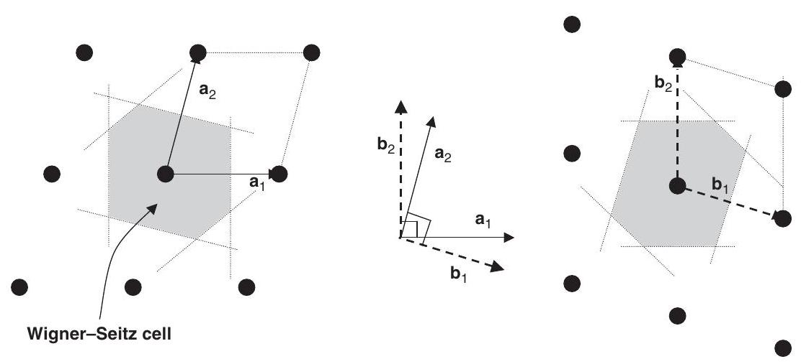
Figure 4.1. Real and reciprocal lattices for a general case in two dimensions. In the middle are shown possible choices for primitive vectors for the Bravais lattice in real space, $\mathbf{a}_{1}$ and $\mathbf{a}_{2}$, and the corresponding reciprocal lattice vectors, $\mathbf{b}_{1}$ and $\mathbf{b}_{2}$. In each case two types of primitive cells are shown, which when translated fill the two-dimensional space. The parallelogram cells are simple to construct but are not unique. The Wigner-Seitz cell in real space is uniquely defined as the most compact cell that is symmetric about the origin; the first Brillouin zone is the Wigner-Seitz cell of the reciprocal lattice.

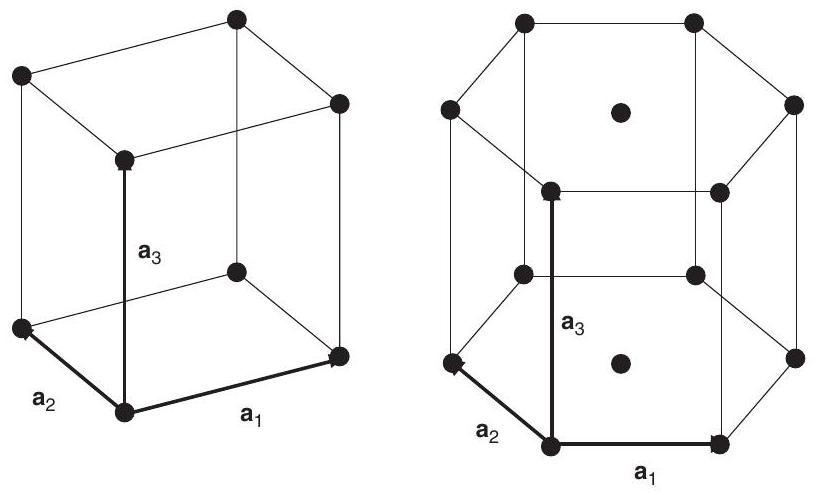
Figure 4.2. Simple cubic (left) and simple hexagonal (right) Bravais lattices. In the simple cubic case, the cell shown is the Wigner-Seitz cell and the Brillouin zone has the same shape. In the hexagonal case, the volume shown contains three atoms; the Wigner-Seitz cell is also a hexagonal prism rotated by $90^{\circ}$ and $1 / 3$ the volume. The reciprocal lattice is also hexagonal and rotated from the real lattice by $90^{\circ}$, and the Brillouin zone is shown in Fig. 4.10.

Figures 4.2-4.4 show examples of three-dimensional lattices that occur in many crystals. The primitive vectors can be chosen to be (in units of $a$ )

$$
\begin{array}{llll}
\quad \text { simple cubic } & \text { simple hex. } & \text { fcc } & \text { bcc } \\
\mathbf{a}_{1}=(1,0,0) & (1,0,0) & \left(0, \frac{1}{2}, \frac{1}{2}\right) & \left(-\frac{1}{2}, \frac{1}{2}, \frac{1}{2}\right), \\
\mathbf{a}_{2}=(0,1,0) & \left(\frac{1}{2}, \frac{\sqrt{3}}{2}, 0\right) & \left(\frac{1}{2}, 0, \frac{1}{2}\right) & \left(\frac{1}{2},-\frac{1}{2}, \frac{1}{2}\right), \\
\mathbf{a}_{3}=(0,0,1) & \left(0,0, \frac{c}{a}\right) & \left(\frac{1}{2}, \frac{1}{2}, 0\right) & \left(\frac{1}{2}, \frac{1}{2},-\frac{1}{2}\right) .
\end{array}
$$

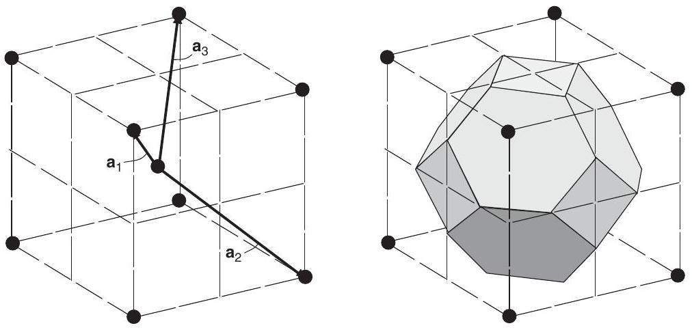
Figure 4.3. Body-centered cubic (bcc) lattice, showing one choice for the three lattice vectors.

The conventional cubic cell shown indicates the set of all eight nearest neighbors at a distance $\frac{\sqrt{3}}{2} a$ around the central atom. (There are six second neighbors at distance $a$.) On the right-hand side of the figure is shown the Wigner-Seitz cell formed by the perpendicular bisectors of the lattice vectors (this is also the Brillouin zone for the fcc lattice).

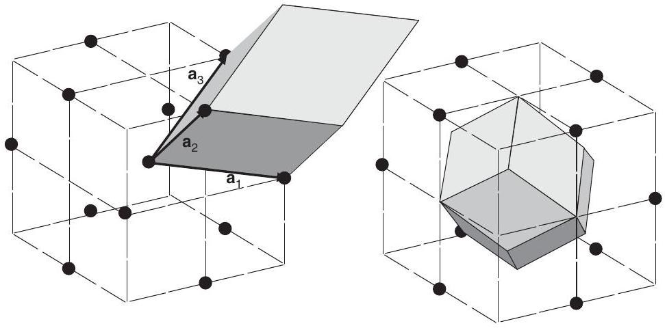
Figure 4.4. Face-centered cubic (fcc) lattice, drawn to emphasize the close packing of 12 neighbors around the central site. (The location of sites at face centers is evident if the cube is drawn with a lattice site at each corner and on each face of the cube.) Left: one choice for primitive lattice vectors and the parallelepiped primitive cell, which has lower symmetry than the lattice. Right: the symmetric Wigner-Seitz cell (which is also the Brillouin zone for the bcc lattice).

The body-centered cubic (bcc) and face-centered cubic (fcc) lattices are shown, respectively, in Figs. 4.3 and 4.4, each represented in the large conventional cubic cell (indicated by the dashed lines) with a lattice site at the center. All nearest neighbors of the central site are shown: 8 for bcc and 12 for fcc lattices. One choice of primitive vectors is shown in each case, but clearly other equivalent vectors could be chosen, and all vectors to the equivalent neighbors are also lattice translations. In the fcc case, the left-hand side of Fig. 4.4 shows one possible primitive cell, the parallelepiped formed by the primitive vectors. This is the
simplest cell to construct; however, this cell clearly does not have cubic symmetry and other choices of primitive vectors lead to different cells. The Wigner-Seitz cells for each Bravais lattice, shown respectively in Figs. 4.3 and 4.4, are bounded by planes that are perpendicular bisectors of the translation vectors from the central lattice point. The Wigner-Seitz cell is particularly useful because it is the unique cell defined as the set of all points in space closer to the central lattice point than to any other lattice point; it is independent of the choice of primitive translations and it has the full symmetry of the Bravais lattice.

It is useful for deriving formal relations and for practical computer programs to express the set of primitive vectors as a square matrix $a_{i j}=\left(\mathbf{a}_{i}\right)_{j}$, where $j$ denotes the cartesian component and $i$ the primitive vector, i.e., the matrix has the same form as the arrays of vectors shown in Eqs. (4.2) and (4.3).

The volume of any primitive cell must be the same, since translations of any such cell fill all space. The most convenient choice of cell in which to express the volume is the parallelepiped defined by the primitive vectors. If we define $\Omega_{\text {cell }}$ as the volume in any dimension $d$ (i.e., it has units (length) ${ }^{d}$ ), simple geometric arguments show that $\Omega_{\text {cell }}=\left|a_{1}\right| (d=1) ;\left|\mathbf{a}_{1} \times \mathbf{a}_{2}\right|,(d=2)$; and $\left|\mathbf{a}_{1} \cdot\left(\mathbf{a}_{2} \times \mathbf{a}_{3}\right)\right|,(d=3)$. In any dimension this can be written as the determinant of the a matrix (see Exercise 4.4),

$$
\Omega_{\mathrm{cell}}=\operatorname{det}(\mathbf{a})=|\mathbf{a}| .
$$

## 4.1.2 The Basis of Atoms in a Cell

The basis describes the positions of atoms in each unit cell relative to the chosen origin. If there are $S$ atoms per primitive cell, then the basis is specified by the atomic position vectors $\tau_{s}, s=1, S$.

## 4.1.3 Two Dimensions

Two-dimensional cases are both instructive and relevant for important problems in real materials. For example, graphene, $\mathrm{BN}, \mathrm{MoS}_{2}$ and many other transition metal pnictides and chalcogenides can be made in actual single layers and they can be "stacked" to form the so-called van der Waals heterostructures described in Section 2.12. In addition there are three-dimensional crystals with layer structures that have strong bonding between the layers but nevertheless the electronic states near the Fermi energy are well described as twodimensional planar systems with only weak hopping between the planes. For example, the three-dimensional structure of the high-temperature superconductor $\mathrm{YBa}_{2} \mathrm{Cu}_{3} \mathrm{O}_{7}$ is shown in Fig. 17.3; however, the most interest is in the band confined to the $\mathrm{CuO}_{2}$ square planes. These will serve as illustrative examples of simple bands in Chapter 14 and as notable examples of full density functional theory calculations.

The square lattice for $\mathrm{CuO}_{2}$ planes is shown in Fig. 4.5. The lattice vectors are given above and the atomic position vectors are conveniently chosen with the Cu atom at the origin $\tau_{1}=(0,0)$ and the other positions chosen to be $\tau_{2}=\left(\frac{1}{2}, 0\right) a$ and $\tau_{3}=\left(0, \frac{1}{2}\right) a$. It is

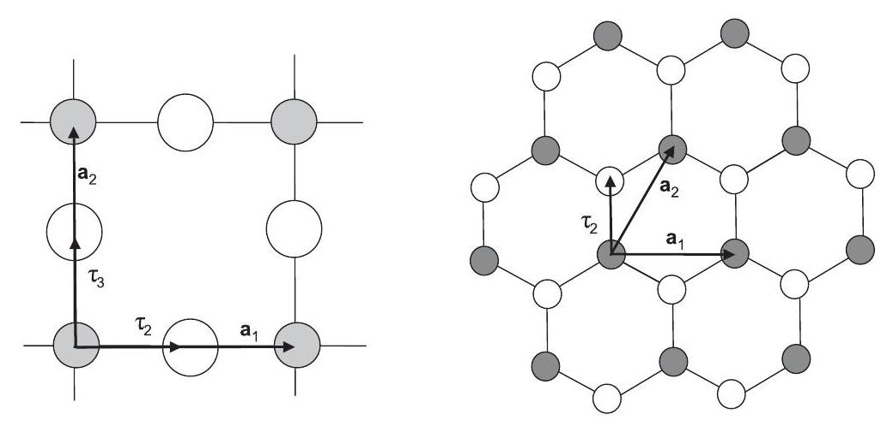
Figure 4.5. Left: square lattice for $\mathrm{CuO}_{2}$ planes common to the cuprate high-temperature superconductors; there are three atoms per primitive cell. Right: honeycomb lattice for a single plane of graphite or hexagonal BN; the lattice is triangular and there are two atoms per primitive cell.

useful to place the Cu atom at the origin since it is the position of highest symmetry in the cell, with inversion, mirror planes, and fourfold rotation symmetry about this site. ${ }^{3}$

Graphene or a plane of hexagonal BN form a honeycomb lattice with a triangular Bravais lattice and two atoms per primitive cell, as shown on the right-hand side of Fig. 4.5. If the two atoms are the same chemical species, the structure is that of a plane of graphite. The primitive lattice vectors are $\mathbf{a}_{1}=(1,0) a$ and $\mathbf{a}_{2}=\left(\frac{1}{2}, \frac{\sqrt{3}}{2}\right) a$, where the nearest neighbor distance is $a / \sqrt{3}$. If one atom is at the origin, $\tau_{1}=(0,0)$, one of the possible choices of $\tau_{2}$ is $\tau_{2}=(0,1 / \sqrt{3}) a$ as shown in Fig. 4.5. It is also useful to define the atomic positions in terms of the primitive lattice vectors by $\tau_{s}=\sum_{i=1}^{d} \tau_{s i}^{L} \mathbf{a}_{i}$, where the superscript $L$ denotes the representation in lattice vectors. In this case, one finds $\tau_{2}=\frac{2}{3}\left(\mathbf{a}_{1}+\mathbf{a}_{2}\right)$ or $\tau_{1}^{L}=[0,0]$ and $\tau_{2}^{L}=\left[\frac{2}{3}, \frac{2}{3}\right] .{ }^{4}$

Single layers of many transition metal chalcogenides such as $\mathrm{MoS}_{2}, \mathrm{MoSe}_{3}$, and $\mathrm{WSe}_{3}$ are of interest for possible technological applications and they can be grown in heterostructures as described in Section 2.12. For example, $\mathrm{MoS}_{2}$ in the 2 H structure is a semiconductor with a direct bandgap (see Fig. 22.8), which causes it to have strong optical absorption. The 2 H structure is depicted in Fig. 4.6; the top view at the left looks the same as graphene and BN so that the Bravais lattice is also the triangular lattice, the same as a layer of close-packed spheres in Fig. 4.9. There is one Mo atom per primitive cell and we can choose the origin at the Mo site, i.e., $\tau_{1}=0$; however, there are two S atoms per cell above and below the Mo plane at positions $\tau_{2}$ and $\tau_{3}$, each with three Mo neighbors as indicated in the right side of Fig. 4.6. The 1T is similar except the two S atoms are not directly above one another but are at positions labeled B and C in Fig. 4.9.

[^2]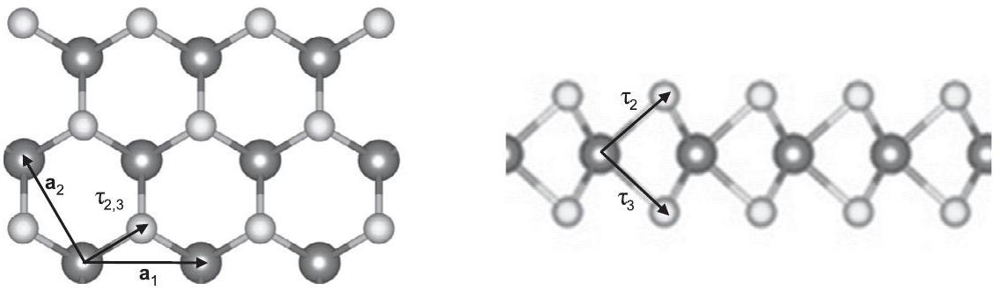
Figure 4.6. Crystal structure of a single $\mathrm{MoS}_{2}$ layer in the 2 H structure. The top view at the left shows that the Mo atoms (dark gray) form a triangular 2D Bravais lattice like graphene and BN in Fig. 4.5. The S atoms (light gray) each have 3 Mo neighbors like graphene and BN ; however, they are above and below the Mo plane as shown in the side view at the right for the 2 H structure. The 1T structure is the same but with the two S atoms in the alternate positions as described in the text.

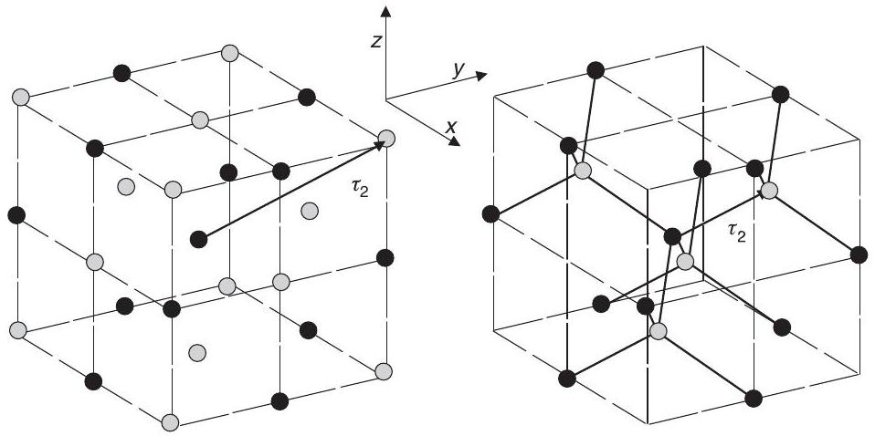
Figure 4.7. Two examples of crystals with a basis of two atoms per cell and fcc Bravais lattice. Left: rock salt (or NaCl ) structure. Right: zinc-blende (cubic ZnS ) structure. The positions of the atoms are given in the text. In the former case, a simple cubic crystal results if the two atoms are the same. In the latter case, if the two atoms are identical the resulting crystal has diamond structure.

## 4.1.4 Three Dimensions

NaCl and ZnS are two examples of crystals with the fcc Bravais lattice and a basis of two atoms per cell, as shown in Fig. 4.7. The primitive translation vectors are given in the previous section in terms of the cube edge $a$ and illustrated in Fig. 4.4. For the case of NaCl , it is convenient to choose one atom at the origin $\tau_{1}=(0,0,0)$, since there is inversion symmetry and cubic rotational symmetry around each atomic site, and the second basis vector is chosen to be $\tau_{2}=\left(\frac{1}{2}, \frac{1}{2}, \frac{1}{2}\right) a$. In terms of the primitive lattice vectors, one can see from Fig. 4.7 that $\tau_{2}=\sum_{i=1}^{d} \tau_{2 i}^{L} \mathbf{a}_{i}$, where $\tau_{2}^{L}=\left[\frac{1}{2}, \frac{1}{2}, \frac{1}{2}\right]$. It is also easy to see that if the two atoms at positions $\tau_{1}$ and $\tau_{2}$ were the same, then the crystal would actually have a simple cubic Bravais lattice, with cube edge $a_{\mathrm{sc}}=\frac{1}{2} a_{\mathrm{fcc}}$.

A second example is the zinc-blende structure, which is the structure of many III-V and II-VI crystals such as GaAs and ZnS . This crystal is also fcc with two atoms per unit cell.

Although there is no center of inversion in a zinc-blende structure crystal, each atom is at a center of tetrahedral symmetry; we can place the origin at one atom, $\tau_{1}=(0,0,0) a$, and $\tau_{2}=\left(\frac{1}{4}, \frac{1}{4}, \frac{1}{4}\right) a$, as shown in Fig. 4.7, or any of the equivalent choices. Thus this structure is the same as the NaCl structure except for the basis, which in primitive lattice vectors is simply $\tau_{2}^{L}=\left[\frac{1}{4}, \frac{1}{4}, \frac{1}{4}\right]$. If the two atoms in the cell are identical, this is the diamond structure in which $\mathrm{C}, \mathrm{Si}, \mathrm{Ge}$, and gray Sn occur. A bond center is the appropriate choice of origin for the diamond structure since this is a center of inversion symmetry. This can be accomplished by shifting the origin so that $\tau_{1}=-\left(\frac{1}{8}, \frac{1}{8}, \frac{1}{8}\right) a$, and $\tau_{2}=\left(\frac{1}{8}, \frac{1}{8}, \frac{1}{8}\right) a$; similarly, $\tau_{1}^{L}=-\left[\frac{1}{8}, \frac{1}{8}, \frac{1}{8}\right]$ and $\tau_{2}^{L}=\left[\frac{1}{8}, \frac{1}{8}, \frac{1}{8}\right]$.

The perovskite structure illustrated in Fig. 4.8 has chemical composition $\mathrm{ABO}_{3}$ and occurs for a large number of compounds with interesting properties including ferroelectrics (e.g., $\mathrm{BaTiO}_{3}$ ), Mott-insulator antiferromagnets (e.g., $\mathrm{CaMnO}_{3}$ ), and alloys exhibiting metal-insulator transitions (e.g., $\mathrm{La}_{x} \mathrm{Ca}_{1-x} \mathrm{MnO}_{3}$ ). The crystal may be thought of as the CsCl structure with O on the edges. The environment of the A and B atoms is very different, with the A atoms having 12 O neighbors at a distance $a / \sqrt{2}$ and the B atoms having 6 O neighbors at a distance $a / 2$. Thus these atoms play a very different role in the properties. Typically the A atom is a nontransition metal for which Coulomb ionic bonding favors the maximum number of O neighbors, whereas the B atom is a transition metal where the d states favor bonding with the O states. Note the contrast of the planes of B and O atoms with the $\mathrm{CuO}_{2}$ planes in Fig. 4.5: although the planes are similar, each B atom in the cubic perovskites is in three intersecting orthogonal planes, whereas in the layered structures such as $\mathrm{La}_{2} \mathrm{CuO}_{4}$, the $\mathrm{CuO}_{2}$ planes are clearly identified, with each Cu belonging to only one plane.

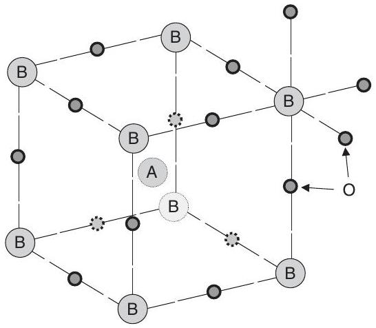
Figure 4.8. The perovskite crystal structure with the chemical composition $\mathrm{ABO}_{3}$. This structure occurs for a large number of compounds with interesting properties, including ferroelectrics (e.g., $\mathrm{BaTiO}_{3}$ ), antiferromagnets (e.g., $\mathrm{CaMnO}_{3}$ ), and alloys (e.g., $\mathrm{Pb}_{x} \mathrm{Zr}_{1-x} \mathrm{TiO}_{3}$ and $\mathrm{La}_{x} \mathrm{Ca}_{1-x} \mathrm{MnO}_{3}$ ). The crystal may be thought of as cubes with A atoms at the center, B at the corners, and O on the edges. The environment of the A and B atoms is very different, the A atom having 12 O neighbors at a distance $a / \sqrt{2}$ and the B atoms having 6 O neighbors at a distance $a / 2$. (The neighbors around one $B$ atom are shown.) The Bravais lattice is simple cubic.

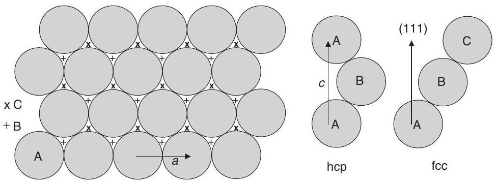
Figure 4.9. Stacking of close-packed planes to create close-packed three-dimensional lattices. Left: The only possible close packing in two dimensions is the hexagonal layer of spheres labeled A , with lattice constant $a$. Right: Three-dimensional stacking can have the next layers in either B or C positions. Of the infinite set of possible layer sequences, only the fcc stacking (... ABCABC...) forms a primitive lattice; hexagonal close-packed (hcp) (... ABABAB ...) has two sites per primitive cell; all others have larger primitive cells.

## 4.1.5 Close-Packed Structures

In two dimensions there is only one way to make a "close-packed structure," defined as a structure in which hard spheres (or disks) can be placed with the maximum filling of space. That is the triangular lattice in Fig. 4.5 with one atom per lattice point. In the plane, each atom has six neighbors in a hexagonal arrangement, as shown in Fig. 4.9. All threedimensional close-packed structures consist of such close-packed planes of atoms stacked in various sequences. As shown in Fig. 4.9, the adjacent plane can be stacked in one of two ways: if the given plane is labeled A , then two possible positions for the next plane can be labeled B and C .

The face-centered cubic structure (shown in Fig. 4.4) is the cubic close-packed structure, which can be viewed as the sequence of close-packed planes in the sequence . . . ABCABC .... It has one atom per primitive cell, as may be seen by the fact that each atom has the same relation to all its neighbors, i.e., an A atom flanked by C and B planes is equivalent to a B atom flanked by A and C planes, etc. Specifically, if the lattice is a Bravais lattice then the vector from an atom in the $A$ plane to one of its closest neighbors in the adjacent $C$ plane must be a lattice vector. Similarly, twice that vector is also a lattice vector, as may be verified easily. The cubic symmetry can be verified by the fact that the close-packed planes may be chosen perpendicular to any of the [111] crystal axes.

The hexagonal closed-packed structure consists of close-packed planes stacked in a sequence . . . $\mathrm{ABABAB} \ldots$. This is a hexagonal Bravais lattice with a basis of two atoms that are not equivalent by a translation. (This can be seen because - unlike the fcc case twice the vector from an A atom to a neighboring B atom is not a vector connecting atoms. Thus the primitive cell is hexagonal as shown Fig. 4.2 with $a$ equal to the distance between atoms in the plane and $c$ the distance between two A planes. The ideal $c / a$ ratio is that for packing of hard spheres, $c / a=\sqrt{8 / 3}$ [Exercise 4.11]). The two atoms in the primitive cell are equivalent by a combination of translation by $c / 2$ and rotation by $\pi / 6$, but this does not affect the analysis of the translation symmetry.

There are an infinite number of possible stackings or "polytypes" all of which are "close packed." In particular, polytypes are actually realized in crystals with tetrahedral bonding, like ZnS . The two simplest structures are cubic (zinc-blende) and hexagonal (wurtzite), based on the fcc and hcp lattices. In this case, each site in one of the A, B, or C planes corresponds to two atoms ( Zn and S ) and the fcc case is shown in Fig. 4.7.

# 4.2 Reciprocal Lattice and Brillouin Zone

Consider any function $f(\mathbf{r})$ defined for the crystal, such as the density of the electrons, which is the same in each unit cell,

$$
f\left(\mathbf{r}+\mathbf{T}\left(n_{1}, n_{2}, \ldots\right)\right)=f(\mathbf{r}),
$$

where $\mathbf{T}$ is any translation defined above. Such a periodic function can be represented by Fourier transforms in terms of Fourier components at wavevectors $\mathbf{q}$ defined in reciprocal space. The formulas can be written most simply in terms of a discrete set of Fourier components if we restrict the Fourier components to those that are periodic in a large volume of crystal $\Omega_{\text {crystal }}$ composed of $N_{\text {cell }}=N_{1} \times N_{2} \times \cdots$ cells. Then each component must satisfy the Born-von Karman periodic boundary conditions in each of the dimensions

$$
\exp \left(\mathrm{i} \mathbf{q} \cdot N_{1} \mathbf{a}_{1}\right)=\exp \left(\mathrm{i} \mathbf{q} \cdot N_{2} \mathbf{a}_{2}\right) \ldots=1
$$

so that $\mathbf{q}$ is restricted to the set of vectors satisfying $\mathbf{q} \cdot \mathbf{a}_{i}=2 \pi \frac{\text { integer }}{N_{i}}$ for each of the primitive vectors $\mathbf{a}_{i}$. In the limit of large volumes $\Omega_{\text {crystal }}$ the final results must be independent of the particular choice of boundary conditions. ${ }^{5}$

The Fourier transform is defined to be

$$
f(\mathbf{q})=\frac{1}{\Omega_{\text {crystal }}} \int_{\Omega_{\text {crystal }}} \mathrm{d} \mathbf{r} f(\mathbf{r}) \exp (\mathrm{i} \mathbf{q} \cdot \mathbf{r})
$$

which, for periodic functions, can be written

$$
\begin{aligned}
f(\mathbf{q}) & =\frac{1}{\Omega_{\text {crystal }}} \sum_{n_{1}, n_{2}, \ldots} \int_{\Omega_{\text {cell }}} \mathrm{d} \mathbf{r} f(\mathbf{r}) \mathrm{e}^{\mathrm{i} \mathbf{q} \cdot\left(\mathbf{r}+\mathbf{T}\left(n_{1}, n_{2}, \ldots\right)\right)} \\
& =\frac{1}{N_{\text {cell }}} \sum_{n_{1}, n_{2}, \ldots} \mathrm{e}^{\mathrm{i} \mathbf{q} \cdot \mathbf{T}\left(n_{1}, n_{2}, \ldots\right)} \frac{1}{\Omega_{\text {cell }}} \times \int_{\Omega_{\text {cell }}} \mathrm{d} \mathbf{r} f(\mathbf{r}) \mathrm{e}^{\mathrm{i} \mathbf{q} \cdot \mathbf{r}} .
\end{aligned}
$$

The sum over all lattice points in the middle line vanishes for all $\mathbf{q}$ except those for which $\mathbf{q} \cdot \mathbf{T}\left(n_{1}, n_{2}, \ldots\right)=2 \pi \times$ integer for all translations $\mathbf{T}$. Since $\mathbf{T}\left(n_{1}, n_{2}, \ldots\right)$ is a sum of integer multiples of the primitive translations $\mathbf{a}_{i}$, it follows that $\mathbf{q} \cdot \mathbf{a}_{i}=2 \pi \times$ integer.

[^3]The set of Fourier components $\mathbf{q}$ that satisfy this condition is the "reciprocal lattice." If we define the vectors $\mathbf{b}_{i}, i=1, d$ that are reciprocal to the primitive translations $\mathbf{a}_{i}$, i.e.,

$$
\mathbf{b}_{i} \cdot \mathbf{a}_{j}=2 \pi \delta_{i j}
$$

- the only nonzero Fourier components of $f(\mathbf{r})$ are for $\mathbf{q}=\mathbf{G}$, where the $\mathbf{G}$ vectors are a lattice of points in reciprocal space defined by

$$
\mathbf{G}\left(m_{1}, m_{2}, \ldots\right)=m_{1} \mathbf{b}_{1}+m_{2} \mathbf{b}_{2}+\ldots,
$$

where the $m_{i}, i=1, d$ are integers. For each $\mathbf{G}$, the Fourier transform of the periodic function can be written

$$
f(\mathbf{G})=\frac{1}{\Omega_{\mathrm{cell}}} \int_{\Omega_{\mathrm{cell}}} \mathrm{~d} \mathbf{r} f(\mathbf{r}) \exp (\mathrm{i} \mathbf{G} \cdot \mathbf{r})
$$

The mutually reciprocal relation of the Bravais lattice in real space and the reciprocal lattice becomes apparent using matrix notation that is valid in any dimension. If we define square matrix $b_{i j}=\left(\mathbf{b}_{i}\right)_{j}$, exactly as was done for the $a_{i j}$ matrix, then primitive vectors are related by

$$
\mathbf{b}^{T} \mathbf{a}=2 \pi \mathbf{1} \rightarrow \mathbf{b}=2 \pi\left(\mathbf{a}^{T}\right)^{-1} \text { or } \mathbf{a}=2 \pi\left(\mathbf{b}^{T}\right)^{-1} .
$$

It is also straightforward to derive explicit expressions for the relation of the $\mathbf{a}_{i}$ and $\mathbf{b}_{i}$ vectors; for example, in three dimensions, one can show by geometric arguments that

$$
\mathbf{b}_{1}=2 \pi \frac{\mathbf{a}_{2} \times \mathbf{a}_{3}}{\left|\mathbf{a}_{1} \cdot\left(\mathbf{a}_{2} \times \mathbf{a}_{3}\right)\right|}
$$

and cyclical permutations. The geometric construction of the reciprocal lattice in two dimensions is shown in Fig. 4.1.

It is easy to show that the reciprocal of a square (simple cubic) lattice is also a square (simple cubic) lattice, with dimension $\frac{2 \pi}{a}$. The reciprocal of the triangular (hexagonal) lattice is also triangular (hexagonal) but rotated with respect to the crystal lattice. The bcc and fcc lattices are reciprocal to each other (Exercise 4.9). The primitive vectors of the reciprocal lattice for each of the three-dimensional lattices in Eq. (4.3) in units of $\frac{2 \pi}{a}$ are given by

$$
\begin{array}{llll}
\quad \text { simple cubic } & \text { simple hex. } & \text { fcc } & \text { bcc } \\
\mathbf{b}_{1}=(1,0,0) & \left(1,-\frac{1}{\sqrt{3}}, 0\right) & (1,1,-1) & (0,1,1), \\
\mathbf{b}_{2}=(0,1,0) & \left(0, \frac{2}{\sqrt{3}}, 0\right) & (1,-1,1) & (1,0,1), \\
\mathbf{b}_{3}=(0,0,1) & \left(0,0, \frac{a}{c}\right) & (-1,1,1) & (1,1,0) .
\end{array}
$$

The volume of any primitive cell of the reciprocal lattice can be found from the same reasoning as used for the Bravais in real space. This is the volume of the first Brillouin
zone $\Omega_{\mathrm{BZ}}$ (see Section 4.2), which can be written for any dimension $d$ in analogy to Eq. (4.4) as

$$
\Omega_{\mathrm{BZ}}=\operatorname{det}(\mathbf{b})=|\mathbf{b}|=\frac{(2 \pi)^{d}}{\Omega_{\mathrm{cell}}}
$$

This shows the mutual reciprocal relation of $\Omega_{\mathrm{BZ}}$ and $\Omega_{\text {cell }}$. The formulas can also be expressed in the geometric forms $\Omega_{\mathrm{BZ}}=\left|b_{1}\right|(d=1) ;\left|\mathbf{b}_{1} \times \mathbf{b}_{2}\right|,(d=2)$; and $\mid \mathbf{b}_{1} \cdot\left(\mathbf{b}_{2} \times\right. \left.\mathbf{b}_{3}\right) \mid,(d=3)$.

## 4.2.1 The Brillouin Zone

In this book, the term "Brillouin zone" or "BZ" is used in two ways. In some cases, especially for Fourier transforms and the proofs in the chapters on topology, it is most convenient to use a parallelepiped defined by the reciprocal lattice vectors. In general, however, it is most useful to use the customary convention that it means the WignerSeitz cell of the reciprocal lattice, which is defined by the planes that are the perpendicular bisectors of the vectors from the origin to the reciprocal lattice points. It is on these planes that the Bragg condition is satisfied for elastic scattering [280, 285]. For incident particles with wavevectors inside the BZ there can be no Bragg scattering. Construction of the BZ is illustrated in Figs. 4.1-4.4, and widely used notations for points in the BZ of several crystals are given in Fig. 4.10.

## 4.2.2 Useful Relations

Expressions for crystals often involve the lengths of vectors in real and reciprocal space, $|\tau+\mathbf{T}|$ and $|\mathbf{k}+\mathbf{G}|$ and the scalar products $(\mathbf{k}+\mathbf{G}) \cdot(\tau+\mathbf{T})$. If the vectors are expressed in a cartesian coordinate system, the expressions simply involve sums over each cartesian component. However, it is often more convenient to represent $\mathbf{T}$ and $\mathbf{G}$ by the integer multiples of the basis vectors, and positions $\tau$ and wave vectors $\mathbf{k}$ as fractional multiples of the basis vectors. It is useful to define lengths and scalar products in this representation, i.e., to define the "metric."

The matrix formulation makes it easy to derive the desired expressions. Any position vector $\tau$ with elements $\tau_{1}, \tau_{2}, \ldots$, in cartesian coordinates can be written in terms of the primitive vectors by $\tau=\sum_{i=1}^{d} \tau_{i}^{L} \mathbf{a}_{i}$, where the superscript $L$ denotes the representation in lattice vectors and $\tau^{L}$ has elements $\tau_{1}^{L}, \tau_{2}^{L}, \ldots$, that are fractions of primitive translation vectors. In matrix form this becomes (here superscript $T$ denotes transpose)

$$
\tau=\tau^{L} \mathbf{a} ; \quad \tau^{L}=\tau \mathbf{a}^{-1}=\frac{1}{2 \pi} \tau \mathbf{b}^{T}
$$

where $\mathbf{b}$ is the matrix of primitive vectors of the reciprocal lattice. Similarly, a vector $\mathbf{k}$ in reciprocal space can be expressed as $\mathbf{k}=\sum_{i=1}^{d} k_{i}^{L} \mathbf{b}_{i}$ with the relations

$$
\mathbf{k}=\mathbf{k}^{L} \mathbf{b} ; \quad \mathbf{k}^{L}=\mathbf{k b}^{-1}=\frac{1}{2 \pi} \mathbf{k a}^{T}
$$

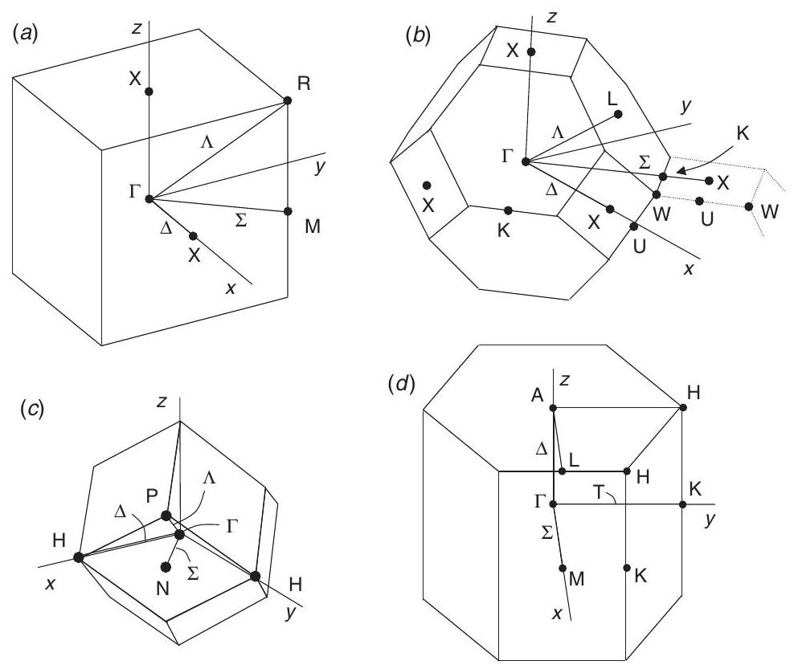
Figure 4.10. Brillouin zones for several common lattices: (a) simple cubic (sc), (b) face-centered cubic (fcc), (c) body-centered cubic (bcc), and (d) hexagonal (hex). High-symmetry points and lines are labeled according to Bouckaret, Smoluchowski, and Wigner; see also Slater [284]. The zone center $(\mathbf{k}=0)$ is designated $\Gamma$ and interior lines by Greek letters; points on the zone boundary are designated by Roman letters. In the case of the fcc lattice, a portion of a neighboring cell is represented by dotted lines. This shows the orientation of neighboring cells that provides useful information, for example, that the line $\Sigma$ from $\Gamma$ to K continues to a point outside the first BZ that is equivalent to X .

The scalar product $(\mathbf{k}+\mathbf{G}) \cdot(\tau+\mathbf{T})$ is easily written in the lattice coordinates, using relation Eq. (4.9). If $\mathbf{T}\left(n_{1}, n_{2}, \ldots\right)=n_{1} \mathbf{a}_{1}+n_{2} \mathbf{a}_{2}+\cdots$ and $\mathbf{G}\left(m_{1}, m_{2}, \ldots\right)=m_{1} \mathbf{b}_{1}+ m_{2} \mathbf{b}_{2}+\ldots$, then one finds the simple expression

$$
(\mathbf{k}+\mathbf{G}) \cdot(\tau+\mathbf{T})=2 \pi \sum_{i=1}^{d}\left(k_{i}^{L}+m_{i}\right)\left(\tau_{i}^{L}+n_{i}\right) \equiv 2 \pi\left(\mathbf{k}^{L}+\mathbf{m}\right) \cdot\left(\tau^{L}+\mathbf{n}\right) .
$$

The relation in terms of the cartesian vectors is readily derived using Eqs. (4.16) and (4.17). On the other hand, the lengths are most easily written in the cartesian system. Using Eqs. (4.16) and (4.17) and the same vector notation as in Eq. (4.18), it is straightforward to show that lengths are given by

$$
|\tau+\mathbf{T}|^{2}=\left(\tau^{L}+\mathbf{n}\right) \mathbf{a a}^{T}\left(\tau^{L}+\mathbf{n}\right)^{T} ;|\mathbf{k}+\mathbf{G}|^{2}=\left(\mathbf{k}^{L}+\mathbf{m}\right) \mathbf{b b}^{T}\left(\mathbf{k}^{L}+\mathbf{m}\right)^{T}
$$

- i.e., $\mathbf{a a}^{T}$ and $\mathbf{b b}^{T}$ are the metric tensors for the vectors in real and reciprocal spaces expressed in their natural forms as multiples of the primitive translation vectors.

Finally, one often needs to find all the lattice vectors within some cutoff radius, e.g., in order to find the lowest Fourier components in reciprocal space or the nearest neighbors in real space. Consider the parallelepiped defined by all lattice points in real space $\mathbf{T}\left(n_{1}, n_{2}, n_{3}\right) ;-N_{1} \leq n_{1} \leq N_{1} ;-N_{2} \leq n_{2} \leq N_{2} ;-N_{3} \leq n_{3} \leq N_{3}$. Since the vectors $\mathbf{a}_{2}$ and $\mathbf{a}_{3}$ form a plane, the distance in space perpendicular to this plane is the projection of $\mathbf{T}$ onto the unit vector perpendicular to the plane. This unit vector is $\hat{\mathbf{b}_{1}}=\mathbf{b}_{1} /\left|\mathbf{b}_{1}\right|$ and, using Eq. (4.19), it is then simple to show that the maximum distance in this direction is $R_{\max }=2 \pi \frac{N_{1}}{\left|\mathbf{b}_{1}\right|}$. Similar equations hold for the other directions. The result is a simple expression (Exercise 4.15) for the boundaries of the parallelepiped that bounds a sphere of radius $R_{\text {max }}$,

$$
N_{1}=\frac{\left|\mathbf{b}_{1}\right|}{2 \pi} R_{\max } ; N_{2}=\frac{\left|\mathbf{b}_{2}\right|}{2 \pi} R_{\max } ; \ldots .
$$

In reciprocal space the corresponding condition for the parallelepiped that bounds a sphere of radius $G_{\text {max }}$ is

$$
M_{1}=\frac{\left|\mathbf{a}_{1}\right|}{2 \pi} G_{\max } ; M_{2}=\frac{\left|\mathbf{a}_{2}\right|}{2 \pi} G_{\max } ; \ldots,
$$

where the vectors range from $-M_{i} \mathbf{b}_{i}$ to $+M_{i} \mathbf{b}_{i}$ in each direction.

# 4.3 Excitations and the Bloch Theorem

The previous sections were devoted to properties of periodic functions in a crystal, such as the nuclear positions and electron density, that obey the relation Eq. (4.5), i.e., $f(\mathbf{r}+ \left.\mathbf{T}\left(n_{1}, n_{2}, \ldots\right)\right)=f(\mathbf{r})$ for any translation of the Bravais lattice $\mathbf{T}(\mathbf{n}) \equiv \mathbf{T}\left(n_{1}, n_{2}, \ldots\right)= n_{1} \mathbf{a}_{1}+n_{2} \mathbf{a}_{2}+\ldots$, as defined in Eq. (4.1). Such periodic functions have nonzero Fourier components only for reciprocal space at the reciprocal lattice vectors defined by Eq. (4.10).

Excitations of the crystal do not, in general, have the periodicity of the crystal. ${ }^{6}$ The subject of this section is the classification of excitations according to their behavior under the translation operations of the crystal. This leads to a Bloch theorem proved, in a general way, and applicable to all types of excitations: electrons, phonons, and other excitations of the crystal. ${ }^{7}$ We will give explicit demonstrations for independent-particle excitations; however, since the general relations apply to any system, the theorems can be generalized to correlated many-body systems.

Consider the eigenstates of any operator $\hat{O}$ defined for the periodic crystal. Any such operator must be invariant to any lattice translation $\mathbf{T}(\mathbf{n})$. For example, $\hat{O}$ could be the hamiltonian $\hat{H}$ for the Schrödinger equation for independent particles,

[^4]$$
\hat{H} \psi(\mathbf{r})=\left[-\frac{\hbar^{2}}{2 m_{e}} \nabla^{2}+V(\mathbf{r})\right] \psi_{i}(\mathbf{r})=\varepsilon_{i} \psi_{i}(\mathbf{r})
$$

The operator $\hat{H}$ is invariant to all lattice translations since $V_{\text {eff }}(\mathbf{r})$ has the periodicity of the crystal ${ }^{8}$ and the derivative operator is invariant to any translation.

Similarly, we can define translation operators $\hat{T}_{\mathbf{n}}$ that act on any function by displacing the arguments, e.g.,

$$
\hat{T}_{\mathbf{n}} V(\mathbf{r})=V[\mathbf{r}+\mathbf{T}(\mathbf{n})]=V\left(\mathbf{r}+n_{1} \mathbf{a}_{1}+n_{2} \mathbf{a}_{2}+\ldots\right) .
$$

Since the hamiltonian is invariant to any of the translations $\mathbf{T}(\mathbf{n})$, it follows that the hamiltonian operator commutes with each of the translations operators $\hat{T}_{\mathbf{n}}$,

$$
\hat{H} \hat{T}_{\mathbf{n}}=\hat{T}_{\mathbf{n}} \hat{H}
$$

From Eq. (4.24) it follows that the eigenstates of $\hat{H}$ can be chosen to be eigenstates of all $\hat{T}_{\mathbf{n}}$ simultaneously. Unlike the hamiltonian, the eigenstates of the translation operators can be readily determined, independent of any details of the crystal; thus they can be used to "block diagonalize" the hamiltonian, rigorously classifying the states by their eigenvalues of the translation operators and thus leading to the "Bloch theorem" derived explicitly below.

The key point is that the translation operators form a simple group in which the product of any two translations is a third translation, so that the operators obey the relation,

$$
\hat{T}_{\mathbf{n}_{1}} \hat{T}_{\mathbf{n}_{2}}=\hat{T}_{\mathbf{n}_{1}+\mathbf{n}_{2}}
$$

Thus the eigenvalues $t_{\mathbf{n}}$ and eigenstates $\psi(\mathbf{r})$ of the operators $\hat{T}_{\mathbf{n}}$

$$
\hat{T}_{\mathbf{n}} \psi(\mathbf{r})=t_{\mathbf{n}} \psi(\mathbf{r})
$$

must obey the relations

$$
\hat{T}_{\mathbf{n}_{1}} \hat{T}_{\mathbf{n}_{2}} \psi(\mathbf{r})=t_{\left(\mathbf{n}_{1}+\mathbf{n}_{2}\right)} \psi(\mathbf{r})=t_{\mathbf{n}_{1}} t_{\mathbf{n}_{2}} \psi(\mathbf{r})
$$

By breaking each translation into the product of primitive translations, any $t_{\mathbf{n}}$ can be written in terms of a primitive set $t\left(\mathbf{a}_{i}\right)$

$$
t_{\mathbf{n}}=\left[t\left(\mathbf{a}_{1}\right)\right]^{n_{1}}\left[t\left(\mathbf{a}_{2}\right)\right]^{n_{2}} \ldots .
$$

Since the modulus of each $t\left(\mathbf{a}_{i}\right)$ must be unity (otherwise any function obeying Eq. (4.28) is not bounded), it follows that each $t\left(\mathbf{a}_{i}\right)$ can always be written

$$
t\left(\mathbf{a}_{i}\right)=\mathrm{e}^{\mathrm{i} 2 \pi y_{i}}
$$

Since the eigenfunctions must satisfy periodic boundary conditions Eq. (4.6), $\left(t\left(\mathbf{a}_{i}\right)\right)^{N_{i}}=1$, so that $y_{i}=1 / N_{i}$. Finally, using the definition of the primitive reciprocal lattice vectors in Eq. (4.9), Eq. (4.28) can be written

$$
t_{\mathbf{n}}=\mathrm{e}^{\mathrm{i} \mathbf{k} \cdot \mathbf{T}_{\mathbf{n}}}
$$

[^5]where
$$
\mathbf{k}=\frac{n_{1}}{N_{1}} \mathbf{b}_{1}+\frac{n_{2}}{N_{2}} \mathbf{b}_{2}+\cdots
$$
is a vector in reciprocal space. The range of $\mathbf{k}$ can be restricted to one primitive cell of the reciprocal lattice since the relation Eq. (4.30) is the same in every cell that differs by the addition of a reciprocal lattice vector $\mathbf{G}$ for which $\mathbf{G} \cdot \mathbf{T}=2 \pi \times$ integer. Note that there are exactly the same number of values of $\mathbf{k}$ as the number of cells.

This leads us directly to the desired results:

1. The Bloch theorem. ${ }^{9}$ From Eqs. (4.27), (4.30), and (4.31), one finds

$$
\hat{T}_{\mathbf{n}} \psi(\mathbf{r})=\psi\left(\mathbf{r}+\mathbf{T}_{\mathbf{n}}\right)=\mathrm{e}^{\mathrm{i} \mathbf{k} \cdot \mathbf{T}_{\mathbf{n}}} \psi(\mathbf{r})
$$

which is the celebrated "Bloch theorem" that eigenstates of the translation operators vary from one cell to another in the crystal with the phase factor given in Eq. (4.32). The eigenstates of any periodic operator, such as the hamiltonian, can be chosen with definite values of $\mathbf{k}$, which can be used to classify any excitation of a periodic crystal. From Eq. (4.32) it follows that eigenfunctions with a definite $\mathbf{k}$ can also be written

$$
\psi_{\mathbf{k}}(\mathbf{r})=\mathrm{e}^{\mathrm{i} \mathbf{k} \cdot \mathbf{r}} u_{\mathbf{k}}(\mathbf{r})
$$

where $u_{\mathbf{k}}(\mathbf{r})$ is periodic ( $u_{\mathbf{k}}\left(\mathbf{r}+\mathbf{T}_{\mathbf{n}}\right)=u_{\mathbf{k}}(\mathbf{r})$ ). Examples of Bloch states are shown in Fig. 4.11 and the Bloch theorem for independent-particle electron states in many different representations are given in Chapters 12-17.
2. Bands of eigenvalues. In the limit of a large (macroscopic) crystal, the spacing of the $\mathbf{k}$ points goes to zero and $\mathbf{k}$ can be considered a continuous variable. The eigenstates of the hamiltonian may be found separately for each $\mathbf{k}$ in one primitive cell of the reciprocal lattice. For each $\mathbf{k}$ there is a discrete set of eigenstates that can be labeled by an index $i$. This leads to bands of eigenvalues $\varepsilon_{i, \mathbf{k}}$ and energy gaps where there can be no eigenstates for any $\mathbf{k}$.
3. Conservation of crystal momentum. It follows from the analysis above that in a perfect crystal the wavevector $\mathbf{k}$ is conserved modulo any reciprocal lattice vector $\mathbf{G}$. Thus it is analogous to ordinary momentum in free space, but it has the additional feature that it is only conserved within one primitive cell, usually chosen to be the Brillouin zone. Thus two excitations at vectors $\mathbf{k}_{1}$ and $\mathbf{k}_{2}$ may have total momentum $\mathbf{k}_{1}+\mathbf{k}_{2}$ outside the Brillouin zone at origin and their true crystal momentum should be reduced to the Brillouin zone around the origin by adding a reciprocal lattice vector. The physical process of scattering of two excitations by some perturbation is called "Umklapp scattering" [280].
4. The role of the Brillouin zone (BZ). All possible eigenstates are specified by $\mathbf{k}$ within any primitive cell of the periodic lattice in reciprocal space. However, the BZ is the cell of choice in which to represent excitations; its boundaries are the bisecting planes where Bragg scattering occurs and inside the Brillouin zone there are no such boundaries. Thus

[^6]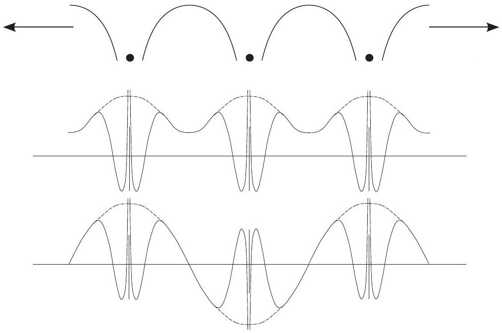
Figure 4.11. Schematic illustration of a periodic potential in a crystal extending to the left and right and two examples of Bloch states at $k=0$ and at the zone boundary. The envelope is the smooth function that multiplies a periodic array of atomic-like 3 s functions, chosen to be the same as in Fig. 11.2.

bands $\varepsilon_{i, \mathbf{k}}$ are analytic functions of $\mathbf{k}$ inside the BZ and nonanalytic dependence on $\mathbf{k}$ can occur only at the boundaries.

Examples of Brillouin zones for important cases are shown in Fig. 4.10 with labels for high-symmetry points and lines using the notation of Bouckaret, Smoluchowski, and Wigner (see also Slater [284]). The labels define the directions and points used in many figures given in the present work for electron bands and phonon dispersion curves.
5. Integrals in k space. For many properties, such as the counting of electrons in bands, total energies, etc., it is essential to sum over the states labeled by $\mathbf{k}$. The crucial point is that if one chooses the eigenfunctions that obey periodic boundary conditions in a large crystal of volume $\Omega_{\text {crystal }}$ composed of $N_{\text {cell }}=N_{1} \times N_{2} \times \cdots$ cells, as was done in the analysis of Eq. (4.6), then there is exactly one value of $\mathbf{k}$ for each cell. Thus in a sum over states to find an intrinsic property of a crystal expressed as "per unit cell" one simply has a sum over values of $\mathbf{k}$ divided by the number of values $N_{k}$. For a general function $f_{i}(\mathbf{k})$, where $i$ denotes any of the discrete set of states at each $\mathbf{k}$, the average value per cell becomes

$$
\bar{f}_{i}=\frac{1}{N_{k}} \sum_{\mathbf{k}} f_{i}(\mathbf{k}) .
$$

If one converts the sum to an integral by taking the limit of a continuous variable in Fourier space with a volume per $\mathbf{k}$ point of $\Omega_{\mathrm{BZ}} / N_{k}$,

$$
\bar{f}_{i}=\frac{1}{\Omega_{\mathrm{BZ}}} \int_{\mathrm{BZ}} \mathrm{~d} \mathbf{k} f_{i}(\mathbf{k})=\frac{\Omega_{\text {cell }}}{(2 \pi)^{d}} \int_{\mathrm{BZ}} \mathrm{~d} \mathbf{k} f_{i}(\mathbf{k}),
$$

where $\Omega_{\text {cell }}$ is the volume of a primitive cell in real space.
6. Equation for the periodic part of Bloch functions. The Bloch functions $\psi_{i, \mathbf{k}}(\mathbf{r})= \mathrm{e}^{\mathrm{i} \mathbf{k} \cdot \mathbf{r}} u_{i, \mathbf{k}}(\mathbf{r})$ are eigenfunctions of the hamiltonian operator $\hat{H}$. By inserting the expression for $\psi_{i, \mathbf{k}}(\mathbf{r})$ in terms of $u_{i, \mathbf{k}}(\mathbf{r})$, the equation becomes

$$
\mathrm{e}^{-i \mathbf{k} \cdot \mathbf{r}} \hat{H} \mathrm{e}^{\mathrm{i} \mathbf{k} \cdot \mathbf{r}} u_{i, \mathbf{k}}(\mathbf{r})=\varepsilon_{i, \mathbf{k}} u_{i, \mathbf{k}}(\mathbf{r})
$$

For the hamiltonian in Eq. (4.22), the equation can be written

$$
\hat{H}(\mathbf{k}) u_{i, \mathbf{k}}(\mathbf{r})=\left[-\frac{\hbar^{2}}{2 m_{e}}(\nabla+i \mathbf{k})^{2}+V(\mathbf{r})\right] u_{i, \mathbf{k}}(\mathbf{r})=\varepsilon_{i, \mathbf{k}} u_{i, \mathbf{k}}(\mathbf{r})
$$

7. Magnetic fields, spin, and spin-orbit interaction. The generalization to spin-orbitals is treated briefly in the next section and described in various places in this book.
8. Topology of the Bloch functions. All of the points above were understood in the 1920s, but it was only starting in the 1980s that the topology of the Bloch functions was recognized by Thouless, Haldane, and others. Topology is a global property of the eigenfunctions as a function of $\mathbf{k}$ in the Brillouin zone that is discussed in Chapters 2528). The new discoveries are in terms of the phases of the periodic part of Bloch functions, which lead to physically meaningful Berry phases. At this point it is important to emphasize that the Bloch theorem is still valid and the equations at any point $\mathbf{k}$ are exactly the same. Even though fabulous consequences are still being discovered, Eq. (4.37) is still valid and the methods for solution developed over the years still apply.

# 4.4 Time-Reversal and Inversion Symmetries

There is an additional symmetry that is present in all systems with no magnetic field. Since the hamiltonian is invariant to time reversal in the original time-dependent Schrödinger equation, it follows that the hamiltonian can always be chosen to be real. In a timeindependent equation, such as Eq. (12.1), this means that if $\psi$ is an eigenfunction, then $\psi^{*}$ must also be an eigenfunction with the same real eigenvalue $\varepsilon$. According to the Bloch theorem, the solutions $\psi_{i,-\mathbf{k}}(\mathbf{r})$ can be classified by their wavevector $\mathbf{k}$ and a discrete band index $i$. If $\psi_{i,-\mathbf{k}}(\mathbf{r})$ satisfies the Bloch condition Eq. (4.32), then it follows that $\psi_{i, \mathbf{k}}^{*}(\mathbf{r})$ satisfies the same equation except with a phase factor corresponding to $-\mathbf{k}$. Thus there is never a need to calculate states at both $\mathbf{k}$ and $-\mathbf{k}$ in any crystal, $\psi_{i,-\mathbf{k}}(\mathbf{r})$ can always be chosen to be $\psi_{i, \mathbf{k}}^{*}(\mathbf{r})$, and the eigenvalues are equal $\varepsilon_{i,-\mathbf{k}}=\varepsilon_{i, \mathbf{k}}$. If in addition the crystal has inversion symmetry, then Eq. (4.37) is invariant under inversion since $V(-\mathbf{r})=V(\mathbf{r})$ and $(\nabla+i \mathbf{k})^{2}$ is the same if we replace $\mathbf{k}$ and $\mathbf{r}$ by $-\mathbf{k}$ and $-\mathbf{r}$. Thus the periodic part of the Bloch function can be chosen to satisfy $u_{i, \mathbf{k}}(\mathbf{r})=u_{i,-\mathbf{k}}(-\mathbf{r})=u_{i, \mathbf{k}}^{*}(-\mathbf{r})$.

## 4.4.1 Spin-Orbit Interaction

So far we have ignored spin, considering only solutions for a single electron in a nonrelativistic hamiltonian. However, relativistic effects introduce a coupling of spin and spatial
motion, i.e., the spin-orbit interaction derived in Appendix O. There it is shown that the equations can be written in terms of $2 \times 2$ matrices in terms of $\psi_{\uparrow, i, \mathbf{k}}(\mathbf{r})$ and $\psi_{\downarrow, i, \mathbf{k}}(\mathbf{r})$ where spin-orbit interaction leads to a diagonal term opposite for ↑ and ↓ and an offdiagonal spin-flip term. Time reversal leads to reversal of both spin and momentum so that a state $\psi_{i, \mathbf{k}}(\sigma, \mathbf{r})$ is transformed to $\psi_{i,-\mathbf{k}}(-\sigma, \mathbf{r})$, where $\sigma$ is the spin variable. If there is time-reversal symmetry, Kramers theorem guarantees that states with reversed momentum and spin functions are degenerate and $\psi_{i, \mathbf{k}}(\sigma, \mathbf{r})=\psi_{i,-\mathbf{k}}^{*}(-\sigma, \mathbf{r})$.

This leads to a conclusion that is a key to understanding topological insulators in Chapters 27 and 28. At certain $\mathbf{k}$ points in a crystal $\mathbf{k}$ and $-\mathbf{k}$ are the same ( $\mathbf{k}=0$ ) or related by a reciprocal lattice vector, and the Kramers theorem guarantees that the two spin states are degenerate. These are called TRIM (time-reversal invariant momentum) and their role is explained in Section 27.4. See especially Figs. 27.4 and 28.1, which show the TRIM points in two and three dimensions. Another example is the linear dispersion in the Rashba effect at a surface shown in Figs. O. 1 and O.2. The states are degenerate at $\mathbf{k}=0$ with linear dispersion that would not occur if there were no spin-orbit interaction. The effect can be viewed as if each spin state is in a magnetic field, opposite for the two spins so that overall there is time-reversal symmetry.

## 4.4.2 Symmetries in Magnetic Systems

The effects of a magnetic field can be included by modifying the hamiltonian in two ways: $\mathbf{p} \rightarrow\left(\mathbf{p}-\frac{e}{c} \mathbf{A}\right)$, where $\mathbf{A}$ is the vector potential, and $\hat{H} \rightarrow \hat{H}+\hat{H}_{\text {Zeeman }}$, with $\hat{H}_{\text {Zeeman }}=g \mu \mathbf{H} \cdot \vec{\sigma}$. (See Appendix O for the elegant derivation by Dirac.) The latter term is easy to add to an independent-particle calculation in which there is no spinorbit interaction; there are simply two calculations for different spins. The first term is not hard to include in localized systems like atoms where there are circulating currents. However, in extended condensed matter, there are quantitative effects that are macroscopic manifestations of quantum mechanics, including Landau diamagnetism, edge currents in quantum Hall systems (Appendix Q), and Chern insulators (Section 27.2). Topological insulators with time-reversal symmetry in Chapters 25-28, have related effects often called a quantum spin Hall effect.

In ferromagnetic systems there is a spontaneous breaking of time reversal symmetry. The ideas also apply to finite systems with a net spin, e.g., if there is an odd number of electrons. As far as symmetry is concerned, there is no difference from a material in an external magnetic field. However, the effects originate in the Coulomb interactions, which can be included in an independent-particle theory as an effective field (often a very large field). Such Zeeman-like spin-dependent terms are regularly used in independent-particle calculations to study magnetic solids such as spin-density functional theory. In HartreeFock calculations on finite systems, exchange induces such terms automatically; however, effects of correlation are omitted.

Antiferromagnetic solids are ones in which there is long-range order involving both space and time-reversal symmetries, e.g., a Neel state is invariant to a combination of translation and time reversal. States with such a symmetry can be described in an independent-particle
approach by an effective potential with this symmetry breaking form. The broken symmetry leads to a larger unit cell in real space and a translation (or "folding") of the excitations into a smaller Brillouin zone compared with the nonmagnetic system. Antiferromagnetic solids are one of the outstanding classes of condensed matter in which many-body effects may play a crucial role. Mott insulators tend to be antiferromagnets, and metals with antiferromagnetic correlations often have large enhanced response functions. This is a major topic of the companion book [1], which addresses the many-body problem and issues that have confounded theorists since the early years of quantum mechanics.

# 4.5 Point Symmetries

This section is a brief summary needed for group theory applications. Discussion of group theory and symmetries in different crystal classes are covered in a number of texts and monographs. For example, Ashcroft and Mermin [280] give an overview of symmetries with pictorial representation, Slater [284] gives detailed analyses for many crystals with group tables and symmetry labels, and there are many useful books on group theory [281-283]. The codes for electronic structure for crystals in Appendix R all have some facilty to automatically generate and/or apply the group operations.

The total space group of a crystal is composed of the translation group and the point group. Point symmetries are rotations, inversions, reflections, and their combinations that leave the system invariant. In addition, there can be nonsymmorphic operations that are combinations with translations or "glides" of fractions of a crystal translation vector. The set of all such operations, $\left\{R_{n}, n=1, \ldots, N_{\text {group }}\right\}$, forms a group. The operation on any function $g(\mathbf{r})$ of the full symmetry system (such as the density $n(\mathbf{r})$ or the total energy $\left.E_{\text {total }}\right)$ is

$$
R_{n} g(\mathbf{r})=g\left(R_{n} \mathbf{r}+\mathbf{t}_{n}\right),
$$

where $R_{n} \mathbf{r}$ denotes the rotation, inversions, or reflections of the position $\mathbf{r}$ and $\mathbf{t}_{n}$ is the nonsymmorphic translation associated with operation $n$.

The two most important consequences of the symmetry operations for excitations can be demonstrated by applying the symmetry operations to the Schrödinger equation (4.22), with $i$ replaced by the quantum numbers for a crystal, $i \rightarrow i, \mathbf{k}$. Since the hamiltonian is invariant under any symmetry operation $R_{n}$, the operation of $R_{n}$ leads to a new equation with $\mathbf{r} \rightarrow R_{i} \mathbf{r}+\mathbf{t}_{i}$ and $\mathbf{k} \rightarrow R_{i} \mathbf{k}$ (the fractional translation has no effect on reciprocal space). It follows that the new function,

$$
\psi_{i}^{R_{i} \mathbf{k}}\left(R_{i} \mathbf{r}+\mathbf{t}_{i}\right)=\psi_{i}^{\mathbf{k}}(\mathbf{r}) ; \text { or } \psi_{i}^{R_{i}^{-1} \mathbf{k}}(\mathbf{r})=\psi_{i}^{\mathbf{k}}\left(R_{i} \mathbf{r}+\mathbf{t}_{i}\right)
$$

must also be an eigenfunction of the hamiltonian with the same eigenvalue $\varepsilon_{i}^{\mathbf{k}}$. This leads to two consequences:

- At "high-symmetry" $\mathbf{k}$ points, $R_{i}^{-1} \mathbf{k} \equiv \mathbf{k}$, so that Eq. (4.39) leads to relations among the eigenvectors at that $\mathbf{k}$ point, i.e., they can be classified according to the group representations. For example, at $\mathbf{k}=0$, in cubic crystals all states have degeneracy 1,2 , or 3 .
- One can define the "irreducible Brillouin zone" (IBZ), which is the smallest fraction of the BZ that is sufficient to determine all the information on the excitations of the crystal. The excitations at all other $\mathbf{k}$ points outside the IBZ are related by the symmetry operations. If a group operation $R_{i}^{-1} \mathbf{k}$ leads to a distinguishable $\mathbf{k}$ point, then Eq. (4.39) shows that the states at $R_{i}^{-1} \mathbf{k}$ can be generated from those at $\mathbf{k}$ by the relations given in Eq. (4.39), apart from a phase factor that has no consequence, and the fact that the eigenvalues must be equal,

$$
\varepsilon_{i}^{R_{i}^{-1} \mathbf{k}}=\varepsilon_{i}^{\mathbf{k}} .
$$

If there is time-reversal symmetry, the BZ can be reduced by at least a factor of 2 using relation of states at $\mathbf{k}$ and $-\mathbf{k}$; in a square lattice, the IBZ is $1 / 8$ the BZ, as illustrated in Fig. 4.12; in the highest-symmetry crystals (cubic), the IBZ is only $1 / 48$ the BZ.

## 4.5.1 Spin-Orbit Interaction

If there is spin-orbit interaction, the energy bands are labeled by irreducible representations of the double group for each crystal structure. The applications to crystals are worked out in many sources such as [281,282,284]. In this book we will only deal with cases such as the splitting of threefold degenerate $p(\mathrm{~L}=1)$ states at $\mathbf{k}=0$ in a cubic crystal. The states split into twofold degenerate $\mathrm{J}=1 / 2$ and fourfold $\mathrm{J}=3 / 2$ states, which are illustrated for GaAs in Figs. 14.9 and 17.7. Spin-orbit interaction plays a crucial role in topological insulators in Chapters 27 and 28 and surface states in Chapter 22. We will not deal with the analysis in terms of the crystal symmetry, which can be found in the references.

# 4.6 Integration over the Brillouin Zone and Special Points

Evaluation of many quantities, such as energy and density, require integration over the BZ. There are two separate aspects of this problem:

- Accurate integration with a discrete set of points in the BZ. This is specific to the given problem and depends on having sufficient points in regions where the integrand varies rapidly. In this respect, the key division is between metals and insulators. Insulators have filled bands that can be integrated using only a few well-chosen points such as the "special points" discussed below. On the other hand, metals require careful integration near the Fermi surface for the bands that cross the Fermi energy where the Fermi factor varies rapidly.
- Symmetry can be used to reduce the calculations since all independent information can be found from states with $\mathbf{k}$ in the IBZ. This is useful in all cases with high symmetry, whether metals or insulators.

## 4.6.1 Special Points

The "special" property of insulators is that the integrals have the form of Eq. (4.34) where the sum is over filled bands in the full $B Z$. Since the integrand $f_{i}(\mathbf{k})$ is some function of the

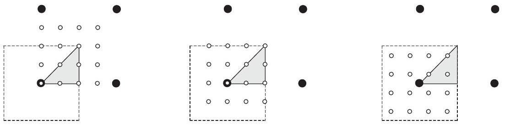
Figure 4.12. Grids for integration for a 2 d square lattice, each with four times the density of the reciprocal lattice in each dimension. The left and center figures are equivalent with one point at the origin, and the six inequivalent points in the irreducible BZ shown in gray. Right: a shifted special point grid of the same density but with only three inequivalent points. Additional possibilities have been given by Moreno and Soler [286], who also pointed out that different shifts and symmetrization can lead to finer grids.

eigenfunctions $\psi_{i, \mathbf{k}}$ and eigenvalues $\varepsilon_{i, \mathbf{k}}$, it is a smoothly varying, ${ }^{10}$ periodic function of $\mathbf{k}$. Thus $f_{i}(\mathbf{k})$ can be expanded in Fourier components,

$$
f_{i}(\mathbf{k})=\sum_{\mathbf{T}} f_{i}(\mathbf{T}) \mathrm{e}^{\mathrm{i} \mathbf{k} \cdot \mathbf{T}},
$$

where $\mathbf{T}$ are the translation vectors of the crystal. The most important point is that the contribution of the rapidly varying terms at large $\mathbf{T}$ decreases exponentially so that the sum in Eq. (4.40) can be truncated to a finite sum. The proof [287] is related to transformations of the expressions to traces over Wannier functions (see Chapter 23) and the observation that the range of $f_{i}(\mathbf{T})$ is determined by the range of the Wannier functions.

Special points are chosen for efficient integration of smooth periodic functions. ${ }^{11}$ The single most special point is the Baldereschi point [289], where the integration reduces to a single point. The choice is based upon (1) the fact that there is always some one "meanvalue point" where the integrand equals the integral, and (2) use of crystal symmetry to find such a point approximately. The coordinates of the mean-value point for cubic lattices were found to be [289] simple cubic, $k=(\pi / a)(1 / 2,1 / 2,1 / 2)$; body-centered cubic, $k=(2 \pi / a)(1 / 6,1 / 6,1 / 2)$; and face-centered cubic, $k=(2 \pi / a)(0.6223,0.2953,1 / 2)$. Chadi and Cohen [290] have generalized this idea and have given equations for "best" larger sets of points.

The general method proposed by Monkhorst and Pack [287] is now the most widely used method because it leads to a uniform set of points determined by a simple formula valid for any crystal (given here explicitly for three dimensions):

$$
\mathbf{k}_{n_{1}, n_{2}, n_{3}} \equiv \sum_{i}^{3} \frac{2 n_{i}-N_{i}-1}{2 N_{i}} \mathbf{G}_{i},
$$

[^7]where $\mathbf{G}_{i}$ are the primitive vectors of the reciprocal lattice. The main features of the Monkhorst-Pack points are as follows:

- A sum over the uniform set of points in Eq. (4.41), with $n_{i}=1,2, \ldots, N_{i}$, exactly integrates a periodic function that has Fourier components that extend only to $N_{i} \mathbf{T}_{i}$ in each direction. (See Exercise 4.21. In fact, Eq. (4.41) makes a maximum error for higher Fourier components.)
- The set of points defined by Eq. (4.41) is a uniform grid in $\mathbf{k}$ that is a scaled version of the reciprocal lattice and offset from $\mathbf{k}=0$. For many lattices, especially cubic, it is preferable to choose $N_{i}$ to be even [287]. Then the set does not involve the highest symmetry points; it omits the $\mathbf{k}=0$ point and points on the BZ boundary.
- The $N_{i}=2$ set is the Baldereschi point for a simple cubic crystal (taking into account symmetry - see below). The sets for all cubic lattices are also the same as the offset Gilat-Raubenheimer mesh (see [291]).
- An informative tabulation of grids and their efficiency, together with an illuminating description is given by Moreno and Soler [286], who emphasized the generation of different sets of regular grids using a combination of offsets and symmetry.

The logic behind the Monkhorst-Pack choice of points can be understood in one dimension, where it is easy to see that the exact value of the integral,

$$
I_{1}=\int_{0}^{2 \pi} \mathrm{~d} k \sin (k)=0
$$

is given by the value of the integrand $f_{1}(k)=\sin (k)$ at the midpoint, $k=\pi$ where $\sin (k)=$ 0 . If one has a sum of two sin functions, $f_{2}(k)=A_{1} \sin (k)+A_{2} \sin (2 k)$, then the exact value of the integral is given by a sum over two points:

$$
I_{2}=\int_{0}^{2 \pi} \mathrm{~d} k f_{2}(k)=0=f_{2}(k=\pi / 2)+f_{2}(k=3 \pi / 2)
$$

The advantage of the special point grids that do not contain the $\mathbf{k}=0$ point is much greater in higher dimensions. As illustrated in Fig. 4.12 for a square lattice, an integration with a grid $4 \times 4=16$ times as dense as the reciprocal lattice can be done with only three inequivalent $\mathbf{k}$ points in the irreducible BZ (defined in the following subsection). This set is sufficient to integrate exactly any periodic function with Fourier components up to $\mathbf{T}=(4,4) \times a$, where $a$ is the square edge. The advantages are greater in higher dimensions.

## 4.6.2 Irreducible BZ

Integrals over the BZ can be replaced by integrals only over the IBZ. For example, the sums needed in the total energy (general expressions in Section 7.3 or specific ones for crystals, such as Eq. (13.1)) have the form of Eq. (4.34). Since the summand is a scalar, it must be invariant under each operation, $f_{i}\left(R_{n} \mathbf{k}\right)=f_{i}(\mathbf{k})$. It is convenient to define $w_{\mathbf{k}}$ to be the total number of distinguishable $\mathbf{k}$ points related by symmetry to the given $\mathbf{k}$ point in the IBZ
(including the point in the IBZ) divided by the total number of points $N_{k}$. (Note that points on the BZ boundary related by $\mathbf{G}$ vectors are not distinguishable.) Then the sum Eq. (4.34) is equivalent to

$$
\bar{f}_{i}=\sum_{\mathbf{k}}^{\mathrm{IBZ}} w_{\mathbf{k}} f_{i}(\mathbf{k})
$$

Quantities such as the density can always be written as

$$
n(\mathbf{r})=\frac{1}{N_{k}} \sum_{\mathbf{k}} n_{\mathbf{k}}(\mathbf{r})=\frac{1}{N_{\text {group }}} \sum_{R_{n}} \sum_{\mathbf{k}}^{\mathrm{IBZ}} w_{\mathbf{k}} n_{\mathbf{k}}\left(R_{n} \mathbf{r}+\mathbf{t}_{n}\right) .
$$

Here points are weighted according to $w_{\mathbf{k}}$, just as in Eq. (4.44), and in addition the variable $\mathbf{r}$ is transformed in each term $n_{\mathbf{k}}(\mathbf{r})$. Corresponding expressions for Fourier components are given in Section 12.7.

Symmetry operations can be used to reduce the calculations greatly. Excellent examples are the Monkhorst-Pack meshes applied to cubic crystals, where there are 48 symmetry operations so that the IBZ is $1 / 48$ the total BZ. The set defined by $N_{i}=2$ has $2^{3}=8$ points in the BZ , which reduces to 1 point in the IBZ. Similarly, $N_{i}=4 \rightarrow 4^{3}=64$ points in the BZ reduces to 2 points; $N_{i}=6 \rightarrow 6^{3}=216$ points in the BZ reduces to 10 points. As an example, for fcc the 2 -point set is $(2 \pi / a)(1 / 4,1 / 4,1 / 4)$ and $(2 \pi / a)(1 / 4,1 / 4,3 / 4)$, which has been found to yield remarkably accurate results for energies of semiconductors, a fact that was very important in early calculations [171]. The 10-point set is sufficient for almost all modern calculations for such materials.

## 4.6.3 Interpolation Methods

Metals present an important general class of issues for efficient sampling of the desired states in the BZ. The Fermi surface plays a special role in all properties and the integration over states must take into account the sharp variation of the Fermi function from unity to zero as a function of $\mathbf{k}$. This plays a decisive role in all calculations of sums over occupied states for total quantities (e.g., the total electron density, energy, force, and stress in Chapter 7) and sums over both occupied and empty states for response functions and spectral functions (Chapter 20 and Appendix D).

In order to represent the Fermi surface, the tetrahedron method [292-295] is widely used. If the eigenvalues and vectors are known at a set of grid points, the variation between the grid points can always be approximated by an interpolation scheme using tetrahedra. This is particularly useful because tetrahedra can be used to fill all space for any grid. A simple case is illustrated on the left-hand side of Fig. 4.13, and the same construction can be used for other cases, e.g., an irregular grid that has more points near the Fermi surface and fewer points far from the Fermi surface where accuracy is not needed. The simplest procedure is a linear interpolation between the values known at the vertices, but higher-order schemes can also be used for special grids. Tetrahedron methods are very important in calculations for transition metals, rare earths, etc. where there are exquisite details of the Fermi surfaces that must be resolved.

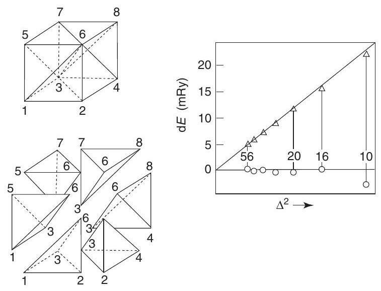
Figure 4.13. Example of generation of tetrahedra that fill the space between the grid points (left) and the results (right) of total energy calculations for Cu as a function of grid spacing $\Delta$, comparing the linear method and the method of [292]. From [292].

One example is the method proposed by Blöchl [292] in which there is a grid of $\mathbf{k}$ points and tetrahedra that reduces to a special-points method for insulators. It also provides an interpolation formula that goes beyond the linear approximation of matrix elements within the tetrahedra, which can improve the results for metals. The use of a regular grid is helpful since the irreducible $\mathbf{k}$ points and tetrahedra can be selected by an automated procedure. An example of results for Cu metal is shown on the right-hand side of Fig. 4.13. Since the Fermi surface of Cu is rather simple, the improvement over simple linear interpolation may be surprising; it is due largely to the fact that the curvature of the occupied band crossing the Fermi energy is everywhere positive so that linear interpolation always leads to a systematic error.

# 4.7 Density of States

An important quantity for many purposes is the density of states (DOS) per unit energy $E$ (and per unit volume $\Omega$ in extended matter),

$$
\rho(E)=\frac{1}{N_{k}} \sum_{i, \mathbf{k}} \delta\left(\varepsilon_{i, \mathbf{k}}-E\right)=\frac{\Omega_{\mathrm{cell}}}{(2 \pi)^{d}} \int_{\mathrm{BZ}} \mathrm{~d} \mathbf{k} \delta\left(\varepsilon_{i, \mathbf{k}}-E\right) .
$$

In the case of independent-particle states, where $\varepsilon_{i, \mathbf{k}}$ denotes the energy of an electron (or phonon), Eq. (4.46) is the number of independent-particle states per unit energy. Quantities like the specific heat involve excitations of electrons that do not change the number, i.e., an excitation from a filled to an empty state. Similarly, for independent-particle susceptibilities, such as general forms of $\chi^{0}$ in Appendix D and the dielectric function given in Eq. (21.9), the imaginary part is given by matrix elements times a joint DOS, i.e., a double sum over bands $i$ and $j$ but a single sum over $\mathbf{k}$ due to momentum conservation, as a function of the energy difference $E=\varepsilon_{j}-\varepsilon_{i}$.

It is straightforward to show that the DOS has "critical points," or van Hove singularities [296], where $\rho(E)$ has analytic forms that depend only on the space dimension. In three dimensions, each band must have square root singularities at the maxima and minima and at saddle points in the bands. A simple example is illustrated later in Fig. 14.4 for a tightbinding model in one, two, and three dimensions, and a characteristic example for many bands in a crystal is shown in Fig. 16.12; an example for phonons is shown in Fig. 2.11.

**SELECT FURTHER READING**

Physically motivated discussion for many crystals with symmetry labels:
Ashcroft, N. and Mermin, N., Solid State Physics (W. B. Saunders Company, New York, 1976).
Cohen, M. L. and Louie, S. G., Fundamentals of Condensed Matter Physics (Cambridge University Press, Cambridge, 2016).
Girvin S. M. and Yang K., Modern Condensed Matter Physics (Cambridge University Press, Cambridge, 2019).
Slater, J. C., Symmetry and Energy Bonds in Crystals (Dover, New York, 1972), collected and reprinted version of Quantum Theory of Molecules and Solids, vol. 2 (1965).

Books on group theory with applications to crystals:
Heine, V., Group Theory (Pergamon Press, New York, 1960).
Lax, M. J., Symmetry Principles in Solid State and Molecular Physics (John Wiley \& Sons, New York, 1974).
Tinkham, M., Group Theory and Quantum Mechanics (McGraw-HIll, New York, 1964).
Book with insightful problems with solutions:
Mihaly, L. and Martin, M. C., Solid State Physics: Problems and Solutions, 2nd ed. (Wiley-VCH, Berlin, 2009).

**Exercises**

4.1 Derive the expression for primitive reciprocal lattice in three dimensions given in Eq. (4.13).
4.2 For a two-dimensional lattice give an expression for primitive reciprocal lattice vectors that is equivalent to the one for three dimensions given in Eq. (4.13).
4.3 Show that for the two-dimensional triangular lattice the reciprocal lattice is also triangular and is rotated by $90^{\circ}$.
4.4 Show that the volume of the primitive cell in any dimension is given by Eq. (4.4).
4.5 Find the Wigner-Seitz cell for the two-dimensional triangular lattice. Does it have the symmetry of a triangle or of a hexagon? Support your answer in terms of the symmetry of the triangular lattice.
4.6 Draw the Wigner-Seitz cell and the first Brillouin zone for the two-dimensional triangular lattice.
4.7 Consider a honeycomb plane of graphite in which each atom has three nearest neighbors. Give primitive translation vectors, basis vectors for the atoms in the unit cell, and reciprocal lattice primitive vectors. Show that the BZ is hexagonal.
4.8 Covalent crystals tend to form structures in which the bonds are not at $180^{\circ}$. Show that this means that the structures will have more than one atom per primitive cell.
4.9 Show that the fcc and bcc lattices are reciprocal to one another. Do this in two ways: by drawing the vectors and taking cross products and by explicit inversion of the lattice vector matrices.
4.10 Consider a body-centered cubic crystal, like Na , composed of an element with one atom at each lattice site. What is the Bravais lattice in terms of the conventional cube edge $a$ ? How many nearest neighbors does each atom have? How many second neighbors? Now suppose that the crystal is changed to a diatomic crystal like CsCl with all the nearest neighbors of a Cs atom being Cl , and vice versa. Now what is the Bravais lattice in terms of the conventional cube edge $a$ ? What is the basis?
4.11 Derive the value of the ideal $c / a$ ratio for packing of hard spheres in the hcp structure.
4.12 Derive the formulas given in Eq. (4.12), paying careful attention to the definitions of the matrices and the places where the transpose is required.
4.13 Derive the formulas given in Eq. (4.18).
4.14 Derive the formulas given in Eq. (4.19).
4.15 Derive the relations given in Eqs. (4.20) and (4.21) for the parallelepiped that bounds a sphere in real and in reciprocal space. Explain the reason why the dimensions of the parallelepiped in reciprocal space involve the primitive vectors for the real lattice and vice versa.
4.16 Determine the coordinates of the points on the boundary of the Brillouin zone for fcc (X, W, $\mathrm{K}, \mathrm{U})$ and bcc ( $\mathrm{H}, \mathrm{N}, \mathrm{P}$ ) lattices.
4.17 Derive the formulas given in Eqs. (4.20) and (4.21). Hint: use the relations of real and reciprocal space given in the sentences before these equations.
4.18 Show that the expressions for integrals over the Brillouin zone Eq. (4.35), applied to the case of free electrons, lead to the same relations between density of one spin state $n^{\sigma}$ and the Fermi momentum $k_{F}^{\sigma}$ that was found in the section on homogeneous gas in Eq. (5.5). (From this one relation follow the other relations given after Eq. (5.5).)
4.19 In one dimension, dispersion can have singularities only at the end points where $E(k)-E_{0}= A\left(k-k_{0}\right)^{2}$, with $A$ positive or negative. Show that the singularities in the DOS form have the form $\rho(E) \propto\left|E-E_{0}\right|^{-1 / 2}$, as illustrated in the left panel of Fig. 14.4.
4.20 Show that singularities like those in Fig. 14.4 occur in three dimensions, using (4.46) and the fact that $E \propto A k_{x}^{2}+B k_{y}^{2}+C k_{z}^{2}$ with $A, B, C$ all positive (negative) at minima (maxima) or with different signs at saddle points.
4.21 The "special points" defined by Monkhorst and Pack are chosen to integrate periodic functions efficiently with rapidly decreasing magnitude of the Fourier components. This is a set of exercises to illustrate this property:
(a) Show that in one dimension the average of $f(k)$ at the $k$ points $\frac{1}{4} \frac{\pi}{a}$ and $\frac{3}{4} \frac{\pi}{a}$ is exact if $f$ is a sum of Fourier components $k+n \frac{2 \pi}{a}$, with $n=0,1,2,3$, but that the error is maximum for $n=4$.
(b) Derive the general form of Eq. (4.41).
(c) Why are uniform sets of points more efficient if they do it not include the $\Gamma$ point?
(d) Derive the 2- and 10-point sets given for an fcc lattice, where symmetry has been used to reduce the points to the irreducible BZ.
4.22 The bands of any one-dimensional crystal are solutions of the Schrödinger equation (4.22) with a periodic potential $V(x+a)=V(x)$. The complete solution can be reduced to an informative analytic expression in terms of the scattering properties of a single unit cell and the Bloch theorem. This exercise follows the illuminating discussion by Ashcroft and Mermin [280], problem 8.1, and it lays a foundation for exercises that illustrate the pseudopotential concept (Exercises 11.2, 11.6, and 11.14) and the relation to plane wave, APW, KKR, and MTO methods, respectively, in Exercise 12.6, 16.1, 16.7, and 16.13.

An elegant approach is to consider a different problem first: an infinite line with $\tilde{V}(x)=0$ except for a single cell in which the potential is the same as in a cell of the crystal, $\tilde{V}(x)=V(x)$ for $-a / 2<x<a / 2$. At any positive energy $\varepsilon \equiv\left(\hbar^{2} / 2 m_{e}\right) K^{2}$, there are two solutions: $\psi_{l}(x)$ and $\psi_{r}(x)$ corresponding to waves incident from the left and from the right. Outside the cell, $\psi_{l}(x)$ is a given by $\psi_{l}(x)=\mathrm{e}^{i K x}+r \mathrm{e}^{-i K x}, x<-\frac{a}{2}$, and $\psi_{l}(x)=t \mathrm{e}^{i K x}, x>a / 2$, where $t$ and $r$ are transmission and reflection amplitudes. There is a corresponding expression for $\psi_{r}(x)$. Inside the cell, the functions can be found by integration of the equation, but we can proceed without specifying the explicit solution.
(a) The transmission coefficient can be written as $t=|t| \mathrm{e}^{i \delta}$, with $\delta$ a phase shift that is related to the phase shifts defined in Appendix J as clarified in Exercise 11.2. It is well known from scattering theory that $|t|^{2}+|r|^{2}=1$ and $r= \pm i|r| \mathrm{e}^{i \delta}$, which are left as an exercise to derive.
(b) A solution $\psi(x)$ in the crystal at energy $\varepsilon$ (if it exists) can be expressed as a linear combination of $\psi_{l}(x)$ and $\psi_{r}(x)$ evaluated at the same energy. Within the central cell all functions satisfy the same equation and $\psi(x)$ can always be written as a linear combination,

$$
\psi(x)=A \psi_{l}(x)+B \psi_{r}(x), \quad-\frac{a}{2}<x<\frac{a}{2},
$$

with $A$ and $B$ chosen so that $\psi(x)$ satisfies the Bloch theorem for some crystal momentum $k$. Since $\psi(x)$ and $\mathrm{d} \psi(x) / \mathrm{d} x$ must be continuous, it follows that $\psi\left(\frac{a}{2}\right)=\mathrm{e}^{i k a} \psi\left(-\frac{a}{2}\right)$ and $\psi^{\prime}\left(\frac{a}{2}\right)=\mathrm{e}^{i k a} \psi^{\prime}\left(-\frac{a}{2}\right)$. Using this information and the forms of $\psi_{l}(x)$ and $\psi_{r}(x)$, find the $2 \times 2$ secular equation and show that the solution is given by

$$
2 t \cos (k a)=\mathrm{e}^{-i K a}+\left(t^{2}-r^{2}\right) \mathrm{e}^{i K a} .
$$

Verify that this is the correct solution for free electrons, $V(x)=0$.
(c) Show that in terms of the phase shift, the solution, (4.48), can be written

$$
|t| \cos (k a)=\cos (K a+\delta), \quad \varepsilon \equiv \frac{\hbar^{2}}{2 m_{e}} K^{2}
$$

(d) Analyze Eq. (4.49) to illustrate properties of bands and indicate which are special features of one dimension. (i) Since $|t|$ and $\delta$ are functions of energy $\varepsilon$, it is most convenient to fix $\varepsilon$ and use Eq. (4.49) to find the wavevector $k$; this exemplifies the "root-tracing" method used in augmented methods (Chapter 16). (ii) There are necessarily bandgaps where there are no solutions, except for the free electron case. (iii) There is exactly one band of allowed states $\varepsilon(k)$ between each gap. (iv) The density of states, Eq. (4.46), has the form shown in the left panel in Fig. 14.4.
(e) Finally, discuss the problems with extending this approach to higher dimensions.

[^0]:    ${ }^{1}$ A group is defined by the condition that the application of any two operations leads to a result that is another operation in the group. We will illustrate this with the translation group. The reader is referred to other sources for the general theory and the specific set of groups possible in crystals, e.g., books on group theory (see [281283], and the comprehensive work by Slater [284].

[^1]:    ${ }^{2}$ In some crystals the space group can be factorized into a product of translation and point groups; in others (such as the diamond structure) there are nonsymmorphic operations that can only be expressed as a combination of translation and a point operation.

[^2]:    ${ }^{3}$ In any case where the origin can be chosen as a center of inversion, the Fourier transforms of all properties, such as the density and potential, are real. Also, all excitations can be classified into even and odd relative to this origin, and the fourfold rotational symmetry allows the roles of the five Cu d states to be separated.
    ${ }^{4}$ Simple reasoning shows that all covalently bonded crystals are expected to have more than one atom per primitive cell (see the examples of diamond and ZnS crystals and Exercise 4.8).

[^3]:    ${ }^{5}$ Of course invariance to the choice of boundary conditions in the large-system limit must be proven. For shortrange forces and periodic operators the proof is straightforward, but the generalization to Coulomb forces requires care in defining the boundary conditions on the potentials. The calculation of electric polarization is especially problematic and a satisfactory theory has been developed only within the past few years, as is described in Chapter 24.

[^4]:    ${ }^{6}$ We take the Born-von Karman boundary conditions that the excitations are required to be periodic in the large volume $\Omega_{\text {crystal }}$ composed of $N_{\text {cell }}=N_{1} \times N_{2} \times \cdots$ cells, as was described previously in Eq. (4.6). See the footnote there regarding the proofs that the results are independent of the choice of boundary conditions in the thermodynamic limit of large size.
    ${ }^{7}$ The derivation here follows the "first proof" of the Bloch theorem as described by Ashcroft and Mermin [280]. It is rather formal and simpler alternative proofs are given in Chapters 12 and 14.

[^5]:    ${ }^{8}$ The logic also holds if the potential is a nonlocal operator (as in pseudopotentials, with which we will deal later).

[^6]:    ${ }^{9}$ The properties of waves in periodic media were derived earlier by Flouquet in one dimension (see note in [280]) and is often referred to in the physics literature as the "Bloch-Flouquet theorem."

[^7]:    ${ }^{10}$ For an individual band the variation is not smooth at crossings with other bands; however, the relevant sums over all filled bands are smooth so long as all bands concerned are filled. This is always the case if the filled and empty bands are separated by a gap as in an insulator.
    ${ }^{11}$ In this sense, the method is analogous to Gauss-Chebyshev integration. (See [288], who found that GaussChebyshev can be more efficient than the Monkhorst-Pack method for large sets of points.)

