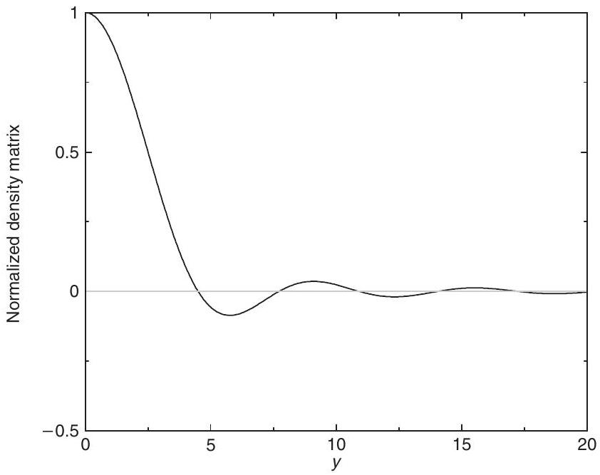
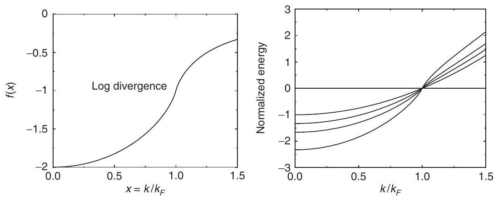
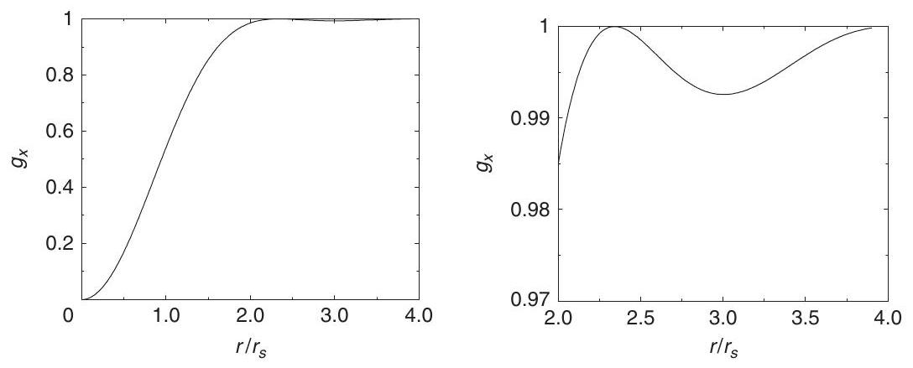
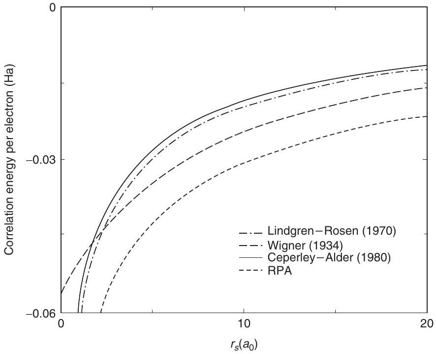
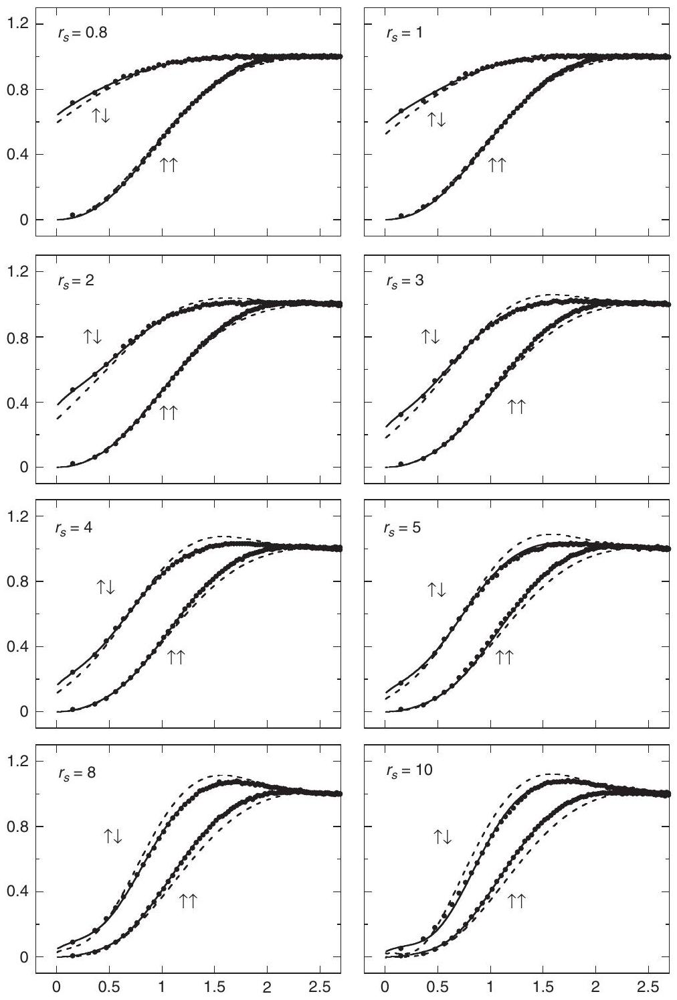
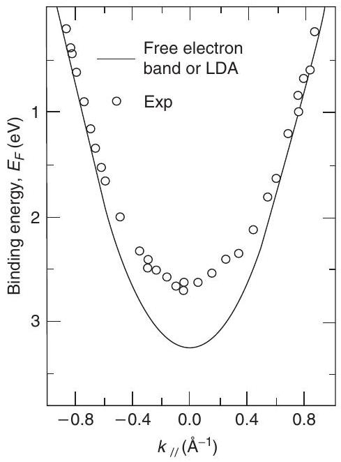
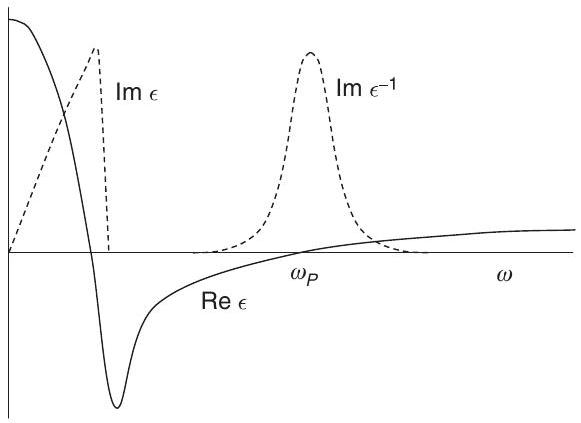

**5**

**Uniform Electron Gas and sp-Bonded Metals**

**Summary**

The simplest model system representing electrons in condensed matter is the homogeneous electron gas, in which the nuclei are replaced by a uniform positively charged background. This system is completely specified by the density $n$ (or $r_{s}$, which is the average distance between electrons) and the spin density $n_{\uparrow}-n_{\downarrow}$ or the polarization $\zeta=\left(n_{\uparrow}-n_{\downarrow}\right) / n$. The homogeneous gas illustrates the problems associated with interacting electrons in condensed matter and is a prelude to the electronic structure of matter, which is governed by the combined effects of nuclei and electron interaction.

# 5.1 The Electron Gas

The homogeneous electron gas is the simplest system for illustrating key properties of interacting electrons and characteristic magnitudes of electronic energies in condensed matter. Since all independent-particle terms can be calculated analytically, this is an ideal model system for understanding the effects of correlation. In particular, the homogeneous gas best illustrates the issues of Fermi liquid theory [297, 298], which is the basis for our understanding of the "normal" (nonsuperconducting) state of real metals in terms of effective independent-particle approaches.

A homogeneous system is completely specified by its density $n=N_{e} / \Omega$, which can be characterized by the parameter $r_{s}$, defined as the radius of a sphere containing one electron on average,

$$
\frac{4 \pi}{3} r_{s}^{3}=\Omega / N_{e}=\frac{1}{n} ; \quad \text { or } \quad r_{s}=\left(\frac{3}{4 \pi n}\right)^{1 / 3} .
$$

Thus $r_{s}$ is a measure of the average distance between electrons. Table 5.1 gives values of $r_{s}$ for valence electrons in a number of elements. The values shown are typical of characteristic electron densities in solids. For simple crystals, $r_{s}$ is readily derived from the structure and

Table 5.1. Typical $r_{s}$ values in elemental solids in units of the Bohr radius $a_{0}$. The valence is indicated by $Z$. The alkalis have bcc structure; $\mathrm{Al}, \mathrm{Cu}$, and Pb are fcc; the other group IV elements have diamond structure; and other elements have various structures. The values for metals are taken from [285] and [300]; precise values depend on temperature.
| $Z=1$ | $Z=2$ | $Z=1$ | $Z=2$ | $Z=3$ | $Z=4$ |
| :--- | :--- | :--- | :--- | :--- | :--- |
| Li 3.23 | Be 1.88 |  |  | B | C 1.31 |
| Na 3.93 | Mg 2.65 |  |  | Al 2.07 | Si 2.00 |
| K 4.86 | Ca 3.27 | Cu 2.67 | Zn 2.31 | Ga 2.19 | Ge 2.08 |
| Rb 5.20 | Sr 3.56 | Ag 3.02 | Cd 2.59 | In 2.41 | Sn 2.39 |
| Cs 5.63 | Ba 3.69 | Au 3.01 | Hg 2.15 | Tl | Pb 2.30 |

lattice constant; expressions for fcc and bcc, and the VI, III-V, and II-VI semiconductors are given in Exercises 5.1 and 5.2.

Of course, density is not constant in a real solid and it is interesting to determine the variation in density. In ordinary diamond-structure Si , there is a significant volume with low density (the open parts of the diamond structure). However, in the compressed metallic phase of Si with Sn structure, the variation in $r_{s}$ is only $\pm \approx 20 \%$. The distribution of local values of the density parameter $r_{s}$ for valence electrons in Si can be found in [299].

The hamiltonian for the homogeneous system is derived by replacing the nuclei in Eq. (3.1) with a uniform positively charged background, which leads to

$$
\begin{aligned}
\hat{H}= & -\frac{\hbar^{2}}{2 m_{e}} \sum_{i} \nabla_{i}^{2}+\frac{1}{2} \frac{4 \pi}{\epsilon_{0}}\left[\sum_{i \neq j} \frac{e^{2}}{\left|\mathbf{r}_{i}-\mathbf{r}_{j}\right|}-\int \mathrm{d}^{3} r \mathrm{~d}^{3} r^{\prime} \frac{(n e)^{2}}{\left|\mathbf{r}-\mathbf{r}^{\prime}\right|}\right] \\
& \rightarrow-\frac{1}{2} \sum_{i} \nabla_{i}^{2}+\frac{1}{2}\left[\sum_{i \neq j} \frac{1}{\left|\mathbf{r}_{i}-\mathbf{r}_{j}\right|}-\int \mathrm{d}^{3} r \mathrm{~d}^{3} r^{\prime} \frac{n^{2}}{\left|\mathbf{r}-\mathbf{r}^{\prime}\right|}\right]
\end{aligned}
$$

where the second expression is in Hartree atomic units $\hbar=m_{e}=e=4 \pi / \epsilon_{0}=1$, where lengths are given in units of the Bohr radius $a_{0}$. The last term is the average background term, which must be included to cancel the divergence due to Coulomb interaction among the electrons. The total energy is given by

$$
E=\langle\hat{H}\rangle=\langle\hat{T}\rangle+\left\langle\hat{V}_{\text {int }}\right\rangle-\frac{1}{2} \int \mathrm{~d}^{3} r \mathrm{~d}^{3} r^{\prime} \frac{n^{2}}{\left|\mathbf{r}-\mathbf{r}^{\prime}\right|},
$$

where the first term is the kinetic energy of interacting electrons and the last two terms are the difference between the potential energy of the actual interacting electrons and the self-interaction of a classical uniform negative charge density, i.e., the exchange-correlation
energy. ${ }^{1}$ Note that the difference is well defined since there is a cancellation of the divergent Coulomb interactions, as discussed following Eq. (3.16).

In order to understand the interacting gas as a function of density, it is useful to express the hamiltonian Eq. (5.2) in terms of scaled coordinates $\tilde{\mathbf{r}}=\mathbf{r} / r_{s}$ instead of atomic units ( $\mathbf{r}$ in units of $a_{0}$ ) assumed in the second expression in (5.2). Then Eq. (5.2) becomes (see Exercise 5.3 for the last term, which is essential for the expression to be well defined)

$$
\hat{H}=\left(\frac{a_{0}}{r_{s}}\right)^{2} \sum_{i}\left[-\frac{1}{2} \tilde{\nabla}_{i}^{2}+\frac{1}{2} \frac{r_{s}}{a_{0}}\left(\sum_{j \neq i} \frac{1}{\left|\tilde{\mathbf{r}}_{i}-\tilde{\mathbf{r}}_{j}\right|}-\frac{3}{4 \pi} \int \mathrm{~d}^{3} \tilde{\mathbf{r}} \frac{1}{|\tilde{\mathbf{r}}|}\right)\right],
$$

where energies are in atomic units. This expression shows explicitly that one can view the system in terms of a scaled unit of energy (the Hartree scaled by $\left(a_{0} / r_{s}\right)^{2}$ ) and a scaled effective interaction proportional to $r_{s} / a_{0}$. In other words, the properties as a function of density $r_{s} / a_{0}$ are completely equivalent to a system at fixed density but with scaled electron-electron interaction $e^{2} \rightarrow\left(r_{s} / a_{0}\right) e^{2}$ at fixed density and a scaled unit of energy.

# 5.2 Noninteracting and Hartree-Fock Approximations

In the noninteracting approximation, the solutions of Eq. (3.36) are eigenstates of the kinetic energy operator, i.e., normalized plane waves $\psi_{\mathbf{k}}=\left(1 / \Omega^{1 / 2}\right) \mathrm{e}^{\mathrm{i} \mathbf{k} \cdot \mathbf{r}}$ with energy $\varepsilon_{\mathbf{k}}=\frac{\hbar^{2}}{2 m_{e}} k^{2}$. The ground state for a given density of up and down spin electrons is the determinant function Eq. (3.43) formed from the single-electron states with wavevectors inside the Fermi surface, which is a sphere in reciprocal space of radius $k_{F}^{\sigma}$, the Fermi wavevector for each spin $\sigma$. The value of $k_{F}^{\sigma}$ is readily derived, since each allowed k state in a crystal of volume $\Omega$ is associated with a volume in reciprocal space $(2 \pi)^{3} / \Omega$ (see Exercise 5.4 and Chapter 4.) Each state can contain one electron of each spin so that

$$
\frac{4 \pi}{3}\left(k_{F}^{\sigma}\right)^{3}=\frac{(2 \pi)^{3}}{\Omega} N_{e}^{\sigma} \text {; i.e. }\left(k_{F}^{\sigma}\right)^{3}=6 \pi^{2} n^{\sigma} \text { or } k_{F}^{\sigma}=\left(6 \pi^{2}\right)^{1 / 3}\left(n^{\sigma}\right)^{1 / 3} .
$$

If the system is unpolarized, i.e., $n^{\uparrow}=n^{\downarrow}=n / 2$, then $k_{F}=k_{F}^{\uparrow}=k_{F}^{\downarrow}$, where

$$
\left(k_{F}\right)^{3}=3 \pi^{2} n ; \text { or } k_{F}=\left(3 \pi^{2}\right)^{1 / 3} n^{1 / 3}=\left(\frac{9}{4} \pi\right)^{1 / 3} / r_{s} .
$$

The expression for the Fermi wavevector has the remarkable property that it also applies to interacting electron systems: the Luttinger theorem [47, 301] guarantees that the Fermi surface exists at the same $k_{F}^{\sigma}$ as in the noninteracting case so long as there is no phase transition.

In the independent-particle approximation, Fermi energy $E_{F 0}^{\sigma}$ for each spin is given by

$$
E_{F 0}^{\sigma}=\frac{\hbar^{2}}{2 m_{e}}\left(k_{F}^{\sigma}\right)^{2}=\frac{1}{2}\left(k_{F}^{\sigma} a_{0}\right)^{2} \rightarrow \frac{1}{2}\left(k_{F}^{\sigma}\right)^{2},
$$

[^0]Table 5.2. Characteristic energies for each spin $\sigma$ for the homogeneous electron gas in the Hartree-Fock approximation: the Fermi energy $E_{F 0}^{\sigma}$; kinetic energy $T_{0}^{\sigma}$ and Hartree-Fock exchange energy per electron $E_{x}^{\sigma}$, which is negative; and the increase in band width in the Hartree-Fock approximation $\Delta W_{\text {HFA }}$
| Quantity | Expression | Atomic units |
| :--- | :--- | :--- |
| $E_{F 0}^{\sigma}$ | $\frac{\hbar^{2}}{2 m_{e}}\left(k_{F}^{\sigma}\right)^{2}$ | $\frac{1}{2}\left(k_{F}^{\sigma}\right)^{2}$ |
| $T_{0}^{\sigma}$ | $\frac{3}{5} E_{F}^{\sigma}$ | $\frac{3}{5} E_{F}^{\sigma}$ |
| $-E_{x}^{\sigma}$ | $\frac{3 e^{2}}{4 \pi} k_{F}^{\sigma}$ | $\frac{3}{4 \pi} k_{F}^{\sigma}$ |
| $\Delta W_{\text {HFA }}^{\sigma}$ | $\frac{e^{2}}{\pi} k_{F}^{\sigma}$ | $\frac{1}{\pi} k_{F}^{\sigma}$ |

Table 5.3. Useful expressions for the unpolarized homogeneous electron gas in terms of $r_{s}$ in units of the Bohr radius $a_{0}$. See caption of Table 5.2 for definitions of energies.
| Quantity | Expression | Atomic units | Common units |
| :--- | :--- | :--- | :--- |
| $k_{F}$ | $\left(\frac{9}{4} \pi\right)^{1 / 3} / r_{s}$ | $1.919,158 / r_{s}$ | $3.626,470 / r_{S}$ (Ang. ${ }^{-1}$ ) |
| $E_{F 0}$ | $\frac{1}{2}\left(\frac{9}{4} \pi\right)^{2 / 3} / r_{s}^{2}$ | $1.841,584 / r_{S}^{2}$ | $50.112,45 / r_{S}^{2}(\mathrm{eV})$ |
| $T_{0}$ | $\frac{3}{5} E_{F}$ | $1.104,961 / r_{s}^{2}$ | $30.067,47 / r_{s}^{2}(\mathrm{eV})$ |
| $-E_{x}$ | $\frac{3}{4 \pi}\left(\frac{9 \pi}{4}\right)^{1 / 3} / r_{s}$ | $0.458,165,29 / r_{s}$ | $12.467,311 / r_{s}(\mathrm{eV})$ |
| $\Delta W_{\mathrm{HFA}}$ | $\left(\frac{9}{4 \pi^{2}}\right)^{1 / 3} / r_{s}$ | $0.145,838,54 / r_{s}$ | $3.968,4684 / r_{S}(\mathrm{eV})$ |

where the last expression is in atomic units with $a_{0}=1$. Useful relations for the Fermi wavevector and various energies are given in Tables 5.2 and 5.3.

The total kinetic energy per electron of a given spin in the ground state is given by integrating over the filled states

$$
T_{0}^{\sigma}=\frac{\hbar^{2}}{2 m_{e}} \frac{4 \pi \int_{0}^{k_{F}^{\sigma}} \mathrm{d} k k^{4}}{4 \pi \int_{0}^{k_{F}^{\sigma}} \mathrm{d} k k^{2}}=\frac{3}{5} E_{F 0}^{\sigma}
$$

(see Exercise 5.7 for one and two dimensions). Since the energy is positive, the homogeneous gas is clearly unbound in this approximation. The true binding in a material is provided by the added attraction to point nuclei and the attractive exchange and correlation energies.

## 5.2.1 Density Matrix

The density matrix in the homogeneous gas illustrates both the general expressions and the nature of the spatial dependence in many-electron systems. The general expression for independent fermions Eq. (3.41) simplifies for the homogeneous gas (for each spin) to

$$
\rho\left(\mathbf{r}, \mathbf{r}^{\prime}\right)=\rho\left(\left|\mathbf{r}-\mathbf{r}^{\prime}\right|\right)=\frac{1}{(2 \pi)^{3}} \int \mathrm{~d} \mathbf{k} f(\varepsilon(k)) \mathrm{e}^{\mathrm{i} \mathbf{k} \cdot\left(\mathbf{r}-\mathbf{r}^{\prime}\right)},
$$

where $\varepsilon(k)=k^{2} / 2$, which is just a Fourier transform of the Fermi function $f(\varepsilon(k))$. To evaluate the function it is convenient to transform the expression using a partial integration [302], yielding

$$
\rho(r)=\frac{\beta}{(2 \pi)^{2}} \frac{1}{r} \frac{\mathrm{~d}}{\mathrm{~d} r} \frac{1}{r} \frac{\mathrm{~d}}{\mathrm{~d} r} \int_{-\infty}^{\infty} \mathrm{d} k \cos (k r) f^{\prime}\left(\beta\left(\frac{1}{2} k^{2}-\mu\right)\right) .
$$

This is a particularly revealing form that makes it clear why long-range oscillations in $r=\left|\mathbf{r}-\mathbf{r}^{\prime}\right|$ must result from sharp variation in the derivative of the Fermi function $f^{\prime}(\varepsilon)$, long known in Fourier transforms and attributed to Gibbs [303]. Since $f^{\prime}(\varepsilon)$ approaches a delta function at low temperature, the range of $\rho(r)$ must increase as the temperature is reduced. At $T=0, \rho(r)$ decays as $1 / r^{2}$ [260],

$$
\rho(r)=\frac{k_{F}^{3}}{3 \pi^{2}}\left[3 \frac{\sin (y)-y \cos (y)}{y^{3}}\right],
$$

with $y=k_{F} r$. The function in square brackets is defined to be normalized (Exercise 5.6) and is plotted in Fig. 5.1, where the decaying oscillatory form is evident, often called Friedel oscillations for charge and Ruderman-Kittel-Kasuya-Yosida oscillations for magnetic interactions [260, 280, 285]. Numerical results [302, 304] and simple analytic approximations [278, 302] can be found for $T \neq 0$, which show an exponential decay constant $\propto k_{B} T / k_{F}$.

## 5.2.2 Hartree-Fock Approximation

In the Hartree-Fock approximation, the one-electron orbitals are eigenstates of the nonlocal operator in Eq. (3.45). The solution of the Hartree-Fock equations in this case can be done analytically: the first step is to show that the eigenstates are plane waves, just as for noninteracting electrons (see Exercise 5.8). Thus the kinetic energy and the density matrix are the same as for noninteracting electrons, as they must be since the Hartree-Fock wavefunction contains no correlation beyond that required by the exclusion principle. The next step is to derive the eigenvalue for each $k$, which is $k^{2} / 2$ plus the matrix element of the exchange operator Eq. (3.48). The integrals can be done analytically (the steps are outlined in Exercise 5.9 following [280, 297]), leading to

$$
\varepsilon_{k}=\frac{1}{2} k^{2}+\frac{k_{F}}{\pi} f(x),
$$

Figure 5.1. The dimensionless density matrix at $T=0$ in the noninteracting homogeneous gas (the term in square brackets in Eq. (5.11) as a function of $y=k_{F} r$ ). The oscillations have spatial form governed by the Fermi wavevector $k_{F}$ and describe charge around an impurity (Friedel oscillations) or magnetic interactions in a metal (Ruderman-Kittel-Kasuya-Yosida oscillations) [260, 280, 285]. See also Fig. 5.3, which shows the consequences for the pair correlation function.

where $x=k / k_{F}$ and

$$
f(x)=-\left(1+\frac{1-x^{2}}{2 x} \ln \left|\frac{1+x}{1-x}\right|\right) .
$$

(Note that the expression applies to each spin separately.)
The factor $f(x)$, shown in Fig. 5.2, is negative for all $x$; at the bottom of the band ( $x=0$ ), $f(0)=-2$, and at large $x$ it approaches zero. Near the Fermi surface ( $x=1$ ), $f(x)$ varies rapidly and has a divergent slope; nevertheless the limiting value at $x=1$ is well defined, $f(x \rightarrow 1)=-1$. Thus in the Hartree-Fock approximation, exchange increases the band width $W$ by $\Delta W=k_{F} / \pi$. This holds separately for each spin, and in the unpolarized case, the factor can also be written $\Delta W=\left(\frac{9}{4 \pi^{2}}\right)^{1 / 3} / r_{s}$ (see Table 5.3 and Exercise 5.10).

The Hartree-Fock eigenvalue relative to the Fermi energy, i.e., defined with $\varepsilon_{k} \equiv 0$ at $k=k_{F}$, can be written in scaled form,

$$
\varepsilon_{k}=\frac{1}{2} k_{F}^{2}\left\{\left(x^{2}-1\right)+\frac{2}{\pi k_{F}}[f(x)+1]\right\} .
$$

The expression in curly brackets is plotted on the right-hand side of Fig. 5.2 for several values of $r_{s}$. The broadening of the filled band due to interactions in the Hartree-Fock approximation is indicated by the value at $k=0$, which is -1 for noninteracting electrons.

The singularity at the Fermi surface, first pointed out by Bardeen, [254], is a consequence of long-range Coulomb interaction and the existence of the Fermi surface where the separation of the occupied and empty states vanishes. The velocity at the Fermi surface

Figure 5.2. Left: the factor $f(x)$, Eq. (5.13), in the homogeneous gas that determines the dispersion $\varepsilon_{\mathrm{HFA}}(k)$ in the Hartree-Fock approximation. Right: $\varepsilon_{\mathrm{HFA}}(k)$ for three densities $\left(r_{s}=1,2,4\right)$ compared to the noninteracting case. The lowest density (largest $r_{s}$ ) is lowest at $k=0$ and has the most visible singularity at the Fermi surface, $x=1$. The normalized dimensionless eigenvalue is defined by the square brackets in Eq. (5.14), and $r_{s}=0$ is the noninteracting limit $-1+x^{2}$.

$\mathrm{d} \varepsilon / \mathrm{d} k$ diverges (Exercise 5.11), in blatant contradiction with experiment, where the welldefined velocities are determined by such measurements as specific heat and the de Haasvan Alfen effect [280,285]. Thus this is an intrinsic failure of Hartree-Fock that carries over to any metal. The Hartree-Fock divergence, however, can be avoided either if there is a finite gap (i.e., in an insulator where Hartree-Fock is qualitatively correct and is widely applied in quantum chemistry) or if the Coulomb interaction is screened to be effectively short range. This is the ansatz - i.e., the assertion - of Fermi liquid theory: that the interactions are screened for low-energy excitations, leading to weakly interacting "quasiparticles," which is commonly justified by partial summation of diagrams in the random phase approximation (RPA) [297, 298].

## 5.2.3 The Exchange Energy and Exchange Hole

The exact total energy of the homogeneous gas is given by Eq. (5.3), which can be separated into the Hartree-Fock total energy, which is the sum of kinetic energy of independent electrons plus the exchange energy, and the remainder, termed the "correlation energy." As we have seen in Section 3.7, the exchange energy and exchange hole can be computed directly from the wavefunctions, which can be done analytically in this case. In addition, the exchange energy per electron is simply the average of the exchange contribution to the eigenvalue $\frac{k_{F}}{\pi} f(x)$ in Eq. (5.12) multiplied by $1 / 2$ to take into account the fact that interactions should not be double counted. Using the fact that the average value of $f(x)$ is $-3 / 2$ (Exercise 5.12), it follows that the exchange energy per electron is

$$
\epsilon_{x}^{\sigma}=E_{x}^{\sigma} / N^{\sigma}=-\frac{3}{4 \pi} k_{F}^{\sigma}=-\frac{3}{4}\left(\frac{6}{\pi} n^{\sigma}\right)^{1 / 3} .
$$

In the unpolarized case, one finds $\epsilon_{x} \equiv \epsilon_{x}^{\uparrow}=\epsilon_{x}^{\downarrow}=-\frac{3}{4 \pi}\left(\frac{9 \pi}{4}\right)^{1 / 3} / r_{s}$ and the explicit numerical relations in Table 5.3.

Figure 5.3. Exchange hole $g_{x}(r)$ in the homogeneous electron gas, Eq. (5.19) plotted as a function of $r / r_{s}$, where $r_{s}$ is the average distance between electrons in an unpolarized system. The magnitude decreases rapidly with oscillation, as shown in the greatly expanded right-hand figure. Note the similarity to the calculated pair correlation function for parallel spins in Fig. 5.5.

For partially polarized cases, the exchange energy is just a sum of terms for the two spins, which can also be expressed in an alternative form in terms of the total density $n=n^{\uparrow}+n^{\downarrow}$ and fractional polarization,

$$
\zeta=\frac{n^{\uparrow}-n^{\downarrow}}{n} .
$$

It is straightforward to show that exchange in a polarized system has the form

$$
\epsilon_{x}(n, \zeta)=\epsilon_{x}(n, 0)+\left[\epsilon_{x}(n, 1)-\epsilon_{x}(n, 0)\right] f_{x}(\zeta),
$$

where

$$
f_{x}(\zeta)=\frac{1}{2} \frac{(1+\zeta)^{4 / 3}+(1-\zeta)^{4 / 3}-2}{2^{1 / 3}-1}
$$

which is readily derived [305] from Eq. (5.15).
The exchange hole $g_{x}$ defined in Eqs. (3.54) or (3.52) involves only electrons of the same spin and in a homogeneous system is a function only of the relative distance $|\mathbf{r}|=\left|\mathbf{r}_{1}-\mathbf{r}_{2}\right|$, so that $g_{x}\left(\mathbf{r}_{1}, \sigma_{1} ; \mathbf{r}_{2}, \sigma_{2}\right)=\delta_{\sigma_{1}, \sigma_{2}} g_{x}^{\sigma_{1}, \sigma_{1}}(|\mathbf{r}|)$. In the homogeneous gas, the form of the exchange hole can be calculated analytically in two ways (see Exercise 5.13): the definitions can be used directly [306] by inserting the plane wave eigenfunctions (normalized to a large volume $\Omega$ ) and evaluating the resulting expression. Alternatively, $g_{x}(r)$ can be found from the general relation Eq. (3.56) of the pair correlation function and the density matrix in a noninteracting system ${ }^{2}$ together with the density matrix $\rho(r)$ given by Eq. (5.11). For each spin, the hole can be given in terms of the dimensionless variable $y=k_{F}^{\sigma} r$ with the result

$$
g_{x}^{\sigma, \sigma}(y)=1-\left[3 \frac{\sin (y)-y \cos (y)}{y^{3}}\right]^{2},
$$

which is shown graphically in Fig. 5.3. The exchange hole in the homogeneous gas illustrates the principle that for fermions the hole $n^{x}$ must always be negative, i.e., $g_{x}^{\sigma, \sigma}$

[^1]must be less than 1 , and it approaches 1 as an inverse power law with the well-known Friedel oscillations due to the sharp Fermi surface.

# 5.3 Correlation Hole and Energy

"Screening" is the effect in a many-body system whereby the particles collectively correlate to reduce the net interaction among any two particles. For repulsive interactions, the hole (reduced probability of finding other particles) around each particle tends to produce a net weaker interaction strength, i.e., a lower total energy.

## 5.3.1 Thomas-Fermi Screening

The grandfather of models for screening is the Thomas-Fermi approximation for the electron gas, which is the quantum equivalent of Debye screening in a classical system. The screening is determined by analyzing the response of the gas to a static external charge density with Fourier component $k$. The response at wavevector $k$ is determined by the change in energy of the electrons, which is a function of only density in the Thomas-Fermi approximation (Section 6.2). The result is that the long-range Coulomb interaction is screened to an exponentially decaying interaction, which in Fourier space can be written as

$$
\frac{1}{k^{2}} \rightarrow \frac{1}{k^{2}+k_{\mathrm{TF}}^{2}},
$$

where $k_{\mathrm{TF}}$ is the Thomas-Fermi screening wavevector (the inverse of the characteristic screening length). For an unpolarized system, $k_{\mathrm{TF}}$ is given by (see Exercise 5.14 and [280])

$$
k_{\mathrm{TF}}=r_{s}^{1 / 2}\left(\frac{16}{3 \pi^{2}}\right)^{1 / 3} k_{F}=\left(\frac{12}{\pi}\right)^{1 / 3} r_{s}^{-1 / 2}
$$

where $r_{s}$ is in atomic units, i.e., in units of the Bohr radius $a_{0}$.
This is the simplest estimate for the characteristic length over which electrons are correlated, which is very useful in understanding the full results below in a homogeneous gas and estimates for real systems.

## 5.3.2 Correlation Energy

It is not possible to determine the correlation hole and energy analytically. The first quantitative form for the correlation energy of a homogeneous gas was proposed in the 1930s by Wigner [76, 307], as an interpolation between low- and high-density limits. ${ }^{3}$ At low density the electrons form a "Wigner crystal" and the correlation energy is just the electrostatic energy of point charges on the body-centered cubic lattice. At the time, it was thought that the exchange energy per electron approached a constant in the high-density limit, and Wigner proposed the simple interpolation

[^2]
Figure 5.4. Correlation energy of an unpolarized homogeneous electron gas as a function of the density parameter $r_{S}$. The most accurate are the quantum Monte Carlo (QMC) calculations by Ceperley and Alder [311]; the curve labeled "Ceperley-Alder" is the interpolation formula fitted to the QMC results by Vosko, Wilk, and Nusair (VWN) [312]. The Perdew-Zunger (PZ) fit [313] is almost identical on this scale. In comparison are shown the Wigner interpolation formula, Eq. (5.22), the RPA (see text), and an improved many-body perturbation calculation taken from Mahan [306], where it is attributed to L. Lindgren and A. Rosen. Figure provided by H. Kim.

$$
\epsilon_{c}=-\frac{0.44}{r_{s}+7.8}(\text { in a.u. }=\text { Hartree }) .
$$

Correct treatment of correlation confounded many-body theory for decades until the work of Gellmann and Breuckner [308], who summed infinite series of diagrams to eliminate divergences that are present at each order and calculated the correlation energy exactly in the high-density limit, $r_{s} \rightarrow 0$. For an unpolarized gas ( $n^{\uparrow}=n^{\downarrow}=n / 2$ ), the result is [308, 309]

$$
\epsilon_{c}\left(r_{s}\right) \rightarrow 0.311 \ln \left(r_{s}\right)-0.048+r_{s}\left(A \ln \left(r_{s}\right)+C\right)+\cdots,
$$

where the $\ln$ terms are the signature of non-analyticity that causes so much difficulty. At low density the system can be considered a Wigner crystal with zero point motion leading to [298, 310]

$$
\epsilon_{c}\left(r_{s}\right) \rightarrow \frac{a_{1}}{r_{s}}+\frac{a_{2}}{r_{s}^{3 / 2}}+\frac{a_{3}}{r_{s}^{2}}+\cdots,
$$

There has been considerable work in the intervening years [306], including the wellknown work of Hedin and Lundqvist [241] using the random phase approximation (RPA), which is the basis of much of our present understanding of excitations and other recent work such as self-consistent "GW" calculations [314]. The most accurate results for
ground-state properties are found from quantum Monte Carlo (QMC) calculations that can treat interacting many-body systems [311, 315, 316], which are the benchmark for other methods. The QMC results for the correlation energy $\epsilon_{c}\left(r_{s}\right)$ per electron in an unpolarized gas are shown in Fig. 5.4 where they are compared with the Wigner interpolation formula, RPA, and improved many-body calculations of Lindgren and Rosen (results given in [306], p. 314). A more recent calculation [317] using the Bethe-Salpeter equation (BSE) finds energies slightly larger in magnitude than QMC similar to the Lindgren-Rosen curve in Fig. 5.4. A very important result is that for materials at typical solid densities ( $r_{s} \approx 2-6$ ) the correlation energy is much smaller than the exchange energy; however, at very low densities (large $r_{s}$ ) correlation becomes more important and dominates in the regime of the Wigner crystal ( $r_{s}>\approx 80$ ).

The use of the QMC results in subsequent electronic structure calculations relies upon parameterized analytic forms for $E_{c}\left(r_{s}\right)$ fitted to the QMC energies calculated at many values of $r_{s}$, mainly for unpolarized and fully polarized ( $n^{\uparrow}=n$ ) cases, although some calculations have been done at intermediate polarization [315]. The key point is that the formulas fit the data well at typical densities and extrapolate to the high- and low-density limits, Eqs. (5.23) and (5.24). Widely used forms are due to Perdew and Zunger (PZ) [313] and Vosko, Wilkes, and Nussair (VWN) [312], which are given in Appendix B and are included in subroutines for functionals referred to there and available online.

The simplest form for the correlation energy as a function of spin polarization is the one made by PZ [313] that correlation varies the same as exchange

$$
\epsilon_{c}(n, \zeta)=\epsilon_{c}(n, 0)+\left[\epsilon_{c}(n, 1)-\epsilon_{c}(n, 0)\right] f_{x}(\zeta),
$$

where $f_{x}(\zeta)$ is given by Eq. (5.18). The slightly more complex form of VWN [312] has been found to be a slightly better fit to more recent QMC data [315].

It is also important for understanding the meaning of both exchange and correlation energies to see how they originate from the interaction of an electron with the exchangecorrelation "hole" discussed in Section 3.7. The potential energy of interaction of each electron with its hole can be written

$$
\epsilon_{\mathrm{xc}}^{\mathrm{pot}}\left(r_{s}\right)=E_{\mathrm{xc}}^{\mathrm{pot}} / N=\frac{1}{N}\left[\left\langle\hat{V}_{\mathrm{int}}\right\rangle-E_{\mathrm{Hartree}}(n)\right]=\frac{1}{2 n} e^{2} \int \mathrm{~d}^{3} r \frac{n_{\mathrm{xc}}(|\mathbf{r}|)}{|\mathbf{r}|},
$$

where the factor $1 / 2$ is included to avoid double counting and we have explicitly indicated interaction strength $e^{2}$, which will be useful later. The exchange-correlation hole $n_{\mathrm{xc}}(|\mathbf{r}|)$, of course, is spherically symmetric and is a function of density, i.e., of $r_{s}$. In the ground state, $\epsilon_{\mathrm{xc}}^{\mathrm{pot}}$ is negative since exchange lowers the energy if interactions are repulsive and correlation always lowers the energy. However, this is not the total exchange-correlation energy per electron $\epsilon_{\mathrm{xc}}$ because the kinetic energy increases as the electrons correlate to lower their potential energy.

The full exchange-correlation energy including kinetic terms can be found in two ways: kinetic energy can be determined from the virial theorem [318] or from the "coupling constant integration formula" in Section 3.4. We will consider the latter as an example

Figure 5.5. Spin-resolved normalized pair-correlation function $g_{\mathrm{xc}}(r)$ for the unpolarized homogenous electron gas as a function of scaled separation $r / r_{s}$, for $r_{s}$ varying from $r_{s}=0.8$ to $r_{s}=10$. Dots, QMC data of [319]; dashed line, Perdew-Wang model; solid line, coupling constant integrated form of [318]. From [318].

of the generalized force theorem, i.e., the coupling constant integration formula Eq. (3.27) in which the coupling constant $e^{2}$ is replaced by $\lambda e^{2}$, which is varied from $\lambda=0$ (the noninteracting problem) to the actual value $\lambda=1$. Just as in Eq. (3.27), the derivative of the energy with respect to $\lambda$ involves only the explicit linear variation of $\epsilon_{\mathrm{xc}}^{\text {pot }}\left(r_{s}\right)$ in Eq. (5.26)
with $\lambda$ and there is no contribution from the implicit dependence of $n_{\mathrm{xc}}^{\lambda}(|\mathbf{r}|)$ on $\lambda$ since the energy is at a minimum with respect to such variations. This leads directly to the result that

$$
\epsilon_{\mathrm{xc}}\left(r_{s}\right)=\frac{1}{2 n} e^{2} \int \mathrm{~d}^{3} r \frac{n_{\mathrm{xc}}^{\mathrm{av}}(r)}{r}
$$

where $n_{\mathrm{xc}}^{\mathrm{av}}(r)$ is the coupling-constant-averaged hole

$$
n_{\mathrm{xc}}^{\mathrm{av}}(r)=\int_{0}^{1} \mathrm{~d} \lambda n_{\mathrm{xc}}^{\lambda}(r)
$$

The exchange-correlation hole has been calculated by quantum Monte Carlo methods at full coupling strength $\lambda=1$, with results that are shown in Fig. 5.5 for various densities labeled $r_{s}$. By comparison with the exchange hole shown in Fig. 5.3, it is apparent that correlation is much more important for antiparallel spins than for parallel spins, which are kept apart by the Pauli principle. In general, correlation tends to reduce the long-range part of the exchange hole, i.e., it tends to cause screening.

Variation of the exchange-correlation hole with $r_{s}$ can also be understood as variation with the strength of the interaction. As pointed out in Eq. (5.4), variation of $e^{2}$ from 0 to 1 at fixed density is equivalent to variation of $r_{s}$ from 0 to the actual value. Working in scaled units $r / r_{s}$ and $r_{s} \rightarrow \lambda r_{s}$, one finds

$$
n_{\mathrm{xc}}^{\mathrm{av}}\left(\frac{r}{r_{s}}\right)=\int_{0}^{1} \mathrm{~d} \lambda n_{\mathrm{xc}}^{\lambda}\left(\frac{r}{\lambda r_{s}}\right)
$$

Examples of the variation of the hole $n_{\mathrm{xc}}\left(\frac{r}{\lambda r_{s}}\right)$ are shown in Fig. 5.5 for various $r_{s}$ for parallel and opposite spins in an unpolarized gas. Explicit evaluation of $\epsilon_{\mathrm{xc}}\left(r_{s}\right)$ has been done using this approach in [318]. Note that this expression involves $\lambda r_{s}<r_{s}$ in the integrand, i.e., the hole for a system with density higher than the actual density. Exercises 5.15 and 5.16 deal with this relation, explicit shapes of the average holes for materials, and the possibility of making a relation that involves larger $r_{s}$ (stronger coupling).

# 5.4 Binding in sp-Bonded Metals

The stage was set for understanding solids on a quantitative basis by Slater [320] and by Wigner and Seitz [54, 57] in the early 1930s. The simplest metals, the alkalis with one weakly bound electron per atom, are represented remarkably well by the energy of a homogeneous electron gas plus the attractive interaction with the positive cores. It was recognized that the ions were effectively weak scatterers even though the actual wavefunctions must have atomic-like radial structure near the ion. This is the precursor of the pseudopotential idea (Chapter 11) and also follows from the scattering analysis of Slater's APW method and the KKR approach (Chapter 16). Treating the electrons as a homogeneous gas, and adding the energies of the ions in the uniform background, leads to the expression for total energy per electron,

$$
\frac{E_{\text {total }}}{N}=\frac{1.105}{r_{s}^{2}}-\frac{0.458}{r_{s}}+\epsilon_{c}-\frac{1}{2} \frac{\alpha}{r_{s}}+\epsilon_{R}
$$

where atomic units are assumed ( $r_{s}$ in units of $a_{0}$ ), and we have used the expressions in Table 5.3 for kinetic and exchange energies, and $\epsilon_{c}$ is the correlation energy per electron. The last two terms represent interaction of a uniform electron density with the ions: $\alpha$ is the Madelung constant for point charges in a background, and the final term is a repulsive correction due to the fact that the ion is not a point. Values of $\alpha$ are tabulated in Table F. 1 for representative structures. The factor $\epsilon_{R}$ is due to core repulsion, which can be estimated using the effective model potentials in Fig. 11.3 that are designed to take this effect into account. This amounts to removing the attraction of the nucleus and the background in a core radius $R_{c}$ around the ion

$$
\epsilon_{R}=n 2 \pi \int_{0}^{R_{c}} \mathrm{~d} r r^{2} \frac{e^{2}}{r}=\frac{3}{4 \pi r_{s}^{3}} 2 \pi e^{2} R_{c}^{2}=\frac{3}{2} \frac{a_{0} R_{c}^{2}}{r_{s}^{3}}=\frac{3}{2} \frac{R_{c}^{2}}{r_{s}^{3}},
$$

where the last form is in atomic units.
Expression (5.30) contains much of the essential physics for the sp-bonded metals, as discussed in basic texts on solid state physics [280, 285,300]. For example, the equilibrium value of $r_{s}$ predicted by Eq. (5.30) is given by finding the extremum of Eq. (5.30). A good approximation is to neglect $\epsilon_{c}$ and to take $\alpha=1.80$, the value for the WignerSeitz sphere that is very close to actual values in close-packed metals as shown in Table F. 1 and Eq. (F.10). This leads to

$$
\frac{r_{s}}{a_{0}}=0.814+\sqrt{0.899+3.31\left(\frac{R_{c}}{a_{0}}\right)^{2}}
$$

and improved expressions described in Exercise 5.17. Without the repulsive term, this leads to $r_{s}=1.76$, which is much too small. However, a core radius $\approx 2 a_{0}$ (e.g., a typical $R_{c}$ in the model ion potentials shown in Fig. 11.3 and references given there) leads to a very reasonable $r_{s} \approx 4 a_{0}$. The kinetic energy contribution to the bulk modulus is

$$
B=\Omega \frac{\mathrm{d}^{2} E}{\mathrm{~d} \Omega^{2}}=\frac{3}{4 \pi r_{s}} \frac{1}{9} \frac{\mathrm{~d}^{2}}{\mathrm{~d} r_{s}^{2}} \frac{1.105}{r_{s}^{2}}=\frac{0.176}{r_{s}^{5}}=\frac{51.7}{r_{s}^{5}} \mathrm{Mbar},
$$

where a Mbar $(=100 \mathrm{GPa})$ is a convenient unit. This sets a scale for understanding the bulk modulus in real materials, giving the right order of magnitude (often better) for materials ranging from sp-bonded metals to strongly bonded covalent solids.

# 5.5 Excitations and the Lindhard Dielectric Function

Excitations of a homogeneous gas can be classified into two types (see Section 2.14): electron addition or removal to create quasiparticles, and collective excitations in which the number of electrons does not change. The former are the bands for quasiparticles in Fermi liquid theory. How well do the noninteracting or Hartree-Fock bands shown in Fig. 5.2 agree with improved calculations and experiment? Figure 5.6 shows photoemission data for Na , which is near the homogeneous gas limit, compared to the noninteracting dispersion $k^{2} / 2$. Interestingly, the bands are narrower than $k^{2} / 2$, i.e., the opposite of what is predicted

Figure 5.6. Experimental bands of Na determined from angle-resolved photoemission [322] compared to the simple $k^{2} / 2$ dispersion for a non-interacting homogeneous electron gas at the density of Na , which is close to the actual calculated bands in Na . Such agreement is also found in other materials, providing the justification that density functional theory is a reasonable starting point for understanding electronic structure in solids such as the sp-bonded metals. From [322]; see also [323].

by Hartree-Fock theory. This is a field of active research in many-body perturbation theory to describe the excitations [321]. For our purposes, the important conclusion is that the noninteracting case is a good starting point close to the measured dispersion. This is germane to electronic structure of real solids, where it is found that Kohn-Sham eigenvalues are a reasonable starting point for describing excitations (see Section 7.7).

Excitations that do not change the particle number are charge density fluctuations (plasma oscillations) described by the dielectric function and spin fluctuations that are described by spin response functions. Expressions for the response functions are given in Chapters 20 and 21 and in Appendices D and E. The point of this section is to apply the expressions to a homogeneous system where the integrals can be done analytically. The discussion here follows Pines [297], sections 3-5, and provides examples that help to understand the more complex behavior of real inhomogeneous systems. In a homogeneous system, the dielectric function, Eqs. (E.8) and (E.11), is diagonal in the tensor indices and is an isotropic function of relative coordinates $\epsilon\left(\left|\mathbf{r}-\mathbf{r}^{\prime}\right|, t-t^{\prime}\right)$, so that in Fourier space it is simply $\epsilon(q, \omega)$. Then, we have the simple interpretation that $\epsilon(q, \omega)$ is the response to an internal field,

$$
\mathbf{D}(q, \omega)=\mathbf{E}(q, \omega)+4 \pi \mathbf{P}(q, \omega)=\epsilon(q, \omega) \mathbf{E}(q, \omega)
$$

or, in terms of potentials,

$$
\epsilon(q, \omega)=\frac{\delta V_{\mathrm{ext}}(\mathbf{q}, \omega)}{\delta V_{\mathrm{test}}(\mathbf{q}, \omega)}=1-v(q) \chi_{n}^{*}(\mathbf{q}, \omega),
$$

where $v(q)=\frac{4 \pi e^{2}}{q^{2}}$ is the frequency-independent relation of the Coulomb potential at wavevector $q$ to the electron density $n(q)$. No approximation has so far been made if $\chi^{*}$ is the full many-body response function (called the "proper" response function) to the internal electric field.

The well-known RPA [297] is the approximation where all interactions felt by the electrons average out because of their "random phases," except for the Hartree term, in which case each electron experiences an effective potential $V_{\text {eff }}$ that is the same as that for a test charge $V_{\text {test }}$. Then $\chi_{n}^{*}(\mathbf{q}, \omega)=\chi_{n}^{0}(\mathbf{q}, \omega)$ and the RPA is an example of effectivefield response functions treated in more detail in Section 21.4 and Appendix D. In a homogeneous gas, the expression for $\chi^{0}$ given in Section 21.4 becomes an integral over states where $|\mathbf{k}|<k_{F}$ is occupied and $|\mathbf{k}+\mathbf{q}|>k_{F}$ is empty, which can be written

$$
\chi_{n}^{0}(\mathbf{q}, \omega)=4 \frac{1}{\frac{4 \pi}{3} k_{F}^{3}} \int^{k=k_{F}} \mathrm{~d} \mathbf{k} \frac{1}{\varepsilon_{k}-\varepsilon_{|\mathbf{k}+\mathbf{q}|}-\omega+i \delta} \Theta\left(|\mathbf{k}+\mathbf{q}|-k_{F}\right)
$$

The integral can be evaluated analytically for a homogeneous gas where $\varepsilon_{k}=\frac{1}{2} k^{2}$, leading to the Lindhard [324] dielectric function. The imaginary part can be derived as an integral over regions where the conditions are satisfied by $k<k_{F},|\mathbf{k}+\mathbf{q}|>k_{F}$ and the real part of the energy denominator vanishes. The real part can be derived by a Kramers-Kronig transform Eq. (D.18), with the result (Exercise 5.18) [297],

$$
\begin{aligned}
\operatorname{Im} \epsilon(q, \omega) & =\frac{\pi}{2} \frac{k_{\mathrm{TF}}^{2}}{q^{2}} \frac{\omega}{q v_{F}}, \omega<q v_{F}-\varepsilon_{q} \\
& =\frac{\pi}{4} \frac{k_{\mathrm{TF}}^{2}}{q^{2}} \frac{k_{F}}{q}\left[1-\frac{\left(\omega-\varepsilon_{q}\right)^{2}}{\left(q v_{F}\right)^{2}}\right], q v_{F}-\varepsilon_{q}<\omega<q v_{F}+\varepsilon_{q} \\
& =0, \omega>q v_{F}-\varepsilon_{q}
\end{aligned}
$$

where $v_{F}$ is the velocity at the Fermi surface and

$$
\begin{aligned}
\operatorname{Re} \epsilon(q, \omega)= & 1+\frac{k_{\mathrm{TF}}^{2}}{2 q^{2}} \\
& +\frac{k_{F} k_{\mathrm{TF}}^{2}}{4 q^{3}} \times\left\{\left[1-\frac{\left(\omega-\varepsilon_{q}\right)^{2}}{\left(q v_{F}\right)^{2}}\right] \ln \left|\frac{\omega-q v_{F}-\varepsilon_{q}}{\omega+q v_{F}-\varepsilon_{q}}\right|+\omega \rightarrow-\omega\right\} .
\end{aligned}
$$

The form of $\epsilon(q, \omega)$ for a homogeneous gas is shown in Fig. 5.7 for small $q$. The imaginary part of $\epsilon$ vanishes for $\omega>q v_{F}+\varepsilon_{q}$, so that there is no absorption above this frequency. The real part of the dielectric function vanishes at the plasmon frequency $\omega=\omega_{p}$, where $\omega_{p}^{2}=4 \pi n_{e} e^{2} / m_{e}$, with $n_{e}$ the electron density. This corresponds to a pole in the inverse dielectric function $\epsilon^{-1}(q, \omega)$. The behavior of $\epsilon$ at the plasma frequency can be derived (Exercise 5.18) from Eq. (5.38) by expanding the logarithms, but the derivation is much more easily done using the general "f sum rule" given in Section E.3, together with the fact that the imaginary part of $\epsilon(q, \omega)$ vanishes at $\omega=\omega_{p}$.

Figure 5.7. Lindhard dielectric function $\epsilon(k, \omega)$ for $k \ll k_{\text {TF }}$ given in Eq. (5.38) for a homogeneous electron gas in the random phase approximation (RPA). The imaginary part of $\epsilon$ is large only for low frequency. The frequency at which the real part of $\epsilon(k, \omega)$ vanishes corresponds to a peak in the imaginary part of $\epsilon^{-1}(k, \omega)$, which denotes the plasma oscillation at $\omega=\omega_{P}(k)$. For low frequencies, the real part approaches $k_{\mathrm{TF}}^{2} / k^{2}$, the same as the Thomas-Fermi form Eq. (5.20).

The Lindhard expression reveals many important properties that carry over qualitatively to solids. The low-frequency peak is still present in metals and is called the Drude absorption and there is generally additional broadening due to scattering [280, 285, 300]. In addition, the static screening $\operatorname{Re} \epsilon(q, 0)$ has oscillations at twice the Fermi wavevector $q=2 k_{F}$, which lead to Friedel oscillations and the Kohn anomaly for phonons. Related affects carry over to response functions of solids (Appendix D and Chapter 20), except that $2 k_{F}$ is replaced by anisotropic vectors that span the Fermi surface.

The primary difference in real materials is that there are also interband transitions that give nonzero imaginary $\epsilon$ above a threshold frequency. Examples of imaginary parts of $\epsilon(q \approx 0, \omega)$ for crystals are shown in Figs. 2.25 and 21.5. Interband absorption also causes a broadening of the plasmon peak in $\epsilon^{-1}(q, \omega)$, but, nevertheless, there still tends to be a dominant peak around the plasma frequency. Examples are given in Chapter 21, where the absorption of light by nanoscale clusters exhibits clearly the plasma-like peak.

**SELECT FURTHER READING**

The homogeneous electron gas is the testing ground for many-body theories and it has a large role in the companion book [1].

Texts and other sources with useful discussions:
Ashcroft, N. and Mermin, N. D., Solid State Physics (W. B. Saunders Company, New York, 1976).
Cohen, M. L. and Louie, S. G., Fundamentals of Condensed Matter Physics (Cambridge University Press, Cambridge, 2016).
Girvin S. M. and Yang K., Modern Condensed Matter Physics (Cambridge University Press, Cambridge, 2019).
Jones, W. and March, N. H., Theoretical Solid State Physics, vols. 1-2, (John Wiley \& Sons, New York, 1976).
Mahan, G. D., Many-Particle Physics, 3rd edn. (Kluwer Academic/Plenum Publishers, New York, 2000).

Pines, D., Elementary Excitations in Solids (John Wiley \& Sons, New York, 1964).
See the classic references by D. Pines and P. Nozières that have been reprinted [44, 298, 325].

**Exercises**

5.1 For fcc and bcc crystals with $Z$ valence electrons per primitive cells, show that $r_{s}$ is given, respectively, by

$$
r_{s}=\frac{a}{2}\left(\frac{3}{2 \pi Z}\right)^{1 / 3} \text { and } r_{s}=\frac{a}{2}\left(\frac{3}{\pi Z}\right)^{1 / 3} .
$$

If $r_{s}$ is in atomic units $\left(a_{0}\right)$ and the cube edge $a$ is in $\AA$, then $r_{s}=0.738 Z^{-1 / 3} a$ and $r_{s}=0.930 Z^{-1 / 3} a$.
5.2 For semiconductors with eight valence electrons per primitive cell in diamond- or zinc-blendestructure crystals, show that $r_{s}=0.369 a$.
5.3 Argue that the expression for Coulomb interaction in large parentheses in Eq. (5.4) is finite due to cancellation of the two divergent terms. Show that the scaled hamiltonian given in Eq. (5.4) is indeed equivalent to the original hamiltonian Eq. (5.2).
5.4 Derive the relation Eq. (5.5) between the Fermi wavevector $k_{F}^{\sigma}$ and the density $n^{\sigma}$ for a given spin. Do this by considering a large cube of side $L$ and requiring the wavefunctions to be periodic in length $L$ in each direction (Born-von Karman boundary conditions).
5.5 Show that relation Eq. (5.6), between $k_{F}$ and the density parameter $r_{s}$ for an unpolarized gas, follows from the basic definition Eq. (5.5) (see also previous problem).
5.6 Show that Eq. (5.10) follows from Eq. (5.9) by carrying out the indicated differentiation and partial integration. Use this form to derive the $T=0$ form, Eq. (5.11). Also show that the factor in brackets approaches unity for $y \rightarrow 0$.
5.7 Verify Eq. (5.8) for the kinetic energy of the ground state of a noninteracting electron gas. Note that in Eq. (5.8) the denominator counts the number of states and the numerator is the same integral but weighted by the kinetic energy of a state, so that this equation is independent of the number of spins. Derive the corresponding results for one and two dimensions.
5.8 Show that plane waves are eigenstates for the Hartree-Fock theory of a homogeneous electron gas - assuming the ground state is homogeneous, which may not be the case when interactions are included. Thus the kinetic energy is the same for Hartree-Fock theory as for noninteracting particles.
5.9 Derive Eq. (5.12) for eigenvalues in the Hartree-Fock approximation from the general definition in Eq. (3.48). Hint: the exchange integral for plane wave states has the form $-4 \pi \sum_{\mathbf{k}^{\prime}}^{k^{\prime}<k_{F}} 1 /\left|\mathbf{k}-\mathbf{k}^{\prime}\right|^{2}$. This leads to the singular $\log$ form in three dimensions. For more details, see [280, 297].
5.10 Derive the broadening of the bands in the Hartree-Fock approximation from the unpolarized gas $\Delta W=\left(9 / 4 \pi^{2}\right)^{1 / 3} / r_{s}$ using Eq. (5.12).
5.11 Derive analytically that the electron velocity $v=\mathrm{d} \varepsilon / \mathrm{d} k$ diverges at $k=k_{F}$ in the HartreeFock approximation. Argue that (1) this happens in all metals due to the Coulomb interaction and the Hartree-Fock approximation and (2) there is no divergence for short-range interactions.
5.12 Show that the average value of the factor $f(x)$ in Eq. (5.13) is $-3 / 4$, as stated before Eq. (5.15). Then, for the ground state of the homogeneous gas, verify the result for the exchange energy Eq. (5.15).
5.13 Show that Eq. (5.19) follows directly from evaluating the expressions in (3.54) or (3.52) by inserting the plane wave eigenfunctions (normalized to a large volume $\Omega$ ) and evaluating the resulting expression. Alternatively, $g_{x}(r)$ can be found from the general relation Eq. (3.56) of the pair correlation function and the density matrix for noninteracting fermions [260,278], $g_{x}(r)=1-|\rho(r)|^{2} / n^{2}$, where $n$ is the density and the density matrix $\rho(r)$ is given by Eq. (5.11).
5.14 Consider a point charge in an otherwise uniform gas. Use the Thomas-Fermi (TF) approximation (Chapter 6) to derive the TF screening length Eq. (5.21). (Hint: assume the change in the density due to the impurity is $\delta n(r) \propto \exp \left(-k_{T F} r\right) / r$ and determine the decay constant $k_{T F}$ from the TF equations expanded to linear order in $\delta n(r)$.)
5.15 Derive the expression for the exchange-correlation hole Eq. (5.29) in terms of the hole at larger densities (smaller $r_{s}$ ). Would there be an analogous form that involves an integral of $\lambda$ from 1 to $\infty$, i.e., for larger $r_{s}$ ?
5.16 Using Fig. 5.5 sketch the shape of the average hole, Eq. (5.29), for antiparallel-spin electrons $\mathrm{Al}, \mathrm{Na}$, and Cs .
5.17 Derive the expression for the equilibrium $r_{s}$ given in Eq. (5.32) from the expression for total energy and using $\alpha=1.80$. In which direction will the predicted $r_{s}$ change if correlation is included? Find the explicit expression using the Wigner interpolation formula for $\epsilon_{c}$.
5.18 Derive the Lindhard expression for the dielectric function of a homogeneous gas Eq. (5.38). This is a tedious integral and the steps are given by Pines [297], p. 144.

[^0]:    ${ }^{1}$ This can be derived from expression (3.16) for the energy, since in this case the total charge density (electrons + background) is everywhere zero, so that the final term in Eq. (3.16) vanishes.

[^1]:    ${ }^{2}$ The arguments can be applied to any noninteracting particles [278]; for bosons the result is that $g_{x}(r)=1+ |\rho(r)|^{2} / n^{2}$ is always greater than 1. See Section 3.7 and Exercise 3.15.

[^2]:    ${ }^{3}$ The first formula proposed by Wigner [76] was in error due to an incorrect expression for the low-density limit, as pointed out in [307].

