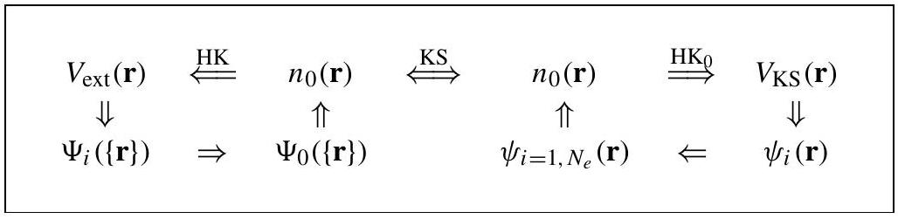
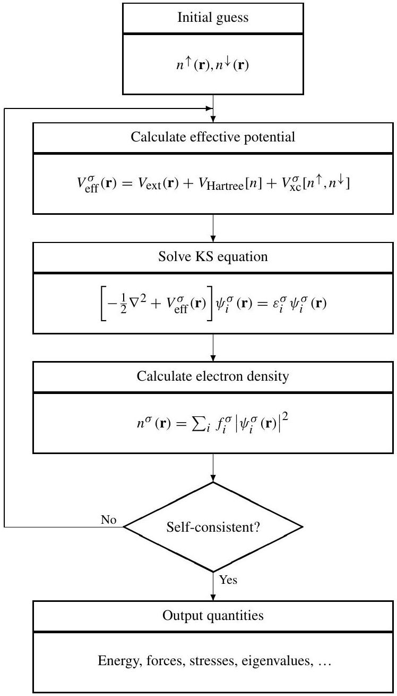
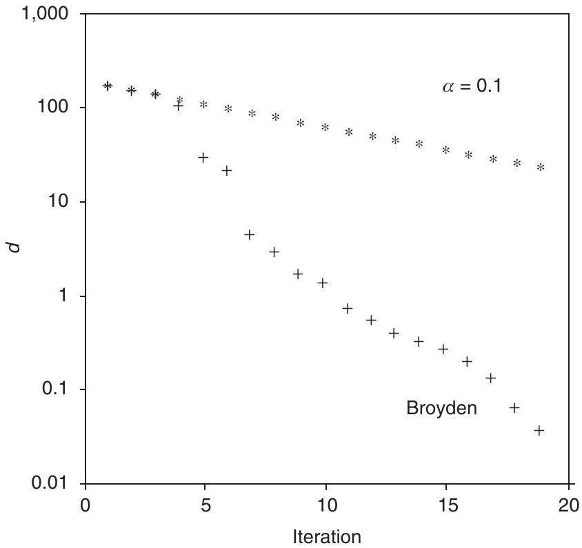

**7**

**The Kohn-Sham Auxiliary System**

If you don't like the answer, change the question.

**Summary**

Density functional theory is the most widely used method today for electronic structure calculations because of the approach proposed by Kohn and Sham in 1965: to replace the original many-body problem by an auxiliary independent-particle problem. The auxiliary system explicitly takes into account important parts of the problem including the nuclear potentials, the average repulsive Coulomb interactions, and the kinetic energy of independent fermions; the difficult problem of interacting, correlated electrons are incorporated in an exchange-correlation functional $E_{\mathrm{xc}}[n]$. In principle, this provides a method to calculate exact ground-state properties of many-body systems using independent-particle methods; in practice, approximate forms for $E_{\mathrm{xc}}[n]$ have proved to be remarkably successful. This chapter is devoted to defining the Kohn-Sham system and solving the self-consistent Kohn-Sham equations, which apply for any exchange-correlation functional. Progress in finding successful approximations to the $E_{\mathrm{xc}}[n]$ functional is the topic of the following two chapters.

# 7.1 Replacing One Problem with Another

The Kohn-Sham approach is to replace the difficult interacting many-body system obeying the hamiltonian Eq. (3.1) with a different auxiliary system that can be solved more easily. Since there is no unique prescription for choosing the simpler auxiliary system, this is an ansatz ${ }^{1}$ that rephrases the issues. Kohn and Sham proposed that the ground-state density of the original interacting system is equal to that of some chosen noninteracting system. This leads to independent-particle equations for the noninteracting system that can be considered exactly soluble (in practice by numerical means) with all the difficult

[^0]many-body terms incorporated into an exchange-correlation functional of the density. By solving the equations, one finds the ground-state density and energy of the original interacting system with the accuracy limited only by the approximations in the exchangecorrelation functional.

Indeed, the Kohn-Sham approach has led to very useful approximations that are now the basis of most calculations that attempt to make "first-principles" or $a b$ initio predictions for the properties of condensed matter and large molecular systems. The local density approximation (LDA) or various generalized-gradient approximations (GGAs) described below are remarkably accurate, most notably for "wide-band" systems, such as the group IV and II-V semiconductors, sp-bonded metals like Na and Al , insulators like diamond, NaCl , and molecules with covalent and/or ionic bonding. It also appears to be successful for many cases in which the electrons have stronger effects of correlations, such as transition metals. However, these approximations fail for many strongly correlated cases including the copper oxide planar materials, which are antiferromagnetic insulators for exactly half-filled bands, whereas the LDA or present GGA functionals find them to be metals [240]. This leads to the present situation in which there is great interest in utilizing and improving the density functional approach: to build upon the many successes of current approximations and to overcome the known deficiencies and failures in strongly correlated electron systems.

Here we will consider the Kohn-Sham ansatz for the ground state, which is by far the most widespread way in which the theory has been applied. However, in the big picture this is only the first step. The fundamental theorems of density functional theory (Chapter 6) show that in principle the ground-state density determines everything. A great challenge in present theoretical work is to develop methods for calculating excited state properties. We will return to these issues at the end of this chapter and in Chapter 9, but for the moment we will be concerned only with the theory of the ground state.

The Kohn-Sham construction of an auxiliary system rests upon two assumptions:

1. The exact ground-state density can be represented by the ground-state density of an auxiliary system of noninteracting particles. This is called "noninteracting- $V$ representability"; although there are no rigorous proofs for real systems of interest, we will proceed assuming its validity. This leads to the relation of the actual and auxiliary systems shown in Fig. 7.1.
2. The auxiliary hamiltonian is chosen to have the usual kinetic operator and an effective local potential $V_{\text {eff }}^{\sigma}(\mathbf{r})$ acting on an electron of spin $\sigma$ at point $\mathbf{r}$. The local form is essential in order for there to be a one-to-one correspondence of the potential. ${ }^{2}$ As in Chapter 6, we assume that the external potential $\hat{V}_{\text {ext }}$ is spin independent; ${ }^{3}$ nevertheless,
${ }^{2}$ The generalized Kohn-Sham approach in Chapter 9 involves nonlocal orbital-dependent functionals. This is indeed outside the framework of the Kohn-Sham method as defined here, but it is interesting to note that the original paper of Kohn and Sham also proposed an alternative approach with a Hartree-Fock-like orbitaldependent operator for exchange, as in Eq. (3.45).
${ }^{3}$ Spin-orbit interaction is ignored as this point. It is a relativistic effect that can be included in the usual nonrelativistic equations as a term $H_{S O}$ as described in Appendix O, and it is not included in the exchangecorrelation functional.

Figure 7.1. Schematic representation of Kohn-Sham auxiliary system (compare to Fig. 6.1). The notation $\mathrm{HK}_{0}$ denotes the Hohenberg-Kohn theorem applied to the noninteracting problem. The arrow labeled KS provides the connection in both directions between the many-body and the auxiliary independent-particle systems, so that the arrows connect any point to any other point. Therefore, in principle, solution of the independent-particle Kohn-Sham problem determines all properties of the full many-body system.

except in cases that are spin symmetric, the auxiliary effective potential $V_{\text {eff }}^{\sigma}(\mathbf{r})$ must depend on spin in order to give the correct density for each spin.

The actual calculations are performed on the auxiliary independent-particle system defined by the auxiliary hamiltonian (using Hartree atomic units $\hbar=m_{e}=e=4 \pi / \epsilon_{0}=1$ )

$$
\hat{H}_{\mathrm{aux}}^{\sigma}=-\frac{1}{2} \nabla^{2}+V^{\sigma}(\mathbf{r}) .
$$

The expressions must apply for all $V^{\sigma}(\mathbf{r})$ in some range, in order to define functionals for a range of densities. For a system of $N=N^{\uparrow}+N^{\downarrow}$ independent electrons obeying this hamiltonian, the ground state has one electron in each of the $N^{\sigma}$ orbitals $\psi_{i}^{\sigma}(\mathbf{r})$ with the lowest eigenvalues $\epsilon_{i}^{\sigma}$ of the hamiltonian Eq. (7.1). The density of the auxiliary system is given by sums of squares of the orbitals for each spin

$$
n(\mathbf{r})=\sum_{\sigma} n(\mathbf{r}, \sigma)=\sum_{\sigma} \sum_{i=1}^{N^{\sigma}}\left|\psi_{i}^{\sigma}(\mathbf{r})\right|^{2},
$$

the independent-particle kinetic energy $T_{s}$ can be expressed in two ways,

$$
T_{s}=-\frac{1}{2} \sum_{\sigma} \sum_{i=1}^{N^{\sigma}}\left\langle\psi_{i}^{\sigma}\right| \nabla^{2}\left|\psi_{i}^{\sigma}\right\rangle=\frac{1}{2} \sum_{\sigma} \sum_{i=1}^{N^{\sigma}} \int d^{3} r\left|\nabla \psi_{i}^{\sigma}(\mathbf{r})\right|^{2},
$$

and we define the classical Coulomb interaction energy of the electron density $n(\mathbf{r})$ interacting with itself (the Hartree energy defined in Eq. (3.15)) as

$$
E_{\text {Hartree }}[n]=\frac{1}{2} \int \mathrm{~d}^{3} r \mathrm{~d}^{3} r^{\prime} \frac{n(\mathbf{r}) n\left(\mathbf{r}^{\prime}\right)}{\left|\mathbf{r}-\mathbf{r}^{\prime}\right|} .
$$

The Kohn-Sham approach to the full interacting many-body problem is to rewrite the Hohenberg-Kohn expression for the ground-state energy functional Eq. (6.12) in the form

$$
E_{\mathrm{KS}}=T_{s}[n]+\int \mathrm{d} \mathbf{r} V_{\mathrm{ext}}(\mathbf{r}) n(\mathbf{r})+E_{\text {Hartree }}[n]+E_{I I}+E_{\mathrm{xc}}[n] .
$$

Here $V_{\text {ext }}(\mathbf{r})$ is the external potential due to the nuclei and any other external fields (assumed to be independent of spin) and $E_{I I}$ is the interaction between the nuclei (see Eq. (3.2)). Thus
the sum of the terms involving $V_{\text {ext }}, E_{\text {Hartree }}$, and $E_{I I}$ forms a neutral grouping that is well defined (see Section 3.2). The independent-particle kinetic energy $T_{s}$ is given explicitly as a functional of the orbitals; however, $T_{S}$ for each spin $\sigma$ must be a unique functional of the density $n(\mathbf{r}, \sigma)$ by application of the Hohenberg-Kohn arguments applied to the independent-particle hamiltonian Eq. (7.1); see Exercise 7.4.

All many-body effects of exchange and correlation are grouped into the exchangecorrelation energy $E_{\mathrm{xc}}$. Comparing the Hohenberg-Kohn, Eqs. (6.12) and (6.19), and Kohn-Sham, Eq. (7.5), expressions for the total energy (recall that the auxiliary density $n(\mathbf{r}, \sigma)$ of Eq. (7.2) is required to equal the true density for each spin $\sigma$ ) shows that $E_{\mathrm{xc}}$ can be written in terms of the Hohenberg-Kohn functional Eq. (6.13) as

$$
E_{\mathrm{XC}}[n]=F_{\mathrm{HK}}[n]-\left(T_{s}[n]+E_{\text {Hartree }}[n]\right)
$$

or in the more revealing form

$$
E_{\mathrm{xc}}[n]=\langle\hat{T}\rangle-T_{s}[n]+\left\langle\hat{V}_{\mathrm{int}}\right\rangle-E_{\mathrm{Hartree}}[n]
$$

Here $[n]$ denotes a functional of the density $n(\mathbf{r}, \sigma)$, which depends on both position in space $\mathbf{r}$ and spin $\sigma$. One can see that $E_{\mathrm{xc}}[n]$ must be a functional since the right-hand sides of the equations are functionals. The latter equation shows explicitly that $E_{\mathrm{xc}}$ is just the difference of the kinetic and the internal interaction energies of the true interacting many-body system from those of the fictitious independent-particle system with electron-electron interactions replaced by the Hartree energy.

If the universal functional $E_{\mathrm{xc}}[n]$ defined in Eq. (7.7) (or $\epsilon_{\mathrm{xc}}([n], \mathbf{r})$ in Eq. (8.1)) were known, then the exact ground-state energy and density of the many-body electron problem could be found by solving the Kohn-Sham equations for independent particles. To the extent that an approximate form for $E_{\mathrm{xc}}[n]$ describes the true exchange-correlation energy, the Kohn-Sham method provides a feasible approach to calculating the ground-state properties of the many-body electron system.

# 7.2 The Kohn-Sham Variational Equations

Solution of the Kohn-Sham auxiliary system for the ground state can be viewed as the problem of minimization with respect to either the density $n(\mathbf{r}, \sigma)$ or the effective potential $V_{\text {eff }}^{\sigma}(\mathbf{r})$ (see Section 9.5). Since $T_{S}$ Eq. (7.3) is explicitly expressed as a functional of the orbitals but all other terms are considered to be functionals of the density, one can vary the wavefunctions and use the chain rule to derive the variational equation ${ }^{4}$

$$
\frac{\delta E_{\mathrm{KS}}}{\delta \psi_{i}^{\sigma *}(\mathbf{r})}=\frac{\delta T_{s}}{\delta \psi_{i}^{\sigma *}(\mathbf{r})}+\left[\frac{\delta E_{\mathrm{ext}}}{\delta n(\mathbf{r}, \sigma)}+\frac{\delta E_{\mathrm{Hartree}}}{\delta n(\mathbf{r}, \sigma)}+\frac{\delta E_{\mathrm{xc}}}{\delta n(\mathbf{r}, \sigma)}\right] \frac{\delta n(\mathbf{r}, \sigma)}{\delta \psi_{i}^{\sigma *(\mathbf{r})}}=0
$$

[^1]subject to the orthonormalization constraints
$$
\left\langle\psi_{i}^{\sigma} \mid \psi_{j}^{\sigma^{\prime}}\right\rangle=\delta_{i, j} \delta_{\sigma, \sigma^{\prime}}
$$

This is equivalent to the Rayleigh-Ritz principle [258,259] and the general derivation of the Schrödinger equations in (3.10)-(3.12), except for the explicit dependence of $E_{\text {Hartree }}$ and $E_{\mathrm{xc}}$ on $n$.

Using expressions (7.2) and (7.3) for $n^{\sigma}(\mathbf{r})$ and $T_{s}$, which give

$$
\frac{\delta T_{s}}{\delta \psi_{i}^{\sigma *}(\mathbf{r})}=-\frac{1}{2} \nabla^{2} \psi_{i}^{\sigma}(\mathbf{r}) ; \quad \frac{\delta n^{\sigma}(\mathbf{r})}{\delta \psi_{i}^{\sigma *}(\mathbf{r})}=\psi_{i}^{\sigma}(\mathbf{r}),
$$

and the Lagrange multiplier method for handling the constraints Eqs. (3.10)-(3.13), this leads to the Kohn-Sham Schrödinger-like equations:

$$
\left(H_{\mathrm{KS}}^{\sigma}-\varepsilon_{i}^{\sigma}\right) \psi_{i}^{\sigma}(\mathbf{r})=0
$$

where the $\varepsilon_{i}$ are the eigenvalues, and $H_{\mathrm{KS}}$ is the effective hamiltonian (in Hartree atomic units)

$$
H_{\mathrm{KS}}^{\sigma}(\mathbf{r})=-\frac{1}{2} \nabla^{2}+V_{\mathrm{KS}}^{\sigma}(\mathbf{r}),
$$

with

$$
\begin{aligned}
V_{\mathrm{KS}}^{\sigma}(\mathbf{r}) & =V_{\mathrm{ext}}(\mathbf{r})+\frac{\delta E_{\text {Hartree }}}{\delta n(\mathbf{r}, \sigma)}+\frac{\delta E_{\mathrm{xc}}}{\delta n(\mathbf{r}, \sigma)} \\
& =V_{\mathrm{ext}}(\mathbf{r})+V_{\text {Hartree }}(\mathbf{r})+V_{\mathrm{xc}}^{\sigma}(\mathbf{r})
\end{aligned}
$$

The meaning of the functional derivatives in the definitions of the Kohn-Sham potential, Eqs. (7.8) and (7.13), is described in Appendix A along with illustrative examples.

Equations (7.11)-(7.13) are the famous Kohn-Sham equations, with the resulting density $n(\mathbf{r}, \sigma)$ and total energy $E_{\mathrm{KS}}$ given by Eqs. (7.2) and (7.5). The equations have the form of independent-particle equations with a potential that must be found self-consistently with the resulting density. These equations are independent of any approximation to the functional $E_{\mathrm{xc}}[n]$, and would lead to the exact ground-state density and energy for the interacting system if the exact functional $E_{\mathrm{xc}}[n]$ were known. Furthermore, it follows from the Hohenberg-Kohn theorems (see Exercise 7.3) that the ground-state density uniquely determines the potential at the minimum (except for a trivial constant), so that there is a unique Kohn-Sham potential $\left.V_{\text {eff }}^{\sigma}(\mathbf{r})\right|_{\text {min }} \equiv V_{\text {KS }}^{\sigma}(\mathbf{r})$ associated with any given interacting electron system. ${ }^{5}$

[^2]The extraordinary success of the Kohn-Sham approach is due to the separation of the problem of interacting electron into two parts: tractable equations that are considered in this chapter, and the difficult exchange-correlation term $E_{\mathrm{xc}}[n]$ and $V_{\mathrm{xc}}^{\sigma}(\mathbf{r})$ that is the topic of the following two chapters. Because of the difficulty of the original problem the latter are extraordinarily difficult to determine. There are no exact solutions, but it has been found that it is possible to find very useful approximations. The success of the methods depends totally upon the faithfulness of the functionals to describe the interacting many-body system, and they are given special attention in the following two chapters, Chapters 8 and 9.

# 7.3 Solution of the Self-Consistent Coupled Kohn-Sham Equations

The Kohn-Sham equations are summarized in the flow diagram in Fig. 7.2. They are a set of Schrödinger-like independent-particle equations that must be solved subject to the condition that the effective potential $V_{\text {eff }}^{\sigma}(\mathbf{r})$ and the density $n(\mathbf{r}, \sigma)$ are consistent. The explicit reference to spin will be dropped except where needed, and notation $V_{\text {eff }}$ and $n$ will be assumed to designate both space and spin dependence (of course, the potential for each spin depends on the densities for both spins). An actual calculation utilizes a numerical procedure that successively changes $V_{\text {eff }}$ and $n$ to approach the self-consistent solution. The computationally intensive step in Fig. 7.2 is "solve KS equation" for a given potential $V_{\text {eff }}$. This is the subject of the following chapters. Here this step is considered a "black box" that uniquely solves the equations for a given input $V^{\text {in }}$ to determine an output density $n^{\text {out }}$, i.e., $V^{\text {in }} \rightarrow n^{\text {out }}$. Conversely, for a given form of the $x c$ functional, any density $n$ determines a potential $V_{\text {eff }}$, as shown in the second box. (This is the same as Eq. (7.13) and examples of specific expressions are given in Section 8.6.)

The problem is that except at the exact solution, the input and output potentials and densities do not agree. To arrive at the solution one operationally defines a new potential $n^{\text {out }} \rightarrow V^{\text {new }}$, which can then start a new cycle with $V^{\text {new }}$ as the new input potential. Clearly, the procedure shown in Fig. 7.2 can be made into the iterative progression

$$
V_{i} \rightarrow n_{i} \rightarrow V_{i+1} \rightarrow n_{i+1} \rightarrow \cdots
$$

where $i$ labels the step in the iteration. The progression converges with a judicious choice of the new potential in terms of the potential or density found at the previous step (or steps).

Methods for reaching self-consistency are described in Section 7.4. However, it is best to first examine the nature of various possible total energy functionals. The expressions are needed for the final calculation of the energy and, in addition, the behavior of any of the functionals near the correct solution provides the basis for analysis of the convergence characteristics using that functional.

## 7.3.1 Total Energy Functionals

The Kohn-Sham equations are derived by minimizing the energy $E_{\mathrm{KS}}$ in Eq. (7.8); however, there are various choices for functionals, all of which have the same minimum energy

## 7.3.2 Self-consistent Kohn-Sham equations

Figure 7.2. Schematic representation of the self-consistent loop for solution of the Kohn-Sham equations. In a spin-polarized system there are two such loops that must be iterated simultaneously, with the potential for each spin $V_{\text {eff }}^{\sigma}\left[n^{\sigma}, n^{\sigma}\right]$ a functional of the density of both spins. In the generalized Kohn-Sham approach the form of the loop is the same even though the potential is a nonlocal orbital-dependent operator as described in Chapter 9.

solution of the Kohn-Sham equations but behave differently away from the minimum. In particular, it is not essential to regard the density as the independent variable in the equations; different functionals can be found by a Legendre transformation to change the independent and dependent variables, as is familiar in thermodynamics. In terms of the Kohn-Sham equations, this means the behavior is a functional of the difference of input and output quantities $\Delta V=V^{\text {out }}-V^{\text {in }}$ and $\Delta n=n^{\text {out }}-n^{\text {in }}$, where $n^{\text {out }}$ is the resulting
density from solving the Schrödinger-like equation with the potential $V^{\text {in }}$. It is essential to utilize correct variational expressions in order to have the desired variational properties.

The original expression for the Kohn-Sham energy functional is given by Eq. (7.5), which is repeated here, with the grouping of all the potential terms to define $E_{\text {pot }}[n]$,

$$
\begin{aligned}
E_{\mathrm{KS}} & =T_{s}[n]+E_{\mathrm{pot}}[n] \\
E_{\mathrm{pot}}[n] & =\int \mathrm{d} \mathbf{r} V_{\mathrm{ext}}(\mathbf{r}) n(\mathbf{r})+E_{\mathrm{Hartree}}[n]+E_{I I}+E_{\mathrm{xc}}[n]
\end{aligned}
$$

The first three terms on the right-hand side of the second equation together form a neutral grouping equal to the classical Coulomb interaction $E^{\mathrm{CC}}$ in Eq. (3.14). Since the eigenvalues of the Kohn-Sham equations are given by

$$
\varepsilon_{i}^{\sigma}=\left\langle\psi_{i}^{\sigma}\right| H_{K S}^{\sigma}\left|\psi_{i}^{\sigma}\right\rangle,
$$

the kinetic energy can be expressed as

$$
T_{s}=E_{s}-\sum_{\sigma} \int \mathrm{d} \mathbf{r} V^{\sigma, i n}(\mathbf{r}) n^{\mathrm{out}}(\mathbf{r}, \sigma)
$$

where

$$
E_{s}=\sum_{\sigma} \sum_{i=1}^{N^{\sigma}} \varepsilon_{i}^{\sigma}
$$

The advantages of this formulation are that the eigenvalues are available in actual calculations, and, furthermore, $E_{s}$ in Eq. (7.19) is itself a functional. It is the ground-state energy of a noninteracting electron system, for which the Hohenberg-Kohn theorems, the force theorem, etc. all apply in a particularly simple way.

## 7.3.3 The Kohn-Sham Functional of the Potential $E_{\mathrm{KS}}[V]$

Although the Kohn-Sham energy Eq. (7.15) is, in principle, a functional of the density, it is operationally a functional of the input potential $E_{\mathrm{KS}}\left[V^{\text {in }}\right]$, as indicated in Fig. 7.2. (Here $V$ denotes the potential for each spin, $V^{\sigma}(\mathbf{r})$.) At any stage of a Kohn-Sham calculation when the energy is not at the minimum, $V^{\text {in }}$ determines all the quantities in the energy. This is clearly shown if we write $E_{\mathrm{KS}}$ from Eq. (7.15) as

$$
E_{\mathrm{KS}}\left[V^{\mathrm{in}}\right]=E_{s}\left[V^{\mathrm{in}}\right]-\sum_{\sigma} \int \mathrm{d} \mathbf{r} V^{\sigma, i n}(\mathbf{r}) n^{\mathrm{out}}(\mathbf{r}, \sigma)+E_{\mathrm{pot}}\left[n^{\mathrm{out}}\right]
$$

where the first two terms on the right-hand side are a convenient way of calculating the independent-particle kinetic energy as in Eq. (7.18), and $E_{\text {pot }}$ is the sum of potential terms given in Eq. (7.16) evaluated for $n=n^{\text {out }}$. Since $E_{s}$ is the sum of eigenvalues, Eq. (7.19), and $n^{\text {out }}(\mathbf{r}, \sigma)$ is the output density, each determined directly by the potential $V^{\sigma, \text { in }}(\mathbf{r})$, clearly the energy is a functional of $V^{\mathrm{in}}$. Of course, $E_{\mathrm{KS}}$ formally can be regarded as a functional of $n^{\text {out }}$, since there is a one-to-one relation of the output density and the input
potential (except for a trivial constant in $V^{\mathrm{in}}$ ); however, the Kohn-Sham equations provide no way of choosing $n^{\text {out }}$ except as an output determined by a potential.

The solution of the Kohn-Sham equations is for the potential $V^{\text {in }}$ that minimizes the energy, Eq. (7.20). Then $V^{\text {in }}=V_{\text {KS }}$, the output density $n^{\text {out }}$ is the ground-state density $n^{0}$, and the potential and density are consistent with the relation in Eq. (7.13). The functional $E_{\mathrm{KS}}\left[V^{\text {in }}\right]$ is variational and all other potentials lead to energies that are higher by an amount that is quadratic in the error $V^{\text {in }}-V_{\text {KS }}$. Near the minimum energy solution, the error in the energy must also be quadratic in the error in the density $\delta n=n^{\text {out }}-n^{0}$, so that

$$
E_{\mathrm{KS}}\left[V^{\mathrm{in}}\right]=E_{\mathrm{KS}}\left[V_{\mathrm{KS}}\right]+\frac{1}{2} \sum_{\sigma, \sigma^{\prime}} \int \mathrm{d} \mathbf{r d} \mathbf{r}^{\prime}\left[\frac{\delta^{2} E_{\mathrm{KS}}}{\delta n(\mathbf{r}, \sigma) \delta n\left(\mathbf{r}^{\prime}, \sigma^{\prime}\right)}\right]_{n^{0}} \delta n(\mathbf{r}, \sigma) \delta n\left(\mathbf{r}^{\prime}, \sigma^{\prime}\right),
$$

where the second term is always positive.

## 7.3.4 Explicit Functionals of the Density

As shown by Harris [359], Weinert et al. [360], and Foulkes and Haydock [361], one can choose different expressions for the total energy functional that are given explicitly in terms of the density. The functional is cast in terms of the density $n^{\text {in }}$ that, via Eq. (7.13), determines the input potential $V\left[n^{\mathrm{in}}\right] \equiv V_{n^{\text {in }}}$, which in turn leads directly to the sum of eigenvalues, the first term on the right-hand side of Eq. (7.20). The energy is then defined by evaluating the functional $E_{\text {pot }}\left[n^{\text {in }}\right]$ in Eq. (7.16) in terms of the chosen input density $n^{\text {in }}(\mathbf{r}, \sigma)$ (instead of the output density $n^{\text {out }}(\mathbf{r}, \sigma)$ as in the Kohn-Sham functional),

$$
E_{H W F}\left[n^{\text {in }}\right] \equiv E_{s}\left[V_{n^{\text {in }}}\right]-\sum_{\sigma} \int \mathrm{d} \mathbf{r} V_{n^{\text {in }}}^{\sigma}(\mathbf{r}) n^{\text {in }}(\mathbf{r}, \sigma)+E_{\mathrm{pot}}\left[n^{\text {in }}\right]
$$

The stationary properties of this functional can be understood straightforwardly following the arguments of Foulkes [361]. For a given input density $n^{\text {in }}$ and potential $V_{n^{\text {in }}}$, the difference in the two expressions for the energy involves only the potential terms

$$
\begin{aligned}
E_{\mathrm{KS}}\left[V^{\text {in }}\right]-E_{H W F}\left[n^{\text {in }}\right]= & \sum_{\sigma} \int \mathrm{d} \mathbf{r} V_{n^{\text {in }}}^{\sigma}(\mathbf{r})\left[n^{\text {out }}(\mathbf{r}, \sigma)-n^{\text {in }}(\mathbf{r}, \sigma)\right] \\
& +\left[E_{\mathrm{pot}}\left[n^{\text {out }}\right]-E_{\mathrm{pot}}\left[n^{\text {in }}\right]\right]
\end{aligned}
$$

Near the correct solution where $\Delta n=n^{\text {out }}-n^{\text {in }}$ is small, one can expand the difference in Eq. (7.23) in powers of $\Delta n$. The linear terms cancel (which follows from the fact that $V_{n^{\text {in }}}^{\sigma}(\mathbf{r})=\left[\delta E_{\mathrm{pot}} /(\delta n(\mathbf{r}, \sigma))\right]_{n^{\text {in }}}$; see Exercise 7.15) so that the lowest-order terms are

$$
E_{\mathrm{KS}}\left[V^{\mathrm{in}}\right]-E_{H W F}\left[n^{\mathrm{in}}\right] \approx \frac{1}{2} \sum_{\sigma, \sigma^{\prime}} \int \mathrm{d} \mathbf{r d} \mathbf{r}^{\prime} K\left(\mathbf{r}, \sigma ; \mathbf{r}^{\prime}, \sigma^{\prime}\right)_{n^{\mathrm{in}}} \Delta n(\mathbf{r}, \sigma) \Delta n\left(\mathbf{r}^{\prime}, \sigma^{\prime}\right)
$$

where the kernel $K$ is defined to be

$$
\begin{aligned}
K\left(\mathbf{r}, \sigma ; \mathbf{r}^{\prime}, \sigma^{\prime}\right) & \equiv \frac{\delta^{2} E_{\mathrm{Hxc}}[n]}{\delta n(\mathbf{r}, \sigma) \delta n\left(\mathbf{r}^{\prime}, \sigma^{\prime}\right)} \\
& =\frac{1}{\left|\mathbf{r}-\mathbf{r}^{\prime}\right|} \delta_{\sigma, \sigma^{\prime}}+\frac{\delta^{2} E_{\mathrm{xc}}[n]}{\delta n(\mathbf{r}, \sigma) \delta n\left(\mathbf{r}^{\prime}, \sigma^{\prime}\right)}
\end{aligned}
$$

evaluated for $n=n^{\text {in }}$. (Note that $K$ has been defined in terms of $E_{\mathrm{Hxc}}[n] \equiv E_{\text {Hartree }}[n]+ E_{\mathrm{XC}}[n]$; the other terms in $E_{\text {pot }}[n]$ do not contribute since they are constant or linear in $n$.) Since the differences in the energies are quadratic in the errors in the density, it follows that at the exact solution where $\Delta n(\mathbf{r}, \sigma)=0$, the functional $E_{H W F}\left[n^{\text {in }}\right]$ equals the usual Kohn-Sham energy and it is stationary. However, it is not variational, which can be seen from Eq. (7.24). Since the kernel $K$ tends to be positive (see below), then $E_{H W F}\left[n^{\mathrm{in}}\right]$ is lower than $E_{\mathrm{KS}}\left[V^{\mathrm{in}}\right]$. Thus even though $E_{\mathrm{KS}}\left[V^{\mathrm{in}}\right]$ is always above the Kohn-Sham energy, $E_{H W F}\left[n^{\mathrm{in}}\right]$ may be lower by an amount that is second order in the error $\Delta n(\mathbf{r}, \sigma)$.

The primary advantage of the explicit functional of the density Eq. (7.22) is that, for densities near the correct solution, it can accurately approximate the true Kohn-Sham energy. In particular, it is often an excellent approximation to stop the calculation after one calculation of eigenvalues with no self-consistency: in this case one does not even need to calculate the output density. This approach is remarkably successful if $n(\mathbf{r})$ is approximated by a sum of atomic densities [172, 359, 361-363]. Perhaps the first example was a calculation of phonon frequencies [172]. Foulkes has used this as a conceptual basis for the success of empirical tight-binding models where the energy is given strictly by sums of eigenvalues plus additional terms that can be accounted for in this approach (see Section 14.11 on total energies in tight-binding methods). In addition, it is particularly simple to calculate the energy relative to neutral atoms in terms of the difference in the density from a sum of neutral atoms. This yields directly desirable physical quantities, as described in Section F.4.

In a full self-consistent calculation the functional Eq. (7.22) is useful at each step of the iteration in Fig. 7.2. It is now standard to calculate both energies, Eqs. (7.20) and (7.22), at each step in the iteration. The KS functional of the potential is variational, but the nonvariational functional of the density energy is usually closer to the true energy for reasons explained in Section 7.4. It is also very useful to calculate both energies and treat the difference as a measure of the lack of self-consistency during a calculation.

It is tempting to assume that the explicit density functional Eq. (7.22) is a maximum as a function of density. However, this is not the case in general because the second-derivative functional $K\left(\mathbf{r}, \sigma ; \mathbf{r}^{\prime}, \sigma^{\prime}\right)$ in Eq. (7.25) is not guaranteed to be positive definite [364-366]. From the definition of $K$ in Eq. (7.25), the first term is positive definite since it is due to the repulsive Hartree term. One might expect that the second attractive term would never overcome the repulsion. However, approximations such as the LDA violate this condition since the extreme local $\delta\left(\left|\mathbf{r}-\mathbf{r}^{\prime}\right|\right)$ behavior leads to large negative contributions for short wavelength density variations.

## 7.3.5 Generalized Functionals of $V$ and $n, E[V ; n]$

It is also possible to define functionals of the density and potential varied independently, as pointed out by a number of authors $[361,363,367,368]$. We will denote $n$ and $V$ by $n^{\text {in }}$ and $V^{\text {in }}$ to emphasize that both are independent input functions. The expression is exactly the same as Eq. (7.22), except that $V^{\text {in }}$ is regarded as an independent function so that the expression can be written

$$
E\left[V^{\text {in }}, n^{\text {in }}\right]=E_{S}\left[V^{\text {in }}\right]-\sum_{\sigma} \int V^{\sigma, \text { in }}(\mathbf{r}) n^{\text {in }}(\mathbf{r}, \sigma) \mathrm{d} \mathbf{r}+E_{\text {pot }}\left[n^{\text {in }}\right] .
$$

The first term is solely a functional of $V^{\text {in }}$, the last term is a functional only of $n^{\text {in }}$, and the only coupling of $V^{\text {in }}$ and $n^{\text {in }}$ is through the simple bilinear second term. The properties of the functional can be seen clearly following the description by Methfessel [363]. Considering variations around any $V^{\text {in }}$ and $n^{\text {in }}$, to linear order

$$
\begin{aligned}
\delta E\left[V^{\text {in }}, n^{\text {in }}\right]= & \sum_{\sigma} \int\left[V_{n^{\text {in }}}^{\sigma}(\mathbf{r})-V^{\sigma, \text { in }}(\mathbf{r})\right] \delta n(\mathbf{r}, \sigma) \mathrm{d} \mathbf{r} \\
& +\sum_{\sigma} \int\left[n^{\text {out }}(\mathbf{r}, \sigma)-n^{\text {in }}(\mathbf{r}, \sigma)\right] \delta V^{\sigma}(\mathbf{r}) \mathrm{d} \mathbf{r}
\end{aligned}
$$

where $V_{n^{\text {in }}}^{\sigma}(\mathbf{r})=\left[\frac{\delta E_{\text {pot }}}{\delta n(\mathbf{r}, \sigma)}\right]_{n^{\text {in }}}$ is the potential determined by the input density (as used in Eq. (7.22)), and $n_{V^{\text {in }}}^{\text {out }}(\mathbf{r}, \sigma)$ is the output density determined by the potential $V^{\text {in }}$ (as used in Eq. (7.20)). Since the terms in brackets vanish at self-consistency, the functional is stationary and the value equals the Kohn-Sham energy $E_{\mathrm{KS}}\left[V^{\mathrm{KS}}\right]$.

It is also straightforward to show [363] that for any fixed density $n^{\text {in }}$, the stationary point of $E\left[V^{\text {in }}, n^{\text {in }}\right]$ as a function of $V^{\text {in }}$ is in fact a global maximum as a function of $V^{\text {in }}$, at which point the value of $E_{S}\left[V^{\text {max }}\right]-\sum_{\sigma} \int V^{\sigma, \max }(\mathbf{r}) n^{\text {in }}(\mathbf{r}, \sigma) \mathrm{d} \mathbf{r}$ equals the Kohn-Sham kinetic energy functional $T_{s}\left[n^{\text {in }}\right]$. Although the maximum property may seem surprising, it follows from inequalities similar to the Hohenberg-Kohn arguments and it can be understood from Eq. (7.27), which shows that

$$
\frac{\delta E}{\delta V^{\sigma}(\mathbf{r})}=n^{\mathrm{out}}(\mathbf{r}, \sigma)-n^{\mathrm{in}}(\mathbf{r}, \sigma) \Rightarrow \frac{\delta^{2} E}{\delta V^{\sigma}(\mathbf{r}) \delta V^{\sigma^{\prime}}\left(\mathbf{r}^{\prime}\right)}=\frac{\delta n^{\mathrm{out}}(\mathbf{r}, \sigma)}{\delta V^{\sigma^{\prime}}\left(\mathbf{r}^{\prime}\right)}
$$

The eigenvalues of this functional are always negative since the density decreases where the potential is increased [363]. The curvature of $E$ as a functional of $n^{\text {in }}$ is given by the kernel Eq. (7.25), which involves only the potential terms $E_{\mathrm{Hxc}}[n]$ since the other terms are constant or linear. As explained following Eq. (7.25), $E$ tends to be a minimum as a functional of $n^{\text {in }}$; however, this is not guaranteed and only with constraints on the density variations is the solution a minimum [363].

The importance of the stationarity is that one can approximate both $V^{\text {in }}$ and $n^{\text {in }}$. For example, one can choose convenient forms for the potentials, such as spherical muffin-tin-type potentials often used in augmented methods. If one carries out the Kohn-Sham calculation exactly for this potential, of course this is just a restatement of the variational property of $E_{\mathrm{KS}}[V]$. The generalized functional shows that the errors in the energy are still
quadratic if the density is also approximated using convenient functional forms. This can be used to advantage in calculations as illustrated in [363].

## 7.3.6 Free Energy Functionals

Introducing temperature has many potential benefits:

- Direct calculation of thermal quantities: entropy $S$, free energy $F=E-\mathrm{TS}$, etc.
- The density matrix becomes shorter range as the temperature increases, which can be used to advantage, e.g., in order- $N$ methods (Chapter 18).
- Smearing the occupation makes calculations for metals less sensitive to numerical approximations.

Expressions for the energy are given by any of the previous functionals with the sum of single-particle energies $E_{s} \rightarrow E_{s}(T)$ generalized to finite $T$ as in Eq. (3.39). The entropy is given by the single particle form of the Mermin finite temperature functional Eq. (6.20),

$$
S=-\left[\sum_{i} f_{i} \ln f_{i}+\sum_{i}\left(1-f_{i}\right) \ln \left(1-f_{i}\right)\right],
$$

where $f_{i}$ denotes the occupation number $f\left(\varepsilon_{i}-\mu\right)$.
These formulas can be used as a clever way to calculate $E(T=0)$. The simple idea is that $E(T)$ increases quadratically with $T$, whereas $F(T)$ decreases quadratically. A combination of the two, $E+F$ (see Exercise 7.17), can cancel the quadratic terms and give an expression equal to $E(T=0)$ with only quartic corrections. For example, this has been used by Gillan [369] to calculate the vacancy energy in Al using a calculation actually done at a temperature of $10,000 \mathrm{~K}$. The high temperature greatly simplifies the calculations by reducing the finite size effects in the calculation.

In iterative methods (Appendix M), one is seeking to find the solution for both the potential and the wavefunctions at the same time, i.e., the wavefunctions are not consistent with the potential, as is assumed in the above expressions. As shown in [370], one can generalize the Fermi function $f_{i}$ to a matrix $f_{i j}$, which is constrained to have eigenvalues in the range $[0,1]$. Then the density is given by

$$
n(\mathbf{r})=\sum_{i j} f_{i j} \psi_{i}^{*}(\mathbf{r}) \psi_{j}(\mathbf{r})
$$

and the grand energy functional Eq. (6.20) is generalized to

$$
\begin{aligned}
\tilde{\Omega}\left[V^{\text {in }}, n^{\text {in }}, T, \mu\right]= & E\left[V^{\text {in }}, n^{\text {in }}\right]_{0}+\mu\left(N_{0}-\operatorname{Tr}[f]\right) \\
& +k_{B} T \operatorname{Tr}[f \ln f+(1-f) \ln (1-f)] .
\end{aligned}
$$

This form is particularly useful in iterative methods where it can speed the convergence in metals by effectively allowing for unitary transformations of the wavefunctions that are problematic because they correspond to low-energy "slow modes" of the electronic system.

The most complete expression for a generalized functional is found by including temperature $T$ via the Mermin functional (see Section 6.5) and the chemical potential $\mu$ to allow variation in particle number. Then, as shown by Nicholson et al. [368], one can define a grand functional,

$$
\begin{aligned}
\Omega\left[V^{\text {in }}, n^{\text {in }}, T, \mu\right]= & E\left[V^{\text {in }}, n^{\text {in }}, T\right]_{0}+\mu\left(N_{0}-\sum_{i} f_{i}\right) \\
& +k_{B} T\left[\sum_{i} f_{i} \ln f_{i}+\sum_{i}\left(1-f_{i}\right) \ln \left(1-f_{i}\right)\right] .
\end{aligned}
$$

This functional is stationary with respect to $V^{\text {in }}, n^{\text {in }}, \mu, T$, and the form of the occupation function $f(\varepsilon)$.

# 7.4 Achieving Self-Consistency

A key problem is the choice of procedure for updating the potential $V^{\sigma}$ or the density $n^{\sigma}$ in each loop of the Kohn-Sham equations illustrated in Fig. 7.2. Obviously one can vary either $V^{\sigma}$ or $n^{\sigma}$, but it is simpler to describe in terms of $n^{\sigma}$, which is unique, whereas $V^{\sigma}$ is subject to shift by a constant. (The spin index $\sigma$ is omitted below for simplicity.) This section is devoted to the basic ideas of linear mixing, dielectric screening, and numerical methods; there are many variations and combinations and there is no attempt to review all methods.

The simplest approach is linear mixing, estimating an improved density input $n_{i+1}^{\mathrm{in}}$ at step $i+1$ as a fixed linear combination of $n_{i}^{\text {in }}$ and $n_{i}^{\text {out }}$ at step $i$,

$$
n_{i+1}^{\text {in }}=\alpha n_{i}^{\text {out }}+(1-\alpha) n_{i}^{\text {in }}=n_{i}^{\text {in }}+\alpha\left(n_{i}^{\text {out }}-n_{i}^{\text {in }}\right) .
$$

This is a good choice in the absence of other information and is essentially moving in an approximate "steepest descent" direction for minimizing the energy.

Why cannot one simply take the output density at one step as the input to the next? What are the limits on $\alpha$ ? How can one do better? The answers lie in linear analysis of the behavior near the minimum [371, 372]. ${ }^{6}$ As in Eq. (7.21), let us define the deviation from the correct density to be $\delta n \equiv n-n_{\text {KS }}$ at any step in the iteration. Then near the solution, the error in the output density to linear order in the error in the input is given by

$$
\delta n^{\text {out }}\left[n^{\text {in }}\right]=n^{\text {out }}-n_{\mathrm{KS}}=(\tilde{\chi}+1)\left(n^{\text {in }}-n_{\mathrm{KS}}\right),
$$

where

$$
\tilde{\chi}+1=\frac{\delta n^{\text {out }}}{\delta n^{\text {in }}}=\frac{\delta n^{\text {out }}}{\delta V^{\text {in }}} \frac{\delta V^{\text {in }}}{\delta n^{\text {in }}} .
$$

Here $\delta n^{\text {out }} / \delta V^{\text {in }}$ is a response function defined to be $\chi^{0}$ in Eq. (D.6) and $\delta V^{\text {in }} / \delta n^{\text {in }}$ is $K$ defined in Eq. (7.25). Thus the needed function $\tilde{\chi}$ can be calculated and is closely related

[^3]to other uses of response functions. The best choice for the new density is one that would make the error zero, i.e., $n_{i+1}^{\text {in }}=n_{\text {KS }}$. Since $n_{i}^{\text {out }}$ and $n_{i}^{\text {in }}$ are known from step $i$, if $\tilde{\chi}$ is also known, then Eq. (7.34) can be solved for $n_{\mathrm{KS}}$,
$$
n_{\mathrm{KS}}=n_{i}^{\mathrm{in}}-\tilde{\chi}^{-1}\left(n_{i}^{\mathrm{out}}-n_{i}^{\mathrm{in}}\right) .
$$

If Eq. (7.36) were exact, this would be the answer and the iterations could stop; since it is not exact this gives the best input for the next iteration.

Although Eq. (7.36) is a more complex integral equation, it bears a strong resemblance to the linear-mixing equation (7.33). If we resolve the response function $\tilde{\chi}$ into eigenfunctions $\tilde{\chi}\left(\mathbf{r}, \mathbf{r}^{\prime}\right)=\sum_{m} \chi_{m} f_{m}(\mathbf{r}) f_{m}\left(\mathbf{r}^{\prime}\right)$, the eigenvalues $\chi_{m}$ give the optimal $\alpha$ for the change in density resolved into the density eigenvectors $f_{m}(\mathbf{r})$. Furthermore, the radius of convergence of the linear-mixing scheme is determined by the maximum eigenvalue $\tilde{\chi}_{\text {max }}^{-1}=1 / \tilde{\chi}_{\text {min }}$ of the matrix $\tilde{\chi}^{-1}$. If a constant $\alpha$ is used, it is straightforward to show [372] that the maximum error at iteration $i$ varies as $\left(1-\alpha \tilde{\chi}_{\text {max }}^{-1}\right)^{i}$, so that the iterations converge only if $\alpha<2 / \tilde{\chi}_{\text {max }}^{-1}=2 \tilde{\chi}_{\text {min }}$ (see Exercises 7.21 and 13.3).

Physically, the response of the system is a measure of the polarizability. Linear mixing with large $\alpha$ works well for strongly bound, rigid systems, such as wide-gap insulators. However, convergence can be very difficult to achieve for "soft cases," for which metal surfaces are an especially difficult example. Convergence algorithms using the response kernel $K$ have been proposed [373] for such cases. In these examples, it is most useful to analyze the response in Fourier space, which is done in Section 13.2 in the chapter on plane waves.

## 7.4.1 Numerical Mixing Schemes

The difficulty with the analysis in terms of the response kernel $\tilde{\chi}$ (or $K$ ) is that in real problems, it can be found only by calculations (similar to those for response functions; see Appendix D and Chapter 20) that are more costly than many iterations of a standard minimization algorithm. It can be much more efficient to adopt methods from the numerical literature that build up the information on the Jacobian $J$ (the second-derivative matrix) of the system automatically rather than using physical arguments. In fact, the matrix $\tilde{\chi}$ is the Jacobian $J$, but in this section we will use the notation $J$ to be consistent with commonly used notation (see Appendix L).

General numerical approaches for reaching a consistent solution include the Broyden method [374] described in Appendix L. ${ }^{7}$ and the RMM-DIIS approach described in Section M.7. In the Broyden method the desired quantity, the inverse Jacobian $J^{-1}$ itself, is built up as the iterations proceed. Starting with an approximate form, $J^{-1}$ is improved at each iteration in a way so that the change in density for step $i+1$ is made in a direction orthogonal to all previous directions. (This is the general idea in all numerical methods that generate a "Krylov subspace" - see Appendices L and M.) The magnitude of the step is chosen to be such that it would give the result of step $i$ projected onto the subspace generated thus far. (Note the similarity of this last requirement with solution Eq. (7.36) using $\tilde{\chi}^{-1}$;
${ }^{7}$ This method was first used in solid-state calculations by Bendt and Zunger [375] and described in more detail by Srivastava [376].
the difference is that in the Broyden method only partial information is known about the Jacobian at any step $i$.) Thus the Broyden method combines the "best of both worlds" to make an automatic method that generates the needed parts of the Jacobian as the calculation proceeds, with essentially no added cost above that encountered in simple linear mixing.

At each iteration $i$ the input density for the next step is given by an equation analogous to Eq. (7.36) except that $\tilde{\chi}$ is replaced by the approximate Jacobian $J_{i}$

$$
n_{i+1}^{\mathrm{in}}=n_{i}^{\mathrm{in}}-J_{i}^{-1}\left(n_{i}^{\mathrm{out}}-n_{i}^{\mathrm{in}}\right),
$$

and $J_{i}^{-1}$ is improved at each step by Expression (L.24). This can be used directly if the Jacobian matrix is small, i.e., if there are only a few components of the density for which convergence is a problem. An example is given in Section 13.2 in the chapter on plane waves. Srivastava [376] has shown how to avoid storage of the Jacobian matrices by writing the predicted change $\delta n_{i+1}^{\text {in }}$ in terms of a sum over all the previous steps involving only the initial $\mathrm{J}_{0}^{-1}$. A modified Broyden method was proposed by Vanderbilt and Louie [380] and adapted by Johnson [381] to also incorporate Srivistava's improvements [376]. The basic equation is given in Eq. (L.25) with discussion of the weights given in the original and subsequent papers.

An example of the power of the Broyden method using this approach is shown in Fig. 7.3 for the density at a ( 100 ) surface of W using an LAPW method (Chapter 17). The quantity shown is the "distance" $d$, which is the norm of the residual

Figure 7.3. Convergence of the density for a $\mathrm{W}(100)$ surface (see Eq. (7.38) for the definition of $d$ ) versus iteration number for linear mixing and the Broyden method. From [377]. There are many more recent variations; see Section 13.2 and assessments in references such as [378] and [379].

$$
d=\frac{1}{\Omega_{\mathrm{cell}}} \int_{\Omega_{\mathrm{cell}}} \mathrm{~d}^{3} r\left(n^{\mathrm{out}}-n^{\mathrm{in}}\right)^{2}
$$

plotted for linear mixing with $\alpha=0.1$ and for Broyden with $J_{0}=\alpha \mathbf{1}$. There are many variations and improved methods, too many to mention, and the reader is advised that this is an important consideration that can greatly affect the time required for a calculation. See, for example, references such as [378] and [379] and the discussion in Section 13.2.

# 7.5 Force and Stress

It is straightforward to see that the usual form (Section 3.3) of the force theorem holds in density functional calculations. The essential point is that the energy is at a variational minimum (or saddle point in generalized functionals) with respect to the density at the selfconsistent solution. Thus changes in the density as a nucleus is moved do not contribute to the first-order derivatives. The result follows from the Hohenberg-Kohn expression for the total energy, Eq. (6.12), or any of the expressions in Section 7.3. Since the only terms that depend explicitly on the positions of the nuclei are the interaction $E_{I I}$ and the external potential, one immediately finds

$$
\mathbf{F}_{I}=-\frac{\partial E}{\partial \mathbf{R}_{I}}=-\int \mathrm{d} \mathbf{r} n(\mathbf{r}) \frac{\partial V_{\mathrm{ext}}(\mathbf{r})}{\partial \mathbf{R}_{I}}-\frac{\partial E_{I I}}{\partial \mathbf{R}_{I}},
$$

which is the "electrostatic theorem" for the forces due to Feynman [268] and given in Eq. (3.19). For nonlocal pseudopotentials, the force is only formally a function of the density; operationally it is defined in terms of the Kohn-Sham wavefunctions, with the general expression given in Eq. (3.20) and explicit plane wave expressions given in Eq. (13.3).

There are many possible alternative expressions for forces since any linear variation of the density can be added to Eq. (7.39) with no change in the result. The main point is very simple and is illustrated in Fig. I.1: the usual force theorem involves a nucleus moving relative to all the electrons as shown on the left-hand side of Fig. I.1. It is more appropriate in many actual calculations (especially ones involving core electrons) to move part of the density along with the nucleus as illustrated in the middle part of the figure. The resulting equations can be made very simple through clever choices, as described in Appendix I.

In actual calculations, there are two factors that can affect the use of the force theorem Eq. (7.39): (1) explicit dependence of the basis on the positions of the atoms, and (2) errors due to non-self-consistency. Both factors can be addressed by considering the nature of the terms omitted in going from Eqs. (3.18) to (3.19). The middle terms in Eq. (3.18) that involve variations of the wavefunctions can be written in the independent-particle case as

$$
\begin{aligned}
\mathbf{F}_{I}^{(2)}= & -2 \operatorname{Re} \sum_{i} \int \mathrm{~d} \mathbf{r} \frac{\partial \psi_{i}^{*}}{\partial \mathbf{R}_{I}}\left[\frac{1}{2} \nabla^{2}+V_{\mathrm{KS}}-\varepsilon_{i}\right] \psi_{i} \\
& -\int \mathrm{d} \mathbf{r}\left[V_{\mathrm{KS}}-V^{\mathrm{in}}\right] \frac{\partial n}{\partial \mathbf{R}_{I}}
\end{aligned}
$$

where the term involving $\varepsilon_{i}$ is due to the orthonormality constraint just as in the derivation of the Kohn-Sham equation. Here $V_{\mathrm{KS}}$ is defined to be the self-consistent Kohn-Sham
potential for the given basis set, and $V^{\text {in }}$ is the non-self-consistent input potential that leads to the wavefunctions $\psi_{i}$.

Since the $\psi_{i}$ are the eigenstates of the hamiltonian with potential $V^{\mathrm{in}}$, the first term in Eq. (7.40) is zero if the changes in the $\psi_{i}$ maintain orthonormality when the atom is displaced. This happens in two cases: (1) if the basis is independent of the atom positions (as in plane waves), or (2) if the basis is complete. However, this term is nonzero if the basis is tied to the atoms (as in atom-centered orbitals) and the basis is incomplete. This contribution, often called the Pulay correction term [269], is straightforward - but often tedious - to include in a calculation. Only if it is included will the force be equal to the change in total energy per unit displacement. One of the great advantages of plane waves is that they are manifestly zero even if the basis is not complete.

The last term in Eq. (7.40) is the contribution due to the lack of self-consistency in the solution. This is a more serious concern for forces than for the energy since the energy is variational (errors are second order), whereas the force expression is not. Strategies can be devised for approximate inclusion of such terms at any stage in the self-consistency iterations, even though the final potential $V_{\mathrm{KS}}$ is not known. These methods are based on essentially the same logic as those for achieving self-consistency discussed in Section 7.4, where the goal is to find the optimum choice of potential at the next step.

## 7.5.1 Stress

Stress and strain are important concepts in characterizing the states of condensed matter; however, general expressions in terms of the ground-state wavefunction have been formulated only in the 1980s [102, 162]. There are a number of subtle issues and complications, so that a separate appendix, Appendix G, is devoted to the definition of stress and strain and to the resulting formulas that can be used in various applications.

The main results are that the stress tensor is the generalization of pressure to all the independent components of dilation and shear, and the "stress theorem" provides a way to calculate all components of the stress tensor from the ground-state wavefunction as a generalization of the virial theorem for pressure. In condensed matter, the state of the system is specified by the forces on each atom and by the macroscopic stress, which is an independent variable. The conditions for equilibrium are (1) the total force vanishes on each atom, and (2) the macroscopic stress equals the externally applied stress. This is well established in classical simulations [382] (e.g., the Parrinello-Rahman [383] and variable metric methods [384]) and is now an integral part of electronic structure calculations [385] in which one relaxes the structure by minimizing with respect to both the positions of the atoms in a unit cell and the size and shape of the cell.

# 7.6 Interpretation of the Exchange-Correlation Potential $\boldsymbol{V}_{\mathbf{x c}}$

The exchange-correlation potential $V_{\mathrm{xc}}^{\sigma}(\mathbf{r})$ is the functional derivative of $E_{\mathrm{xc}}$; it is not a potential that can be identified with interactions between particles, and it behaves in ways that seem paradoxical. The difference from an ordinary potential is brought out if it is expressed in terms of the exchange-correlation energy density $\epsilon_{\mathrm{xc}}([n], \mathbf{r})$ defined in Eq. (8.1),

$$
V_{\mathrm{xc}}^{\sigma}(\mathbf{r})=\epsilon_{\mathrm{xc}}([n], \mathbf{r})+n(\mathbf{r}) \frac{\delta \epsilon_{\mathrm{xc}}([n], \mathbf{r})}{\delta n(\mathbf{r}, \sigma)}
$$

The second term (sometimes called the "response potential" [386]) is due to the change in the exchange-correlation hole with density. In an insulator, this derivative is discontinuous at a bandgap where the nature of the states changes discontinuously as a function of $n$. This leads to a "derivative discontinuity" whereby the Kohn-Sham potential for all the electrons in a crystal changes by a constant amount when a single electron is added [387, 388]. Thus even in the exact Kohn-Sham theory, the difference between the highest occupied and lowest unoccupied eigenvalues should not equal the actual bandgap. Similarly, there can be a shift in absolute energies of states of one molecule due to the presence of another molecule far away [389].

The behavior of the Kohn-Sham potential as a function of density seems paradoxical. How can adding one electron shift the potential for all the other electrons in a solid? The answer is in the definition of the functional and the behavior can be understood from examination of the kinetic energy. The great advance of the Kohn-Sham approach over the Thomas-Fermi approximation is the incorporation of orbitals to define the kinetic energy. In terms of orbitals, it is easy to see that the kinetic energy $T_{s}$ for independent particles in Eq. (7.3) changes discontinuously in going from an occupied to an empty band, since the $\psi_{i}^{\sigma}(\mathbf{r})$ are different for different bands. In terms of the density this means the formal density functional $T_{s}[n]$ has discontinuous derivatives at densities that correspond to filled bands. This is a direct consequence of quantum mechanics and is not paradoxical; the real problem is that it is difficult to incorporate into an explicit density functional. It is likewise straightforward to see that the true exchange-correlation functional must change discontinuously. None of these properties is incorporated in any of the simple explicit functionals of the density, such as the local density or gradient approximations (Sections 8.3 and 8.5); however, they occur naturally (and are not paradoxical) in terms of orbital-dependent formulations in Chapter 9.

A different way to see the properties is to note that the Kohn-Sham potential $V_{\mathrm{KS}}$ is defined by the requirement that it yield the exact charge density. This is an exacting requirement that must be accomplished by the properties of $V_{\mathrm{xc}}, V_{\mathrm{KS}}^{\sigma}(\mathbf{r})=V_{\text {ext }}(\mathbf{r})+ V_{\text {Hartree }}(\mathbf{r})+V_{\mathrm{xc}}^{\sigma}(\mathbf{r})$, where $V_{\text {ext }}(\mathbf{r})$ is known and $V_{\text {Hartree }}(\mathbf{r})$ is a simple explicit functional of the density. Thus one way to determine $V_{\mathrm{xc}}^{\sigma}(\mathbf{r})$ is the requirement that $V_{\mathrm{KS}}^{\sigma}(\mathbf{r})$ lead to the exact density. Conversely, the application of the Hohenberg-Kohn theorem to the KohnSham noninteracting system implies that the exact density can be fit by only one $V_{\mathrm{xc}}^{\sigma}(\mathbf{r})$, which is unique except for an additive constant.

# 7.7 Meaning of the Eigenvalues

It is often said that Kohn-Sham eigenvalues have no physical meaning. Indeed, the eigenvalues are not the energies to add or subtract electrons from the interacting many-body system. There is only one exception [390]: the highest eigenvalue in a finite system, which is minus the ionization energy, $-I$. The asymptotic long-range density of a bound system is governed by the occupied state with highest eigenvalue; since the density is assumed to
be exact, so must the eigenvalue be exact. No other eigenvalue is guaranteed to be correct by the Kohn-Sham construction.

Nevertheless, the eigenvalues have a well-defined meaning within the theory and they can be used to construct physically meaningful quantities. One approach is the development of perturbation expressions for excitation energies starting from the Kohn-Sham eigenfunctions and eigenvalues. This can take the form of a functional [391] or it can be an operational definition, such as an explicit many-body calculation that uses the Kohn-Sham eigenfunctions and eigenvalues as input. The latter is actually done in quantum Monte Carlo and many-body perturbation approaches discussed in detail in [1]. For example, in fixednode diffusion Monte Carlo, the resulting energies are determined by the nodes of the manybody trial function. If the trial function is taken to be a determinant made of Kohn-Sham orbitals, each result is operationally a functional of the Kohn-Sham potential.

Within the Kohn-Sham formalism itself, the eigenvalues have a definite mathematical meaning, often known as the Slater-Janak theorem [392]. The eigenvalue is the derivative of the total energy with respect to occupation of a state

$$
\varepsilon_{i}=\frac{\mathrm{d} E_{\text {total }}}{\mathrm{d} n_{i}}=\int \mathrm{d} \mathbf{r} \frac{\mathrm{~d} E_{\text {total }}}{\mathrm{d} n(\mathbf{r})} \frac{\mathrm{d} n(\mathbf{r})}{\mathrm{d} n_{i}}
$$

For a noninteracting system this is trivial. However, for the Kohn-Sham problem it raises interesting points. The exchange-correlation energy is a functional of the density and the derivative of the potential terms in $\mathrm{d} E_{\text {total }} / \mathrm{d} n(\mathbf{r})$ in Eq. (7.42) is the effective potential $V_{\mathrm{xc}}(\mathbf{r})$ in Eq. (7.41). As pointed out following that equation, $V_{\mathrm{xc}}(\mathbf{r})$ contains a "response part" that is the derivative of $\epsilon_{\mathrm{xc}}([n], \mathbf{r})$ with respect to $n(\mathbf{r})$. This can vary discontinuously between states giving rise to jumps in eigenvalues that are at first surprising. This is the well-known "bandgap discontinuity" [387, 388].

Thus it follows that for the critical problem of the gap in an insulator, the eigenvalues of the ground state Kohn-Sham potential should not be the correct gap, at least in principle. However, the magnitude of the discontinuity has not been established and there is active research especially using "optimized effective potentials" (Section 9.5) to clarify the issues regarding electron addition and removal energies.

# 7.8 Intricacies of Exact Kohn-Sham Theory

This section asks similar questions of Kohn-Sham theory as were asked in Section 6.6 of Hohenberg-Kohn density functional theory. In some cases the answers are the same and will be abbreviated here, but in other cases the difference in the answers is fundamental for understanding practical forms of density functional theory.

## 7.8.1 Allowed Densities for Electrons

Since the Hohenberg-Kohn theorems also apply to independent-particle problems, the reasoning of Section 6.6 shows the following:

- One can construct different wavefunctions $\psi_{i}$ that have the same density $n(\mathbf{r})$.
- An antisymmetric wavefunction for fermions can describe any possible density (" $N$-representability") with some analyticity conditions.
- It is not possible to generate any reasonable density as the ground state of some local external potential (" $V$-representability"). One example is a linear combination of densities of a set of degenerate states. A second is the density corresponding to an excited state of a potential, which cannot be the ground state of another potential if it is required not to have singularities. (The example of a 2 s state in H is discussed in Exercise 6.6).

The new question is this:

- For any ground-state density of an interacting electron system, is it possible to reproduce the density exactly as the ground-state density of a noninteracting electron system ("noninteracting $V$-representability")?
The answer is not known. This is the Kohn-Sham ansatz, which is the basis for the entire industry, but it has never been proven in general. It is obviously true for the homogeneous gas; it can be demonstrated easily for any one- or two-electron problem (see Exercises 7.2 and 7.12); and it has been shown by Kohn and Sham [84] for small deviations from the homogeneous gas (Exercise 7.10); but to the knowledge of the author, there are no general proofs. Nevertheless, results of calculations appear very reasonable and detailed tests have shown that it is possible to fit the best numerical densities in many cases. We will follow the standard practice and proceed under the assumption that it is either valid or is good enough to be worth all this effort. The definition of "exact Kohn-Sham theory" followed here is that it is exact-assuming that it exists.

## 7.8.2 Properties Obeyed by "Exact Kohn-Sham Theory"

The Kohn-Sham approach places even heavier emphasis on the ground state than the Hohenberg-Kohn theorems. The only properties guaranteed to be correct by construction in the exact Kohn-Sham theory are the density and the energy. Thus questions arise as to what properties of a material should be given correctly by Kohn-Sham theory if the exchange-correlation functional were known exactly.

There are restrictions on the applicability of the Kohn-Sham approach. The questions and answers below assume that it is possible to represent any reasonable density even though it is not proven and that there is no magnetic field or spin-orbit interaction. Generalizations of the theory are considered in the following sections.

These are difficult questions. The answers given here are the opinions of the author with short explanations of the reasoning. They are meant to encourage the reader to probe more deeply into the theory and answer the questions for him/herself.

- Is the ground-state spin density correct in Kohn-Sham theory?

Yes, in the spin-density theory where a spin-dependent effective potential is introduced specifically to give the correct density and spin density. Noncollinear spin functionals
(Section 8.3) allow the proper rotation invariance, which is broken in theories that fix only the $z$-component of the spin.

- Are static charge and spin susceptibilities given correctly by the ground-state functional? Yes. Static susceptibilities are second derivatives of ground-state energy with respect to external fields. Since the functional is valid for all potentials, the derivatives must be correct. ${ }^{8}$
- Is the macroscopic polarization in a crystal given correctly by the Kohn-Sham theory in terms of the density $n(\mathbf{r})$ in the bulk of the crystal?
No. It is now understood that the static polarization can be determined by the phases of the wavefunctions (see Chapter 24), which may not be correct since the Kohn-Sham wavefunctions are auxiliary functions not necessarily meaningful.
- Is the exact Fermi surface of a metal given by eigenvalues in the exact Kohn-Sham theory?
Not known to the author. In a metal, susceptibilities have Kohn anomalies at extremal spanning vectors of the Fermi surface, but it is not clear this uniquely determines the Fermi surface. According to [393] a local potential cannot describe at least some Fermi surfaces; however, it may be possible to describe in terms of functionals that are extremely nonlocal functionals of the density. ${ }^{9}$
- Must a Mott insulator - an insulator due to correlations among the electrons - be predicted correctly by the eigenvalues in the exact Kohn-Sham theory?
The answer depends upon the meaning of "Mott insulator," which is used in various ways. If a Mott insulator means any system that becomes an insulator and violates the Luttinger theorem, there are arguments that it must have some type of quantum order, which may require a new density (or other field) to be introduced, perhaps analogous to the pair density for a superconductor described in the next section. If the question is restricted to systems like NiO, perhaps the initial material studied by Mott (see Chapter 1), these are just ordered states that should be given by the exact spin-density theory. This is discussed more fully in [1].
- Are excitation energies given correctly by the eigenvalues of the Kohn-Sham equations? No. The eigenvalues are not the true energies for adding or subtracting electrons, nor for neutral excitations (see Section 7.7). Even if the generalized Kohn-Sham approach (Chapter 9) provides new approaches, certainly entire continuous spectra cannot be described by eigenvalues.
- Is any excitation energy given correctly by an eigenvalue of the Kohn-Sham equations? Yes. The highest eigenvalue in a finite system must be correct [390] because that state dominates the long-range tail of the density, which is defined to be correct.
- Is the exact specific heat versus temperature given correctly by the exact finite temperature Mermin functional?
${ }^{8}$ The dielectric susceptibility is a special case and care must be taken to describe the electric polarization properly. There is a term outside the usual Kohn-Sham theory related to the following question and described in Chapter 24.
${ }^{9}$ This may be analogous to the problem of describing excitations in insulators in time-dependent density functional theory, which requires a nonlocal potential or a very nonlocal functional (Section 21.8).

Yes. Even though the specific heat involves excitations from the ground state, nevertheless the thermal averages over these excitations must be a unique functional of the density and the temperature. However, it is more difficult to derive the exchange-correlation functional as function of temperature.

- Is it possible to determine excitation energies by any means using the Kohn-Sham theory?
Yes. This question is in the spirit of the Hohenberg-Kohn existence proofs. Since the Kohn-Sham density is exact by construction, it follows from the Hohenberg-Kohn theorems that all properties are determined since the entire hamiltonian is determined. Thus there should be some way to use the Kohn-Sham potential and eigenfunctions to determine all excitations exactly, but this requires a theory beyond the naive use of Kohn-Sham eigenvalues. One approach is to use the eigenstates as the basis for many-body calculations, which is literally done in configuration interaction, Monte Carlo, and many-body perturbation theory calculations such as the GW and BSE as described in [1] and other references. Other formulations bring certain excitations into the fold of the Kohn-Sham approach itself, most importantly, time-dependent KohnSham theory.

# 7.9 Time-Dependent Density Functional Theory

The Kohn-Sham approach replaces the many-body problem with an independent-particle problem, in which the effective potential depends on the density. As discussed in Section 7.7, the eigenvalues of the Kohn-Sham equations are independent-particle eigenvalues that do not correspond to true electron removal or addition energies. Similarly, eigenvalue differences do not correspond to excitation energies.

How can the Kohn-Sham approach properly describe excitations? The answer is to return to the formulation in terms of the interacting density. In the full many-body problem, excitations are most readily described in terms of the response functions, i.e., the response of the system to external perturbations. The excitation energies in the response in Eq. (D.2) are the exact many-body excitation energies. Following the analysis of frequency-dependent dynamical response functions in Appendix D, the exact density response function has poles as a function of frequency $\omega$ at the exact excitation energies. Therefore, the goal is to construct a theory of the dynamical density response function within the Kohn-Sham framework.

Such a theory exists: "time-dependent Kohn-Sham density functional theory" (TDDFT) is a generalization of the original static Kohn-Sham method that was put on a firm theoretical basis by Runge and Gross [246] and is described in more detail in Chapter 21. The theory appears to be remarkably simple and straightforward, and it is now widely used as a standard tool for calculation of spectra, especially in the chemistry community. However, it has many subtle aspects; the apparent simplicity is because of the adiabatic approximation that uses the standard ground-state functionals. There are fundamental issues and active research to improve the functionals and go beyond this approximation, as described, for example, in [247, 394, 395].

# 7.10 Other Generalizations of the Kohn-Sham Approach

The overarching guiding principle of the Kohn-Sham approach is the replacement of the full many-body problem with a simpler problem. In the usual Kohn-Sham theory of Eq. (7.1), the simpler problem is a system of noninteracting particles chosen to reproduce only the correct ground-state density and energy. In this framework, the eigenvalues and eigenfunctions do not correspond to actual excitations, except the highest eigenvalue of a localized system. However, this is not essential: the density is supposed to determine everything. A general approach for requiring that the auxiliary system reproduce the density and some other quantity has been outlined by Jansen [396]. Why not require that other properties of the Kohn-Sham system are equal to the exact values? For example, the groundstate energy and density and also the bandgap?

We have already used the extension that includes the spin density as well as number density, which serves as one model for other generalizations. An example is the density functional theory of superconductivity introduced in [397] and turned into a practical method in [398] and [399]. The essential ingredient is the addition of an anomalous pair density that is analogous to the spin density. The functional is constructed in terms of the electron-phonon interaction, the same as the well-known previous theories; nevertheless, there is an important consequence that the density functional naturally includes the effect of the so-called Coulomb interaction term $\mu *$, which is a parameter in previous methods. Another example is density polarization theory [350-352] pointed out in Chapter 24.

A much more sweeping modification is called "generalized Kohn-Sham theory" (GKS) which was formulated by Seidl et al. [400] and is the topic of much of Chapter 9. The original Kohn-Sham paper mentioned the possibility of an alternative approach in which the potential is not required to be local. The GKS approach can be cast in terms of functionals of the wavefunctions, with operators similar to the Hartree-Fock nonlocal exchange. This is a theoretical basis for hybrid functionals of the density and the wavefunctions, and other related functionals in Chapter 9, which provide much improved results for bandgaps and optical excitations.

**SELECT FURTHER READING**

For general references for DFT, see the list at the end of Chapter 6.
Applications of Kohn-Sham DFT in materials with an introduction to the theory include the following:
Giustino, F., Materials Modelling Using Density Functional Theory: Properties and Predictions (Oxford University Press, Oxford, 2014).
Kaxiras, E. and Joannopoulos, J. D. Quantum Theory of Materials, 2nd rev. ed. (Cambridge University Press, Cambridge, 2019).
Kohanoff, J., Electronic Calculations for Solids and Molecules: Theory and Computational Methods (Cambridge University Press, Cambridge, 2003).
For selected references on time-dependent DFT, see the list at end of Chapter 21.

**Exercises**

7.1 For any one-electron problem, one can readily determine whether or not any given density is a possible ground-state density. Using the known properties of solutions of the Schrödinger equation, give a sufficient set of conditions that any function must satisfy in order to guarantee that it is the ground-state density of some potential. See Exercise 7.7 for an example of an allowed density and Exercise 6.6 for a function that is not an allowed ground-state density.
7.2 For any density $n(\mathbf{r})$ that is allowed (see Exercise 7.1) and integrates to one electron, show that the Kohn-Sham potential $\left.V_{\text {eff }}^{\sigma}(\mathbf{r})\right|_{\min } \equiv V_{\mathrm{KS}}^{\sigma}(\mathbf{r})$ is unique except for an arbitrary constant, and give an explicit algorithm for constructing $V_{\mathrm{KS}}^{\sigma}(\mathbf{r})$ from $n(\mathbf{r})$. See Exercise 7.7 for an explicit example of an allowed density.
7.3 Generalize the arguments of Exercise 7.2 to show that $V_{\mathrm{KS}}^{\sigma}(\mathbf{r})$ is unique except for an arbitrary constant for a noninteracting Kohn-Sham system of any integer number of electrons.
7.4 For any noninteracting Kohn-Sham system, use the result of Exercise 7.3 to show that the kinetic energy $T_{S}$ for each spin $\sigma$ must be a unique functional of the density $n(\mathbf{r}, \sigma)$ for that spin. Generalize the argument to show that all properties of the system are uniquely determined by the density.
7.5 Based on the result of Exercise 7.4, show that in a finite system with discrete states the kinetic energy functional $T_{S}[n]$ must be a nonanalytic function of the density $n$ with derivatives that are discontinuous at integer occupations. Hint: use the known solutions of the Schrödinger equation, $\psi_{i}$ which are different for each $i$. Generalize this argument to all properties of the system and to filled bands in the case of a solids.
7.6 As an example of the fact that arbitrary densities cannot be constructed from the lowest eigenstates of a noninteracting hamiltonian, see Exercise 6.6. Use this example as the basis for constructing a general argument that it is not possible to construct any density from a determinant formed from the lowest $N$ eigenvectors of a noninteracting particle problem.
7.7 As an example of the explicit construction of a potential determined by the density, find the one-dimensional potential $V(x)$ that gives the density $A \exp \left(-\alpha x^{2}\right)$, where normalization constant $A$ is chosen so that the density corresponds to one electron. Express the answer in terms of $\alpha$.
7.8 For a one-electron radial problem it is straightforward to find the unique Kohn-Sham potential that will lead to any radial density with no nodes. (The Schrödinger equation in radial coordinates is given in Section 10.1.)
(a) Find the potential $V_{\mathrm{KS}}(r)$ that gives the hydrogen atom density.
(b) Find the potential for a gaussian density $A \exp \left(-\alpha r^{2}\right)$, where $A$ is a normalization constant chosen so that the density integrates to one (see also Exercise 7.7.). Express the answer in terms of $\alpha$.
7.9 This problem is an example of explicit construction of orthonormal independent-particle orbitals that describe any density of $N$ particles and, furthermore, that there are many such choices for the same density. This example is for one dimension and is taken from p. 55 of [273]. For a density $n(x)$ and $s(x) \equiv n(x) / N$ given in the range $x_{1} \leq x \leq x_{2}$, define the set of functions

$$
\psi_{k}(x)=[s(x)]^{1 / 2} \exp [i 2 \pi k q(x)]
$$

with $q(x) \equiv \int_{x_{1}}^{x} s\left(x^{\prime}\right) \mathrm{d} x^{\prime}$ and $k=$ integers or half-integers. Show that the orbitals satisfy the desired conditions since each has the same density $s(x)$ and the orbitals are orthonormal. Show that it follows that an infinite number of such choices can be made.
7.10 Show that to lowest order, small deviations from the homogeneous density can be reproduced by noninteracting fermions. Hint: use the fact that to lowest order, any change in the density is linear in the potential.
7.11 Consider an independent-particle hamiltonian $\hat{H}=\hat{H}_{\mathrm{int}}+V_{\text {ext }}$ for which the wavefunction for any state $i$ is a single determinant $\Phi_{i}$ and the subscript "int" denotes all internal terms. Then the total energy can be written $E_{\text {tot }}=E_{\text {int }}[\Phi]+\int \mathrm{d}^{3} \mathbf{r} V_{\text {ext }}(\mathbf{r}) n(\mathbf{r})$. Show that the external potential $V_{\text {ext }}(\mathbf{r})$ is determined to within a constant given $\hat{H}_{\text {int }}$ and any eigenfunction $\Phi_{i}$, not only the ground state. (Hint: solve for $V_{\text {ext }}(\mathbf{r})$ using the Schrödinger equation.) Explain why it is more difficult numerically to find $V_{\text {ext }}(\mathbf{r})$ from the wavefunction for an excited state than for the ground state.
7.12 For a two-electron problem in a singlet state, it is straightforward to find the Kohn-Sham potential that will lead to any density with no nodes. The purpose of this exercise is to emphasize the relation to the one-electron case in Exercise 7.8 by constructing the potential $V_{\mathrm{KS}}(r)$ for the following cases:
(a) A density that is twice that of the H atom
(b) A gaussian density $A \exp \left(-\alpha r^{2}\right)$, where $A$ is chosen so that the density integrates to two electrons
7.13 Project: using an atomic program (such as the one discussed in conjunction with Chapter 10) one can find the density of a closed-shell atom and the Kohn-Sham potential.
(a) This exercise is to invert the problem: construct a minimization program to find the potential $V(r)$ that will produce that density and show that it is the same potential. This is essential for the potential to be unique.
(b) Now modify the density by multiplying by a gaussian and normalizing. For this density find the potential.
7.14 In actual calculations one can determine the energy from either of the two functionals Eqs. (7.21) or (7.22). Describe how it can be useful to compute both. Which is expected to be closest to the actual converged result before convergence is reached? Which is a true variational bound? Can the difference be used as a measure of convergence?
7.15 As posed before Eq. (7.24), derive the expressions for the linear terms and thus the form of Eq. (7.24).
7.16 Fill in the steps to show that Eq. (7.26) defines a functional that is indeed extremal at the correct solution for independent variations of potential and density.
7.17 On general thermodynamic grounds, show that $E(T)$ increases quadratically with $T$, whereas $F(T)$ decreases quadratically. Thus a linear combination of $E(T)$ and $F(T)$ can be chosen in which the quadratic terms cancel. Using the expressions for $E(T)$ and $F(T)$ that follow from the occupation numbers, find the value of $\alpha$ for which $\alpha E(T)+(1-\alpha) F(T)=E(T=0)$ with corrections $\propto T^{4}$.
7.18 Complete the arguments to show that Eq. (7.32) is extremal at the correct solution for independent variations of all the quantities: $V^{\text {in }}, n^{\text {in }}, \mu, T$, and the form of the occupation function $f(\varepsilon)$.
7.19 Show that the form of the electronic entropy $\sum_{i} f_{i} \ln f_{i}+\sum_{i}\left(1-f_{i}\right) \ln \left(1-f_{i}\right)$ presented in Eq. (7.32) in fact follows from the general many body from in terms of the density matrix given by Mermin in Eq. (6.20).
7.20 Show that $\tilde{\chi}$ in Eq. (7.34) is given by

$$
\tilde{\chi}+1=\frac{\delta n^{\text {out }}}{\delta n^{\text {in }}}=\frac{\delta n^{\text {out }}}{\delta V^{\text {in }}} \frac{\delta V^{\text {in }}}{\delta n^{\text {in }}},
$$

where $\delta n^{\text {out }} / \delta V^{\text {in }}$ is a response function defined to be $\chi^{0}$ in Eq. (D.6) and the last term $\delta V^{\text {in }} / \delta n^{\text {in }}$ is $K$ defined in Eq. (7.25). Thus the needed function $\tilde{\chi}$ can be calculated and is closely related to other uses of response functions.
7.21 Derive the constraint on the $\alpha$ parameter in the simple linear-mixing scheme in terms of the response function; i.e., that the iterations converge only if $\alpha<2 / \tilde{\chi}_{\text {max }}^{-1}=2 \tilde{\chi}_{\text {min }}$. See also Exercise 13.3.
7.22 Derive the two terms in the corrections to the force given in Eq. (7.40) for a self-consistent independent-particle method, starting from the general form, Eq. (3.18). The self-consistency adds the second term that is not present is the general case where the hamiltonian never changes. Hint: derive this term from the original definition of the force as a derivative of the total energy.

[^0]:    ${ }^{1}$ Ansatz: attempt, approach. A mathematical assumption, especially about the form of an unknown function, which is made in order to facilitate solution of an equation or other problem (Oxford English Dictionary).

[^1]:    ${ }^{4}$ Note that even if $E_{\mathrm{xc}}$ is explicitly represented as a functional of the wavefunctions (as in the optimized effective potential OEP method, Section 9.5), one does not use $\delta E_{\mathrm{Xc}} /\left(\delta \psi_{i}^{\sigma *}(\mathbf{r})\right)$, which would lead to nonlocal potential operators. See Chapter 9 for a generalized approach.

[^2]:    ${ }^{5}$ It is straightforward to add terms in the Kohn-Sham equations in (7.12) and (7.13) to account for spin-orbit interaction interactions (see Appendix O ) and cases where the spin is not quantized along the same axis at all points in space. The latter case is called "noncollinear spin" and the equations must be written in terms of the spin density matrix $\rho^{\alpha \beta}(\mathbf{r})=\sum_{i} f_{i} \psi_{i}^{\alpha *}(\mathbf{r}) \psi_{i}^{\beta}(\mathbf{r})$, so that the Kohn-Sham hamiltonian Eq. (7.12) becomes a $2 \times 2$ matrix. These make the equations more complicated but are otherwise the same so long as the $E_{\mathrm{xc}}$ functional is not modified (see Section 8.3). Examples of calculations can be found in [355-358] and in Fig. 19.4. However, the equations are formally exact only if $E_{\mathrm{XC}}$ is a functional of the density matrix.

[^3]:    ${ }^{6}$ The description here follows that of Pickett in [372].

