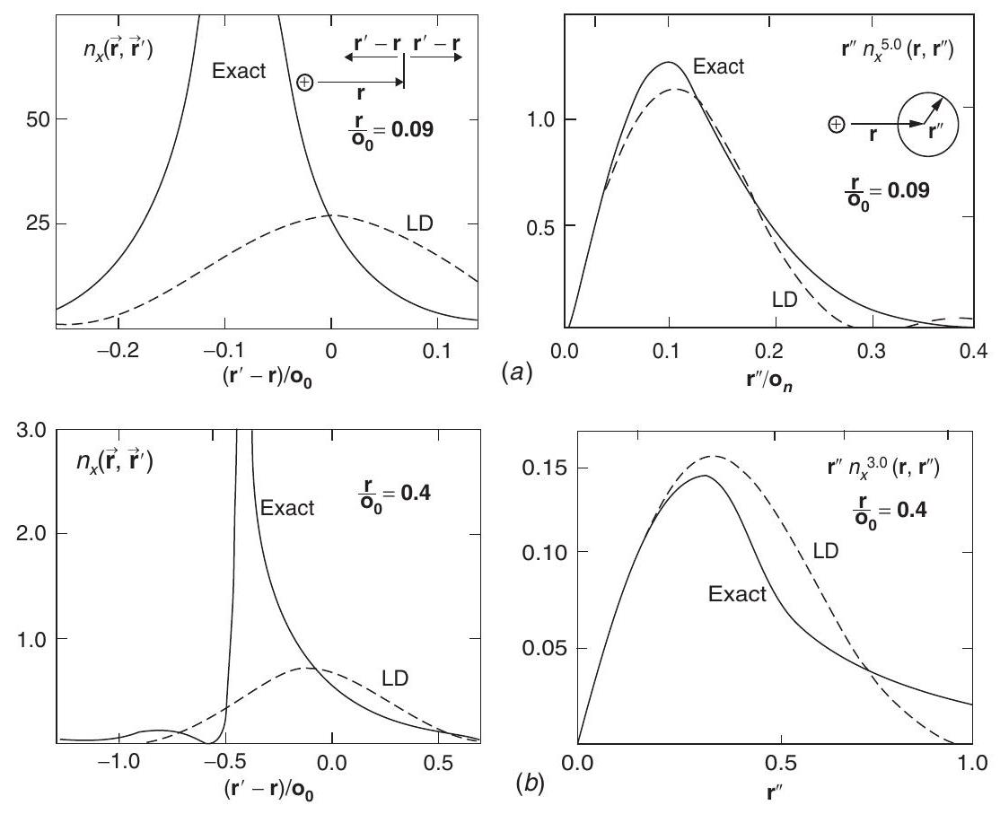
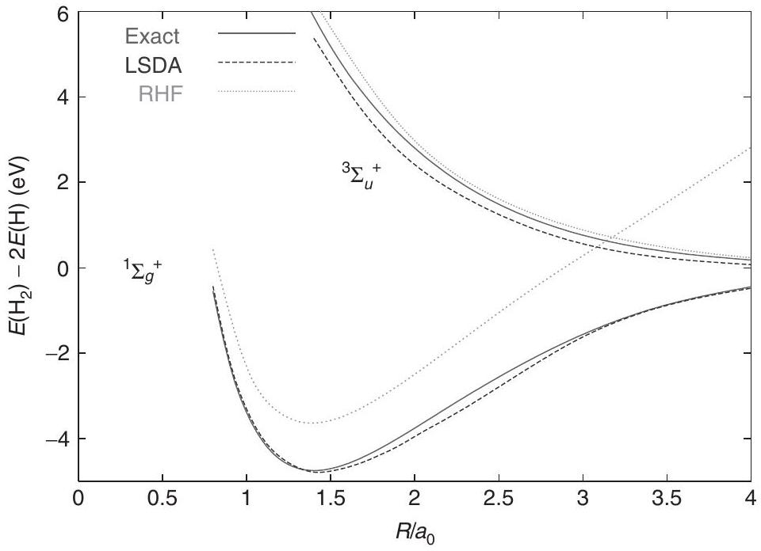
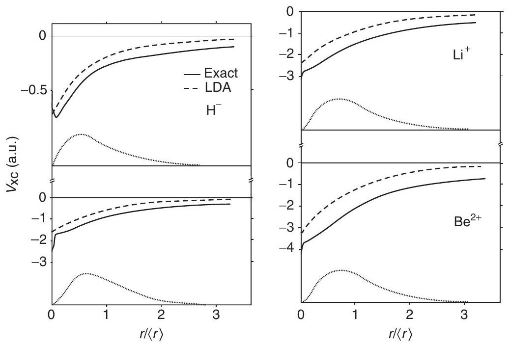
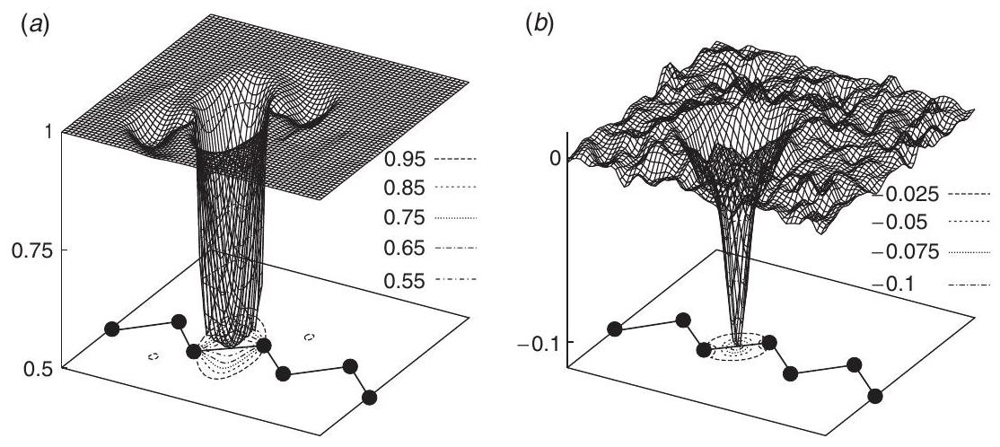
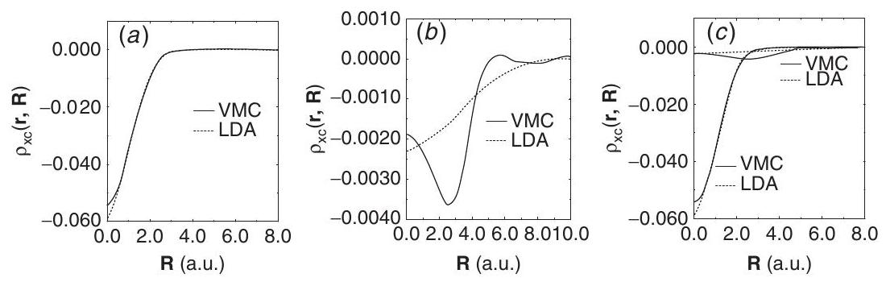
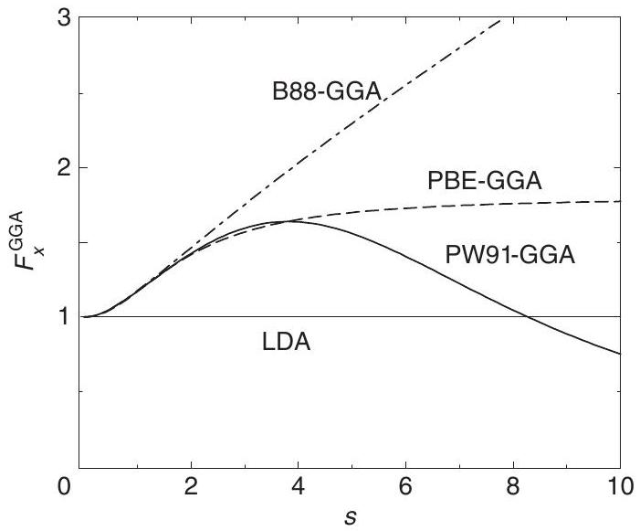
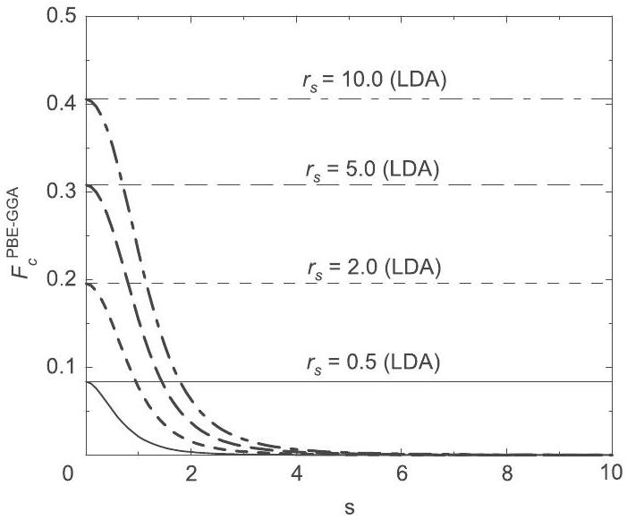

**8**

**Functionals for Exchange and Correlation I**

It is rain that grows flowers, not thunder.
Rumi

**Summary**

Density functional theory is the most widely used method today for electronic structure calculations because of the success of practical, approximate forms for the exchange-correlation energy as a functional of the density $E_{\mathrm{xc}}[n]$. The first part of this chapter is devoted to the basic understanding of the way exchange and correlation affect the energy, which is determined by the exchange-correlation hole, i.e., the decrease in probability of finding electrons near one another due to the exclusion principle and repulsive Coulomb interaction. This is followed by two of the most widely used functionals, the local density approximation (LDA) and the semilocal generalized-gradient approximations (GGAs), and important features are illustrated by a few selected results on atoms and the $\mathrm{H}_{2}$ molecule. Orbital-dependent functionals (hybrid, meta functionals of the kinetic energy, and other approaches) as well as other more advanced functionals and nonlocal van der Waals functionals are considered in Chapter 9.

# 8.1 Overview

The genius of the Kohn-Sham approach is the construction of an auxiliary system described by tractable independent-particle equations with all the difficulties of the full many-body interacting electron problem contained in the exchange-correlation energy $E_{\mathrm{xc}}[n]$ that is a functional of the electron density. This is an exact formulation for the ground-state properties of the full interacting many-body system. However, the exact functional $E_{\mathrm{xc}}[n]$ must be very complex and the Kohn-Sham construction would be only a footnote if that were the only result. The reason that density functional theory is by far the dominant method for practical calculations for materials is because it has proven to be possible to find approximations for exchange-correlation functional $E_{\mathrm{xc}}[n]$ that are remarkably successful. This chapter and the following one are devoted to these approximations.

The central quantity that determines the exchange-correlation energy $E_{\mathrm{xc}}[n]$ is the exchange-correlation hole described in general terms in Section 8.2. The "hole" denotes the decrease in the probability of finding another electron in the region around each electron, which is due to Pauli exclusion principle and correlation caused by the repulsive Coulomb interaction. For large classes of materials, a vast amount of experience has found that the resulting exchange-correlation energy can be reasonably approximated by a local functional (Section 8.3) and Section 8.4 is devoted to justification in terms of the exchangecorrelation hole. The next step is the semilocal generalized gradient approximation in Section 8.5. The local and semilocal approximations are the first two steps up the ladder of functionals in Fig. 9.1.

On the other hand, there are important classes of materials and phenomena that cannot be described by local correlations, for example, van der Waals dispersion interactions, which are due to correlated fluctuations of dipoles on different atoms or molecules. Section 9.8 is an example of how such nonlocal behavior can be cast in terms of a functional of the density.

A natural progress in the development is functionals of the wavefunction in addition to the density. This requires a generalized form of the Kohn-Sham approach, which has proven to be very successful for describing single-particle excitations as well as the ground state, and in some cases they are derived in a systematic way that provides additional insights. This and other advanced developments are the topics of the following chapter.

# 8.2 $E_{\mathrm{xc}}$ and the Exchange-Correlation Hole

In the Kohn-Sham approach, the only quantities needed are the independent-particle kinetic energy, the Hartree energy and the exchange-correlation energy $E_{\mathrm{xc}}[n]$ as a functional of the density. In order to carry out a DFT calculation all one needs is a computational method like those in Part IV and the formula for a functional. However, if one wants to understand the reasoning that has gone into the creation of a functional, or to create a new functional, then it is essential to understand the aspects of exchange and correlation that are needed. It is useful to express the energy $E_{\mathrm{xc}}$ in the form

$$
E_{\mathrm{xc}}[n]=\int \mathrm{d} \mathbf{r} n(\mathbf{r}) \epsilon_{\mathrm{xc}}([n], \mathbf{r}),
$$

where $\epsilon_{\mathrm{xc}}([n], \mathbf{r})$ is an energy per electron at point $\mathbf{r}$ that depends on the density $n(\mathbf{r}, \sigma)$ in some neighborhood of point $\mathbf{r}$. ${ }^{1}$ Since the Hartree energy includes the average Coulomb interactions, the potential energy of interaction per electron $\epsilon_{\mathrm{xc}}([n], \mathbf{r})$ involves the joint probability function for each pair of electrons minus the Hartree term, as described in Section 3.7. The exchange term can be written as in Eq. (3.57) and there is an analogous term for correlation, so that the exchange-correlation interaction energy energy can be written

[^0]$$
\epsilon_{\mathrm{xc}}^{\mathrm{int}}([n], \mathbf{r})=\frac{1}{2} \int \mathrm{~d}^{3} r^{\prime} \frac{n_{\mathrm{xc}}\left(\mathbf{r}, \mathbf{r}^{\prime}\right)}{\left|\mathbf{r}-\mathbf{r}^{\prime}\right|}
$$
where $n_{\mathrm{xc}}\left(\mathbf{r}, \mathbf{r}^{\prime}\right)$ is the exchange-correlation hole around an electron at point $\mathbf{r}$, as described in Section 3.7 summed over parallel ( $\sigma=\sigma^{\prime}$ ) and antiparallel ( $\sigma \neq \sigma^{\prime}$ ) spins. There are several important aspects that can be seen at this point:

- Since the Coulomb interaction is isotropic only the spherical average of $n_{\mathrm{xc}}\left(\mathbf{r}, \mathbf{r}^{\prime}\right)$ as a function of $\mathbf{r}^{\prime}$ is relevant for the energy.
- $n_{\mathrm{xc}}\left(\mathbf{r}, \mathbf{r}^{\prime}\right)$ is a sum of exchange and correlation terms. The exchange hole $n_{\mathrm{x}}\left(\mathbf{r}, \mathbf{r}^{\prime}\right) \leq 0$ is never positive and it integrates to one missing electron. The correlation hole $n_{\mathrm{c}}\left(\mathbf{r}, \mathbf{r}^{\prime}\right)$ integrates to zero since it only reflects the change in relative positions of electrons.
- This is not the entire exchange-correlation energy. As far as exchange is concerned this is the whole story, but correlation also changes the kinetic energy. The exchangecorrelation functional must include the difference from the independent-particle kinetic energy, as brought out in Eq. (7.7).

An expression for $\epsilon_{\mathrm{xc}}([n], \mathbf{r})$ including both interaction and kinetic terms can be found using the "coupling constant integration formula" described in the theoretical background, Section 3.4, which is also called an "adiabatic connection" [271]. In this case, the electronic charge is varied from zero (the noninteracting case) to the actual value (one in atomic units used here), with the added constraint that the density must be kept constant during this variation. Then all other terms remain constant and the change in energy is given by

$$
E_{\mathrm{xc}}[n]=\int_{0}^{e^{2}} \mathrm{~d} \lambda\left\langle\Psi_{\lambda}\right| \frac{\mathrm{d} V_{\mathrm{int}}}{\mathrm{~d} \lambda}\left|\Psi_{\lambda}\right\rangle-E_{\text {Hartree }}=\frac{1}{2} \int \mathrm{~d}^{3} r n(\mathbf{r}) \int \mathrm{d}^{3} r^{\prime} \frac{\bar{n}_{\mathrm{xc}}\left(\mathbf{r}, \mathbf{r}^{\prime}\right)}{\left|\mathbf{r}-\mathbf{r}^{\prime}\right|}
$$

where $\bar{n}_{\mathrm{xc}}\left(\mathbf{r}, \mathbf{r}^{\prime}\right)$ is the coupling-constant-averaged hole

$$
\bar{n}_{\mathrm{xc}}\left(\mathbf{r}, \mathbf{r}^{\prime}\right)=\int_{0}^{1} \mathrm{~d} \lambda n_{\mathrm{xc}}^{\lambda}\left(\mathbf{r}, \mathbf{r}^{\prime}\right)
$$

Together with Eqs. (8.1), (8.3) shows that the exchange-correlation density $\epsilon_{\mathrm{xc}}([n], \mathbf{r})$ can be written as

$$
\epsilon_{\mathrm{xc}}([n], \mathbf{r})=\frac{1}{2} \int \mathrm{~d}^{3} r^{\prime} \frac{\bar{n}_{\mathrm{xc}}\left(\mathbf{r}, \mathbf{r}^{\prime}\right)}{\left|\mathbf{r}-\mathbf{r}^{\prime}\right|}
$$

This is an important result that shows that the exact exchange-correlation energy can be understood in terms of the potential energy due to the exchange-correlation hole averaged over the interaction from $e^{2}=0$ to $e^{2}=1$. For $e^{2}=0$ the wavefunction is just the independent-particle Kohn-Sham wavefunction so that $n_{\mathrm{xc}}^{0}\left(\mathbf{r}, \sigma, \mathbf{r}^{\prime}, \sigma^{\prime}\right)=n_{x}\left(\mathbf{r}, \sigma, \mathbf{r}^{\prime}, \sigma^{\prime}\right)$, where the exchange hole is known from Eq. (3.54). Since the density everywhere is required to remain constant as $\lambda$ is varied, clearly $\epsilon_{\mathrm{xc}}([n], \mathbf{r})$ is implicitly a functional of the density in all space. Thus $E_{\mathrm{xc}}[n]$ can be considered as an interpolation between the exchange-only and the full correlated energies at the given density $n(\mathbf{r}, \sigma)$.

Analysis of the nature of the averaged hole $\bar{n}_{\mathrm{xc}}\left(\mathbf{r}, \mathbf{r}^{\prime}\right)$ is one of the primary approaches for developing improved approximations for $E_{\mathrm{xc}}[n]$. In particular, the exchange-correlation hole obeys a sum rule that its integral must be unity, as shown in Section 3.7. The sum rule is satisfied for any case that is derived from an actual electron hamiltonian and it places constraints on any approximate forms that may be proposed [272]. This and other sum rules [401] are among the primary guidelines for systematic improvement of functionals.

# 8.3 Local (Spin) Density Approximation (LSDA)

## 8.3.1 Homogeneous Gas

The exchange-correlation hole in the homogeneous electron gas has been presented in Chapter 5. The results are relevant here because they present representative cases from weak to strong correlation and they are the basis for the local density approximation. In the independent-particle approximation there is no correlation; the hole is purely the exchange hole involving electrons of the same spin given by Eq. (5.19) and shown in Fig. 5.3. At full coupling strength the hole has been calculated by quantum Monte Carlo methods, with results shown in Fig. 5.5. The average hole is some mean between the two, which can also be found by an appropriate average of the holes from high density (where correlation is negligible) to the actual density. The key point is that Fig. 5.5 allows one to have a feeling for the radial shapes and the characteristic extent of the exchange-correlation hole.

Examples of exchange-correlation hole are also shown in Fig. 8.5 for two densities corresponding to the highest and lowest densities of the valence states in silicon.

## 8.3.2 Local (Spin) Density Approximation

Already in their seminal paper, Kohn and Sham pointed out that solids can often be considered as close to the limit of the homogeneous electron gas. In that limit, it is known that the effects of exchange and correlation are local in character, and they proposed making the local density approximation (LDA) (or more generally the local spin density approximation (LSDA)), in which the exchange-correlation energy is simply an integral over all space with the exchange-correlation energy density at each point assumed to be the same as in a homogeneous electron gas with that density, ${ }^{2}$

$$
\begin{aligned}
E_{\mathrm{xc}}^{\mathrm{LSDA}}\left[n^{\uparrow}, n^{\downarrow}\right] & =\int \mathrm{d}^{3} r n(\mathbf{r}) \epsilon_{\mathrm{xc}}^{\mathrm{hom}}\left(n^{\uparrow}(\mathbf{r}), n^{\downarrow}(\mathbf{r})\right) \\
& =\int \mathrm{d}^{3} r n(\mathbf{r})\left[\epsilon_{x}^{\mathrm{hom}}\left(n^{\uparrow}(\mathbf{r}), n^{\downarrow}(\mathbf{r})\right)+\epsilon_{c}^{\mathrm{hom}}\left(n^{\uparrow}(\mathbf{r}), n^{\downarrow}(\mathbf{r})\right)\right] .
\end{aligned}
$$

[^1]The LSDA can be formulated in terms of either two spin densities $n^{\uparrow}(\mathbf{r})$ and $n^{\downarrow}(\mathbf{r})$, or the total density $n(\mathbf{r})$ and the fractional spin polarization $\zeta(\mathbf{r})$ defined in Eq. (5.16),

$$
\zeta(\mathbf{r})=\frac{n^{\uparrow}(\mathbf{r})-n^{\downarrow}(\mathbf{r})}{n(\mathbf{r})}
$$

The LSDA is the most general local approximation and is given explicitly by Eqs. (5.17) and (5.18) for exchange and by approximate (or fitted) expressions given in Section 5.3 for correlation. For unpolarized systems the LDA is found simply by setting $n^{\uparrow}(\mathbf{r})=n^{\downarrow}(\mathbf{r})= n(\mathbf{r}) / 2$.

The local approximation is considered to be the first rung on the ladder in Fig. 9.1. The only information needed is the exchange-correlation energy of the homogeneous gas as a function of density. The exchange energy of the homogeneous gas is given by the simple analytic form in Eq. (5.15), and the correlation energy has been calculated to great accuracy with Monte Carlo methods [311]. Variations of exchange and correlation energies with density are discussed in Chapter 5 (where they are compared with insightful approximations), and explicit analytic forms fitted to the numerical results are given in Appendix B. As long as there are no further approximations in the calculations, the results of LDA and LSDA calculations can be considered as tests of the local approximation itself; the local approximation lives or dies depending on how the answers agree with experiment (or with in some cases many-body calculations that can be considered essentially exact).

# 8.4 How Can the Local Approximation Possibly Work As Well As It Does?

Much of this part of the book is devoted to improvements over the local approximation. But it is instructive to first consider the astounding successes of the local approximation! Since it is derived from the electron gas, how can it possibly be relevant for an atom that is nothing like an electron gas? How can it possibly produce such accurate results that lattice constants of crystals are predicted to within a few percent?

There are reasons that may help to explain the successes. One is that the hole obeys all the sum rules since it is the exact hole for some external potential, even if it is not the actual one [341]. Thus the hole satisfies constraints imposed by the sum rules, which are difficult to satisfy if one makes arbitrary approximations. Furthermore, the detailed shape of the hole need not be correct since only the spherical average of the xc hole enters the energy. However, such arguments must be backed up to draw anything more than just qualitative reasoning.

## 8.4.1 Atoms

Atoms are an extreme example of finite, inhomogeneous systems, often with wide bandgaps, that are very different from an infinite homogeneous gas. The one-electron problem, the hydrogen atom, is the worst in many ways. In this case there is no correlation and Hartree-Fock is exact for the ground-state energy with exact cancellation of the exchange and Hartree energies. This is a test of the LSDA where there is correlation like in

Figure 8.1. Exchange hole in an Ne atom. Left: $n\left(\mathbf{r}, \mathbf{r}^{\prime}\right)$ plotted for two values of $|\mathbf{r}|$ as a function of $\left|\mathbf{r}^{\prime}-\mathbf{r}\right|$ along a line through the nucleus and compared to the local density approximation. The origin is centered on an electron a distance $|r|$. All quantities are in units of the Bohr radius, $a_{0}$. Right: the spherical average as a function of the relative distance, which shows the close resemblance to the local density approximation. From Gunnarsson et al. [402].

a homogeneous gas. The result shown in Table 9.1 is a small (fictitious) correlation energy that tends to correct the error in the exchange energy, leading to $\approx 7 \%$ error in the binding energy. A similar error is found for the other atoms in Table 9.1. The other functionals are much better, but given the crudeness of the LDA this level of accuracy is quite remarkable.

In order to get a physical picture of how the approximation can be so good, we need to look at the exchange-correlation hole that determines the energy. In an atom the hole associated with an electron depends on the electron position and is nonspherical if the electron is not at the atom center; however, for the energy, only the spherical average is needed. The consequences are illustrated in Fig. 8.1 for the exchange hole $n_{x}\left(\mathbf{r}, \mathbf{r}^{\prime}\right)$ in a neon atom taken from [402]. For the two representative cases shown at the left, the hole is extremely nonspherical, and yet the spherical average, shown on the right, is quite similar to the hole in the homogeneous electron gas with density equal to the local density at the point chosen. Thus even in this case the local approximation is remarkably good for the energy. Such agreement is evidence that the local approximation can be applied to many systems even if they are very inhomogeneous. In addition, it is a good sign for the success of improvements that involve gradients in Section 8.5 and other approaches in Chapter 9.

## 8.4.2 Two-Electron Problems: He and $\mathrm{H}_{2}$

The neutral He atom and $\mathrm{H}_{2}$ molecule are the simplest two-electron systems, which nevertheless exemplify issues related to many of the most important problems in condensed matter physics. The exchange and correlation energies for He are also given in Table 9.1. The good agreement for the LYP functional is not surprising since it was constructed using He as a starting point; however, the quality of the results is impressive for the other functionals.

The neutral $H_{2}$ molecule is a two-electron system for which there are essentially exact quantum Monte Carlo calculations [403]. As shown in Fig. 8.2 it is truly remarkable that the LDA is almost indistinguishable near the minimum and at shorter bond lengths. However, a close examination of the figure reveals a failure at large bond length. The curve for LSDA has a kink where the lowest-energy solution changes from the restricted spin singlet to the unrestricted broken symmetry solution with spin up on one site and spin down on the other. The reason is that at large distances there is a strong correlation between the electrons, with a greatly reduced probability of finding two electrons near the same atom at one time, compared to the probability of $1 / 4$, which would occur in the noninteracting case. The way this is accomplished in the DFT calculation is to break the symmetry, but this is unphysical

Figure 8.2. Energy versus separation $R$ for an $\mathrm{H}_{2}$ molecule, comparing LSDA (unrestricted) and Hartree-Fock (restricted RHF) with the exact energies from [403]. The two sets of curves are for the spin singlet (bonding) and triplet (antibonding) states. The most remarkable result is the accuracy of the LSDA near the minimum, whereas the Hartree-Fock curve is too high since it omits correlation. At large $R$ the unrestricted LSDA has a broken symmetry solution that approaches the usual spin-polarized isolated-atom LSDA limit. The triplet Hartree-Fock energy approaches the exact isolated-atom limit, $E \equiv 0$, for large $R$, but the singlet approaches the wrong limit in the restricted approximation. Figure provided by O. E. Gunnarsson.

Figure 8.3. Exchange-correlation potential in two-electron ions, comparing the exact $V_{\mathrm{xc}}$ with the LDA. Each is derived from an essentially exact density. Note that the LDA potential is too high, leading to an eigenvalue that is also too high. This can be easily understood from the fact that the exact potential has an attractive $1 / r$ form at long range that is missing in the LDA. From Almbladh and Pedroza [404].

since the correct solution is always a spin singlet. This is an example of an intrinsic failure of any method that assumes the spin of each electron is quantized along an axis up or down, not only the local approximation, and it can be fixed only by a method that properly treats a singlet wavefunction.

How do the eigenvalues compare with experimental removal energies? Since the highest eigenvalue is exact in an exact Kohn-Sham calculation, this is a test of approximate functionals. As illustrated in Fig. 8.3, there is a large effect in finite systems due to the long-range form of the potential [404]. The self-interaction that occurs in approximate functionals has the effect of adding a spurious repulsive term that raises the eigenvalues and makes states too weakly bound. Proper treatment of the nonlocal exchange eliminates this effect and makes the states more strongly bound. Similar consequences of nonlocal exchange are found in calculations on many-electron atoms as illustrated in Section 10.5.

## 8.4.3 Solids

There are very few quantitative calculations of the exchange and correlation holes in solids, but an informative example is shown in Figs. 8.4 and 8.5 for Si determined by a quantum Monte Carlo simulation with a chosen variational wavefunction [405]. The figures show separately the exchange and correlation holes, demonstrating the basic fact that the exchange dominates over correlation. It is so large because the main effect of the exchange term is to remove the spurious self-interaction in the Hartree interactions. There is a sum rule

Figure 8.4. Exchange (a) and coupling-constant-averaged correlation hole (b) for an electron at the bond center in Si , calculated by a variational Monte Carlo method. Note the much smaller scale for the correlation hole. From Hood et al. [405].

Figure 8.5. Spherical and coupling-constant-averaged exchange-correlation hole in Si , calculated as in Fig. 8.4, compared with the LDA approximation. Left: hole around an electron at the bond center. Middle: hole around an electron at the interstitial hole. Right: a comparison to scale. From Hood et al. [405].

that the exchange hole integrates to one, whereas the correlation hole integrates to zero since correlation only affects relative positions. Despite the fact that the hole varies greatly from high-density bond-center regions to low-density interstitial regions, the spherical average is given reasonably well by the local density approximation. However, the large difference in the interstitial region shown in Fig. 8.5 indicates possible sources of inaccuracies. Since the hole obeys a sum rule, the deepening at short range due to correlation must be offset by a decrease at large range, i.e., screening that effectively decreases the range of correlation.

# 8.5 Generalized-Gradient Approximations (GGAs)

The success of the LSDA has led to the development of various generalized-gradient approximations (GGAs), which are a step up to the second rung of the DFT ladder in Fig. 9.1. They lead to marked improvements over LSDA for many cases, and GGAs can now provide the accuracy required for density functional theory to be the standard for large
classes of solids and molecules. In this section we briefly describe some of the physical ideas that are the foundation for construction of GGAs, and we focus especially on the PBE functional as a representative GGA functional that is widely used. For example, the PBE functional was chosen for benchmarking the codes most used in the condensed matter community [406].

The first step beyond the local approximation is a functional of the magnitude of the gradient of the density $\left|\nabla n^{\sigma}\right|$ as well as the value $n$ at each point. Such a "gradient expansion approximation" (GEA) was suggested in the original paper of Kohn and Sham and carried out by Herman et al. [407] and others. The low-order expansion of the exchange and correlation energies is known [408]; however, the GEA does not lead to consistent improvement over the LSDA. It violates the sum rules and other relevant conditions [407] and, indeed, often leads to worse results. The basic problem is that gradients in real materials are so large that the expansion breaks down.

The term generalized-gradient expansion (GGA) denotes a variety of ways proposed for functions that modify the behavior at large gradients in such a way as to preserve desired properties. It is convenient [409] to define the functional as a generalized form of Eq. (8.6),

$$
\begin{aligned}
E_{\mathrm{xc}}^{\mathrm{GGA}}\left[n^{\uparrow}, n^{\downarrow}\right] & =\int \mathrm{d}^{3} r n(\mathbf{r}) \epsilon_{\mathrm{xc}}\left(n^{\uparrow}, n^{\downarrow},\left|\nabla n^{\uparrow}\right|,\left|\nabla n^{\downarrow}\right|, \ldots\right) \\
& \equiv \int \mathrm{d}^{3} r n(\mathbf{r}) \epsilon_{x}^{\text {hom }}(n) F_{\mathrm{xc}}\left(n^{\uparrow}, n^{\downarrow},\left|\nabla n^{\uparrow}\right|,\left|\nabla n^{\downarrow}\right|, \ldots\right),
\end{aligned}
$$

where $F_{\mathrm{xc}}$ is dimensionless and $\epsilon_{x}^{\text {hom }}(n)$ is the exchange energy of the unpolarized gas given in Table 5.3.

For exchange, it is straightforward to show (Exercise 8.1) that there is a "spin-scaling relation,"

$$
E_{x}\left[n^{\uparrow}, n^{\downarrow}\right]=\frac{1}{2}\left[E_{x}\left[2 n^{\uparrow}\right]+E_{x}\left[2 n^{\downarrow}\right]\right],
$$

where $E_{x}[n]$ is the exchange energy for an unpolarized system of density $n(\mathbf{r})$. Thus for exchange we need to consider only the spin-unpolarized $F_{x}(n,|\nabla n|)$. It is natural to work in terms of dimensionless reduced-density gradients of $m$ th order that can be defined by

$$
s_{m}=\frac{\left|\nabla^{m} n\right|}{\left(2 k_{F}\right)^{m} n}=\frac{\left|\nabla^{m} n\right|}{2^{m}\left(3 \pi^{2}\right)^{m / 3}(n)^{(1+m / 3)}}
$$

Since the Fermi momentum is given by $k_{F}=3(2 \pi / 3)^{1 / 3} r_{s}^{-1}, s_{m}$ is proportional to the $m$ th-order variation in density normalized to the average distance between electrons $r_{S}$. The explicit expression for the first gradients can be written (Exercise 8.2)

$$
s_{1} \equiv s=\frac{|\nabla n|}{\left(2 k_{F}\right) n}=\frac{\left|\nabla r_{s}\right|}{2(2 \pi / 3)^{1 / 3} r_{s}}
$$

The lowest-order terms in the expansion of $F_{x}$ have been calculated analytically [408, 409]

$$
F_{x}=1+\frac{10}{81} s_{1}^{2}+\frac{146}{2025} s_{2}^{2}+\cdots
$$

Figure 8.6. Exchange enhancement factor $F_{x}$ as a function of the dimensionless density gradient $s$ for various GGAs. (From H. Kim; similar to fig. 1 of [409] but for a larger range of $s$ ). Note that in the relevant range for most materials, $0<s \lesssim 3$, the magnitude of the exchange is increased by a factor $\approx 1.3-1.6$. (This provides an a posteriori reason why there was some success in using the constant factor $4 / 3$ in Slater's average local exchange.)

In Fig. 8.6 are shown the exchange enhancement factor $F_{x}(n, s)$ for three widely used functionals: Becke (B88) [410]; Perdew and Wang (PW91) [411]; and Perdew, Burke, and Enzerhof (PBE) [412]. As shown in the figure, one can divide the GGA into two regions: (i) small $s(0<s<3)$ and (ii) large $s(s>3)$ regions. In region (i), which is relevant for most physical applications, different $F_{x}$ have nearly identical shapes, which is the reason that different GGAs give similar improvement for many conventional systems with small-density gradient contributions. Most importantly, $F_{x} \geq 1$, so all the GGAs lead to an exchange energy lower than the LDA. Typically, there are more rapidly varying density regions in atoms than in condensed matter, which leads to greater lowering of the exchange energy in atoms than in molecules and solids. This results in the reduction of binding energy, correcting the LDA overbinding and improving agreement with experiment, which is one of the most important characteristics of GGAs [413].

Note that for $s$ in the range up to $\approx 3$, which is appropriate form many materials, the average enhancement is roughly $4 / 3$, making the average exchange similar to that proposed by Slater (see Section 9.5), although for very different reasons. Perhaps this accounts for the improvement that has often been found in calculations that use the factor $4 / 3$ or an adjustable factor called " $X \alpha$ " which tends to be between 1 and $4 / 3$.

In region (ii), the different limiting behaviors of $F_{x}$ result from choosing different physical conditions for $s \rightarrow \infty$. In B88, $F_{x}^{\mathrm{B} 88}(s) \sim s / \ln (s)$ was chosen to give the correct exchange energy density ( $\epsilon_{x} \rightarrow-1 / 2 r$ ) [410]. In PW91, choosing $F_{x}^{\text {PW91 }}(s) \sim s^{-1 / 2}$ satisfies the Lieb-Oxford bound (see [412]) and the nonuniform scaling condition that must be satisfied if the functional is to have the proper limit for a thin layer or a line [411]. In PBE, the nonuniform scaling condition was dropped in favor of a simplified

Figure 8.7. Correlation enhancement factor $F_{c}$ as a function of the dimensionless density gradient $s$ for the PBE functional. The actual form is given in Appendix B. Other functionals are qualitatively similar. (See caption of Fig. 8.6.)

parameterization with $F_{x}^{\mathrm{PBE}}(s) \sim$ const. [412]. The fact that different physical conditions lead to very different behaviors of $F_{x}$ in region (ii) not only reflects the lack of knowledge of the large-density gradient regions but also an inherent difficulty of the density gradient expansion in this region: even if one form of GGA somehow gives the correct result for a certain physical property while others fail, it is not guaranteed that the form is superior for other properties in which different physical conditions prevail.

Correlation is more difficult to cast in terms of a functional, but its contribution to the total energy is typically much smaller than the exchange. The lowest-order gradient expansion at high density has been determined by Ma and Brueckner [414] (see [412]) to be

$$
F_{c}=\frac{\epsilon_{c}^{\mathrm{LDA}}(n)}{\epsilon_{x}^{\mathrm{LDA}}(n)}\left(1-0.21951 s_{1}^{2}+\cdots\right) .
$$

For large-density gradients the magnitude of correlation energy decreases and vanishes as $s_{1} \rightarrow \infty$. This decrease can be qualitatively understood since large gradients are associated with strong confining potentials that increase level spacings and reduce the effect of interactions compared to the independent-electron terms. As an example of a GGA for correlation, Fig. 8.7 shows the correlation enhancement factor $F_{c}^{\mathrm{PBE}}$ for the PBE functional, which is almost identical to that for the PW91. The actual analytic form for the PBE correlation is given in Appendix B.

There are now many GGA functionals that are used in quantitative calculations, especially in chemistry (see, e.g., [413] and [415], which gives an overview and extensive assessment of 200 density functionals). A few examples can give a sense of how the functionals are constructed. In many cases correlation is treated using the Lee-YangParr (LYP) [416] functional, which was derived from the orbital-dependent Colle-Salvetti functional [417]. That functional was in turn derived for the He atom and parameterized
to fit atoms with more electrons. The BLYP functional is the combination of YLP for correlation and the Becke exchange functional [410], which was adjusted to approximate the Hartree-Fock exchange in closed-shell atoms. In a more theoretical approach, Krieger and coworkers [418] constructed a functional based on many-body calculations [419] of an artificial "jellium with a gap" problem that attempts to incorporate the effect of a gap into a functional. Many other functionals have parameters adjusted to fit to molecular data. Selected explicit forms can be found in [273, 413, 415, 420].

# 8.6 LDA and GGA Expressions for the Potential $\boldsymbol{V}_{\mathbf{x c}}^{\sigma}(\boldsymbol{r})$

The part of the Kohn-Sham potential due to exchange and correlation $V_{\mathrm{xc}}^{\sigma}(\mathbf{r})$ is defined by the functional derivative in Eqs. (7.13) or (7.41). The potential can be expressed more directly for LDA and GGA functionals, Eqs. (8.6) and (8.8), since they are expressed in terms of functions (not functionals) of the local density of each $\operatorname{spin} n(\mathbf{r}, \sigma)$ and its gradients at point $\mathbf{r}$. Explicit forms are given in Appendix B.

In the LDA, the form is very simple,

$$
\delta E_{\mathrm{xc}}[n]=\sum_{\sigma} \int \mathrm{d} \mathbf{r}\left[\epsilon_{\mathrm{xc}}^{\mathrm{hom}}+n \frac{\partial \epsilon_{\mathrm{xc}}^{\mathrm{hom}}}{\partial n^{\sigma}}\right]_{\mathbf{r}, \sigma} \delta n(\mathbf{r}, \sigma)
$$

so that the potential,

$$
V_{\mathrm{xc}}^{\sigma}(\mathbf{r})=\left[\epsilon_{\mathrm{xc}}^{\mathrm{hom}}+n \frac{\partial \epsilon_{\mathrm{xc}}^{\mathrm{hom}}}{\partial n^{\sigma}}\right]_{\mathbf{r}, \sigma}
$$

involves only ordinary derivatives of $\epsilon_{\mathrm{xc}}^{\mathrm{hom}}\left(n^{\uparrow}, n^{\downarrow}\right)$. Here the subscript $\mathbf{r}, \sigma$ means the quantities in square brackets are evaluated for $n^{\sigma}=n(\mathbf{r}, \sigma)$. The LDA exchange terms are particularly simple: since $\epsilon_{x}^{\mathrm{hom}}\left(n^{\sigma}\right)$ scales as $\left(n^{\sigma}\right)^{1 / 3}$ it follows that

$$
V_{x}^{\sigma}(\mathbf{r})=\frac{4}{3} \epsilon_{x}^{\mathrm{hom}}(n(\mathbf{r}, \sigma))
$$

The correlation potential depends on the form assumed, with selected examples given in Appendix B.

In the GGA one can identify the potential by finding the change $\delta E_{\mathrm{xc}}[n]$ to linear order in $\delta n$ and $\delta \nabla n=\nabla \delta n$,

$$
\delta E_{\mathrm{xc}}[n]=\sum_{\sigma} \int \mathrm{d} \mathbf{r}\left[\epsilon_{\mathrm{xc}}+n \frac{\partial \epsilon_{\mathrm{xc}}}{\partial n^{\sigma}}+n \frac{\partial \epsilon_{\mathrm{xc}}}{\partial \nabla n^{\sigma}} \nabla\right]_{\mathbf{r}, \sigma} \delta n(\mathbf{r}, \sigma)
$$

The term in square brackets might be considered to be the potential; however, it does not have the form of a local potential because of the last term, which is a differential operator.

There are three approaches to handling the last term. The first is to find a local $V_{\mathrm{xc}}^{\sigma}(\mathbf{r})$ by partial integration (see Appendix A) of the last term in square brackets to give

$$
V_{\mathrm{xc}}^{\sigma}(\mathbf{r})=\left[\epsilon_{\mathrm{xc}}+n \frac{\partial \epsilon_{\mathrm{xc}}}{\partial n^{\sigma}}-\nabla\left(n \frac{\partial \epsilon_{\mathrm{xc}}}{\partial \nabla n^{\sigma}}\right)\right]_{\mathbf{r}, \sigma}
$$

This form is commonly used; however, it has the disadvantage that it requires higher derivatives of the density that can lead to pathological potentials and numerical difficulties. This may happen near the nucleus where the density varies rapidly or in the outer regions of atoms where it is very small (see Exercise 8.3).

A second approach is to use the operator form Eq. (8.17) directly by modifying the Kohn-Sham equations [421]. Using the fact that the density can be written in terms of the wavefunctions $\psi_{i}$, the matrix elements of the operator can be written (for simplicity we omit the variables $\mathbf{r}$ and $\sigma$ )

$$
\left\langle\psi_{j}\right| \hat{V}_{\mathrm{xc}}\left|\psi_{i}\right\rangle=\int\left[\tilde{V}_{\mathrm{xc}} \psi_{j}^{*} \psi_{i}+\psi_{j}^{*} \mathbf{V}_{\mathrm{xc}} \cdot \nabla \psi_{i}+\left(\mathbf{V}_{\mathrm{xc}} \cdot \nabla \psi_{j}^{*}\right) \psi_{i}\right]
$$

where $\tilde{V}_{\mathrm{xc}}=\epsilon_{\mathrm{xc}}+n\left(\partial \epsilon_{\mathrm{xc}} / \partial n\right)$ and $\mathbf{V}_{\mathrm{xc}}=n\left(\partial \epsilon_{\mathrm{xc}} / \partial \nabla n\right)$. This form is numerically more stable; however, it requires inclusion of the additional vector operator in the Kohn-Sham equation, which may significantly increase the computational cost; for example, in plane wave approaches four Fourier transforms are required instead of one.

Finally, a different approach proposed by White and Bird [422] is to treat $E_{\mathrm{xc}}$ strictly as a function of the density; the gradient terms are defined by an operational definition in terms of the density. Then Eq. (8.17) can be written using the chain rule as

$$
\begin{aligned}
\delta E_{\mathrm{xc}}[n]= & \sum_{\sigma} \int \mathrm{d} \mathbf{r}\left[\epsilon_{\mathrm{xc}}+n \frac{\partial \epsilon_{\mathrm{xc}}}{\partial n^{\sigma}}\right]_{\mathbf{r}, \sigma} \delta n(\mathbf{r}, \sigma) \\
& +\sum_{\sigma} \iint \mathrm{d} \mathbf{r d} \mathbf{r}^{\prime} n(\mathbf{r})\left[\frac{\partial \epsilon_{\mathrm{xc}}}{\partial \nabla n^{\sigma}}\right]_{\mathbf{r}, \sigma} \frac{\delta \nabla n\left(\mathbf{r}^{\prime}\right)}{\delta n(\mathbf{r})} \delta n(\mathbf{r}, \sigma)
\end{aligned}
$$

where $\left(\delta \nabla n\left(\mathbf{r}^{\prime}\right) / \delta n(\mathbf{r})\right)$ denotes a functional derivative (which is independent of spin). For example, on a grid, the density for either spin is given only at grid points $n\left(\mathbf{r}_{m}\right)$ and the gradient at $\nabla n\left(\mathbf{r}_{m}\right)$ is determined by the density by a formula of the form

$$
\nabla n\left(\mathbf{r}_{m}\right)=\sum_{m^{\prime}} \mathbf{C}_{m-m^{\prime}} n\left(\mathbf{r}_{m^{\prime}}\right)
$$

so that

$$
\frac{\delta \nabla n\left(\mathbf{r}_{m}\right)}{\delta n\left(\mathbf{r}_{m^{\prime}}\right)} \rightarrow \frac{\partial \nabla n\left(\mathbf{r}_{m}\right)}{\partial n\left(\mathbf{r}_{m^{\prime}}\right)}=\mathbf{C}_{m-m^{\prime}}
$$

(Note that each $\mathbf{C}_{m^{\prime \prime}}=\left\{C_{m^{\prime \prime}}^{x}, C_{m^{\prime \prime}}^{y}, C_{m^{\prime \prime}}^{z}\right\}$ is a vector in the space coordinates.) In a finite difference method, the coefficients $\mathbf{C}_{m}$ " are nonzero for some finite range; in a Fourier transform method, the $\mathbf{C}_{m}$ " follow simply by noting that

$$
\nabla n\left(\mathbf{r}_{m}\right)=\sum_{\mathbf{G}} i \mathbf{G} n(\mathbf{G}) \mathrm{e}^{\mathrm{i} \mathbf{G} \cdot \mathbf{r}_{m}}=\frac{1}{N} \sum_{\mathbf{G}, m^{\prime}} i \mathbf{G} \mathrm{e}^{\mathrm{i} \mathbf{G} \cdot\left(\mathbf{r}_{\mathbf{m}}-\mathbf{r}_{\mathbf{m}^{\prime}}\right)} n\left(\mathbf{r}_{m^{\prime}}\right)
$$

Finally, varying $n\left(\mathbf{r}_{m}, \sigma\right)$ in the expression for $E_{\mathrm{xc}}$ and using the chain rule leads to

$$
V_{\mathrm{xc}}^{\sigma}\left(\mathbf{r}_{m}\right)=\left[\epsilon_{\mathrm{xc}}+n \frac{\partial \epsilon_{\mathrm{xc}}}{\partial n}\right]_{\mathbf{r}_{m}, \sigma}+\sum_{m^{\prime}}\left[n \frac{\partial \epsilon_{\mathrm{xc}}}{\partial|\nabla n|} \frac{\nabla n}{|\nabla n|}\right]_{\mathbf{r}_{m^{\prime}, \sigma}} \mathbf{C}_{m^{\prime}-m}
$$

This form reduces the numerical problems associated with Eq. (8.18) without a vector operator as in Eq. (8.19). Note that $V_{\mathrm{xc}}^{\sigma}\left(\mathbf{r}_{m}\right)$ is a nonlocal function of $n\left(\mathbf{r}_{m^{\prime}}, \sigma\right)$, the form of which depends on the way the derivative is calculated. This is an advantage in actual calculations because it ensures consistency between $E_{\mathrm{xc}}$ and $V_{\mathrm{xc}}$. The method can be extended to other bases by specifying the derivative in the appropriate basis.

# 8.7 Average and Weighted Density Formulations: ADA and WDA

An approach to the generalization of the local density approximation proposed by Gunnarsson et al. [402] is to construct a nonlocal functional that depends on the density in some region around each point $\mathbf{r}$. The original proposals were designed to provide a natural extension of the local functional in a way that satisfies the sum rules. This led to two approaches, the average density approximation (ADA) and the weighted density approximation (WDA) [402]. In the ADA, the exchange-correlation hole Eq. (8.4) and energy Eq. (8.5) are approximated by the corresponding quantity for a homogeneous gas of average density $\bar{n}^{\sigma}$ instead of the local density $n(\mathbf{r}, \sigma)$. This leads to

$$
E_{\mathrm{xc}}^{\mathrm{ADA}}\left[n^{\uparrow}, n^{\downarrow}\right]=\int \mathrm{d}^{3} r n(\mathbf{r}) \epsilon_{\mathrm{xc}}^{\mathrm{hom}}\left(\bar{n}^{\uparrow}(\mathbf{r}), \bar{n}^{\downarrow}(\mathbf{r})\right),
$$

where

$$
\bar{n}(\mathbf{r})=\int \mathrm{d}^{3} \mathbf{r}^{\prime} w\left(\bar{n}(\mathbf{r}) ;\left|\mathbf{r}-\mathbf{r}^{\prime}\right|\right) n\left(\mathbf{r}^{\prime}\right)
$$

is a nonlocal functional of the density for each spin separately. The weight function $w$ can be chosen in several ways. Gunnarsson et al. [402] originally proposed a form based on the linear response of the homogeneous electron gas and given in tabular form. The WDA is related but differs in the way the weighting is defined.

Tests have shown that there are advantages of the ADA and WDA, but there have not been extensive studies. A clear superiority over the ordinary LDA and GGAs is that in the limit where a three-dimensional system approaches two dimensional (e.g., in a confined electron gas in semiconductor quantum wells) the nonlocal functionals are well behaved whereas most of the LDA and GGA functionals diverge [423] (see Exercise 8.4). On the other hand, the ADA and WDA functionals suffer from the serious difficulty that core electrons distort the weighting in an unphysical way, so that any reasonable weighting must involve some shell decomposition to separate the effects on core and valence electrons.

# 8.8 Functionals Fitted to Databases

There are many other functionals that cannot be described here. In particular, functionals fitted to databases are extensively used in chemistry. It is not feasible here to cover the large number of such functionals even if they are very useful. An example of widely used functionals is the M06 suite developed by Zhao and Truhlar [424] and the performance of
many other functionals can be found in the review by Mardirossian and Head-Gordon [415]. As a general rule, one might expect that functionals fit to a database work better for similar materials than functionals derived from theoretical arguments and idealized systems like the homogeneous gas. However, they may not work as well when applied to other materials that are significantly different and may not have as much predictive power for wide ranges of problems.

A promising area for future developments is the use of "machine learning" techniques, which may provide ways to discover new functionals by finding patterns that are not apparent and not suggested by traditional chemical and physical intuition. An early paper in the field is [425]; more recent work can be found by searching for the citations to this paper.

**SELECT FURTHER READING**

See the list at the end of Chapter 6 for general references on density functional theory.
Overviews and reviews:
Casida, M. E., in Recent Developments and Applications of Density Functional Theory, edited by J. M. Seminario (Elsevier, Amsterdam, 1996), p. 391.

Cohen, A. J., Mori-Snchez, P., and Yang, W., "Challenges for density functional Theory" Chem. Rev. 112:289-320, 2012.
Koch, W. and Holthausen, M. C., A Chemist's Guide to Density Functional Theory (Wiley-VCH, Weinheim, 2001).
Mardirossian, N. and Head-Gordon, M., "Thirty years of density functional theory in computational chemistry: An overview and extensive assessment of 200 density functionals," Mol. Phys. 115:2315-2372, 2017.
In addition to an extensive assessment of many functionals, the authors describe their approach "to use a combinatorial design strategy that can be loosely characterised as 'survival of the most transferable."
Perdew, J. P. and Burke, K., "Comparison shopping for a gradient-corrected density functional," Int. J. Quant. Chem. 57:309-319, 1996.

Towler, M. D., Zupan, A., and Causa, M., "Density functional theory in periodic systems using local gaussian basis sets," Comp. Phys. Commun. 98:181-205, 1996. (Summarizes explicit formulas for functionals.)

**Exercises**

8.1 Derive the "spin-scaling relation" Eq. (8.9). From this it follows that in the homogeneous gas, one needs only the exchange in the unpolarized case.
8.2 (a) Show that the expression for the dimensionless gradients $s_{1}=s$ in Eq. (8.10) can be written in terms of $r_{s}$ as Eq. (8.11).
(b) Find the form of the second gradient $s_{2}$ in terms of $r_{s}$.
8.3 Use the known form of the density near a nucleus to analyze the final term in Eq. (8.18) near the nucleus. Show that the term involves higher-order derivatives of the density that are singular at the nucleus.
(a) Argue that such a potential is unphysical using the facts that the exact form of the exchange potential is known and correlation is negligible compared to the divergent nuclear potential.
(b) Show that, nevertheless, the result for the total energy is correct since it is just a transformation of the equations.
(c) Finally, discuss how the singularity can lead to numerical difficulties in actual calculations.
8.4 Show that if a three-dimensional system is compressed in one direction so that the electrons are confined to a region that approaches a two-dimensional plane, the density diverges and the LDA expression for the exchange energy approaches negative infinity. Show that this is unphysical and that the exchange energy should approach a finite value that depends on the area density. Argue that this is not necessarily the case for a GGA but that the unphysical behavior can be avoided only by stringent conditions on the form of the GGA.
8.5 Problem on a diatomic molecule that demonstrates the breaking of symmetry in mean-field solutions such as LSDA.
(a) Prove that the lowest state is a singlet for two electrons in any local potential.
(b) Show this explicitly for the two-site Hubbard model with two electrons.
(c) Carry out the unrestricted HF calculation for the two-site Hubbard model with two electrons.

Show that for large U the lowest-energy state has broken symmetry.
(d) Computational exercise (using available codes for DFT calculations): Carry out the same set of calculations for the hydrogen molecule in the LSDA. Show that the lowest-energy state changes from the correct symmetric singlet to a broken symmetry state as the atoms are pulled apart.
(e) Explain why the unrestricted solution has broken symmetry in parts (c) and (d), and discuss the extent to which it represents correct aspects of the physics even though the symmetry is not correct.
(f) Explain how to form a state with proper symmetry using the solutions of (c) and (d) and a sum of determinants.
8.6 Compute the exact exchange potential as a function of radius $r$ in an H atom using the exact wavefunction in the ground state. This can be done with the formulas in Chapter 10 and numerical integration. Compare with the LDA approximation for the exchange potential using the exact density and Expression (8.16) (note the system is full-spin polarized). Show the comparison explicitly by plotting the potentials as a function of radius. Justify the different functional forms of the potentials at large radius in the two cases.
8.7 The hydrogen atom is also a test case for correlation functionals; of course, correlation should be zero in a one-electron problem. Calculate the correlation potential using the approximate forms given in Appendix B (or the simpler Wigner interpolation form). Is the result close to zero? Does the correlation potential tend to cancel the errors in the local exchange approximation?

[^0]:    ${ }^{1}$ For simplicity we consider systems with equal spin up and down. Spin-polarized systems are most straightforwardly treated by introducing two spin densities. To the knowledge of the author, there are no functionals that include the effect of spin-orbit interaction in exchange and correlation.

[^1]:    ${ }^{2}$ The functional in Eq. (8.6) is defined for spin quantized along the same axis at every point in space, but this is not essential. In the local approximation, the same functional applies to a system with a noncollinear spin density where the axis rotates as a function of position [305] (see the footnote after Eq. (7.13)). In gradient approximations there are added terms in the functional.

